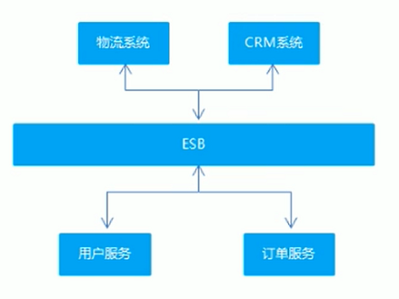
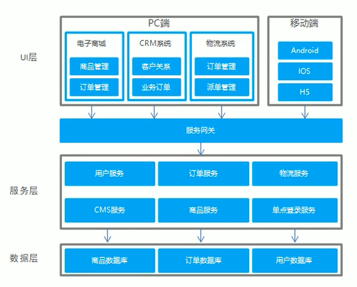
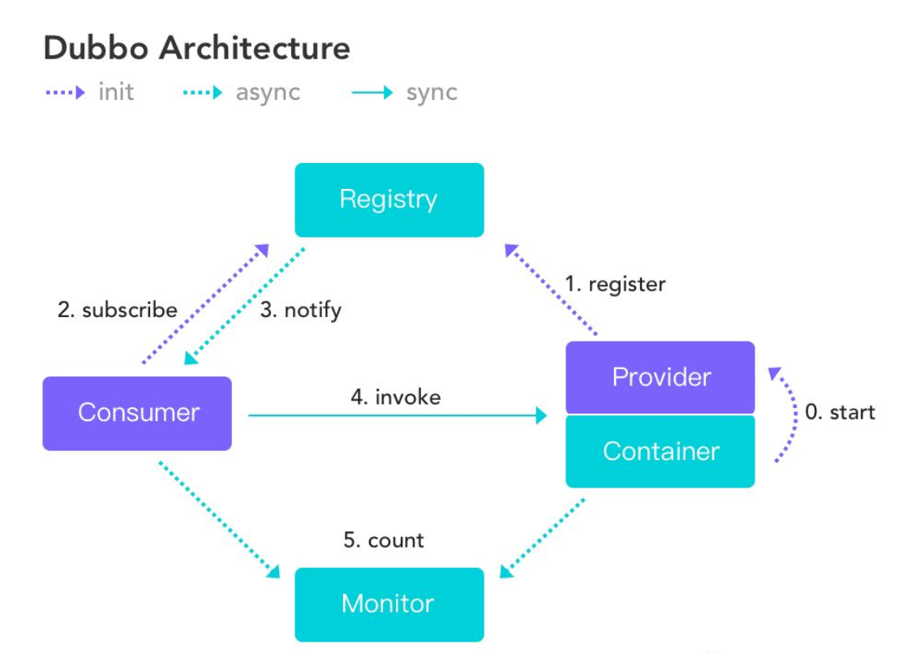

## Dubbo
- **软件架构**  
1. `SOA`架构：`Service-Oriented Architecture`，面向服务的架构  
  
2. 微服务架构  
  
- **Apache Dubbo**  
1. `RPC`：`remote procedure call`，例如A服务器上的一个应用调用B服务器上的应用提供的方法，不能直接调用，需要通过网络表达调用的语义和传达调用的数据  
2. `Dubbo`是一款高性能的`Java RPC框架`  
  
a. `Provider`：服务提供方  
b. `Consumer`：服务消费方  
c. `Registry`：服务注册与发现的注册中心，`Dubbo`官方推荐使用`Zookeeper`作为服务注册中心    
d. `Monitor`：统计服务的调用次数和调用时间的监控中心  
e. `Container`：运行服务的容器  
3.   
```
// 服务提供方

public interface DemoService {
	public String service(String str);
}

import com.alibaba.dubbo.config.annotation.Service;
@Service
public class DemoServiceImpl implements DemoService {
	@Override
	public String service(String str) {
		return "service " + str;
	}
}

<dubbo:application name="dubbo_provider"></dubbo:application>
<dubbo:registry address="zookeeper://127.0.0.1:2181"></dubbo:registry>
<dubbo:protocol name="dubbo" port="20880"></dubbo:protocol>
<dubbo:annotation package="com.pkz33.service.impl"></dubbo:annotation>


// 服务消费方

public interface DemoService {
	public String service(String str);
}

import alibaba.dubbo.config.annotation.Reference;
@Controller
@RequestMapping("/demo")
public class DemoController {
	@Reference
	private DemoService demoService;

	@ResponseBody
	@RequestMapping("/service")
	public String service(String str) {
		return demoService.service(str);
	}
}

<dubbo:application name="dubbo_consumer"></dubbo:application>
<dubbo:registry address="zookeeper://127.0.0.1:2181"></dubbo:registry>
<dubbo:annotation package="com.pkz33.controller"></dubbo:annotation>
<!-- 启动时检查，开发环境配置为false，生产环境配置为true -->
<dubbo:consumer check="false"></dubbo:consumer>


// Dubbo管理控制台
dubbo.registry.address=zookeeper://127.0.0.1:2181
dubbo.admin.root.password=root
dubbo.admin.guest.password=guest
```  
4. `Dubbo`底层基于代理技术为接口（被消费方所引用的）创建代理对象，远程调用通过代理对象完成。`Dubbo`底层基于`Netty`实现网络传输  