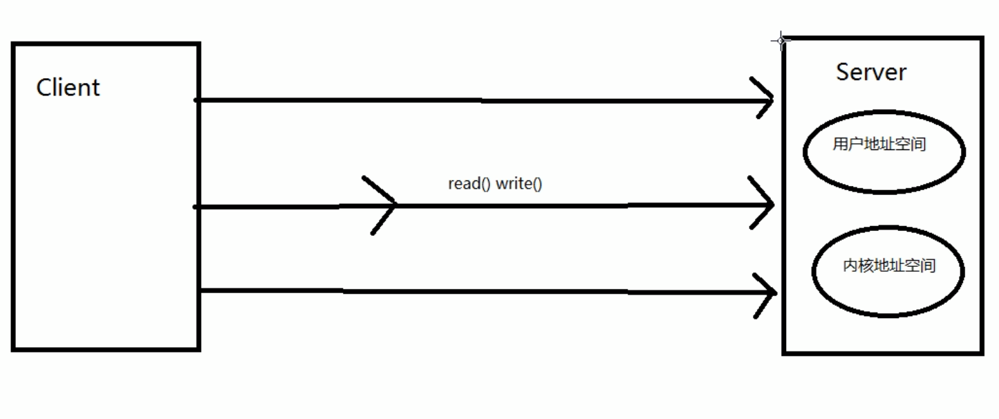

## IO
- **IO概念**

- **FileOutputStream**

- **文件复制**

- **字符输出流**  
字符输出流的使用步骤：
1. 创建`FileWriter`对象，构造方法中绑定要写入数据的目的地  
2. 使用`FileWriter`中的方法`write`，把数据写入到内存缓冲区中（字符转换为字节的过程）
3. 使用`FileWriter`中的方法`flush`，把内存缓冲区中的数据，刷新到文件中
4. 释放资源（会先把内存缓冲区中的数据刷新到文件中）
- **flush方法和close方法**  
区别：  
`flush`：刷新缓冲区，流对象可以继续使用  
`close`：先刷新缓冲区，然后通知系统释放资源，流对象不可以再被使用
- **注意事项**
1. JDK7的新特性：在`try`的后边可以增加一个`()`，在括号中可以定义流对象，且这个流对象的作用域就在`try`中有效。`try`中的代码执行完毕，会自动把流对象释放，不用写`finally`，格式：
```
  try (定义流对象; 定义流对象...) {
    可能会产生异常的代码
  } catch (异常类变量 变量名) {
    异常的处理逻辑
  }
```
2. JDK9的新特性：`try`的前边可以定义流对象，在`try`后边的`()`中可以直接引入流对象的名称`(变量名)`，在`try`代码执行完毕之后，流对象也可以释放掉，不用写`finally`，格式：
```
  A a = new A();
  B b = new B();
  try (a, b) {
    可能会产生异常的代码
  } catch (异常类变量 变量名) {
    异常的处理逻辑
  }
```
- **Properties**
1. `java.util.Properties集合 extends Hashtable<k, v> implements Map<k, v>`
2. `Properties`集合是一个唯一和`IO`流相结合的集合：可以使用`Properties`集合中的方法`store`，把集合中的临时数据持久化写入到硬盘中存储。可以使用`Properties`集合中的方法`load`，把硬盘中保存的文件（键值对），读取到集合中使用
3. 属性列表中每个键及其对应值都是一个字符串。`Properties`集合是一个双列集合，`key`和`value`默认都是字符串
- **BufferedInputStream**

1. 构造方法：    
a. `BufferedOutputStream(OutputStream out)`：创建一个新的缓冲输出流，将数据写入指定的底层输出流    
b. `BufferedOutputStream(OutputStream out, int size)`：创建一个新的缓冲输出流，将具有指定缓冲区大小的数据写入指定的底层输出流。参数`OutputStream out`：字节输出流，可以传递`FileOutputStream`，缓冲流会给`FileOutputStream`增加一个缓冲区，提高写入效率。参数`int size`：指定缓冲流内部缓冲区的大小，不指定默认
2. 使用步骤：  
a. 创建`FileOutputStream`对象，构造方法中绑定要输出的目的地    
b. 创建`BufferedOutputStream`对象，构造方法中传递`FileOutputStream`对象，提高`FileOutputStream`对象效率  
c. 使用`BufferedOutputStream`对象中的方法`write`，把数据写入到内部缓冲区中  
d. 使用`BufferedOutputStream`对象中的方法`flush`，把内部缓冲区中的数据，刷新到文件中  
e. 释放资源（会先调用`flush`方法刷新数据，上一步可以省略）
- **对象的序列化流和反序列化流**
。
1. 序列化和反序列化的时候，会抛出`NotSerializableException`异常。类通过实现`java.io.Serializable`接口启用序列化功能。未实现此接口的类将无法使其任何状态序列化或反序列化。
2. `Serializable`接口也叫标记型接口，要进行序列化和反序列化的类必须实现`Serializable`接口，会给类添加一个标记。进行序列化和反序列化的时候，就会检测是否有这个标记。有：就可以序列化和反序列化。没有：就会抛出`NotSerializableException`异常
3. `java.io.ObjectOutputStream extends OutputStream`，`ObjectOutputStream`：对象的序列化流，把对象以流的方式写入到文件中保存
4. 构造方法：`ObjectOutputStream(OutputStream out)`，创建写入指定`OutputStream`的`ObjectOutputStream`，参数`OutputStream out`，字节输出流
5. 特有的成员方法：`void writeObject(Object obj)`，将指定的对象写入`ObjectOutputStream`
6. 使用步骤：  
a. 创建`ObjectOutputStream`对象，构造方法中传递字节输出流  
b. 使用`ObjectOutputStream`对象中的方法`writeObject`，把对象写入到文件中  
c. 释放资源
7. `java.io.ObjectInputStream extends InputStream`，`ObjectInputStream`：对象的反序列化流，把文件中保存的对象，以流的方式读取出来使用
8. 构造方法：`ObjectInputStream(InputStream in)`，创建从指定`InputStream`读取的`ObjectInputStream`，参数`InputStream in`，字节输入流
9. 特有的成员方法：`void readObject(Object obj)`，从`ObjectOutputStream`读取对象
10. 使用步骤：    
a. 创建`ObjectInputStream`对象，构造方法中传递字节输入流    
b. 使用`ObjectInputStream`对象中的方法`readObject`读取保存对象的文件    
c. 释放资源  
d. 使用读取出来的对象（打印）
- **static关键字**    
静态关键字。静态优先于非静态加载到内存中（静态优先于对象进入到内存中），被`static`修饰的成员变量不能被序列化，序列化的都是对象
```
  private static int age;
  oos.writeObject(new Person("小美女", 18));
  Object o = ois.readObject();
  // Person{name = "小美女", age = 0}
```
- **transient关键字**  
瞬态关键字。被`transient`修饰的成员变量，不能被序列化
```
  private transient int age;
  oos.writeObject(new Person("小美女", 19));
  Object o = ois.readObject();
  // Person{name = "小美女", age = 0}
```
- **InvalidClassException原理**

- **NIO**  
1. 概念：简而言之，`Channel`负责传输，`Buffer`负责存储
  
2. IO和NIO的区别  

3. 缓冲区（`Buffer`）：在Java NIO中负责数据的存取，缓冲区就是数组，用于存储不同数据类型的数据，根据数据类型不同，提供相应类型的缓冲区：  
`ByteBuffer`、`CharBuffer`、`ShortBuffer`、`IntBuffer`、`LongBuffer`、`FloatBuffer`、`DoubleBuffer`  
4. 缓冲区存取数据的两个核心方法：`put()`，存入数据到缓冲区中；`get()`，获取缓冲区中的数据  
5. 缓冲区中的四个核心属性：  
a. `capacity`：容量，表示缓冲区中最大存储数据的容量，一旦声明不能改变  
b. `limit`：界限，表示缓冲区中可以操作数据的大小（`limit`后数据不能进行读写）  
c. `position`：位置，表示缓冲区中正在操作数据的位置  
d. `position` <= `limit` <= `capacity`  
  
6. 常用方法  
a. `rewind()`：可重复读  
b. `clear()`：清空缓冲区，缓冲区中的数据依然存在，但是处于“被遗忘”状态  
c. `mark`：标记，表示记录当前`position`的位置，可以通过`reset()`恢复到`mark`的位置，`0 <= mark <= position <= limit <= capacity`  
7. 非直接缓冲区与直接缓冲区  
a. 非直接缓冲区：通过`allocate()`方法分配缓冲区，将缓冲区建立在JVM的内存中  
b. 直接缓冲区：通过`allocateDirect()`方法分配直接缓冲区，将缓冲区建立在物理内存中，可以提高效率
  
  
8. 通道（`Channel`）  
a. 用于源节点与目标节点的连接。在Java NIO中负责缓冲区中数据的传输，`Channel`本身不存储数据，需要配合缓冲区进行传输  
b. 通道的主要实现类  
```
  java.nio.channels.Channel接口：
      |--FileChannel
      |--SocketChannel
      |--ServerSocketChannel
      |--DatagramChannel
```
c. 获取通道
```
  1. Java针对支持通道的类提供了getChannel()方法
      本地IO：
      FileInputStream/FileOutputStream
      RandomAccessFile
      网络IO：
      Socket
      ServerSocket
      DatagramSocket
  2. 在JDK1.7中的NIO.2针对各个通道提供了静态方法open()
  3. 在JDK1.7中的NIO.2的Files工具类的newByteChannel()
  
  @Test
  public void test1() throws Exception {
    FileInputStream fis = new FileInputStream("1.jpg");
    FileOutputStream fos = new FileOutputStream("2.jpg");
    
    // 获取通道
    FileChannel inChannel = fis.getChannel();
    FileChannel outChannel = fos.getChannel();
    
    // 分配指定大小的缓冲区
    ByteBuffer buf = ByteBuffer.allocate(1024);
    
    // 将通道中的数据存入缓冲区中
    while(inChannel.read(buf) != -1) {
      // 切换读数据的模式
      buf.flip();
      // 将缓冲区中的数据写入通道中
      outChannel.write(buf);
      // 清空缓冲区
      buf.clear();
    }
    
    outChannel.close();
    inChannel.close();
    fos.close();
    fis.close();
  }
  
  // 使用直接缓冲区完成文件的复制（内存映射文件）
  @Test
  public void test2() throws IOException {
    FileChannel inChannel = FileChannel.open(Paths.get("1.jpg"), StandardOpenOption.READ);
    FileChannel outChannel = FileChannel.open(Paths.get("3.jpg"), StandardOpenOption.WRITE, StandardOpenOption.CREATE);
    
    // 内存映射文件
    MappedByteBuffer inMappedBuf = inChannel.map(MapMode.READ_ONLY, 0, inChannel.size());
    MappedByteBuffer outMappedBuf = outChannel.map(MapMode.READ_WRITE, 0, inChannel.size());
    
    // 直接对缓冲区进行数据的读写操作
    byte[] dst = new byte[inMappedBuf.limit()];
    inMappedBuf.get(dst);
    outMappedBuf.put(dst);
    
    inChannel.close();
    outChannel.close();
  }
```
9. 通道之间的数据传输  
`transferFrom()`、`transferTo()`  
10. 分散（`Scatter`）与聚集（`Gather`）  
a. 分散读取（`Scattering Reads`）：将通道中的数据分散到多个缓冲区中  
b. 聚集写入（`Gathering Writes`）：将多个缓冲区中的数据聚集到通道中  
  
  
11. 使用NIO完成网络通信的三个核心：  
a. 通道（`Channel`）：负责连接  
```
  java.nio.channels.Channel接口：
      |--SelectableChannel
          |--SocketChannel
          |--ServerSocketChannel
          |--DatagramChannel
          
          |--Pipe.SinkChannel
          |--Pipe.SourceChannel
```  
b. 缓冲区（`Buffer`）：负责数据的存取  
c. 选择器（`Selector`）：是`SelectableChannel`的多路复用器，用于监控`SelectableChannel`的IO状况
```
  // 客户端
  @Test
  public void client() throws IOException {
    // 1. 获取通道
    SocketChannel sChannel = SocketChannel.open(new InetSocketAddress("127.0.0.1", 9898));
    
    // 2. 切换非阻塞模式
    sChannel.configureBlocking(false);
    
    // 3. 分配指定大小的缓冲区
    ByteBuffer buf = ByteBuffer.allocate(1024);
    
    // 4. 发送数据给服务端
    buf.put(new Date().toString().getBytes());
    buf.flip();
    sChannel.write(buf);
    buf.clear();
    
    // 5. 关闭通道
    sChannel.close();
  }
  
  // 服务端
  @Test
  public void server() throws IOException {
    // 1. 获取通道
    ServerSocketChannel ssChannel = ServerSocketChannel.open();
    
    // 2. 切换非阻塞模式
    ssChannel.configureBlocking(false);
    
    // 3. 绑定连接
    ssChannel.bind(new InetSocketAddress(9898));
    
    // 4. 获取选择器 
    Selector selector = Selector.open();
    
    // 5. 将通道注册到选择器上，并且指定“监听接收事件”
    ssChannel.register(selector, SelectionKey.OP_ACCEPT);
    
    // 6. 轮询式的获取选择器上已经“准备就绪”的事件
    while(selector.select() > 0){
      // 7. 获取当前选择器中所有注册的“选择键（已就绪的监听事件）”
      Iterator<SelectionKey> it = selector.selectedKeys().iterator();
      
      while(it.hasNext()){
        // 8. 获取准备“就绪”的事件
        SelectionKey sk = it.next();
        
        // 9. 判断具体是什么事件准备就绪
        if(sk.isAcceptable()){
          // 10. 若“接收就绪”，获取客户端连接
          SocketChannel sChannel = ssChannel.accept();
          
          // 11. 切换非阻塞模式
          sChannel.configureBlocking(false);
          
          // 12. 将该通道注册到选择器上
          sChannel.register(selector, SelectionKey.OP_READ);
        }else if(sk.isReadable()){
          // 13. 获取当前选择器上“读就绪”状态的通道
          SocketChannel sChannel = (SocketChannel) sk.channel();
          
          // 14. 读取数据
          ByteBuffer buf = ByteBuffer.allocate(1024);
          int len = 0;
          while((len = sChannel.read(buf)) > 0){
            buf.flip();
            System.out.println(new String(buf.array(), 0, len));
            buf.clear();
          }
        }
        
        // 15. 取消选择键SelectionKey
        it.remove();
      }
    }
  }
  
  @Test
  public void send() throws IOException {
    DatagramChannel dc = DatagramChannel.open();
    
    dc.configureBlocking(false);
    
    ByteBuffer buf = ByteBuffer.allocate(1024);
    
    Scanner scan = new Scanner(System.in);
    
    while(scan.hasNext()){
      String str = scan.next();
      buf.put((new Date().toString() + ":\n" + str).getBytes());
      buf.flip();
      dc.send(buf, new InetSocketAddress("127.0.0.1", 9898));
      buf.clear();
    }
    dc.close();
  }
  
  @Test
  public void receive() throws IOException{
    DatagramChannel dc = DatagramChannel.open();
    
    dc.configureBlocking(false);
    
    dc.bind(new InetSocketAddress(9898));
    
    Selector selector = Selector.open();
    
    dc.register(selector, SelectionKey.OP_READ);
    
    while(selector.select() > 0){
      Iterator<SelectionKey> it = selector.selectedKeys.iterator();
      
      while(it.hasNext()){
        SelectionKey sk = it.next();
        if(sk.isReadable()){
          ByteBuffer buf = ByteBuffer.allocate(1024);
          dc.receive(buf);
          buf.flip();
          System.out.println(new String(buf.array(), 0, buf.limit()));
          buf.clear();
        }
      }
      it.remove();
    }
  }
  
  @Test
  public void test1() throws IOException{
    // 1. 获取管道
    Pipe pipe = Pipe.open();
    
    // 2. 将缓冲区中的数据写入管道 
    ByteBuffer buf = ByteBuffer.allocate(1024);
    
    Pipe.SinkChannel sinkChannel = pipe.sink();
    buf.put(“通过单向管道发送数据”.getBytes());
    buf.flip();
    sinkChannel.write(buf);
    
    // 3. 读取缓冲区中的数据 
    Pipe.SourceChannel sourceChannel = pipe.source();
    buf.flip();
    int len = sourceChannel.read(buf);
    System.out.println(new String(buf.array(), 0, len));
    
    sourceChannel.close();
    sinkChannel.close();
  }
```
