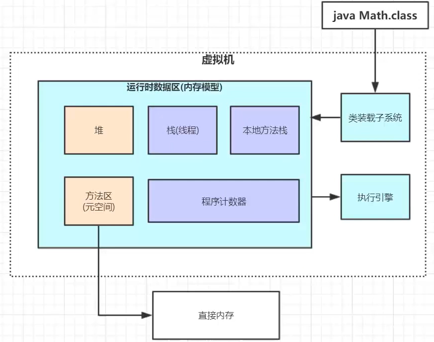
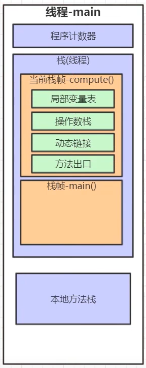
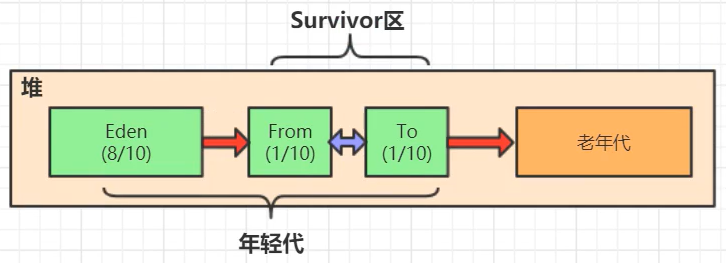
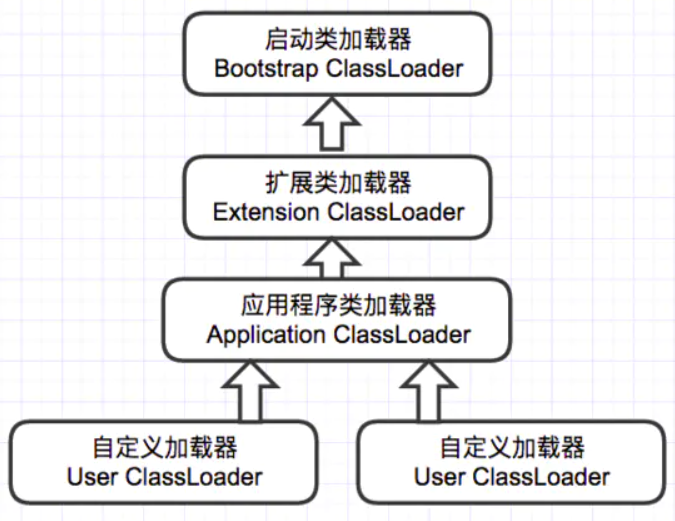
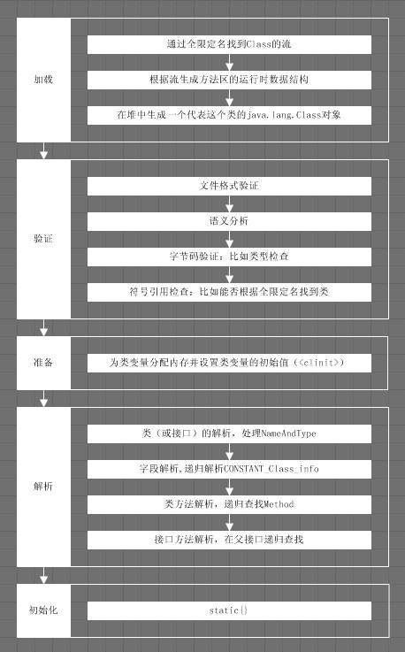

## Java虚拟机
- **JVM内存模型**  
Java的内存大致划分为5个部分。   
   
- **栈（Stack）**  
1. 存放方法中的局部变量。方法在栈当中运行。  
2. 局部变量：方法的参数，或者方法{}内部的变量。  
3. 作用域：一旦超出作用域，立刻从栈内存当中消失。   
   
- **堆（Heap）**  
1. 堆内存里面的东西都有一个地址值：16进制。  
2. 堆内存里面的数据，都有默认值。  
整数默认为0  
浮点数默认为0.0  
字符默认为'\u0000'
布尔型默认为false  
引用类型默认为null  
- **方法区（Method Area）**  
存储.class相关信息，包含方法的信息。  
- **本地方法栈（Native Method Stack）**  
与操作系统相关。  
- **寄存器（PC Register）**  
与CPU相关。
- **垃圾回收算法**  
1. 引用计数法：每个对象都有一个引用计数，被引用一次，计数`+1`；被引用变量值变为`null`，则计数`-1`，直到计数为0，表示变成无用对象  
优点：算法简单  
缺点：循环引用的无用对象无法识别标识  
2. 引用可达法（根搜索算法）：从`GC ROOT`出发，寻找对应的引用节点以及该节点的引用节点，当所有的引用节点寻找完毕之后，剩余的节点被认为是无用节点  
- **分代垃圾回收**     
   
1. 对象分为三种状态：年轻代、年老代、持久代。`JVM`将堆内存划分为`Eden`、`Survivor`和`Old`/`Tenured`空间
2. 垃圾回收过程：  
a. 新创建的对象，绝大多数都会存储在`Eden`中  
b. 当`Eden`满了（达到一定比例），触发`Minor GC`，清理无用对象，然后将剩余有用对象复制到某个`Survivor`，同时清空`Eden`  
c. 当`Eden`再次满了，再次触发`Minor GC`，清理`Eden`和当前非空的`Survivor`的无用对象，将它们中剩余的有用对象复制到另一个空的`Survivor`（每次`Minor GC`执行完毕后：`Eden`置空；两个`Survivor`一个置空，一个非空）  
d. 重复多次（默认15次）`Minor GC`，`Survior`中没有被清理的对象，会被复制到老年代`Old`中  
e. 当`Old`区满了，会触发一次完整的`Full GC`，采用（标记-清除）/（标记-整理）方法  
- **JAVA类加载机制**  
1. 加载：即查找字节流，并据此生成一个代表该类的`java.lang.Class`对象的过程  
2. 类加载器
  
3. `JVM`通过双亲委派模型进行类的加载，我们也可以通过继承`java.lang.ClassLoader`实现自定义的类加载器。当一个类加载器收到类加载任务时，会先将该任务交给其父类加载器处理，只有当父类加载器无法完成该加载任务时，当前类加载器才会尝试执行加载任务，因而加载任务最终都会传递到顶层的启动类加载器。因为类加载的过程中，最终都会委托给顶层的启动类加载器进行加载，所以保证了最终加载的都属于同一个类  
4. 链接：将创建的类合并到`Java`虚拟机中，使之能够执行的过程。它分为验证，准备和解析三个阶段：  
a. 验证：确保被加载类能够满足`Java`虚拟机的约束条件  
b. 准备：为被加载类的静态字段在方法区中分配内存  
c. 解析：在`class`文件被加载到虚拟机之前，当前类并不知道其它类及其方法、字段的具体地址，甚至不知道自己的方法、字段的地址，每当需要引用这些成员时，`Java`编译器会生成一个符号引用。解析的目的，就是将符号引用解析为实际引用  
5. 初始化：类加载的最后一个阶段，开始真正执行类中定义的`Java`程序代码。只有当初始化之后，类才正式成为可执行的状态  
  
