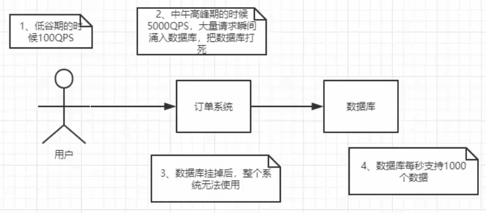
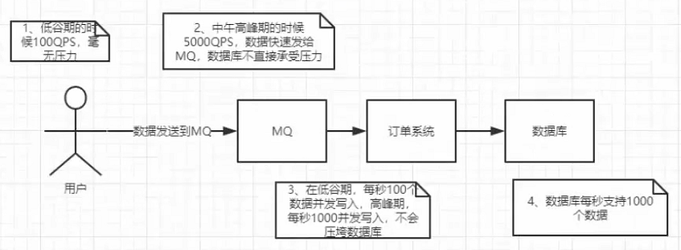
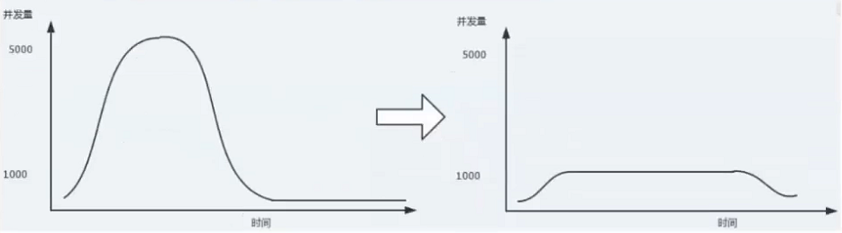
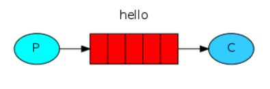
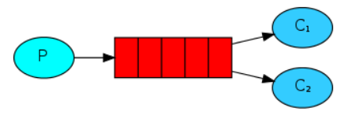
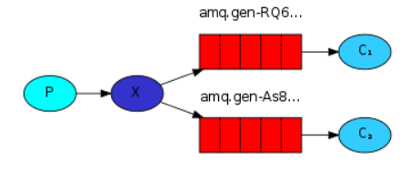
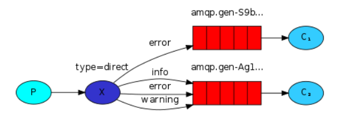
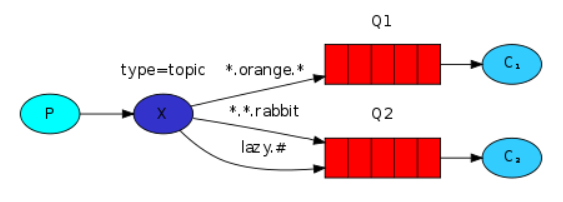

## RabbitMQ
- **消息中间件**  
`MQ`全称`Message Queue`，消息队列是进程/线程之间的通信方法。  
- **应用场景**  
任务异步处理；应用程序解耦合；削峰填谷  
  
  
  
- **工作模式**  
1. `Simple`简单模式  
  
2. `Work`工作模式  
  
3. `Publish/Subscribe`发布订阅模式  
  
4. `Routing`路由模式  
  
5. `Topics`主题模式  
  
