## Redis

- **REmote DIctionary Server**  
1. `C`语言开发的开源的高性能键值对数据库  
2. 内部采用单线程机制进行工作  
- **常用指令**   
1. 信息添加：`set key value`，如`set name pkz`  
2. 信息查询：`get key`  
3. 获取命令帮助文档：`help 命令名称`，`help @组名`
- **Redis数据类型**  
1. `Redis`自身是一个`Map`，所有数据都采用`key:value`的形式存储  
2. 数据类型指的是存储的数据的类型，也就是`value`部分的类型，`key`部分是字符串  
- **string**  
1. 存储单个数据，是最简单的数据存储类型，也是最常用的数据存储类型  
2. 一个存储空间保存一个数据  
3. 存储的内容通常为字符串，如果字符串以整数的形式展示，可以作为数字操作使用   
4. 基本操作：  
```
  添加/修改数据
  set key value
  
  获取数据
  get key
  
  删除数据
  del key
  
  添加/修改多个数据
  mset key1 value1 key2 value2 ...
  
  获取多个数据
  mget key1 key2 ...
  
  获取数据字符个数（字符串长度）
  strlen key
  
  追加信息到原始信息后面（如果原始信息存在就追加，否则新建）
  append key value
  
  设置数值数据增加指定范围的值
  incr key
  incrby key increment
  incrbyfloat key increment
  
  设置数值数据减少指定范围的值
  decr key
  decrby key increment
  
  设置数据具有指定的生命周期
  setex key seconds value
  psetex key milliseconds value
  
  数据操作不成功的反馈与数据正常操作之间的差异
  1) 表示运行结果是否成功
  (integer)0 -> false 失败
  (integer)1 -> true 成功
  2) 表示运行结果值
  (integer)3 -> 3个
  (integer)1 -> 1个
  数据未获取到
  (nil) 等用于null
  数据计算最大范围
  Java中的long的最大值
```  
5. `string`在`redis`内部存储默认就是一个字符串，当遇到增减类操作`incr`，`decr`时会转成数值型进行计算  
6. `redis`所有操作都是原子性的，采用单线程处理所有业务，命令是一个一个执行的，因此无需考虑并发带来的数据影响  
7. 按数值进行操作的数据，如果原始数据不能转成数值，或超过了`redis`数值上限范围，将报错  

8. 数据库中热点数据`key`命名习惯：`表名:主键名:主键值:字段名` 
```
  set user:id:00789:fans 123456789
  set user:id:00789:blogs 789
  
  set user:id:00789 {id:00789,blogs:789,fans:123456789}
```
- **hash**  
1. 对一系列存储的数据进行编组，方便管理  
2. 一个存储空间保存多个键值对数据   
3. 底层使用哈希表结构实现数据存储  
  
4. 基本操作  
```
  添加/修改数据
  hset key field value
  
  获取数据
  hget key field
  hgetall key
  
  删除数据
  hdel key field1 [field2]
  
  添加/修改多个数据
  hmset key field1 value1 field2 value2 ...
  
  获取多个数据
  hmget key field1 field2 ...
  
  获取哈希表中字段的数量
  hlen key
  
  获取哈希表中是否存在指定的字段
  hexists key field
  
  获取哈希表中所有的字段名或字段值
  hkeys key
  hvals key
  
  设置指定字段的数值数据增加指定范围的值
  hincrby key field increment
  hincrbyfloat key field increment
  
  如果字段已经存在于哈希表中，操作无效
  hsetnx key field value
```  
- **list**  
1. 存储多个数据，并对数据进入存储空间的顺序进行区分  
2. 一个存储空间保存多个数据，且通过数据可以体现进入顺序  
3. 保存多个数据，底层使用双向链表存储结构实现  
  
4. 基本操作  
```
  添加/修改数据  
  lpush key value1 [value2] ...
  rpush key value1 [value2] ...
  
  获取数据
  lrange key start stop
  lindex key index
  llen key
  
  获取并移除数据
  lpop key
  rpop key
  
  规定时间内获取并移除数据
  blpop key1 [key2] timeout
  brpop key1 [key2] timeout
  
  移除指定（个数）数据
  lrem key count value
```  
- **set**  
1. 存储大量的数据，在查询方面提供更高的效率  
2. 与`hash`存储结构完全相同，仅存储键，不存储值（`nil`），并且值不允许重复   
  
3. 基本操作  
```
  添加数据  
  sadd key member1 [member2]  
  
  获取全部数据
  smembers key
  
  删除数据
  srem key member1 [member2]
  
  获取集合数据总量
  scard key  
  
  判断集合中是否包含指定数据
  sismember key member
  
  随机获取集合中指定数量的数据
  srandmember key [count]
  
  随机获取集合中的某个数据并将该数据移出集合
  spop key
  
  求两个集合的交、并、差集
  sinter key1 [key2]
  sunion key1 [key2]
  sdiff key1 [key2]
  
  求两个集合的交、并、差集并存储到指定集合中
  sinterstore destination key1 [key2]
  sunionstore destination key1 [key2]
  sdiffstore destination key1 [key2]
  
  将指定数据从原始集合中移动到目标集合中
  smove source destination member
```  
4. `set`类型不允许数据重复，如果添加的数据在`set`中已经存在，将只保留一份  
5. `set`虽然与`hash`的存储结构相同，但是无法启用`hash`中存储值的空间  
- **sorted_set** 
1. 数据排序有利于数据的有效展示，需要提供一种根据自身特征进行排序的方式  
2. 在`set`的存储结构基础上添加可排序字段  
  
3. 基本操作  
```
  添加数据
  zadd key score1 member1 [score2 member2]
  
  获取全部数据
  zrange key start stop [WITHSCORES]
  zrevrange key start stop [WITHSCORES]
  
  删除数据
  zrem key member [member ...]
  
  按条件获取数据
  zrangebyscore key min max [WITHSCORES] [LIMIT]
  zrevrangebyscore key max min [WITHSCORES]
  
  条件删除数据
  zremrangebyrank key start stop
  zremrangebyscore key min max
  
  min与max用于限定搜索查询的条件
  start与stop用于限定查询范围，作用于索引，表示开始和结束索引
  offset与count用于限定查询范围，作用于查询结果，表示开始位置和数据总量
  
  获取集合数据总量
  zcard key
  zcount key min max
  
  集合交、并操作
  numkeys表示key的数量
  zinterstore destination numkeys key [key ...]
  zunionstore destination numkeys key [key ...]
  
  获取数据对应的索引（排名）
  zrank key member
  zrevrank key member
  
  score值获取与修改
  zscore key member
  zincrby key increment member  
  
  获取当前系统时间
  time
```
4. `sorted_set`底层存储还是基于`set`结构，数据不能重复，如果重复添加相同的数据，`score`值将被反复覆盖，保留最后一次修改的结果
- **限制单用户单位时间内访问次数**  
1. 解决方案：  
a. 设计计数器，记录调用次数，用于控制业务执行次数。以用户`id`作为`key`，访问次数作为`value`  
b. 在访问之前获取次数，判断是否超过限定次数：不超过，则每次访问`计数 + 1`；访问失败，`计数 - 1`  
c. 为计数器设置生命周期为指定单位时间，自动清空周期内访问次数  
2. 解决方案改良：  
a. 取消最大值的判定，利用`incr`操作超过最大值抛出异常的形式，替代每次判断是否大于最大值  
b. 访问之前判断是否为`nil`：如果是，设置计数值为`Max - 限制访问次数`；如果不是，`计数 + 1`；访问失败，`计数 - 1`  
c. 遇到异常，则视为访问次数达到上限
- **Redis案例**  
1. 分布式锁  
```
  SETNX product:101 true  // 返回1代表获取锁成功  
  SETNX product:101 false // 返回0代表获取锁失败
  // 执行业务操作
  DEL product:101 // 执行完业务释放锁
  
  SET product:101 true EX 10 NX // 防止程序意外终止导致死锁
  // EX seconds：将key的过期时间设置为seconds秒，等同于SETEX key seconds value
  // NX：只有key不存在时，才对key进行设置操作，等同于SETNX key value
```  
2. 计数器  
```
  INCR article:readcount:{文章id}
  GET article:readcount:{文章id}
```  
3. `Web`集群`session`共享
4. 分布式系统全局序列号：`INCRBY orderId 1000  // redis批量生成序列号提升性能`  
5. 电商购物车  
```
  1) 以用户id为key
  2) 商品id为field
  3) 商品数量为value
  
  购物车操作
  1) 添加商品：HSET cart:101 1001 1
  2) 增加数量：HINCRBY cart:101 1001 1
  3) 商品总数：HLEN cart:101
  4) 删除商品：HDEL cart:101 1001
  5) 获取购物车所有商品：HGETALL cart:101
```  
6. 模拟常用数据结构  
```
  Stack（栈） = LPUSH + LPOP
  Queue（队列） = LPUSH + RPOP
  Blocking MQ（阻塞队列） = LPUSH + BRPOP
```
7. 微博消息和微信公众号消息  
```
  A关注了B，C等大V
  1) B发微博，消息ID为101
  LPUSH msg:{A-ID} 101
  2) C发微博，消息ID为104
  LPUSH msg:{A-ID} 104
  3) 查看最新微博消息
  LRANGE msg:{A-ID} 0 5
```
8. 微信抽奖小程序
```
  1) 点击参与抽奖加入集合
  SADD key {userID}
  2) 查看参与抽奖的所有用户
  SMEMBERS key
  3) 抽取count名中奖者
  SRANDMEMBER key [count] // 抽取后保留
  SPOP key [count]  // 抽取后不保留  
```
9. 微信微博点赞，收藏，标签
```
  1) 点赞
  SADD like:{消息ID} {用户ID}
  2) 取消点赞
  SREM like:{消息ID} {用户ID}
  3) 检查用户是否点过赞
  SISMEMBER like:{消息ID} {用户ID}
  4) 获取点赞的用户列表
  SMEMBERS like:{消息ID}
  5) 获取点赞用户数
  SCARD like:{消息ID}
```  
10. 集合操作实现微博微信关注模型
```
  1) A关注的人：
  aSet  {B, C, D}
  2) B关注的人：
  bSet  {A, C, D, E}
  3) C关注的人：
  cSet  {A, B, E, D, F}
  4) A和B共同关注的人：
  SINTER aSet bSet  // {C, D}
  5) 我（A）关注的人也关注他（B）：
  SISMEMBER cSet B
  SISMEMBER dSet B
  6) 我（A）可能认识的人：
  SDIFF bSet aSet // {A, E}
```
11. `Zset`集合操作实现排行榜
```
  1) 点击新闻
  ZINCRBY hotNews:20200406 1 新闻1
  2) 展示当日排行前十
  ZREVRANGE hotNews:20200406 0 9 WITHSCORES
  3) 七日搜索榜单计算
  ZUNIONSORE hns:0331-0406 7 hns:0331 hns:0401 hns:0402 hns:0403 hns:0404 hns:0405 hns:0406
  4) 展示七日排行前十
  ZREVRANGE hns:0331-0406 0 9 WITHSCORES
```
- **key**  
1. `key`是一个字符串，通过`key`获取`redis`中保存的数据  
2. 基本操作  
```
  删除指定key
  DEL key
  
  获取key是否存在
  EXISTS key
  
  获取key的类型
  TYPE key
  
  为指定key设置有效期
  EXPIRE key seconds
  EXPIRE key milliseconds
  EXPIREAT key timestamp
  EXPIREAT key milliseconds-timestamp
  
  获取key的有效时间
  TTL key
  PTTL key
  
  切换key从时效性转换为永久性
  PERSIST key
  
  为key改名
  RENAME key newkey
  RENAMENX key newkey
  
  对所有key排序
  SORT
  
  其他key通用操作
  HELP @GENERIC
```
3. 查询模式
```
  查询key
  KEYS pattern
  
  查询模式规则
  * 匹配任意数量的任意符号
  ? 匹配一个任意符号
  [] 匹配一个指定符号
  
  查询所有
  KEYS * 
  
  查询以pkz开头
  KEYS pkz*
  
  查询以pkz结尾
  KEYS *pkz
  
  查询所有前面两个字符任意，后面以pkz结尾
  KEYS ??pkz
  
  查询所有以user:开头，最后一个字符任意
  KEYS user:?
  
  查询所有以u开头，以er:1结尾，中间包含一个字母，s或t
  KEYS u[st]er:1  
```
4. `redis`为每个服务提供16个数据库，编号从0到15，每个数据库之间的数据相互独立
```
  切换数据库
  SELECT index
  
  其他操作
  QUIT
  PING
  ECHO message
  
  数据移动
  MOVE key db
  
  数据清除
  DBSIZE
  FLUSHDB
  FLUSHALL
```
- **Jedis**  

1. 客户端连接`redis`  
```
  <!-- 导入依赖 -->
  <dependency>
    <groupId>redis.clients</groupId>
    <artifactId>jedis</artifactId>
    <version>2.9.0</version>
  </dependency>
  
  // 连接 redis
  Jedis jedis = new Jedis("localhost", 6379);
  
  // 操作redis
  jedis.set("name", "pkz");
  jedis.get("name");
  
  // 关闭redis连接
  jedis.close();
```
2. 服务调用次数控制案例  
```
  案例需求：
  1) 设定A、B、C三个用户
  2) A用户限制10次/分调用，B用户限制30次/分调用，C用户不限制
  
  // 设定业务方法
  public void business(String id, Long val){
    System.out.println("用户：" + id + " 业务操作执行第" + val + "次");
  }
  
  // 设定多线程类，模拟用户调用
  class MyThread extends Thread {
    Service sc;
    
    public MyThread(String id, int num){
      sc = new Service(id, num);
    }
    
    public void run(){
      while(true){
        sc.service();
        try{
          Thread.sleep(300L);
        }catch(InterruptedException e){
          e.printStackTrace();
        }
      }
    }
  }
  
  // 设计redis控制方案
  public void service(){
    Jedis jedis = new Jedis("127.0.0.1", 6379);
    String value = jedis.get("compid:" + id);
    // 判断该值是否存在
    try{
      if(value == null){
        // 不存在，创建该值
        jedis.setex("compid:" + id, 5, Long.MAX_VALUE - num + "");
      }else{
        // 存在，自增，调用业务
        Long val = jedis.incr("compid:" + id);
        business(id, num - (Long.MAX_VALUE - val));
      }
    }catch(JedisDataException e){
      System.out.println("访问达到次数上限，请升级会员级别");
      return;
    }finally{
      jedis.close();
    }
  }
  
  // 设计启动主程序
  public static void main(String[] args){
    MyThread mt1 = new MyThread("初级用户", 10);
    MyThread mt2 = new MyThread("高级用户", 30);
    mt1.start();
    mt2.start();
  }
  
  // 对业务控制方案进行改造，设定不同用户等级的判定
  // 将不同用户等级对应的信息、限制次数等设定到redis中，使用hash保存
```
3. 基于连接池获取连接
```
  JedisPool：Jedis提供的连接池技术
    poolConfig：连接池配置对象
    host：redis服务地址
    port：redis服务端口号
  public JedisPool(GenericObjectPoolConfig poolConfig, String host, int port){
    this(poolConfig, host, port, 2000, (String)null, 0, (String)null);
  }
  
  // 封装连接参数
  // jedis.properties
  jedis.host = localhost
  jedis.port = 6379
  jedis.maxTotal = 30
  jedis.maxIdle = 10
  
  // 加载配置信息
  // 静态代码块初始化资源
  static{
    // 读取配置文件，获取参数值
    ResourceBundle rb = ResourceBundle.getBundle("jedis");
    host = rb.getString("jedis.host");
    port = Integer.parseInt(rb.getString("jedis.port"));
    maxTotal = Integer.parseInt(rb.getString("jedis.maxTotal"));
    maxIdle = Integer.parseInt(rb.getString("jedis.maxIdle"));
    poolConfig = new JedisPoolConfig();
    poolConfig.setMaxTotal(maxTotal);
    poolConfig.setMaxIdle(maxIdle);
    jedisPool = new JedisPool(poolConfig, host, port);
  }
  
  // 获取连接
  // 对外访问接口，提供jedis连接对象，连接从连接池获取
  public static Jedis getJedis(){
    Jedis jedis = jedisPool.getResource();
    return jedis;
  }
```
- **Linux环境下安装redis**  
- **配置启动redis**  
```
  cat redis.conf | grep -v "#" | grep -v "^$" > redis-6379.conf
  
  cat redis-6379.conf
  # port 6379
  # daemonize yes
  # logfile "6379.log"
  # dir /root/redis-5.0.5/data
  
  redis-server redis-6379.conf
  
  ps -ef | grep redis-
  
  kill -s 9 进程号
  
  mkdir conf
  
  mv redis-6379.conf conf
  
  cp redis-6379.conf redis-6380.conf
  
  cat redis-6380.conf
  # 设定当前服务启动的端口号
  # port 6380
  # 以守护进程方式启动，redis将以服务的形式存在，日志将不再打印到命令窗口中
  # daemonize yes
  # 设定日志文件名，方便查阅
  # logfile "6380.log"
  # 设定当前服务文件保存位置，包含日志文件、持久化文件等
  # dir /root/redis-5.0.5/data
  
  默认配置启动
  redis-server
  redis-server --port 6379
  redis-server --port 6380
  
  指定配置文件启动
  redis-server redis.conf
  redis-server redis-6379.conf
  redis-server redis-6380.conf
  redis-server conf/redis-6379.conf
  redis-server config/redis-6380.conf
  
  Redis客户端连接
  默认连接
  redis-cli
  
  连接指定服务器
  redis-cli -h 127.0.0.1
  redis-cli -p 6379
  redis-cli -h 127.0.0.1 -p 6379
```
- **持久化**  
1. 利用永久性存储介质将数据保存，在特定时间将保存的数据进行恢复  
2. 持久化用于防止数据的意外丢失，确保数据安全性  
3. 数据状态持久化：快照形式，存储数据，存储格式简单，关注点在数据；操作过程持久化：日志形式，存储操作过程，存储格式复杂，关注点在数据的操作过程  
  
- **RDB**  
1. `save`指令  
```
  语法：save
  
  作用：手动执行一次保存操作
  
  save指令相关配置： 
  dbfilename dump.rdb
    设置本地数据库文件名，默认值为dump.rdb
    通常设置为dump-端口号.rdb
  dir
    设置存储.rdb文件的路径
  rdbcompression yes
    设置存储至本地数据库时是否压缩数据，默认为yes
    通常默认为开启状态，如果设置为no，可以节省CPU运行时间，但会使存储的文件变大
  rdbchecksum yes
    设置是否进行RDB文件格式校验，该校验过程在写文件和读文件过程中均进行
    通常默认为开启状态，如果设置为no，可以节约读写性过程约10%时间消耗，但是有一定的数据损坏的风险
    
  cat redis-6379.conf
  # port 6379
  # daemonize yes
  # logfile "6379.log"
  # dir /root/redis-5.0.5/data
  # dbfilename dump-6379.rdb
  # rdbcompression yes
  # rdbchecksum yes
```  
2. 数据量过大，单线程执行方式造成效率过低：`save`指令的执行会阻塞当前`Redis`服务器，直到当前`RDB`过程完成为止，有可能造成长时间阻塞，线上环境不建议使用  
3. `bgsave`指令  
  
```
  语法：bgsave
  
  作用：手动启动后台保存操作，但不是立即执行
  
  bgsave指令相关配置：
  dbfilename dump.rdb
  dir
  rdbcompression yes
  rdbchecksum yes
  stop-writes-on-bgsave-error yes
    后台存储过程中如果出现错误，是否停止保存操作
    通常默认为开启状态
```
4. `bgsave`命令是针对`save`阻塞问题做的优化，`Redis`内部涉及到`RDB`操作都采用`bgsave`方式  
5. `save`配置

```
  配置：save seconds changes
  
  作用：满足限定时间范围内key的变化数量达到指定数量则进行持久化
  
  参数：
    seconds：监控时间范围
    changes：监控key的变化量
    
  cat redis-6379.conf
  # port 6379
  # daemonize yes
  # logfile "6379.log"
  # dir /root/redis-5.0.5/data
  # dbfilename dump-6379.rdb
  # rdbcompression yes
  # rdbchecksum yes
  # save 10 2
```  
6. `save`配置启动后执行的是`bgsave`操作；`save`配置要根据实际业务情况进行设置，频度过高或过低都会出现性能问题  
7. `RDB`启动方式对比  
  
8. `RDB`特殊启动方式  
```
  全量复制
  
  服务器运行过程中重启
  debug reload
  
  关闭服务器时指定保存数据
  shutdown save
```  
9. `RDB`优点：   
a. `RDB`采用紧凑压缩的二进制文件，存储效率较高  
b. `RDB`内部存储`redis`在某个时间点的数据快照，适合于数据备份，全量复制等场景  
c. `RDB`恢复数据的速度比`AOF`快很多  
d. 应用：服务器定期执行`bgsave`备份，并将`RDB`文件拷贝到远程机器中，用于灾难恢复  
10. `RDB`缺点：  
a. `RDB`方式无论是执行指令还是利用配置，都无法做到实时持久化，具有较大的可能性丢失数据  
b. `bgsave`指令每次运行需要执行`fork`操作创建子进程，性能会有所降低  
c. `Redis`众多版本中未进行`RDB`文件格式的版本统一，可能出现各版本服务器之间的数据格式无法兼容的现象  
- **AOF**
1. `AOF`持久化：以独立日志的方式记录每次写命令，重启时重新执行`AOF`文件中命令以达到恢复数据的目的，与`RDB`相比可以简单描述为[由记录数据转变为记录数据产生的过程]  
2. `AOF`的主要解决数据持久化的实时性问题，目前已经称为`Redis`持久化的主流方式  
  
3. `AOF`写数据的三种策略（`appendfsync`）  
```
  always（每次）
    每次写入操作均同步到AOF文件中，数据零误差，性能较低，不建议使用
  everysec（每秒）
    每秒将缓冲区中的指令同步到AOF文件中，数据准确性较高，性能较高，建议使用，也是默认配置
    在系统突然宕机的情况下会丢失1秒内的数据
  no（系统控制）
    由操作系统控制每次同步到AOF文件的周期，整体过程不可控
```  
4. `AOF`相关配置  
```
  配置：appendonly yes|no
  作用：是否开启AOF持久化功能，默认为不开启状态
  
  配置：appendfsync always|everysec|no
  作用：AOF写数据策略
  
  配置：appendfilename filename
  作用：AOF持久化文件名，默认文件名为appendonly.aof，建议配置为appendonly-端口号.aof
  
  配置：dir
  作用：AOF持久化文件保存路径，与RDB持久化文件保持一致即可
```  
5. `AOF`重写  
  
a. `Redis`引入`AOF`重写机制压缩文件体积，`AOF`文件重写是将`Redis`进程内的数据转化为写命令同步到新的`AOF`文件的过程，简单说，是对同一个数据的若干条命令执行结果，转化为最终结果数据所对应的指令，进行记录  
b. 作用：降低磁盘占用量，提高磁盘利用率；提高持久化效率，提高数恢复效率  
c. 重写方式  
```
  手动重写
  bgrewriteaof
  
  自动重写
  auto-aof-rewrite-min-size size
  auto-aof-rewrite-percentage percentage
  
  自动重写触发比对参数（运行指令info persistence获取具体信息）
  aof_current_size
  aof_base_size
  
  自动重写触发条件
  aof_current_size > auto-aof-rewrite-min-size
  (aof_current_size - aof_base_size) / aof_base_size >= auto-aof-rewrite-percentage
```  
  
d. 重写流程  
  
  
- **RDB和AOF对比**  
  
```
  对数据非常敏感，建议使用默认的AOF持久化方案；数据呈现阶段有效性，建议使用RDB持久化方案
    若不能承受数分钟以内的数据丢失，选用AOF
    若能承受分钟以内的数据丢失，且追求大数据集的恢复速度，选用RDB
    灾难恢复选用RDB
    双保险策略，同时开启RDB和AOF，重启后，Redis优先使用AOF恢复数据，减少数据的丢失
```
- **事务**  
1. 基本操作  
```
  开启事务：multi
  作用：设定事务的开启位置，此指令执行后，后续的指令均加入到事务中
  
  执行事务：exec
  作用：设定事务的结束位置，同时执行事务，与multi成对使用
  
  注意：加入事务的命令暂时进入到任务队列中，并没有立即执行，只有执行exec命令才开始执行
  
  取消事务：discard
  作用：终止当前事务的定义，发生在multi之后，exec之前
```  
2. 工作流程  
  
3. 注意事项  
```
  1) 定义事务的过程中，命令格式输入错误  
      语法错误：指命令书写格式有误  
      处理结果：整体事务中所有命令均不会执行，包括语法正确的命令
  
  2) 定义事务的过程中，命令执行出现错误
      运行错误：指命令格式正确，但是无法正确执行，例如对list进行incr操作
      处理结果：能够正确运行的命令会执行，运行错误的命令不会被执行
  
  3) 已经执行完毕的命令对应的数据不会自动回滚，需要手动进行事务回滚
      记录操作过程中被影响的数据执行之前的状态
        单数据：string
        多数据：hash\list\set\zset
      通过命令恢复所有的被修改的项
        单数据：直接set
        多数据：修改对应值或整体克隆复制
```  
4. 锁  
```
  对key添加监视锁，在执行exec前如果key发生了变化，终止事务执行
  watch key1 [key2 ...]
  
  取消对所有key的监视
  unwatch
```
5. 分布式锁
```
  使用setnx设置一个公共锁
  setnx lock-key value
  
  利用setnx命令的返回值特征，有值则返回设置失败，无值则返回设置成功
    设置成功，拥有控制权，进行下一步操作
    设置失败，不具有控制权，排队或等待
  
  操作完毕通过del操作释放锁
  
  注意：上述解决方案是一种设计概念，具有风险性
```  
6. 分布式锁改良  
```
  问题：
    由于锁操作由用户控制加锁解锁，必定会存在加锁后未解锁的风险
    解锁操作不能仅依赖用户控制，系统级别要给出相应的基本处理方案
    
  解决方案：
    使用expire为锁key添加时间限定，超过时限则自动放弃锁
    expire lock-key seconds
    pexpire lock-key milliseconds
    
  示例：
    setnx lock-name 1
    expire lock-name 20
    get name
    del lock-name
```
- **Redis中的数据特征**  
`Redis`是一种内存级数据库，数据可以通过`TTL`指令获取其状态：   
a. `XX`：具有时效性的数据  
b. `-1`：永久有效的数据  
c. `-2`：已经过期的数据/被删除的数据/未定义的数据  
- **数据删除**  
  
1. 定时删除  
a. 创建一个定时器，当`key`设置有过期时间，且达到过期时间时，由定时器任务立即执行对键的删除操作  
b. 优点：节约内存，到期即删除，快速释放掉不必要的内存占用   
c. 缺点：CPU压力大，无论CPU此时负载量多高，均占用CPU，影响`redis`服务器响应时间和指令吞吐量  
d. 用处理器性能换取存储空间（时间换空间）   
2. 惰性删除  
a. 数据达到过期时间，不做处理。访问数据时先检测（`expireIfNeeded()`）：如果未过期，返回数据；如果已过期，删除，返回不存在  
b. 优点：节约CPU性能，发现必须删除的时候才进行删除  
c. 缺点：内存压力大，会出现长期占用内存的数据  
d. 用存储空间换取处理器性能（时间换空间）  
3. 定期删除    
  
  
a. `Redis`启动服务器初始化时，读取配置`server.hz`的值，默认为10  
b. 每秒钟执行`server.hz`次`serverCron()`，`serverCron()`调用`databasesCron()`，`databasesCron()`调用`activeExpireCycle()`  
c. `activeExpireCycle()`对每个`expires[*]`逐一进行检测，每次执行`250ms / server.hz`时长  
d. 对某个`expires[*]`检测时，随机挑选`W`个`key`检测：如果`key`超时，删除`key`；如果`一轮中删除的key的数量 > W * 25%`，循环该过程；如果`一轮中删除的key的数量 <= W * 25%`，循环检测下一个`expires[*]`；`W取值 = ACTIVE_EXPIRE_CYCLE_LOOKUPS_PER_LOOP属性值`  
e. 参数`current_db`用于标识`activeExpireCycle()`进入哪个`expires[*]`执行；如果`activeExpireCycle()`执行时间到期，下次从`current_db`开始继续执行    
f. 总结：周期性轮询`redis`库中的时效性数据，采用随机抽取的策略，利用过期数据占比的方式控制删除频度  
g. 特点：CPU性能占用设置有峰值，可自定义设置检测频度；内存压力不是很大，长期占用内存的冷数据会被持续清理  
h. 周期性抽查存储空间（随机抽查，重点抽查）  
4. 删除策略对比  
a. 定时删除：节约内存，无占用；不分时段占用CPU资源，频度高；时间换空间  
b. 惰性删除：内存占用严重；延时执行，CPU利用率高；空间换时间  
c. 定期删除：内存定期随机清理；每秒花费固定的CPU资源维护内存；随机抽查，重点抽查
- **逐出算法**  
1. `Redis`使用内存存储数据，在执行每一个命令前，会调用`freeMemoryIfNeeded()`检测内存是否充足，如果内存不满足新加入数据的最低要求，`redis`要删除一些数据，清理数据的策略称为逐出算法  
2. 逐出数据的过程不是100%能够清理出足够的可用内存空间，如果不成功则反复执行。当对所有数据尝试完毕，仍不能达到内存清理要求，将出现错误信息`(error) OOM command not allowed when used memory > 'maxmemory'`  
3. 相关配置  
```
  最大可使用内存：占用物理内存的比例，默认值为0，表示不限制。生产环境中根据需求设定，通常设置在50%以上  
  maxmemory
  
  每次选取待删除数据的个数：选取数据时如果进行全库扫描，将导致严重的性能消耗，降低读写性能。因此采用随机获取数据的方式确定待检测删除数据
  maxmemory-samples
  
  删除策略
  maxmemory-policy
```  
4. 删除策略  
```
  检测易失数据（可能会过期的数据集server.db[i].expires）
    volatile-lru：选择最近最少使用的数据淘汰
    volatile-lfu：选择最近使用次数最少的数淘汰  
    volatile-ttl：选择将要过期的数据淘汰
    volatile-random：选择任意数据淘汰
  
  检测全库数（所有数据集server.db[i].dict）
    allkeys-lru：选择最近最少使用的数据淘汰
    allkeys-lfu：选择最近使用次数最少的数据淘汰
    allkeys-random：选择任意数据淘汰
    
  放弃数据驱逐
    no-enviction：禁止驱逐数据（redis4.0中默认策略），会引发错误OOM（Out Of Memory）
```  
  
5. 使用`info`命令输出监控信息，查询缓存`hit`和`miss`的次数，根据业务需求调优`Redis`配置  
- **服务器端配置**  
```
  设置服务器以守护进程的方式运行
  daemonize yes|no
  
  绑定主机地址
  bind 127.0.0.1
  
  设置服务器端口号
  port 6379
  
  设置数据库数量
  databases 16
```
- **日志配置**  
```
  设置服务器为指定日志记录级别
  loglevel debug|verbose|notice|warning
  
  设置日志记录文件名
  logfile 端口号.log
  
  日志级别在开发过程中设置为verbose即可，生产环境中设置为notice，简化日志输出量，降低日志IO的频度
```  
- **客户端配置**  
```
  设置同一时间最大客户端连接数，默认无限制，当客户端连接达到上限，Redis会关闭新的连接
  maxclients 0
  
  设置客户端空闲等待最大时长，达到最大值后关闭连接，如需关闭该功能，设置为0
  timeout 300
```  
- **多服务器快捷配置**  
```
  导入并加载指定配置文件信息
  include /path/server-端口号.conf
```
- **高级数据类型**  
1. `Bitmaps`    
```
  获取指定key对应偏移量上的bit值
  getbit key offset
  
  设置指定key对应偏移量上的bit值，value只能是1或0
  setbit key offset value
  
  对指定key按位进行交、并、非、异或操作，并将结果保存到destKey中
  bitop op destKey key1 [key2 ...]
    and：交
    or：并
    not：非
    xor：异或
  
  统计指定key中1的数量
  bitcount key [start end]
```  

2. `HyperLogLog`    
```
  原始方案：set
    存储每个用户的id（字符串）
  改进方案：Bitmaps
    存储每个用户状态（bit）
  全新方案：HyperLogLog
  
  基数是数据集去重后元素的个数
  HyperLogLog是用来做基数统计的
  {1, 3, 5, 7, 5, 7, 8} 基数集：{1, 3, 5, 7, 8} 基数：5
  {1, 1, 1, 1, 1, 7, 1} 基数集：{1, 7}  基数：2
  
  HyperLogLog类型的基本操作：
  
  添加数据
  pfadd key element [element ...]
  
  统计数据
  pfcount key [key ...]
  
  合并数据
  pfmerge destkey sourcekey [sourcekey ...]
  
  相关说明：
  用于进行基数统计，只记录数量而不是具体数据
  核心是基数估算算法，最终数值存在一定误差，误差范围：基数估计的结果是一个带有0.81%标准错误的近似值
  消耗空间极小，每个hyperloglog key至多占用12K的内存用于标记基数
  pfadd命令不是一次性分配12K内存使用，内存会随着基数的增加逐渐增大
  pfmerge命令合并后占用的存储空间为12K，无论合并之前数据量是多少
```  
3. `GEO`    
```
  添加坐标点
  geoadd key longitude latitude member [longitude latitude member ...]
  
  获取坐标点
  geopos key member [member ...]
  
  计算坐标点距离
  geodist key member1 member2 [unit]
  
  根据坐标求范围内的数据
  georadius key longitude latitude radius m|km|ft|mi [withcoord] [withdist] [withhash] [count count]
  
  根据点求范围内的数据
  georadiusbymember key member radius m|km|ft|mi [withcoord] [withdist] [withhash] [count count]
  
  获取指定点对应的坐标的hash值
  geohash key member [member ...]
```
- **主从复制**  
   
  
1. 为了避免单点`Redis`服务器故障，准备多台服务器互相连通，将数据复制多个副本保存在不同的服务器上，连接在一起，并且保证数据是同步的。即使其中一台服务器宕机，其他服务器依然可以继续提供服务，实现`Redis`的高可用，同时实现数据冗余备份  
2. 多台服务器连接  
```
  提供数据方：master
    主服务器，主节点，主库
    主客户端
  
  接收数据方：slave
    从服务器，从节点，从库
    从客户端
  
  需要解决的问题：数据同步
  
  核心工作：master的数据复制到slave中
```  
3.   
```
  主从复制是将master中的数据即时、有效的复制到slave中
  
  特征：一个master可以对应多个slave，一个slave只对应一个master
  
  master：
    写数据
    执行写操作时，将出现变化的数据自动同步到slave
    读数据（可忽略）
    
  slave：
    读数据
    写数据（禁止）
```
4. 主从复制的作用：  
a. 读写分离：`master`写、`slave`读，提高服务器的读写负载能力  
b. 负载均衡：基于主从结构，配合读写分离，由`slave`分担`master`的负载，并根据需求的变化，改变`slave`的数量，通过多个从节点分担数据读取负载，大大提高`Redis`服务器并发量与数据吞吐量  
c. 故障恢复：当`master`出现问题时，由`slave`提供服务，实现快速的故障恢复  
d. 数据冗余：实现数据热备份，是持久化之外的一种数据冗余方式  
e. 高可用基石：基于主从复制，构建哨兵模式与集群，实现`Redis`的高可用方案  
- **主从复制的过程**  
  
1. 建立连接阶段  
```
  建立slave到master的连接，使master能够识别slave，并保存slave端口号
  
  步骤1：设置master的地址和端口号，保存master信息
  步骤2：建立socket连接
  步骤3：发送ping命令（定时器任务）
  步骤4：身份验证
  步骤5：发送slave端口信息
  主从连接建立成功
  
  状态：
    slave：保存master的地址和端口
    master：保存slave的端口
    总体：相互之间创建了socket连接
    
  slave连接master：
  方式一：客户端发送命令
  slaveof <masterip> <masterport>
  方式二：启动服务器参数
  redis-server --slaveof <masterip> <masterport>
  方式三：服务器配置（修改配置文件）
  slaveof <masterip> <masterport>
  
  slave系统信息：
    master_link_down_since_seconds
    masterhost
    masterport
  master系统信息：
    slave_listening_port（多个）
    
  # redis-server redis-6379.conf
  # redis-server redis-6380.conf
  
  # redis-cli
  # set name pkz
  
  # redis-cli -p 6380
  # slaveof 127.0.0.1 6379
  # get name
    
  # redis-server redis-6380.conf --slaveof 127.0.0.1 6379
  
  主从断开连接
    客户端发送命令：slaveof no one
    
  授权访问
    master配置文件设置密码
      requirepass <password>
    master客户端发送命令设置密码
      config set requirepass <password>
      config get requirepass
    slave客户端发送命令设置密码
      auth <password>
    slave配置文件设置密码
      masterauth <password>
    启动客户端设置密码
      redis-cli -a <password>  
```  
   
2. 数据同步阶段  
```
  在slave初次连接master后，复制master中的所有数据到slave
  将slave的数据库状态更新为master当前的数据库状态
  
  步骤1：请求同步数据
  步骤2：创建RDB同步数据
  步骤3：恢复RDB同步数据
  步骤4：请求部分同步数据
  步骤5：恢复部分同步数据
  数据同步工作完成
  
  状态：
    slave：具有master端全部数据，包含RDB过程接收的数据
    master：保存slave当前数据同步的位置
    总体：完成了数据克隆
    
  数据同步阶段master相关说明：
    1) 如果master数据量巨大，数据同步应避开流量高峰期，避免造成master阻塞，影响业务正常执行
    2) 复制缓冲区的大小设定不合理，会导致数据溢出。例如进行全量复制周期太长，进行部分复制时发现存在数据丢失的情况，必须进行第二次全量复制，   致使slave陷入死循环状态。配置复制缓冲区大小：repl-backlog-size 1mb
    3) master单机内存占用主机内存的比例不应过大，建议使用50%-70%的内存，剩余30%-50%的内存用于执行bgsave命令和创建复制缓冲区
    
  数据同步阶段slave相关说明：
    1) 为避免slave进行全量复制、部分复制时服务器响应阻塞或数据不同步，建议关闭此期间的对外服务：slave-serve-stale-data yes|no
    2) 多个slave同时对master请求同步数据，master发送的RDB文件增多，会对带宽造成巨大冲击，可能导致master带宽不足，因此数据同步需要根据业务   需求，适当错峰
    3) slave过多时，建议调整拓扑结构，由一主多从结构变成树状结构，中间节点既是master，也是slave。使用树状结构时，层次深度越高的slave与最顶   层master进行数据同步延迟越大，数据一致性变差，应谨慎选择
```
   
3. 命令传播阶段  
```
  当master数据库状态被修改后，导致主从服务器数据库状态不一致，此时需要让主从数据同步到一致的状态，同步的动作称为命令传播
  master将接收到的数据变更命令发送给slave，slave接收命令后执行命令
  
  命令传播阶段的部分复制：
    命令传播阶段出现了断网现象：
      网络闪断闪连：忽略
      短时间网络中断：部分复制
      长时间网络中断：全量复制
  
  部分复制的三个核心要素：
    服务器的运行id（runid）
    主服务器的复制积压缓冲区
    主从服务器的复制偏移量
    
  服务器运行ID（runid）
    概念：服务器运行ID是每一台服务器每次运行的身份识别码，一台服务器多次运行可以生成多个运行id
    组成：运行id由40位字符组成，是一个随机的十六进制字符
    作用：运行id被用于在服务器间进行传输，识别身份；如果两次操作均针对同一台服务器，每次操作必须携带相应的运行id，用于对方识别
    实现方式：运行id在每台服务器启动时自动生成，master首次连接slave时，会将自己的运行ID发送给slave，slave保存此ID，通过info server命令，可   以查看节点的runid
    
  复制缓冲区
    概念：复制缓冲区，又名复制积压缓冲区，是一个先进先出（FIFO）的队列，用于存储服务器执行过的命令，每次传播命令，master都会将传播的命令记   录下来，并存储在复制缓冲区。复制缓冲区默认数据存储空间大小是1M，由于存储空间大小是固定的，当入队元素的数量大于队列长度时，队首的元素会被   弹出，而新元素会入队列
    由来：每台服务器启动时，如果开启AOF或被连接成为master节点，即创建复制缓冲区
    作用：用于保存master收到的指令（仅影响数据变更的指令，例如set、select）
    数据来源：当master接收到主客户端的指令时，除了执行指令，还会将该指令存储到缓冲区中
    组成：
      偏移量
      字节值
    工作原理：
      通过offset区分不同的slave当前数据传播的差异
      master记录已发送的信息对应的offset
      slave记录已接收的信息对应的offset
      
    偏移量（offset）
      概念：一个数字，描述复制缓冲区中的指令字节位置
      分类：
        master复制偏移量：记录发送给所有slave的指令字节对应的位置（多个）
        slave复制偏移量：记录slave接收master发送过来的指令字节对应的位置（一个）
      数据来源：
        master端：发送一次记录一次
        slave端：接收一次记录一次
      作用：同步信息，对比master于slave的差异，当slave断线后，恢复数据使用
```


4. 心跳机制  
```
  进入命令传播阶段，master与slave间需要进行信息交换，使用心跳机制进行维护，实现双方连接保持在线
  
  master心跳任务：
    指令：PING
    周期：由repl-ping-slave-period决定，默认10秒
    作用：判断slave是否在线
    查询：INFO replication，获取slave最后一次连接的时间间隔，lag项维持在0或1视为正常
    
  slave心跳任务：
    指令：REPLCONF ACK {offset}
    周期：1秒
    作用：
      汇报slave自己的复制偏移量，获取最新的数据变更指令
      判断master是否在线
      
  心跳阶段注意事项：
    当slave多数掉线，或延迟过高时，master为保障数据稳定性，将拒绝所有信息同步操作
      min-slaves-to-write 2
      min-slaves-max-lag 8
        slave数量少于2个，或者所有slave的延迟都大于等于10秒时，强制关闭master写功能，停止数据同步
    slave数量由slave发送REPLCONF ACK命令做确认
    slave延迟由slave发送REPLCONF ACK命令做确认
```  
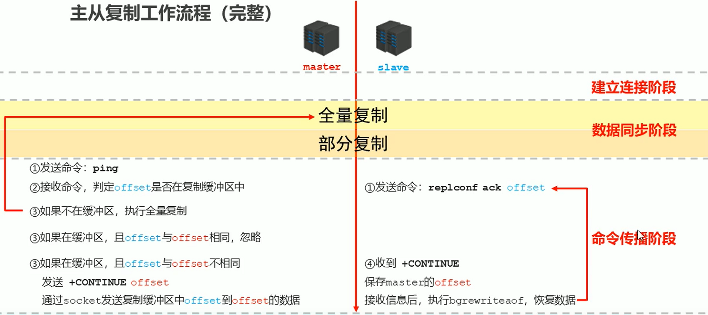  
5. 主从复制常见问题  
```
  1) 频繁的全量复制
    系统运行时，master的数据量越来越大，一旦master重启，runid将发生变化，会导致全部slave的全量复制操作
    
    内部优化调整方案：
      a. master内部创建master_replid变量，使用runid相同的策略生成，长度41位，并发送给所有slave
      b. 在master关闭时执行命令shutdown save，进行RDB持久化，将runid与offset保存到RDB文件中
        repl-id   repl-offset
        通过redis-check-rdb命令可以查看该信息
      c. master重启后加载RDB文件，恢复数据
        重启后，将RDB文件中保存的repl-id与repl-offset加载到内存中
          master_repl_id = repl-id   master_repl_offset = repl-offset
          通过info命令可以查看该信息
      d. 作用：本机保存上次runid，重启后恢复该值，使所有slave认为还是之前的master
  
  2) 频繁的全量复制
    问题现象：
      网络环境不佳，出现网络中断，slave不提供服务
    问题原因：
      复制缓冲区过小，断网后slave的offset越界，触发全量复制
    最终结果：
      slave反复进行全量复制
    解决方案：
      修改复制缓冲区大小
        repl-backlog-size
    建议设置如下：
      a. 测算从master到slave的重连平均时长second
      b. 获取master平均每秒产生写命令数据总量write_size_per_second
      c. 最优复制缓冲区空间 = 2 * second * write_size_per_second
      
  3) 频繁的网络中断
    问题现象：
      master的CPU占用过高或slave频繁断开连接
    问题原因：
      a. slave每1秒发送REPLCONF ACK命令到master
      b. 当slave接到了慢查询（keys *，hgetall等），会大量占用CPU性能
      c. master每1秒调用复制定时函数replicationCron()，对比slave发现长时间没有进行响应
    最终结果：
      master各种资源（输出缓冲区、带宽、连接等）被严重占用
    解决方案：
      通过设置合理的超时时间，确认是否释放slave
      repl-timeout：该参数定义超时时间的阈值（默认60秒），超过该值，释放slave
    
  4) 频繁的网络中断
    问题现象：
      slave与master连接断开
    问题原因：
      a. master发送ping指令频度较低
      b. master设定超时时间较短
      c. ping指令在网络中存在丢包
    解决方案：
      提高ping指令发送的频度
      repl-ping-slave-period：超时时间repl-time的时间至少是ping指令频度的5到10倍，否则slave很容易判定超时
  
  5) 数据不一致
    问题现象：
      多个slave获取相同数据不同步
    问题原因：
      网络信息不同步，数据发送有延迟
    解决方案：
      a. 优化主从间的网络环境，通常放置在同一个机房部署，如使用阿里云等云服务器时要注意此现象
      b. 监控主从节点延迟（通过offset）判断，如果slave延迟过大，暂时屏蔽程序对该slave的数据访问
        slave-serve-stale-data yes|no：开启后仅响应info、slaveof等少数命令（慎用，除非对数据一致性要求很高）
```
- **哨兵**  
1. 哨兵（`sentinel`）：一个分布式系统中，对主从结构中的每台服务器进行监控，当出现故障时通过投票机制选择新的`master`并将所有`slave`连接到新的`master`  
2. 作用  
```
  监控：
    不断检查master和slave是否正常运行
    master存活检测、master与slave运行情况检测
  通知：
    当被监控的服务器出现问题时，向其他（哨兵，客户端）发送通知
  自动故障转移
    断开master与slave连接，选取一个slave作为master，将其他slave连接到新的master，并告知客户端新的服务器地址
    
  注意：
    哨兵也是一台redis服务器，只是不提供数据服务
    通常哨兵配置数量为单数
```
3. 配置哨兵  
```
  配置一拖二的主从结构
  配置三个哨兵（配置相同，端口不同）
  启动哨兵：
    redis-sentinel sentinel-端口号.conf
    
  cat sentinel.conf | grep -v "#" | grep -v "^$" > ./conf/sentinel-26379.conf
  
  cat sentinel-26379.conf
  # port 26379
  # dir /root/redis-5.0.5/data
  # sentinel monitor mymaster 127.0.0.1 6379 2
  # sentinel down-after-milliseconds mymaster 30000
  # sentinel parallel-syncs mymaster 1
  # sentinel failover-timeout mymaster 180000
  
  sed 's/26379/26380/g' sentinel-26379.conf > sentinel-26380.conf
  sed 's/26379/26381/g' sentinel-26379.conf > sentinel-26381.conf
  
  sed 's/6380/6381/g' redis-6380.conf > redis-6381.conf
  
  redis-server redis-5.0.5/conf/redis-6379.conf
  redis-server redis-5.0.5/conf/redis-6380.conf
  redis-server redis-5.0.5/conf/redis-6381.conf
  
  redis-sentinel redis-5.0.5/conf/sentinel-26379.conf
  redis-sentinel redis-5.0.5/conf/sentinel-26380.conf
  redis-sentinel redis-5.0.5/conf/sentinel-26381.conf
  
  redis-cli -p 6379
  set name pkz
  
  redis-cli -p 6380
  get name
```
- **哨兵工作原理**  
1. 哨兵在进行主从切换过程中经历三个阶段：  
a. 监控：同步信息    
b. 通知：保持联通  
c. 故障转移：发现问题；竞选负责人（sentinel）；优选新master；选出新master，其他slave切换master，原master故障恢复后作为slave连接新master   
2. 监控阶段  
```
  同步各个节点的状态信息：
    获取各个sentinel的状态（是否在线）
    获取master的状态：
      master属性：
        runid
        role：master
      各个slave的详细信息
    获取所有slave的状态（根据master中的slave信息）：
      slave属性：
        runid
        role：slave
        master_host、master_port
        offset
```
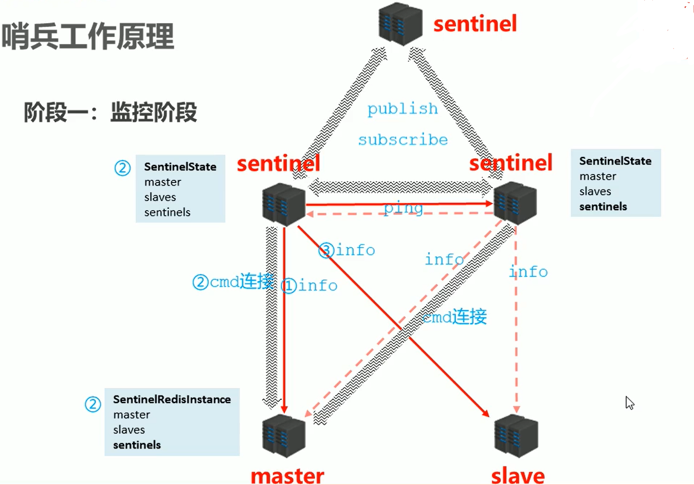  
3. 通知阶段  
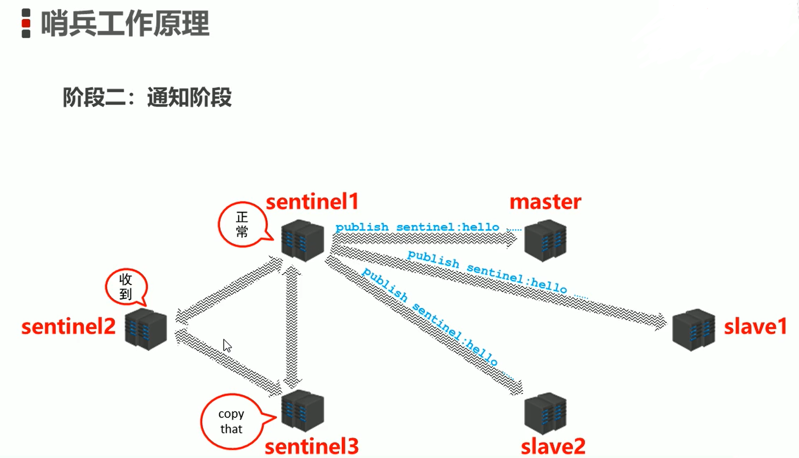  
4. 故障转移阶段  
```
  通过投票竞选负责人（负责sentinel）

  服务器列表中挑选备选master考虑因素：
    是否在线
    响应快慢
    与原master断开时间长短
    优先原则：
      优先级
      offset
      runid
   
  选出新的master后，由sentinel通知新的master：
    向新的master发送slaveof no one
    向其他slave发送slaveof 新master的IP 新master的端口
```
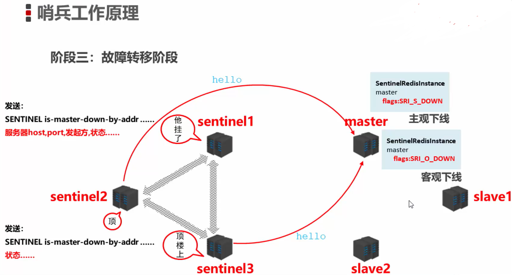
- **集群**  
1. 集群就是是同网络将若干台计算机联通起来，并提供统一的管理方式，使其对外呈现单机的服务效果  
2. 作用：分散单台服务器的访问压力，实现负载均衡；分散单台服务器的存储压力，实现可扩展性；降低单台服务器宕机带来的业务灾难   
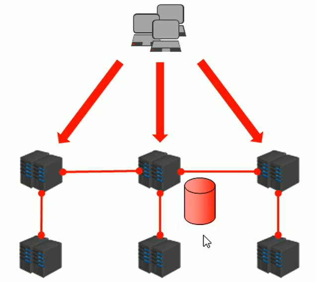  
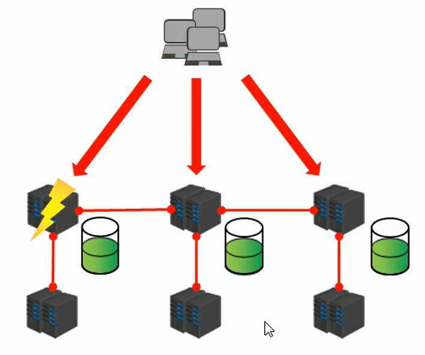  
3. `Redis`集群数据存储设计  
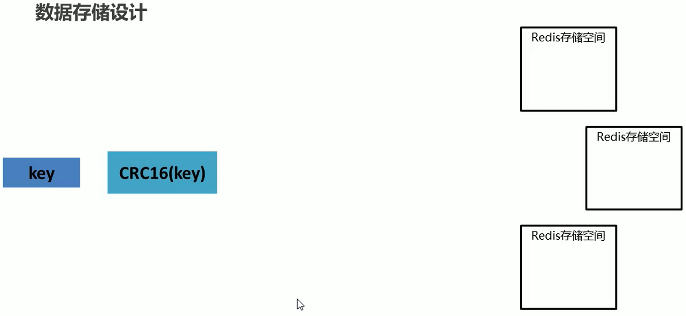
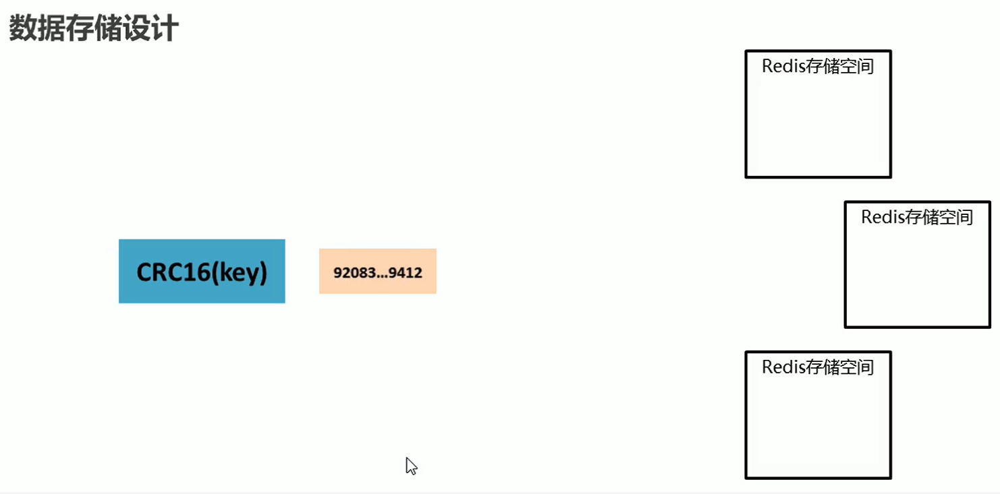
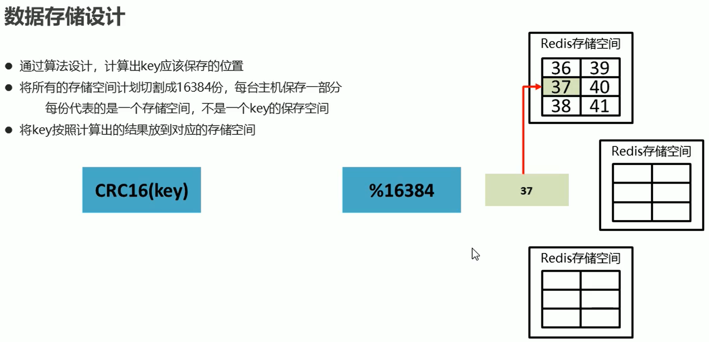
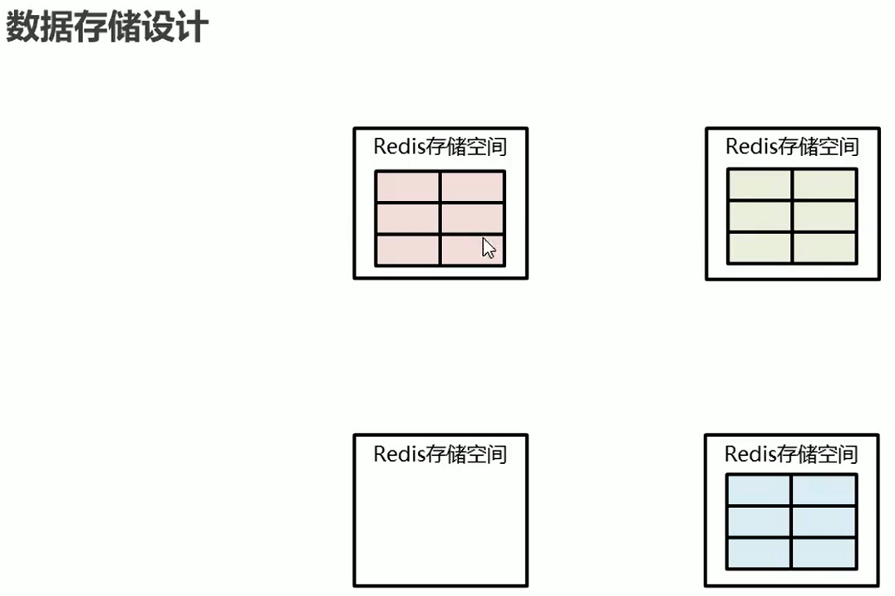
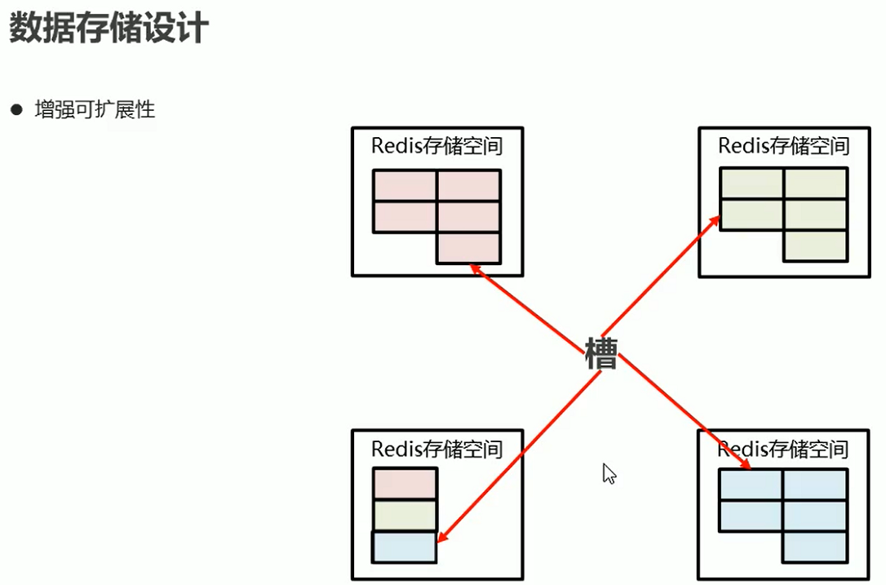
4. `Redis`集群内部通讯设计  
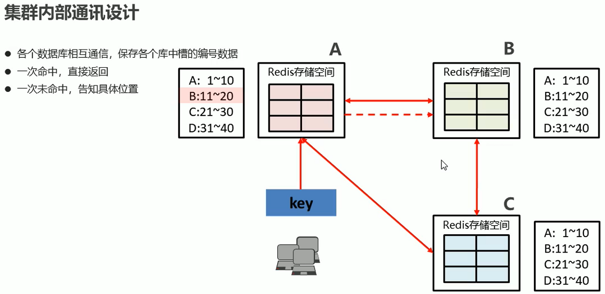  
5. 示例  
```
  cat redis-6379.conf
  # port 6379
  # daemonize no
  # dir /root/redis-5.0.5/data
  # dbfilename dump-6379.rdb
  # rdbcompression yes
  # rdbchecksum yes
  # save 10 2
  # appendonly yes
  # appendfsync always
  # appendfilename appendonly-6379.aof
  # bind 127.0.0.1
  # databases 16
  # cluster-enabled yes
  # cluster-config-file nodes-6379.conf
  # cluster-node-timeout 10000
  
  sed "s/6379/6380/g" redis-6379.conf > redis-6380.conf
  sed "s/6379/6381/g" redis-6379.conf > redis-6381.conf
  sed "s/6379/6382/g" redis-6379.conf > redis-6382.conf
  sed "s/6379/6383/g" redis-6379.conf > redis-6383.conf
  sed "s/6379/6384/g" redis-6379.conf > redis-6384.conf
  sed "s/6379/6385/g" redis-6379.conf > redis-6385.conf
  
  redis-server redis-5.0.5/conf/redis-6379.conf
  redis-server redis-5.0.5/conf/redis-6380.conf
  redis-server redis-5.0.5/conf/redis-6381.conf
  redis-server redis-5.0.5/conf/redis-6382.conf
  redis-server redis-5.0.5/conf/redis-6383.conf
  redis-server redis-5.0.5/conf/redis-6384.conf
  
  ps -ef | grep redis
  
  redis-cli --cluster create 127.0.0.1:6379 127.0.0.1:6380 127.0.0.1:6381 127.0.0.1:6382 127.0.0.1:6383 127.0.0.1:6384 --cluster-replicas 1
  
  redis-cli -c
  set name pkz
  
  redis-cli -c -p 6382
  get name
```
6. `Cluster`配置  
```
  设置加入cluster，成为其中的节点
  cluster-enabled yes|no
  
  cluster配置文件名，该文件属于自动生成
  cluster-config-file <filename>
  
  节点服务响应超时时间，用于判定该节点是否下线或切换为从节点
  cluster-node-timeout <milliseconds>
  
  master连接的slave最小数量
  cluster-migration-barrier <count>
```  
7. `Cluster`节点操作命令
```
  查看集群节点信息
  cluster nodes
  
  进入一个从节点，切换其主节点
  cluster replicate <master-id>
  
  发现一个新节点，新增主节点
  cluster meet ip:port
  
  忽略一个没有solt的节点
  cluster forget <id>
  
  手动故障转移
  cluster failover
```  
- **企业级解决方案**  
1. 缓存预热  
```
  缓存预热就是系统启动前，提前将相关的缓存数据直接加载到缓存系统，避免在用户请求的时候，先查询数据库，然后将数据缓存的问题，从而使用户直接查询提前被预热的缓存数据

  问题提出：
    服务器启动后迅速宕机
    
  解决方案：
    前置准备工作：
      日常例行统计数据访问记录，统计访问频度较高的热点数据
      利用LRU数据删除策略，构建数据留存队列
    准备工作：
      将统计结果中的数据分类，根据级别，redis优先加载级别较高的热点数据
      利用分布式多服务器同时进行数据读取，提高数据加载过程
    实施：
      使用脚本程序固定触发数据预热过程
      如果条件允许，使用CDN（内容分发网络）
```  
2. 缓存雪崩  
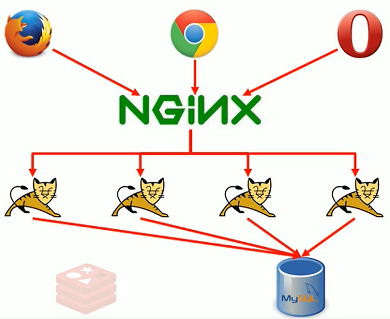
```
  缓存雪崩就是瞬间过期数据量过大，对数据库服务器造成压力。如果能够有效避免过期时间集中，可以有效解决雪崩现象的出现，也要配合其他策略一起使用，并监控服务器的运行数据，根据运行记录做快速调整

  1) 系统平稳运行过程中，忽然数据库连接量激增
  2) 应用服务器无法及时处理请求
  3) 大量408，500错误页面出现
  4) 客户端反复刷新页面获取数据
  5) 数据库崩溃
  6) 应用服务器崩溃
  7) 重启应用服务器无效
  8) Redis服务器崩溃
  9) Redis集群崩溃
  10) 重启数据库后再次遭遇瞬间巨大流量
  
  问题排查：
    1) 在一个较短的时间内，缓存中较多的key集中过期
    2) 此周期内请求访问过期的数据，redis未命中，redis向数据库获取数据
    3) 数据库同时接收到大量的请求无法及时处理
    4) Redis大量请求被积压，开始出现超时现象
    5) 数据库流量激增，数据库崩溃
    6) 重启后缓存中仍然无可用数据 
    7) Redis服务器资源被严重占用，Redis服务器崩溃
    8) Redis集群呈现崩溃，集群瓦解
    9) 应用服务器无法及时得到数据响应请求，来自客户端的请求数量越积越多，应用服务器崩溃
    10) 应用服务器，redis，数据库全部重启，效果不理想
  
  问题分析：
    短时间范围内
    大量key集中过期
    
  解决方案：
    1-1. 更多的页面静态化处理
    1-2. 构建多级缓存架构：
      nginx缓存 + redis缓存 + ehcache缓存
    1-3. 检测Mysql严重耗时的业务并进行优化：
      对数据库的瓶颈进行排查：例如超时查询、耗时较高的事务等
    1-4. 灾难预警机制：
      监控redis服务器性能指标：
        CPU占用、CPU使用率
        内存容量
        查询平均响应时间
        线程数
    1-5. 限流、降级：
      短时间范围内牺牲一些客户体验，限制一部分访问请求，降低应用服务器压力，待业务低速运转后再逐步开放访问
    2-1. LRU与LFU切换
    2-2. 数据有效策略调整：
      根据业务数据有效期进行分类错峰，如A类90分钟，B类80分钟，C类70分钟
      过期时间使用[固定时间+随机值]的形式，稀释集中到期的key的数量
    2-3. 超热数据使用永久key
    2-4. 定期维护（自动+人工）：
      对即将过期数据做访问量分析，确认是否延时，配合访问量统计，做热点数据的延时
    2-5. 加锁（慎用）
```  
3. 缓存击穿  
```
  缓存击穿就是单个高热数据过期的瞬间，数据访问量过大，redis未命中，发起大量对同一数据的数据库访问，对数据库服务器造成压力。应对策略应该在业务数据分析与预防方面进行，配合运行监控测试与即时调整策略，参考雪崩处理策略

  1) 系统平稳运行过程中
  2) 数据库连接量瞬间激增
  3) Redis服务器无大量key过期
  4) Redis内存平稳，无波动
  5) Redis服务器CPU正常
  6) 数据库崩溃
  
  问题排查：
    1) Redis中某个key过期，且对该key的访问量巨大
    2) 多个数据请求从服务器直接压到Redis后，均未命中
    3) Redis在短时间内发起大量对数据库中同一数据的访问
  
  问题分析：
    单个key为高热数据
    key过期
    
  解决方案：
    1) 预先设定：
      以电商为例，在购物节期间，每个商家根据店铺等级，指定若干款主打商品，加大此类信息key的过期时长
    2) 现场调整：
      监控访问量，对自然流量激增的数据延长过期时间或设置为永久key
    3) 后台刷新数据：
      启动定时任务，高峰期来临之前，刷新数据有效期，确保不丢失
    4) 二级缓存：
      设置不同的失效时间，保障不会被同时淘汰
    5) 加锁：
      分布式锁，防止被击穿，但是也会产生性能瓶颈，慎用
```  
4. 缓存穿透  
```
  缓存穿透是客户端访问不存在的数据，跳过合法数据的redis数据缓存阶段，每次都要访问数据库，从而对数据库服务器造成压力。出现此类情况，应及时报警（网警）。无论是黑名单还是白名单，都是对整体系统的压力，警报解除后应尽快移除

  1) 系统平稳运行中
  2) 应用服务器流量随时间增量过大
  3) Redis服务器命中率随时间逐步降低
  4) Redis内存平稳，内存无压力
  5) Redis服务器CPU占用激增
  6) 数据库服务器压力激增
  7) 数据库崩溃
  
  问题排查：
    1) Redis中出现大面积未命中
    2) 出现非正常URL访问
    
  问题分析：
    1) 获取的数据在数据库中也不存在，数据库查询不到相应数据
    2) Redis获取到null数据未进行持久化，直接返回
    3) 下次此类请求到达重复上述过程
    4) 出现黑客攻击服务器
    
  解决方案：
    1) 缓存null：
      对查询结果为null的数据进行缓存（长期使用，定期清理），设定短时限，例如30-60秒，最高5分钟
    2) 白名单策略：
      提前预热各种分类数据id对应的bitmaps，id作为bitmaps的offset，相当于设置了数据白名单。当加载正常数据时放行，加载异常数据时直接拦截（效     率偏低）
      使用布隆过滤器（有关布隆过滤器的命中问题对当前状况可以忽略）
    3) 实时监控：
      实时监控redis命中率（正常业务范围通常会有一个波动值）和null数据的占比：
        非活动时段波动：通常检测3-5倍，超过5倍纳入重点排查对象
        活动时段波动：通常检测10-50倍，超过50倍纳入重点排查对象
      根据倍数不同，启动不同的排查流程，然后使用黑名单进行防控（运营）
    4) key加密：
      问题出现后，临时启动防灾业务key，对key进行业务层传输加密服务，设定校验程序，对过来的key校验
      例如每天随机分配60个加密串，挑选2到3个，混淆到页面数据id中，发现访问key不满足规则，驳回数据访问
```
- **性能指标监控**  
1. 监控指标：性能指标、内存指标、基本活动指标、持久性指标、错误指标  
2. 性能指标  
```
  latency：Redis响应一个请求的时间
  instantaneous_ops_per_sec：平均每秒处理请求总数
  hit rate：缓存命中率（计算出来的）
```  
3. 内存指标
```
  used_memory：已使用内存
  mem_fragmentation_ratio：内存碎片率
  evicted_keys：由于最大内存限制被移除的key的数量
  blocked_clients：由于BLPOP，BRPOP，或者BRPOP，LPUSH而被阻塞的客户端
```  
4. 基本活动指标  
```
  connected_clients：客户端连接数
  connected_slaves：Slave数量
  master_last_io_seconds_ago：最近一次主从交互之后的秒数
  keyspace：数据库中的key值总数
```  
5. 持久性指标  
```
  rdb_last_save_time：最后一次持久化保存到磁盘的时间戳
  rdb_changes_since_last_save：自最后一次持久化以后数据库的更改数
```  
6. 错误指标
```
  rejected_connections：由于达到maxclient限制而被拒绝的连接数
  keyspace_misses：Key值查找失败（没有命中）的次数
  master_link_down_since_seconds：主从断开的持续时间（以秒为单位）  
```
7. 监控工具：Cloud Insight Redis/Prometheus/Redis-stat/Redis-faina/RedisLive/Zabbix  
8. 监控命令：`benchmark`；`redis cli`：`monitor`，`showlog`  
```
  redis-benchmark [-h] [-p] [-c] [-n <requests>] [-k]
  
  50个连接，10000次请求对应的性能
  redis-benchmark
  
  100个连接，5000次请求对应的性能
  redis-benchmark -c 100 -n 5000
  
  redis-cli
  打印服务器调试信息
  monitor
  
  slowlog [operator]
    get：获取慢查询日志
    len：获取慢查询日志条数
    reset：重置慢查询日志
    
  相关配置：
    设置慢查询的时间下限，单位：微秒
    slowlog-log-slower-than 1000
    设置慢查询命令对应的日志显示长度，单位：命令数
    slowlog-max-len 100
```
- **布隆过滤器**   
布隆过滤器可以用于检索一个元素是否在一个集合中，由一个很长的二进制向量和一系列随机映射函数组成。优点是空间效率和查询时间都远远超过一般的算法，缺点是有一定的误识别率和删除困难   
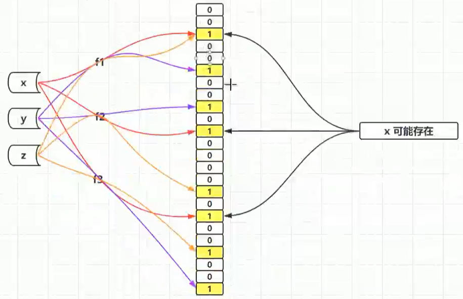
