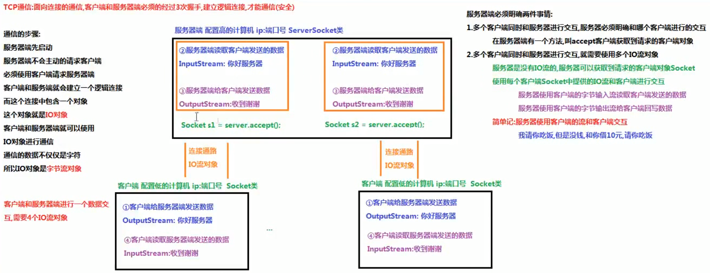
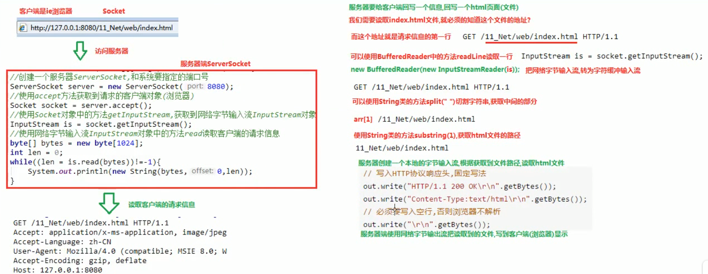

## Socket
- **TCP通信**  
1. TCP通信的客户端：向服务器发送连接请求，给服务器发送数据，读取服务器回写的数据  
2. 表示客户端的类：`java.net.Socket`，此类实现客户端套接字。套接字是两台机器间通信的端点，是包含了IP地址和端口号的网络单位  
构造方法：`Socket(String host, int port)`：创建一个流套接字并将其连接到指定主机上的指定端口号。参数：`String host`，服务器主机的名称/服务器的IP地址。`int port`：服务器的端口号  
成员方法：`OutputStream getOutputStream()`：返回此套接字的输出流。`InputStream getInputStream()`：返回此套接字的输入流。`void close()`：关闭此套接字
3. 实现步骤：  
a. 创建一个客户端对象`Socket`，构造方法绑定服务器的IP地址和端口号  
b. 使用`Socket`对象中的方法`getOutputStream()`获取网络字节输出流`OutputStream`对象  
c. 使用网络字节输出流`OutputStream`对象中的方法`write`，给服务器发送数据  
d. 使用`Socket`对象中的方法`getInputStream()`获取网络字节输入流`InputStream`对象  
e. 使用网络字节输入流`InputStream`对象中的方法`read`，读取服务器回写的数据  
4. 注意：  
a. 客户端和服务端进行交互，必须使用`Socket`中提供的网络流，不能使用自己创建的流对象  
b. 创建客户端对象`Socket`的时候，请求服务器和服务器经过3次握手建立连接通路。如果此时服务器没有启动，就会抛出异常。如果服务器已经启动，就可以进行交互
5. `java.net.ServerSocket`：此类实现服务器套接字  
构造方法：`ServerSocket(int port)`：创建绑定到特定端口的服务器套接字。  
成员方法：`Socket accept()`：倾听并接收套接字的连接。服务器端必须明确一件事情，必须知道是哪个客户端请求的服务器。可以使用`accept`方法获取到请求的客户端对象`Socket`。
6. 服务器端的实现步骤：    
a. 创建服务器`ServerSocket`对象和系统要指定的端口号  
b. 使用`ServerSocket`对象中的方法`accept`，获取到请求的客户端对象`Socket`  
c. 使用`Socket`对象中的方法`getInputStream()`获取网络字节输入流`InputStream`对象  
d. 使用网络字节输入流`InputStream`对象中的方法`read`，读取客户端发送的数据  
e. 使用`Socket`对象中的方法`getOutputStream()`获取网络字节输出流`OutputStream`对象  
f. 使用网络字节输出流`OutputStream`对象中的方法`write`，给客户端回写数据  
d. 释放资源（`Socket`，`ServerSocket`）

- **文件上传案例**    
客户端读取本地文件，把文件上传到服务器，服务器再把上传的文件保存到服务器的硬盘上  
1. 客户端使用本地字节输入流，读取要上传的文件  
2. 客户端使用网络字节输出流，把读取到的文件上传到服务器  
3. 服务器使用网络字节输入流，读取客户端上传的文件 
4. 服务器使用本地字节输出流，把读取的文件，保存到服务器的硬盘上 
5. 服务器使用网络字节输出流，给客户端回写一个“上传成功”
6. 客户端使用网络字节输入流，读取服务器回写的数据
7. 释放资源  
注意：客户端和服务器和本地硬盘进行读写，需要使用自己创建的字节流对象（本地流）。客户端和服务器之间进行读写，必须使用`Socket`中提供的字节流对象（网络流）  
8. 客户端：读取本地文件，上传到服务器，读取服务器回写的数据，实现步骤：  
a. 创建一个本地字节输入流`FileInputStream`对象，构造方法中绑定要读取的数据源  
b. 创建一个客户端`Socket`对象，构造方法中绑定服务器的IP地址和端口号  
c. 使用`Socket`中的方法`getOutputStream`，获取网络字节输出流`OutputStream`对象  
d. 使用本地字节输入流`FileInputStream`对象中的方法`read`，读取本地文件  
e. 使用网络字节输出流`OutputStream`对象中的方法`write`，把读取到的文件上传到服务器  
f. 使用`Socket`中的方法`getInputStream`，获取网络字节输入流`InputStream`对象  
g. 使用网络字节输入流`InputStream`对象中的方法`read`读取服务器回写的数据  
h. 释放资源（`FileInputStream`，`Socket`）
9. 服务器端：读取客户端上传的文件，保存到服务器的硬盘，给客户端回写“上传成功”，实现步骤：  
a. 创建一个服务器`ServerSocket`对象，绑定要指定的端口号  
b. 使用`ServerSocket`对象中的方法`accept`，获取到请求的客户端`Socket`对象  
c. 使用`Socket`对象中的方法`getInputStream`，获取到网络字节输入流`InputStream`对象  
d. 判断服务器硬盘保存文件的文件夹是否存在，不存在则创建  
e. 创建一个本地字节输出流`FileOutputStream`对象，构造方法中绑定要输出的目的地  
f. 使用网络字节输入流`InputStream`对象中的方法`read`，读取客户端上传的文件  
g. 使用本地字节输出流`FileOutStream`对象中的方法`write`，把读取到的文件保存到服务器的硬盘上  
h. 使用`Socket`对象中的方法`getOutputStream`，获取到网络字节输出流`OutputStream`对象  
i. 使用网络字节输出流`OutputStream`对象中的方法`write`，给客户端回写“上传成功”  
j. 释放资源（`FileOutputStream`，`Socket`，`ServerSocket`）

