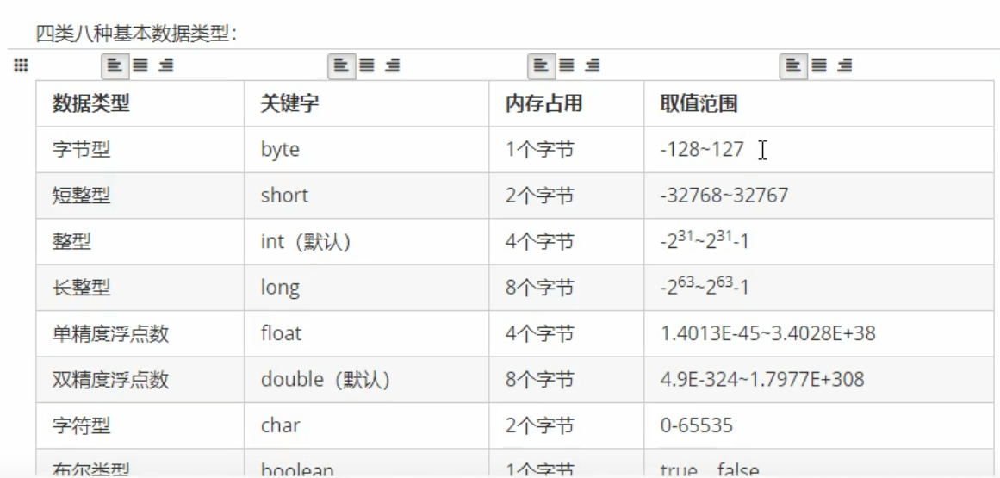

## 基本数据类型
- **八种基本数据类型**  
1. 整数型：byte short int long
2. 浮点型：float double
3. 字符型：char
4. 布尔型：boolean
  
- **注意事项**
1. 字符串不是基本类型，而是引用类型。
2. 浮点型可能只是一个近似值，并非精确的值。
3. 数据范围与字节数不一定相关，例如float数据范围比long更加广泛，但是float是4字节，long是8字节。
4. 整数默认类型是int，如果一定要使用long类型，需要加上一个后缀L。浮点数默认类型是double。如果一定要使用float类型，需要加一个后缀F。建议使用大写字母后缀。
(```)
  System.out.println(1024); //这是一个整数，默认是int类型
  System.out.println(3.14); //这是一个浮点数，默认是double类型
(```)
- **自动类型转换（隐式）**
1. 特点：代码不需要进行特俗处理，自动完成。
2. 规则：数据范围从小到大。
(```)
  //左边是long类型，右边是默认类型int
  //一个等号代表赋值，将右侧int常量，交给左侧long变量存储
  //int -> long，符合数据范围从小到大的要求
  //这一行代码发生了自动类型转换
  long num1 = 100; 
  
  //左边是double类型，右边是float类型
  //float -> double，符合数据范围从小到大
  //发生了自动类型转换
  double num2 = 2.5F;
  
  //左边是float类型，右边是long类型
  //long -> float，float范围比long大一些
  //发生了自动类型转换
  float num3 = 30L;
  System.out.println(num3); //30.0
(```)
- **强制类型转换（显式）**
