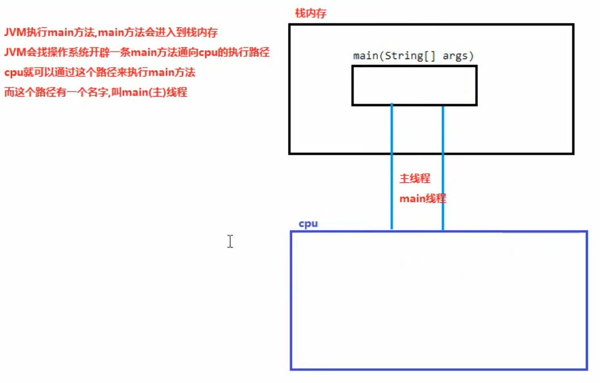
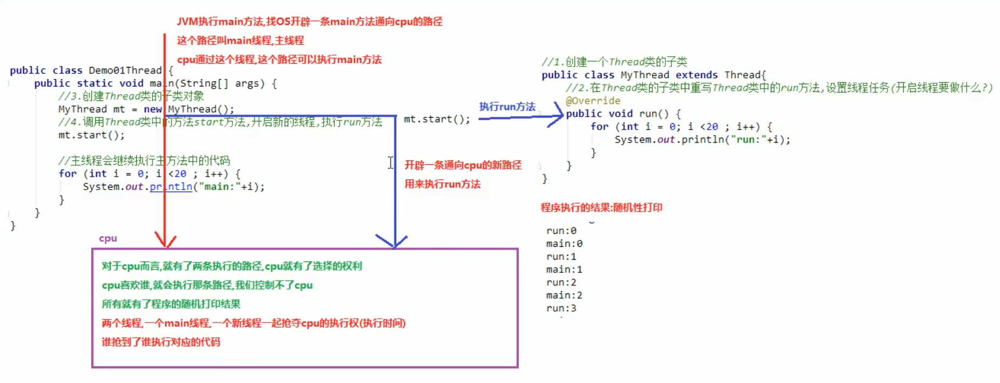
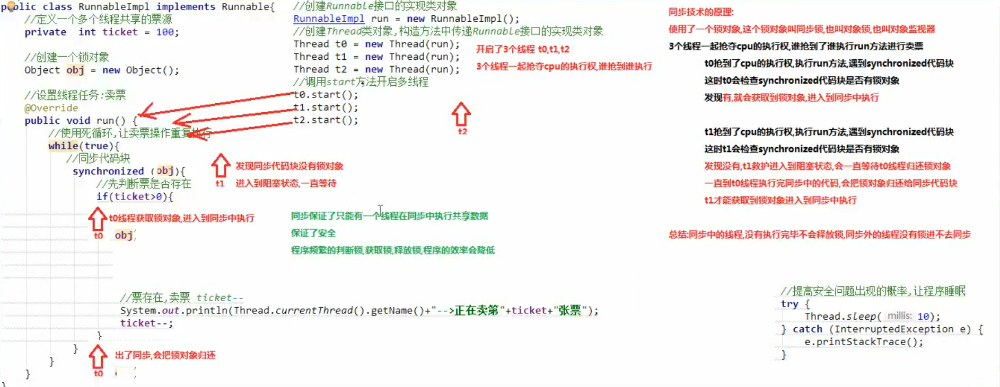

## 多线程
- **线程概念**

- **Thread类**
1. 创建多线程程序的第一种方式：创建`Thread`类的子类。`java.lang.Thread`类，是描述线程的类，实现多线程程序，可以继承`Thread`类
2. 实现步骤：  
a. 创建一个`Thread`类的子类  
b. 在`Thread`类的子类中重写`Thread`类中的`run`方法，设置线程任务  
c. 创建`Thread`类的子类对象  
d. 调用`Thread`类中的`start`方法，开启新的线程，执行`run`方法  

3. `void start()`使该线程开始执行，`Java`虚拟机调用该线程的`run`方法。结果是两个线程并发执行，当前线程（`main`线程）和另一个线程（创建的新线程，执行其`run`方法）。多次启动一个线程是非法的。特别是当线程已经结束执行后，不能再重新启动
4. `java`程序属于抢占式调度，优先级高的线程优先执行。优先级仙童，随机选择一个执行
5. 获取线程的名称：  
a. 使用`Thread`类中的方法`getName()`：`String getName()`返回该线程的名称  
b. 可以先获取到当前正在执行的线程，使用线程中的方法`getName()`获取线程的名称：`static Thread currentThread()`返回对当前正在执行的线程对象的引用
6. `public static void sleep(long millis)`：使当前正在执行的线程以指定的毫秒数暂停（暂时停止执行）
```
  for (int i = 1; i <= 60 ; i++) {
    System.out.println(i);
    
    try {
      Thread.sleep(1000);
    } catch (InterruptedException e) {
      e.printStackTrace();
    }
  }
```
- **多线程原理**

- **Runnable接口**
1. 创建多线程程序的第二种方式：实现`Runnable`接口。`java.lang.Runnable`接口应该由那些打算通过某一线程执行其实例的类来实现。类必须定义一个成为`run`的无参数方法
2. `java.lang.Thread`类的构造方法：  
`Thread(Runnable target)`：分配新的`Thread`对象  
`Thread(Runnable target, String name)`：分配新的`Thread`对象
3. 实现步骤：  
a. 创建一个`Runnable`接口的实现类  
b. 在实现类中重写`Runnable`接口的`run`方法，设置线程任务  
c. 创建一个`Runnable`接口的实现类对象  
d. 创建`Thread`类对象，构造方法中传递`Runnable`接口的实现类对象  
e. 调用`Thread`类中的`start`方法，开启新的线程执行`run`方法
4. 实现`Runnable`接口创建多线程程序的好处：  
a. 避免了单继承的局限性：一个类只能继承一个类，类继承了`Thread`类就不能继承其他的类。实现`Runnable`接口，还可以继承其他的类，实现其他的接口  
b. 增强了程序的扩展性，降低了程序的耦合性（解耦）：实现`Runnable`接口的方式，把设置线程任务和开启新线程进行了分裂（解耦）。实现类中，重写`run`方法用来设置线程任务。创建`Thread`类对象，调用`start`方法开启新线程
- **匿名内部类方式实现线程的创建**  
1. 匿名：没有名字。内部类：写在其他类内部的类。匿名内部类作用：简化代码，把子类继承父类，重写父类的方法，创建子类对象合一步完成。把实现类实现类接口，重写接口中的方法，创建实现类对象合一步完成。匿名内部类的最终产物：子类/实现类对象，而这个类没有名字
2. 格式：  
```
  new 父类/接口() {
    重复父类/接口中的方法
  };
```
- **同步代码块**
1. 解决线程安全问题的第一种方案：使用同步代码块
2. 格式：
```
  synchronized(锁对象) {
    可能会出现线程安全问题的代码（访问共享数据的代码）
  }
```
3. 注意：  
a. 通过代码块中的锁对象，可以使用任意的对象  
b. 必须保证多个线程使用的锁对象是同一个  
c. 锁对象的作用：把同步代码块锁住，只让一个线程在同步代码块中执行  
4. 同步代码块原理

- **同步方法**
1. 解决线程安全问题的第二种方案：使用同步方法  
2. 步骤：  
a. 把访问共享数据的代码抽取出来，放到一个方法中  
b. 在方法上添加`synchronized`修饰符  
3. 定义方法的格式：
```
  修饰符 synchronized 返回值类型 方法名(参数列表) {
    可能会出现线程安全问题的代码（访问了共享数据的代码）
  }
```
4. 同步方法也会把方法内部的代码锁住，只让一个线程执行。同步方法的锁对象是实现类对象`new RunnableImpl()`，也就是`this`  
5. 静态同步方法的锁对象不能是`this`，`this`是创建对象之后产生的，静态方法优先于对象。静态方法的锁对象是本类的`class`属性->`class`文件对象（反射）
```
  public static /*synchronized*/ void payTicketStatic() {
    synchronized (RunnableImpl.class) {
    }
  }
```
