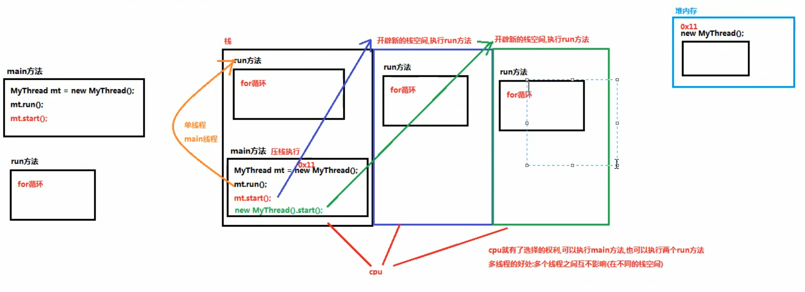

## 多线程  
- **同步/异步**  
1. 同步：A调用B，B处理直到获得结果，才返回给A。需要调用者一致等待和确认调用结果是否返回，然后才能继续执行  
2. 异步：A调用B，无需等待结果  
- **阻塞/非阻塞**  
1. 阻塞：A调用B，A暂时被挂起。调用结果返回前，当前线程挂起不能处理其它任务，一致等待调用结果返回  
2. 非阻塞：A调用B，A不会被挂起。调用结果返回前，当前线程可以处理其它任务  
- **线程概念**

- **Thread类**
1. 创建多线程程序的第一种方式：创建`Thread`类的子类。`java.lang.Thread`类，是描述线程的类，实现多线程程序，可以继承`Thread`类
2. 实现步骤：  
a. 创建一个`Thread`类的子类  
b. 在`Thread`类的子类中重写`Thread`类中的`run`方法，设置线程任务  
c. 创建`Thread`类的子类对象  
d. 调用`Thread`类中的`start`方法，开启新的线程，执行`run`方法  

3. `void start()`使该线程开始执行，`Java`虚拟机调用该线程的`run`方法。结果是两个线程并发执行，当前线程（`main`线程）和另一个线程（创建的新线程，执行其`run`方法）。多次启动一个线程是非法的。特别是当线程已经结束执行后，不能再重新启动  
4. 执行`start`方法会开启一个新的线程，并在新的线程执行`run`方法；仅直接执行`run`方法，会在当前线程执行线程任务，不会开启新的线程  
5. `java`程序属于抢占式调度，优先级高的线程优先执行。优先级相同，随机选择一个执行
6. 获取线程的名称：  
a. 使用`Thread`类中的方法`getName()`：`String getName()`返回该线程的名称  
b. 可以先获取到当前正在执行的线程，使用线程中的方法`getName()`获取线程的名称：`static Thread currentThread()`返回对当前正在执行的线程对象的引用
7. `public static void sleep(long millis)`：使当前正在执行的线程以指定的毫秒数暂停（暂时停止执行）
```
  for (int i = 1; i <= 60 ; i++) {
    System.out.println(i);
    
    try {
      Thread.sleep(1000);
    } catch (InterruptedException e) {
      e.printStackTrace();
    }
  }
```
- **多线程原理**

- **Runnable接口**
1. 创建多线程程序的第二种方式：实现`Runnable`接口。`java.lang.Runnable`接口应该由那些打算通过某一线程执行其实例的类来实现。类必须定义一个成为`run`的无参数方法
2. `java.lang.Thread`类的构造方法：  
`Thread(Runnable target)`：分配新的`Thread`对象  
`Thread(Runnable target, String name)`：分配新的`Thread`对象
3. 实现步骤：  
a. 创建一个`Runnable`接口的实现类  
b. 在实现类中重写`Runnable`接口的`run`方法，设置线程任务  
c. 创建一个`Runnable`接口的实现类对象  
d. 创建`Thread`类对象，构造方法中传递`Runnable`接口的实现类对象  
e. 调用`Thread`类中的`start`方法，开启新的线程执行`run`方法
4. 实现`Runnable`接口创建多线程程序的好处：  
a. 避免了单继承的局限性：一个类只能继承一个类，类继承了`Thread`类就不能继承其他的类。实现`Runnable`接口，还可以继承其他的类，实现其他的接口  
b. 增强了程序的扩展性，降低了程序的耦合性（解耦）：实现`Runnable`接口的方式，把设置线程任务和开启新线程进行了分裂（解耦）。实现类中，重写`run`方法用来设置线程任务。创建`Thread`类对象，调用`start`方法开启新线程
- **匿名内部类方式实现线程的创建**  
1. 匿名：没有名字。内部类：写在其他类内部的类。匿名内部类作用：简化代码，把子类继承父类，重写父类的方法，创建子类对象合一步完成。把实现类实现类接口，重写接口中的方法，创建实现类对象合一步完成。匿名内部类的最终产物：子类/实现类对象，而这个类没有名字
2. 格式：  
```
  new 父类/接口() {
    重复父类/接口中的方法
  };
```
- **同步代码块**
1. 解决线程安全问题的第一种方案：使用同步代码块
2. 格式：
```
  synchronized(锁对象) {
    可能会出现线程安全问题的代码（访问共享数据的代码）
  }
```
3. 注意：  
a. 通过代码块中的锁对象，可以使用任意的对象  
b. 必须保证多个线程使用的锁对象是同一个  
c. 锁对象的作用：把同步代码块锁住，只让一个线程在同步代码块中执行  
4. 同步代码块原理

- **同步方法**
1. 解决线程安全问题的第二种方案：使用同步方法  
2. 步骤：  
a. 把访问共享数据的代码抽取出来，放到一个方法中  
b. 在方法上添加`synchronized`修饰符  
3. 定义方法的格式：
```
  修饰符 synchronized 返回值类型 方法名(参数列表) {
    可能会出现线程安全问题的代码（访问了共享数据的代码）
  }
```
4. 同步方法也会把方法内部的代码锁住，只让一个线程执行。同步方法的锁对象是实现类对象`new RunnableImpl()`，也就是`this`  
5. 静态同步方法的锁对象不能是`this`，`this`是创建对象之后产生的，静态方法优先于对象。静态方法的锁对象是本类的`class`属性->`class`文件对象（反射）
```
  public static /*synchronized*/ void payTicketStatic() {
    synchronized (RunnableImpl.class) {
    }
  }
```
- **Lock锁**
1. 解决线程安全问题的第三种方案：使用Lock锁，`java.util.concurrent.locks.Lock`接口,`Lock`实现提供比使用`synchronized`方法和语句可获得的更广泛的锁定操作  
2. `Lock`接口中的方法：`void lock()`获取锁，`void unlock()`释放锁  
3. `java.util.concurrent.locks.ReentrantLock implements Lock`接口，使用步骤：  
a. 在成员位置创建一个`ReentrantLock`对象  
b. 在可能会出现安全问题的代码前调用`Lock`接口中的方法`lock`获取锁  
c. 在可能会出现安全问题的代码后调用`Lock`接口中的方法`unlock`释放锁  
4. 非静态方法的锁默认为`this`，静态方法的锁为对应的`Class`实例  
5. 某一时刻内，只能有一个线程持有锁，无论几个方法
```
  private int tick = 100;
  private Lock lock = new ReentrantLock();
  @Override
  public void run() {
    while(true) {
      // 上锁
      lock.lock();
      try {
        if(tick > 0) {
          try {
            Thread.sleep(2000);
          } catch (InterruptedException e) {
          
          }
          Sytem.out.println(Thread.currentThread().getName() + " 完成售票，余票为：" + --tick);
        }
      } finally {
        // 释放锁
        lock.unlock();
      }
    }
  }
  
  private Lock lock = new ReentrantLock();
  // Condition实现等待/唤醒
  private Condition condition = lock.newCondition();
  public void sale() {
    lock.lock();
    try {
      while(product <= 0) {
        System.out.println("缺货");
        try {
          condition.await();
        } catch (InterruptedException e) {
        }
      }
      System.out.println(Thread.currentThread().getName() + "：" + --product);
      condition.signalAll();
    } finally {
      lock.unlock();
    }
  }
```  
- **可重入锁**  
1. 可重入就是说某个线程已经获得某个锁，可以再次获取该锁而不会出现死锁
- **线程之间的通信**
1. `Object`类中的方法  
`void wait()`：在其他线程调用此对象的`notify()`方法或`notifyAll()`方法前，导致当前线程等待  
`void notify()`：唤醒在此对象监视器上等待的单个线程。会继续执行`wait()`方法之后的代码
2. 等待唤醒案例  
a. 创建一个顾客线程（消费者）：告知老板要的包子的种类和数量，调用`wait`方法，放弃CPU的执行，进入到`WAITING`状态（无限等待）  
b. 创建一个老板线程（生产者）：花5秒做包子，做好包子之后，调用`notify`方法，唤醒顾客吃包子  
c. 顾客和老板线程必须使用同步代码块包裹起来，保证等待和唤醒只能有一个在执行  
d. 同步使用的锁对象必须保证唯一  
e. 只有锁对象才能调用`wait`和`notify`方法  
```
  // 创建一个老板线程（生产者）
  new Thread() {
    @Override
    public void run() {
      // 一直做包子
      while (true) {
        // 花5秒做包子
        try {
          Thread.sleep(5000);
        } catch (InterruptedException e) {
          e.printStackTrace();
        }
        
        // 保证等待和唤醒的线程只能有一个执行，需要使用同步技术
        synchronized (obj) {
          System.out.println("老板5秒钟之后做好包子，告知顾客，可以吃包子了");
          // 做好包子之后，调用notify方法，唤醒顾客吃包子
          obj.notify();
        }
      }
    }
  }.start();
  
  // 创建一个顾客线程（消费者）
  new Thread() {
    @Override
    public void run() {
      while(true) {
        // 保证等待和唤醒的线程只能有一个执行，需要使用同步技术
        synchronized (obj) {
          System.out.println("告知老板要的包子的种类和数量");
          // 调用wait方法，放弃CPU的执行，进入到WAITING状态（无限等待）
          try {
            obj.wait();
          } catch (InterruptedException e) {
            e.printStackTrace();
          }
          // 唤醒之后执行的代码
          System.out.println("包子已经做好了，开吃");
        }
      }
    }
  }.start();
```
- **TimeWaiting**
1. 进入到`TimeWaiting`（计时等待）有两种方式：  
a. 使用`sleep(long m)`方法，在毫秒值结束之后，线程睡醒进入到`Runnable`/`Blocked`状态  
b. 使用`wait(long m)`方法，`wait`方法如果在毫秒值结束之后，还没有被`notify`唤醒，就会自动醒来，线程睡醒进入到`Runnable`/`Blocked`状态
2. 唤醒的方法：  
a. `void notify()`唤醒在此对象监视器上等待的单个线程  
b. `void notifyAll()`唤醒在此对象监视器上等待的所有线程
- **线程池**
1. `JDK1.5`之后提供的线程池，`java.util.concurrent.Executors`：线程池的工厂类，用来生成线程池
2. `Executors`类中的静态方法：`static ExecutorService newFixedThreadPool(int nThreads)`：创建一个可重用固定线程池数的线程池  
参数：`int nThreads`：创建线程池中包含的线程数量  
返回值：`ExecutorService`接口，返回的是`ExecutorService`接口的实现类对象，可以使用`ExecutorService`接口接收（面向接口编程）
3. `java.util.concurrent.ExecutorService`：线程池接口，用来从线程池中获取线程，调用`start`方法，执行线程任务  
`submit(Runnable task)`：提交一个`Runnable`任务用于执行  
`void shutdown()`：关闭/销毁线程池的方法  
4. 线程池的使用步骤：  
a. 使用线程池的工厂类`Executors`里边提供的静态方法`newFixedThreadPool`生产一个指定线程数量的线程池  
b. 创建一个类，实现`Runnable`接口，重写`run`方法，设置线程任务  
c. 调用`ExecutorService`中的方法`submit`，传递线程任务（实现类），开启线程，执行`run`方法  
d. 调用`ExecutorService`中的方法`shutdown`销毁线程池（不建议执行）
```
  // 使用线程池的工厂类Executors里边提供的静态方法newFixedThreadPool生产一个指定线程数量的线程池
  ExecutorService es = Executors.newFixedThreadPool(2);
  
  // 创建一个类，实现Runnable接口，重写run方法，设置线程任务
  public class RunnableImpl implements Runnable {
    @Override
    public void run() {
      System.out.println(Thread.currentThread().getName() + "创建了一个新的线程执行");
    }
  }
  
  // 调用ExecutorService中的方法submit，传递线程任务（实现类），开启线程，执行run方法
  es.submit(new RunnableImpl()); // pool-1-thread-1创建了一个新的线程执行
  es.submit(new RunnableImpl()); // pool-1-thread-1创建了一个新的线程执行
  // 线程池会一直开启，使用完了线程，会自动把线程归还给线程池，线程可以继续使用
  es.submit(new RunnableImpl()); // pool-1-thread-1创建了一个新的线程执行
  es.submit(new RunnableImpl()); // pool-1-thread-2创建了一个新的线程执行
  
  // 调用ExecutorService中的方法shutdown销毁线程池（不建议执行）
  es.shutdown();
```
5. 线程池的体系结构：
```
  java.util.concurrent.Executor：负责线程的使用与调度的根接口
      |--**ExecutorService子接口：线程池的主要接口
          |--ThreadPoolExecutor：线程池的实现类
          |--ScheduledExecutorService子接口：负责线程的调度
              |--ScheduledThreadPoolExecutor：继承ThreadPoolExecutor，实现ScheduledExecutorService
```
6. 工具类：`Executors`
```
  ExecutorService newFixedThreadPool()：创建固定大小的线程池
  ExecutorService newCachedThreadPool()：缓存线程池，线程池的数量不固定，可以根据需求自动的更改数量
  ExecutorService newSingleThreadPool()：创建单个线程池，线程池中只有一个线程
  ScheduledExecutorService newScheduledThreadPool()：创建固定大小的线程池，可以延迟或定时的执行任务
```
7.   
```
  public static void main(String[] args) {
    // 1. 创建线程池
    ExecutorService pool = Executors.newFixedThreadPool(5);
    
    ThreadPoolDemo tpd = new ThreadPoolDemo();
    
    // 2. 为线程池中的线程分配任务
    for (int i = 0; i < 10; i++) {
      pool.submit(tpd);
    }
    
    // 3. 关闭线程池
    pool.shutdown();
  }
  
  
  public static void main(String[] args) throws Exception {
    // 1. 创建线程池
    ExecutorService pool = Executors.newFixedThreadPool(5);
    
    Future<Integer> future = pool.submit(new Callable<Integer>() {
      @Override
      public Integer call() throws Exception {
        int sum = 0;
        for (int i = 0; i <= 100; i++) {
          sum += i;
        }
        return sum;
      }
    });
    System.out.println(future.get());
    pool.shutdown();
  }
  
  
  public static void main(String[] args) throws Exception {
    ScheduledExecutorService pool = Executors.newScheduledThreadPool(5);
    
    for (int i = 0; i < 5; i++) {
      Future<Integer> result = pool.schedule(new Callable<Integer>() {
        @Override
        public Integer call() throws Exception {
          int num = new Random().nextInt(100);
          System.out.println(Thread.currentThread().getName() + " : " + num);
          return num;
        }
      }, 3, TimeUnit.SECONDS);
      System.out.println(result.get());
    }
    pool.shutdown();
  }
```  
- **ThreadPoolExecutor类**  
  
1. `ThreadPoolExecutor`的重要参数  
a. `corePoolSize`：核心线程数。核心线程会一直存活，即使没有任务需要执行。当线程数小于核心线程数时，即使有线程空闲，线程池也会优先创建新线程处理。设置`allowCoreThreadTimeout = true`时，核心线程会超时关闭  
b. `maxPoolSize`：最大线程数。当`线程数 >= corePoolSize`，且任务队列已满时，线程池会创建新线程处理任务；当`线程数 = maxPoolSize`，且任务队列已满时，线程池会拒绝处理任务而抛出异常  
c. `queueCapacity`：任务队列容量（阻塞队列）：当核心线程数达到最大时，新任务会放在队列中排队等待执行  
d. `keepAliveTime`：线程空闲时间。当线程空闲时间达到`keepAliveTime`时，线程会退出，直到`线程数量 = corePoolSize`；如果`allowCoreThreadTimeout = true`，则直到`线程数量 = 0`  
e. `allowCoreThreadTimeout`：允许核心线程超时  
f. `rejectedExecutionHandler`：任务拒绝处理器。两种情况会拒绝处理任务：(1)当线程数已经达到`maxPoolSize`，且队列已满，会拒绝新任务。(2)当线程池被调用`shutdown()`后，会等待线程池里的任务执行完毕。如果在调用`shutdown()`和线程池真正`shutdown`之间提交任务，会拒绝新任务。线程池会调用`rejectedExecutionHandler`来处理这个任务  
2. `ThreadPoolExecutor`执行过程  
a. 当线程数小于核心线程数时，创建线程  
b. 当线程数大于等于核心线程数，且任务队列未满时，任务进入任务队列  
c. 当线程数大于等于核心线程数，且任务队列已满：若线程数小于最大线程数，创建线程；若线程数等于最大线程数，抛出异常，拒绝任务  
3. 线程池拒绝策略：  
a. 直接抛出拒绝异常  
b. 任务交给调用线程处理  
c. 丢弃队列中最老的任务，再次尝试提交  
d. 直接丢弃无法加载的任务  
- **Lambda**
1. `Lambda`表达式的标准格式，由三部分组成：  
a. 一些参数  
b. 一个箭头  
c. 一段代码
2. 格式：`(参数列表) -> { 一些重写方法的代码 };`
3. 解释说明格式：  
`()`：接口中抽象方法的参数列表，没有参数就空着，有参数就写出参数，多个参数使用逗号分隔  
`->`：传递的意思，把参数传递给方法体`{}`  
`{}`：重写接口的抽象方法的方法体
4. `Lambda`表达式：是可推导，可以省略。凡是根据上下文推导出来的内容，都可以省略书写，可以省略的内容：  
a. `(参数列表)`：括号中参数列表的数据类型，可以省略不写  
b. `(参数列表)`：括号中的参数如果只有一个，那么类型和`()`可以省略  
c. `{一些代码}`：如果`{}`中的代码只有一行，无论是否有返回值，都可以省略（`{}, return, 分号`）。注意：要省略`{}`，`return`，`;`必须一起省略
```
  // 使用匿名内部类的方式，实现多线程
  new Thread(new Runnable {
    @Override
    public void run() {
      System.out.println(Thread.currentThread().getName() + " 新线程创建了");
    }
  }).start();
  
  // 使用Lambda表达式，实现多线程
  new Thread(() -> {
    System.out.println(Thread.currentThread().getName() + " 新线程创建了");
  }).start();
  
  // 优化省略Lambda
  new Thread(() -> System.out.println(Thread.currentThread().getName() + " 新线程创建了")).start();
```
- **volatile**    
   
   
1. `volatile`关键字：当多个线程进行操作共享数据时，可以保证内存中的数据可见。相较于`synchronized`是一种较为轻量级的同步策略   
   
```
  read：从内存读取数据
  load：将主内存读取到的数据写入工作内存  
  use：从工作内存读取数据来计算
  assign：将计算好的值重新赋值到工作内存
  store：将工作内存数据写入主内存
  write：将store的变量值赋值给主内存中的变量
  lock：将主内存变量加锁，标识为线程独占状态
  unlock：将主内存变量解锁
  
  缓存不一致问题解决方案：
    总线加锁（性能较低）：CPU从贮存读取数据到高速缓存，在总线对数据加锁，导致其他CPU无法读写这个数据，直到当前CPU使用完数据释放锁之后其他CPU才能读写当前数据
    MESI缓存一致性协议：多个CPU从主存读取同一个数据到各自的高速缓存，当其中某个CPU修改了缓存里的数据，该数据会马上同步回主内存，其他CPU通过总线嗅探机制可以感知到数据的变化，从而将自己缓存里的数据失效
    
  Volatile缓存可见性实现原理：
    底层实现主要通过汇编lock前缀指令，它会锁定当前内存区域的缓存（缓存行锁定），并回写到主内存
    lock指令：
      会将当前处理器缓存行的数据立即写回到系统内存
      写回内存的操作会引起在其他CPU里缓存了该内存地址数据的数据无效（MESI协议）
```   
2. `volatile`不具备“互斥性”
3. `volatile`不能保证变量的“原子性”  
4. 
  
    
5. 指令重排：JVM在编译Java代码的时候，或者CPU在执行JVM字节码的时候，对现有的指令顺序进行重新排序。目的是为了在不改变程序执行结果（单线程环境）的前提下，优化程序的运行效率  
```
  // 真正的指令重排是在字节码指令的层面，这里以Java代码的重排进行简单示意

  boolean ready = false;
  
  // 线程A中执行
  context = 
