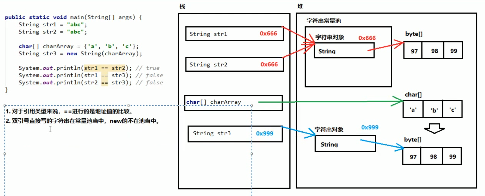

## 字符串
`java.lang.String`类代表字符串。根据API，Java程序中的所有字符串字面值（如`"abc"`）都作为此类的实例实现。也就是说，程序当中所有的双引号字符串，都是`String`类的对象（虽然没有`new`，但是也是）。
- **字符串的特点**
1. 字符串的内容永不可变。【重点】
2. 正是因为字符串不可改变，所以字符串是可以共享使用的。
3. 字符串效果上相当于`char[]`字符数组，但是底层原理是`byte[]`字节数组。
- **创建字符串的常见3+1种方式**     
1. `public String()`：创建一个空白字符串，不含有任何内容。  
```
  String str1 = new String();
```
2. `public String(char[] array)`：根据字符数组的内容，创建相应的字符串。
```
  char[] charArr = { 'A', 'B', 'C' };
  String str2 = new String(charArr);
```
3. `public String(byte[] array)`：根据字节数组的内容，创建响应的字符串。 
```
  byte[] byteArr = { 97, 98, 99 };
  String str3 = new String(byteArr);
```   
4. `String str = "abc"; // 右边直接使用字面量`
- **字符串常量池**  
程序当中字面量（直接写上的双引号字符串），在字符串常量池中。
- **比较**
1. 对于基本类型来说，`==`是进行数值的比较。
2. 对于引用类型来说，`==`是进行地址值的比较。
3. `==`是进行对象的地址值比较，如果需要比较字符串的内容，可以使用`public boolean equals(Object obj)`方法，只有参数是一个字符串且内容相同才会返回`true`，否则返回`false`。**注**：任何对象都能用`Object`进行接收。
- **字符串内存分析**

- **常用方法**  
分割字符串：`public String[] split(String regex)`：按照参数的规则，将字符串切分成若干部分。  
**注**：`split`方法的参数是一个“正则表达式”，如果按照英文句点“.”进行切分，必须写成`"\\."`。
