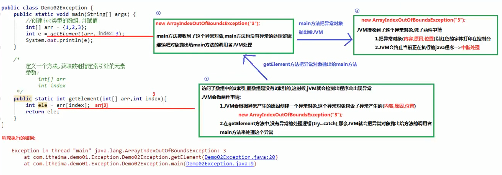

## 异常
- **Throwable**  
1. `java.lang.Throwable`类：`Java`语言中所有错误或异常的超类  
2. `Exception`：编译期异常，进行编译（写代码）时程序出现的问题。`RuntimeException`：运行期异常，`Java`程序运行过程中出现的问题。异常就相当于程序得了一个小毛病（感冒，发烧），把异常处理掉，程序可以继续执行（吃点药，继续革命工作）
3. `Error`：错误。错误就相当于程序得了一个很难治愈的毛病（艾滋，肺炎），必须修改源代码，程序才能继续执行
4. `Throwable`类中定义了3个异常处理的方法：
```
  String getMessage() // 返回此Throwable的简短描述
  String toString() // 返回此Throwable的详细信息字符串
  void printStackTrace() // JVM打印异常对象，默认此方法，打印的异常信息是最全面的
```
- **异常产生过程解析**

- **throw关键字**
1. 作用：可以使用`throw`关键字在指定的方法中抛出指定的异常  
2. 使用格式：`throw new XxxException("异常产生的原因");`  
3. 注意：  
a. `throw`关键字必须写在方法的内部  
b. `throw`关键字后边`new`的对象必须是`Exception`或者`Exception`的子类对象  
c. `throw`关键字抛出指定的异常对象，就必须处理这个异常对象：`throw`关键字后边创建的是`RuntimeException`或者`RuntimeException`的子类对象，可以不处理，默认交给`JVM`处理（打印异常对象，中断程序）。`throw`关键字后边创建的是编译异常（写代码的时候报错），就必须处理这个异常，要么`throws`，要么`try...catch`
4. `Objects`类中的静态方法`public static <T> requireNonNull(T obj)`：查看指定引用对象是不是`null`，源码：
```
  public static <T> T requireNonNull(T obj) {
    if (obj == null)
      throw new NullPointerException();
    return obj;
  }
```
- **throws关键字**
1. 异常处理的第一种方式，交给别人处理
2. 作用：当方法内部抛出异常对象的时候，必须处理这个异常对象。可以使用`throws`关键字处理异常对象，会把异常对象声明抛出给方法的调用者处理（自己不处理，给别人处理），最终交给`JVM`处理（中断处理）
3. 使用格式：在方法声明时使用`修饰符 返回值类型 方法名(参数列表) throws AaaException, BbbException...{ throw new AaaException("产生原因");... }`
4. 注意：  
a. `throws`关键字必须写在方法声明处  
b. `throws`关键字后边声明的异常必须是`Exception`或者`Exception`的子类  
c. 方法内部如果抛出了多个异常对象，`throws`后边必须也声明多个异常。如果抛出的多个异常对象有父子关系，直接声明父类异常即可  
d. 调用了一个声明抛出异常的方法，就必须得处理声明的异常。要么继续使用`throws`声明抛出，交给方法的调用者处理，最终交给`JVM`。要么`try...catch`自己处理异常
- **try...catch**
1. 异常处理的第二种方式，自己处理异常
2. 格式：
```
  try {
    可能产生异常的代码
  } catch(定义一个异常的变量，用来接收try中抛出的异常对象) {
    异常的处理逻辑，捕获异常对象之后，怎么处理异常对象
    一般在工作中，会把异常的信息记录到一个日志中
  }
  ...
  catch(异常类名 变量名) {
  
  }
```
3. 注意：  
a. `try`中可能会抛出多个异常对象，可以使用多个`catch`处理这些异常对象  
b. 如果`try`中产生了异常，就会执行`catch`中的异常处理逻辑，执行完`catch`中的处理逻辑，继续执行`try...catch`之后的代码。如果`try`中没有产生异常，就不会执行`catch`中异常的处理逻辑，执行完`try`中的代码，继续执行`try...catch`之后的代码
4. 一个`try`多个`catch`注意事项：`catch`里边定义的异常变量，如果有子父类关系，子类的异常变量必须写在上边，否则就会报错
5. 多个异常使用捕获处理方式：  
a. 多个异常分别处理  
b. 多个异常一次捕获，多次处理  
c. 多个异常一次捕获一次处理  
6. 运行时异常被抛出可以不处理。即不捕获也不声明抛出。默认给虚拟机处理，中断程序，什么时候不抛出运行时异常，再继续执行程序
- **finally代码块**
1. 格式：
```
  try {
    ...
  } catch {
    ...
  }
  ...
  catch(异常类名 变量名) {
    ...
  } finally {
    无论是否出现异常都会执行
  }
```
2. 注意：  
a. `finally`不能单独使用，必须和`try`一起使用  
b. `finally`一般用于资源释放（资源回收），无论程序是否出现异常，最后都要资源释放（`IO`）  
c. 如果`finally`有`return`语句，永远返回`finally`中的结果，避免该情况
```
    public static int method() {
        try {
            int a = 3 / 0;
        } catch (Exception e) {
            return 1;
        } finally {
            return 0;
        }
    }
    
    public static void main(String[] args) {
        System.out.println(method()); // 0
    }
```
- **子父类异常**
1. 如果父类抛出了多个异常，子类重写父类方法时，抛出和父类相同的异常或者是父类异常的子类或者不抛出异常
2. 父类方法没有抛出异常，子类重写父类该方法时也不可抛出异常。此时子类产生该异常，只能捕获处理，不能声明抛出
3. 父类异常时什么样，子类异常就是什么样
- **自定义异常类**
1. `java`提供的异常类，不够我们使用，需要自己定义一些异常类
2. 格式：
```
  public class XxxException extends Exception/RuntimeException {
    添加一个空参数的构造方法
    添加一个带异常信息的构造方法
  }
```
3. 自定义异常类一般都是以`Exception`结尾，说明该类是一个异常类  
4. 自定义异常类，必须继承`Exception`或者`RuntimeException`。继承`Exception`，自定义的异常类就是一个编译期异常，如果方法内部抛出了编译期异常，就必须处理这个异常，要么`throws`，要么`try...catch`。继承`RuntimeException`，自定义的异常类就是一个运行期异常，无需处理，交给虚拟机处理（中断处理）
