## 数据库
- **SQL分类**
1. DDL（Data Definition Language）数据定义语言，用来定义数据库对象：数据库，表，列等。关键字：`create`，`drop`，`alter`等
2. DML（Data Manipulation Language）数据操作语言，用来对数据库中表的数据进行增删改。关键字：`insert`，`delete`，`update`等
3. DQL（Data Query Language）数据查询语言，用来查询数据库中表的记录（数据）。关键字：`select`，`where`等
4. DCL（Data Control Language）数据控制语言（了解）
- **操作数据库**
1. C（Create）：创建
```
  // 创建数据库
  create database 数据库名称;
  // 创建数据库，判断不存在则创建
  create database if not exists 数据库名称;
  // 创建数据库，并指定字符集
  create database 数据库名称 character set 字符集名;
  
  // 创建db数据库，判断是否存在，并指定字符集为gbk
  create database if not exists db character set gbk;
```
2. R（Retrieve）：查询
```
  // 查询所有数据库的名称
  show databases;
  // 查询某个数据库的字符集：查询某个数据库的创建语句
  show create database 数据库名称;
```
3. U（Update）：修改
```
  // 修改数据库的字符集
  alter database 数据库名称 character set 字符集名称;
```
4. D（Delete）：删除
```
  // 删除数据库
  drop database 数据库名称;
  // 判断数据库存在，存在则删除
  drop database if exists 数据库名称;
```
5. 使用数据库
```
  // 查询当前正在使用的数据库名称
  select database();
  // 使用数据库
  use 数据库名称;
```
- **操作表**
1. C（Create）：创建
```
  // 语法
  create table 表名(
    列名1 数据类型1,
    列名2 数据类型2,
    ...
    列名n 数据类型n
  );
  // 最后一列不需要加逗号
  
  // 数据库类型：
  // 1. int：整数类型
  age int
  
  // 2. double：小数类型
  score double(5,2)
  
  // 3. date：日期，只包含年月日 yyyy-MM-dd
  
  // 4. datetime：日期，包含年月日时分秒 yyyy-MM-dd HH:mm:ss
  
  // 5. timestamp：时间戳类型，包含年月日时分秒 yyyy-MM-dd HH:mm:ss
  // 如果不给这个类型字段赋值，或者赋值为null，则默认使用当前的系统时间自动赋值
  
  // 6. varchar：字符串
  // 最大20个字符
  name varchar(20)
  // zhangsan 8个字符  张三 2个字符
```
2. R（Retrieve）：查询
```
  // 查询某个数据库中所有的表
  show tables;
  
  // 查询表结构
  desc 表名; 
  
  // 复制表
  create table 表名 like 被复制的表名;
```
3. D（Delete）：删除
```
  drop table 表名;
  drop table if exists 表名;
```
4. U（Update）：修改
```
  // 修改表名
  alter table 表名 rename to 新的表名;
  
  // 修改表的字符集
  alter table 表名 character set 字符集名称;
  
  // 添加一列
  alter table 表名 add 列名 数据类型;
  
  // 修改列名称 类型
  alter table 表名 change 列名 新列名 新数据类型;
  alter table 表名 modify 列名 新数据类型;
  
  // 删除列
  alter table 表名 drop 列名; 
```
- **操作数据**
1. 删除
```
  // 如果要删除所有记录
  delete from 表名;  -- 不建议使用，有多少条记录就会执行多少次删除操作
  truncate table 表名;  -- 建议使用，效率更高，先删除表，然后再创建一张一样的表
```
2. 查询
```
  // 语法
  select
    字段列表
  from
    表名列表
  where
    条件列表
  group by
    分组字段
  having
    分组之后的条件
  order by
    排序
  limit
    分页限定
  
  // 基础查询
  // 多个字段的查询
  SELECT 字段名1, 字段名2... FROM 表名;
  // 如果查询所有字段，则可以使用*代替字段列表
  
  // 去除重复
  DISTINCT
  
  // 计算列
  // 一般可以使用四则运算计算一些列的值。（一般只会进行数值型的计算）
  // null参与的运算，计算结果都为null
  // 表达式1：哪个字段需要判断是否为null
  // 表达式2：如果该字段为null后的替换值
  IFNULL(表达式1, 表达式2)
  
  // 起别名
  AS
  // AS也可以省略
    
  // 去除重复的结果集
  SELECT DISTINCT address FROM student;
  SELECT DISTINCT name, address FROM student;
  
  // 如果有null参与的运算，计算结果都为null
  SELECT name, math, english, math + english FROM student;
  SELECT name, math, english, math + IFNULL(english, 0) FROM student;
  
  // 起别名
  SELECT name, math, english, math + IFNULL(english, 0) AS 总分 FROM student;
  SELECT name, math 数学, english 英语, math + IFNULL(english, 0) 总分 FROM student;
  
  // 查询年龄大于等于20小于等于30
  SELECT * FROM student WHERE age >= 20 && age <= 30;
  SELECT * FROM student WHERE age >= 20 AND age <= 30;
  SELECT * FROM student WHERE age BETWEEN 20 AND 30;
  
  // 查询年龄22岁，18岁，25岁的信息
  SELECT * FROM student WHERE age = 22 OR age = 18 OR age = 25;
  SELECT * FROM student WHERE age IN (22, 18, 25);
  
  // 查询英语成绩为null
  // 错误写法，null值不能使用=（!=）判断
  -- SELECT * FROM student WHERE english = NULL;
  // 正确写法
  SELECT * FROM student WHERE english IS NULL;
  // 查询英语成绩不为null
  SELECT * FROM student WHERE english IS NOT NULL;
  
  // 查询姓马的有哪些 LIKE
  SELECT * FROM student WHERE name LIKE '马%';
  // 查询姓名第二个字是化的人
  SELECT * FROM student WHERE name LIKE "_化%";
  // 查询姓名是3个字的人
  SELECT * FROM student WHERE name LIKE '___';
  // 查询姓名中包含德的人
  SELECT * FROM student WHERE name LIKE '%德%';
  
  // 排序查询
  // 语法 ORDER BY 排序字段1 排序方式1, 排序字段2 排序方式2...
  // 排序方式 ASC：升序，默认的  DESC：降序
  // 如果有多个排序条件，则当前边的条件值一样时，才会判断第二个条件
  SELECT * FROM student ORDER BY math ASC;
  SELECT * FROM student ORDER BY math DESC;
  // 按照数学成绩排名，如果数学成绩一样，则按照英语成绩排名
  SELECT * FROM student ORDER BY math ASC, english ASC;
  
  // 聚合函数：将一列数据作为一个整体，进行纵向的计算
  // COUNT：计算个数，一般选择非空的列，主键
  // MAX：计算最大值
  // MIN：计算最小值
  // SUM：计算和
  // AVG：计算平均值
  // 聚合函数的计算，排除null值
  // 选择不包含非空的列进行计算，IFNULL函数
  SELECT COUNT(english) FROM student;
  SELECT COUNT(IFNULL(english, 0)) FROM student;
  SELECT COUNT(id) FROM student;
  SELECT MAX(math) FROM student;
  SELECT MIN(math) FROM student;
  SELECT SUM(english) FROM student;
  SELECT AVG(math) FROM student;
  
  // 分组查询
  // 语法：GROUP BY 分组字段;
  // 分组之后查询的字段：分组字段、聚合函数
  // 按照性别分组，分别查询男、女同学的平均分
  SELECT sex, AVG(math) FROM student GROUP BY sex;
  // 按照性别分组，分别查询男、女同学的平均分，人数
  SELECT sex, AVG(math), COUNT(id) FROM student GROUP BY sex;
  // 按照性别分组，分别查询男、女同学的平均分，人数。要求分数低于70分的人，不参与分组
  SELECT sex, AVG(math), COUNT(id) FROM student WHERE math > 70 GROUP BY sex;
  // 按照性别分组，分别查询男、女同学的平均分，人数。要求分数低于70分的人，不参与分组，分组之后，人数要大于2个人
  SELECT sex, AVG(math), COUNT(id) FROM student WHERE math > 70 GROUP BY sex HAVING COUNT(id) > 2;
  SELECT sex, AVG(math), COUNT(id) 人数 FROM student WHERE math > 70 GROUP BY sex HAVING 人数 > 2;
  // WHERE和HAVING的区别
  // WHERE在分组之前进行限定，如果不满足条件，则不参与分组。HAVING在分组之后进行限定，如果不满足结果，则不会被查询出来
  // WHERE后不可以跟聚合函数，HAVING可以进行聚合函数的判断
  
  // 分页查询
  // 语法：LIMIT 开始的索引, 每页查询的条数;
  // 公式：开始的索引 = (当前的页码 - 1) * 每页显示的条数
  -- 每页显示3条记录
  SELECT * FROM student LIMIT 0, 3;  -- 第1页
  SELECT * FROM student LIMIT 3, 3;  -- 第2页
  SELECT * FROM student LIMIT 6, 3;  -- 第3页
  // LIMIT是一个MYSQL“方言”
```
- **约束**
1. 概念：对表中的数据进行限定，保证数据的正确性、有效性和完整性
2. 分类：  
```
  // 主键约束：PRIMARY KEY
  // 含义：非空且唯一
  // 一张表只能有一个字段为主键
  // 主键就是表中记录的唯一标识
  // 在创建表时，添加主键约束
  CREATE TABLE stu (
    id INT PRIMARY KEY,
    name VARCHAR(20)
  );
  // 删除主键
  // 错误写法 
  -- ALTER TABLE stu MODIFY id INT;
  // 正确写法
  ALTER TABLE stu DROP PRIMARY KEY;
  // 创建完表后，添加主键
  ALTER TABLE stu MODIFY id INT PRIMARY KEY;
  
  // 非空约束：NOT NULL
  // 创建表时添加约束
  CREATE TABLE stu (
    id INT,
    name VARCHAR(20) NOT NULL
  );
  // 创建表后，添加非空约束
  ALTER TABLE stu MODIFY name VARCHAR(20) NOT NULL;
  // 删除name的非空约束
  ALTER TABLE stu MODIFY name VARCHAR(20);
  
  // 唯一约束：UNIQUE 
  // 创建表时，添加唯一约束
  CREATE TABLE stu (
    id INT,
    phone_number VARCHAR(20) UNIQUE
  );
  // 注意MYSQL中，唯一约束限定的列的值可以有多个NULL
  // 删除唯一约束
  ALTER TABLE stu DROP INDEX phone_number;
  // 创建表后，添加唯一约束
  ALTER TABLE stu MODIFY phone_number VARCHAR(20) UNIQUE;
   
  // 外键约束：FOREIGN KEY
  // 让表与表产生关系，从而保证数据的正确性
  // 在创建表时，添加外键
  CREATE TABLE 表名 (
    ...
    外键列
    CONSTRAINT 外键名称 FOREIGN KEY (外键列名称) REFERENCES 主表名称(主表列名称)
  );
  // 删除外键
  ALTER TABLE 表名 DROP FOREIGN KEY 外键名称;
  // 创建表之后，添加外键
  ALTER TABLE 表名 ADD CONSTRAINT 外键名称 FOREIGN KEY (外键字段名称) REFERENCES 主表名称(主表列名称);
  // 添加外键
  CREATE TABLE employee (
    id INT PRIMARY KEY AUTO_INCREMENT,
    name VARCHAR(20),
    age INT,
    dep_id INT,
    CONSTRAINT emp_dept_fk FOREIGN KEY (dep_id) REFERENCES department(id)
  );
  // 删除外键
  ALTER TABLE employee DROP FOREIGN KEY emp_dept_fk;
  
  // 级联操作
  // 添加级联操作
  ALTER TABLE 表名 ADD CONSTRAINT 外键名称 FOREIGN KEY (外键字段名称) REFERENCES 主表名称(主表列名称) ON UPDATE CASCADE ON DELETE CASCADE;
  // 分类
  ON UPDATE CASCADE -- 级联更新
  ON DELETE CASCADE -- 级联删除
  
  // 自动增长
  // 概念：如果某一列是数值类型的，使用AUTO_INCREMENT可以完成值的自动增长
  // 在创建表时，添加主键约束，并且完成自动增长
  CREATE TABLE stu (
    id INT PRIMARY KEY AUTO_INCREMENT,
    name VARCHAR(20)
  );
  // 删除自动增长
  ALTER TABLE stu MODIFY id INT;
  // 添加自动增长
  ALTER TABLE stu MODIFY id INT AUTO_INCREMENT;
```
- **多表关系**
1. 一对多（多对一）  
如：部门和员工  
实现方式：在多的一方建立外键，指向一的一方的主键  
2. 多对多  
如：学生和课程  
实现方式：多对多关系实现需要借助第三章中间表。中间表至少包含两个字段，这两个字段作为第三张表的外键，分别指向两张表的主键
3. 一对一  
如：人和身份证  
实现方式：一对一关系实现，可以在任意一方添加唯一外键指向另一方的主键
- **三大范式**  
1. 第一范式（1NF）：每一列都是不可分割的原子数据项  
2. 第二范式（2NF）：在1NF的基础上，非码属性必须完全依赖于码（在1NF基础上消除非主属性对主码的部分函数依赖）  
3. 第三范式（3NF）：在2NF的基础上，任何非主属性不依赖于其它非主属性（在2NF基础上消除传递依赖）
4. 几个概念：  
a. 函数依赖：A-->B，如果通过A属性（属性组）的值，可以唯一确定B属性的值，则称B依赖于A  
例如：学号-->姓名，(学号, 课程名称)-->分数  
b. 完全函数依赖：A-->B，如果A是一个属性组，则B属性值的确定需要依赖于A属性组所有的属性值  
例如：(学号, 课程名称)-->分数  
c. 部分函数依赖：A-->B，如果A是一个属性组，则B属性的确定只需要依赖于A属性组中的某一些值即可  
例如：(学号, 课程名称)-->姓名  
d. 传递函数依赖：A-->B，B-->C。如果通过A属性（属性组）的值，可以唯一确定B属性的值，再通过B属性（属性组）的值可以唯一确定C属性的值，则称C传递函数依赖于A  
例如：学号-->系名，系名-->系主任  
e. 码：如果在一张表中，一个属性或属性组，被其他所有属性所完全依赖，则称这个属性（属性组）为该表的码  
例如：该表中码为：(学号, 课程名称)  
主属性：码属性组中的所有属性  
非主属性：除过码属性组的属性  
5. 案例  
a. 原表    
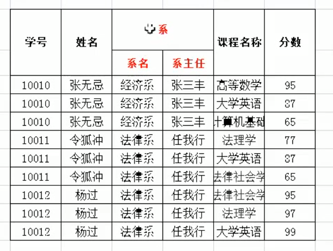  
b. 1NF  
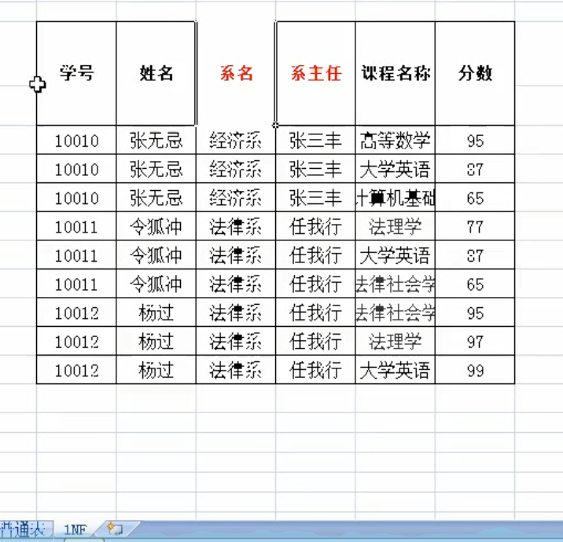  
c. 2NF  
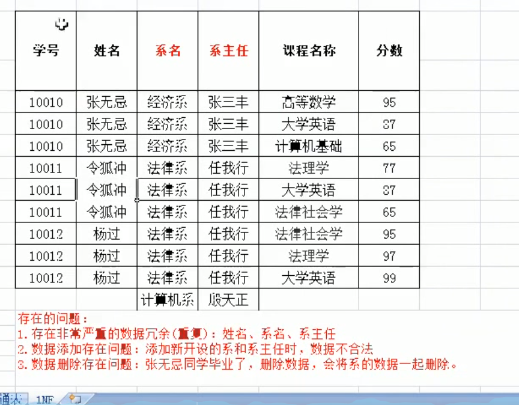  
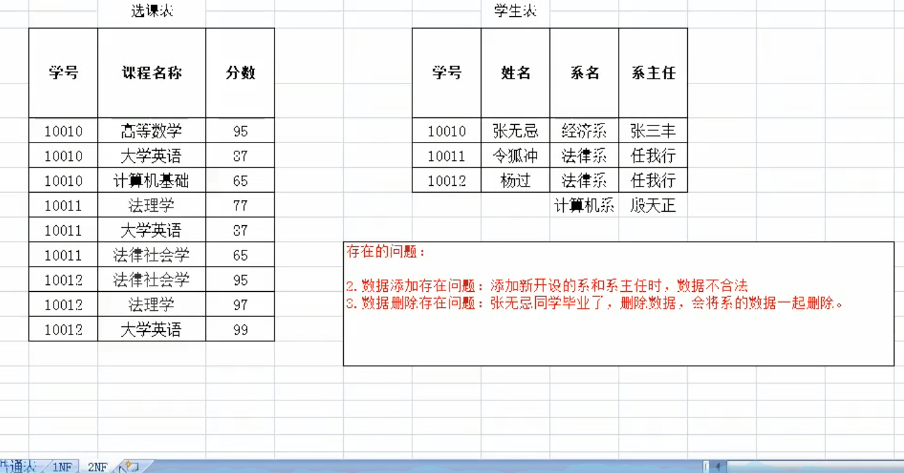  
d. 3NF  
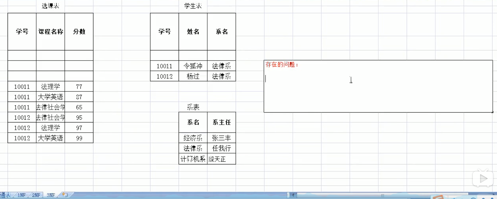  
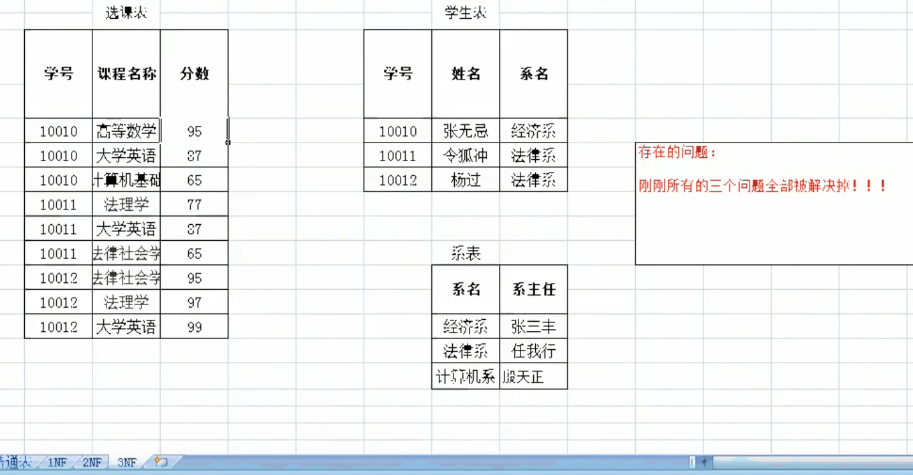  
- **数据库的备份和还原**  
1. 备份：`mysqldump -u用户名 -p密码 数据库名称 > 保存的路径`  
2. 还原：   
a. 登录数据库  
b. 创建数据库  
c. 使用数据库  
d. 执行文件 `source 文件路径`  
- **多表查询**  
1. 内连接查询：
```
  // 隐式内连接：使用WHERE条件消除无用数据
  // 查询所有员工信息和对应的部门信息
  SELECT * FROM emp, dept WHERE emp.dept_id = dept.id;
  // 查询员工表的名称，性别，部门表的名称
  SELECT emp.name, emp.gender, dept.name FROM emp, dept WHERE emp.dept_id = dept.id;
  SELECT
    t1.name,
    t1.gender,
    t2.name
  FROM
    emp t1,
    dept t2
  WHERE
    t1.dept_id = t2.id;
    
    // 显式内连接：
    SELECT 字段列表 FROM 表名1 [INNER] JOIN 表名2 ON 条件
    // 例子
    SELECT * FROM emp INNER JOIN dept ON emp.dept_id = dept.id;
    SELECT * FROM emp JOIN dept ON emp.dept_id = dept.id;
```
2. 外连接查询：
```
  // 左外连接，查询的是左表所有数据以及其交集部分
  SELECT 字段列表 FROM 表1 LEFT [OUTER] JOIN 表2 ON 条件;
  // 右外连接，查询的是右表所有数据以及其交集部分
  SELECT 字段列表 FROM 表1 RIGHT [OUTER] JOIN 表2 ON 条件;
  // 例子
  SELECT t1.*, t2.name FROM emp t1 LEFT JOIN dept t2 ON t1.dept_id = t2.id;
  SELECT t1.*, t2.name FROM emp t1 RIGHT JOIN dept t2 ON t1.dept_id = t2.id;
  SELECT * FROM dept t2 RIGHT JOIN emp t1 ON t1.dept_id = t2.id;
```
3. 子查询：
```
  // 查询中嵌套查询，称嵌套查询为子查询
  // 查询工资最高的员工信息
  // 1. 查询最高的工资是多少 9000
  SELECT MAX(salary) FROM emp;
  // 2. 查询员工信息，并且工资等于9000的
  SELECT * FROM emp WHERE emp.salary = 9000;
  // 一条SQL就完成这个操作，子查询
  SELECT * FROM emp WHERE emp.salary = (SELECT MAX(salary) FROM emp);
  
  // 子查询不同情况
  // 1. 子查询的结果是单行单列的：
  // 子查询可以作为条件，使用运算符去判断（> >= < <=）
  // 查询员工工资小于平均工资的人
  SELECT * FROM emp WHERE emp.salary < (SELECT AVG(salary) FROM emp);
  // 2. 子查询的结果是多行单列的：
  // 子查询可以作为条件，使用运算符IN来判断
  // 查询'财务部'和'市场部'所有的员工信息
  SELECT id FROM dept WHERE name = '财务部' OR name = '市场部';
  SELECT * FROM emp WHERE dept_id = 3 OR dept_id = 2;
  // 子查询
  SELECT * FROM emp WHERE dept_id IN (SELECT id FROM dept WHERE name = '财务部' OR name = '市场部');
  // 3. 子查询的结果是多行多列的：
  // 子查询可以作为一张虚拟表参与查询
  // 查询员工入职日期是2011-11-11日之后的员工信息和部门信息
  // 子查询
  SELECT * FROM dept t1, (SELECT * FROM emp WHERE emp.join_date > '2011-11-11') t2 WHERE t1.id = t2.dept_id;
  // 普通内连接
  SELECT * FROM emp t1, dept t2 WHERE t1.dept_id = t2.id AND t1.join_date > '2011-11-11';
```
- **事务**
1. 如果一个包含多个步骤的业务操作，被事务管理，那么这些操作要么同时成功，要么同时失败
2. 操作：  
a. 开启事务：`start transaction;`  
b. 回滚：`rollback;`  
c. 提交：`commit;`
3. 例子
```
  CREATE TABLE account (
    id INT PRIMARY KEY AUTO_INCREMENT,
    name VARCHAR(10),
    balance DOUBLE
  );
  // 添加数据
  INSERT INTO account (name, balance) VALUES ('zhangsan', 1000), ('lisi', 1000);
  SELECT * FROM account;
  UPDATE account SET balance = 1000;
  // 张三给李四转账500元
  // 0. 开启事务
  STRAT TRANSACTION;
  // 1. 张三账户-500
  UPDATE account SET balance = balance - 500 WHERE name = 'zhangsan';
  // 2. 李四账户+500
  UPDATE account SET balance = balance + 500 WHERE name = 'lisi';
  // 发现执行没有问题，提交事务
  COMMIT;
  // 发现出问题了，回滚事务
  ROLLBACK;
```
4. MySQL数据库中事务默认自动提交  
a. 事务提交的两种方式：  
自动提交：MySQL就是自动提交的，一条DML（增删改）语句会自动提交一次事务  
手动提交：Oracle数据库默认是手动提交事务，需要先开启事务再提交  
b. 修改事务的默认提交方式：  
查看事务的默认提交方式`SELECT @@AUTOCOMMIT;`：1代表自动提交，0代表手动提交  
修改默认提交方式：`SET @@AUTOCOMMIT = 0;`
5. 事务的四大特征：  
a. 原子性：是不可分割的最小操作单位，要么同时成功，要么同时失败  
b. 持久性：当事务提交或回滚后，数据库会持久化的保存数据  
c. 隔离性：多个事务之间，相互独立  
d. 一致性：事务操作前后，数据总量不变  
6. 事务的隔离级别  
a. 多个事务之间是隔离的，相互独立的。但是如果多个事务操作同一批数据，则会引发一些问题，设置不同的隔离级别就可以解决这些问题  
b. 存在问题：  
脏读：一个事务，读取到另一个事务中没有提交的数据  
不可重复读（虚读）：在同一个事务中，两次读取到的数据不一样  
幻读：  
```
  // 当前表中工资为10000的员工有10人  
  // 事务A，读取所有工资为10000的员工，共10条记录
  // 此时事务B向表中插入一条工资为10000的员工记录
  // 事务A再次读取所有工资为10000的员工，共11条记录，发生幻读

  // 事务在插入已经检查过不存在的记录时，发现这些数据已经存在了 
  // 事务A查询User表id为1的用户是否存在，如果不存在则插入一条id为1的数据  
  // 事务A查询结束后，事务B向User表插入一条id为1的数据
  // 此时，事务A查询到id为1的用户不存在，插入1条id为1的数据
  // 发生主键冲突，事务A执行失败，发生幻读  
```      
c. 隔离级别：  
`read uncommitted`：读未提交，产生的问题：脏读、不可重复读、幻读  
`read committed`：读已提交（Oracle），产生的问题：不可重复读、幻读  
`repeatable read`：可重复读（MySQL默认），产生的问题：幻读  
`serializable`：串行化，可以解决所有的问题   
注意：隔离级别从小到大安全性越来越高，但是效率越来越低  
数据库查询隔离级别：`SELECT @@TX_ISOLATION;`  
数据库设置隔离级别：`set global transaction isolation level 级别字符串;`  
- **DCL**  
1. 管理用户，授权  
```
  // 添加用户
  CREATE USER '用户名'@'主机名' IDENTIFIED BY '密码';
  
  // 删除用户
  drop user '用户名'@'主机名';
  
  // 修改用户密码
  UPDATE USER SET PASSWORD = PASSWORD('新密码') WHERE USER = '用户名';
  UPDATE USER SET PASSWORD = PASSWORD('abc') WHERE USER = 'lisi';  
  SET PASSWORD FOR '用户名'@'主机名' = PASSWORD('新密码');
  SET PASSWORD FOR 'root'@'localhost' = PASSWORD('123');
  
  // 查询用户
  // 1. 切换到mysql数据库
  use mysql;
  // 2. 查询user表
  select * from user;
  // 通配符：%表示可以在任意主机使用用户登录数据库
```
2. MySQL中忘记了ROOT用户的密码  
a. `cmd`->`net stop mysql`停止mysql服务，需要管理员运行`cmd`  
b. 使用无验证方式启动mysql服务：`mysqld --skip-grant-tables`  
c. 打开新的`cmd`窗口，直接输入`mysql`命令，回车，就可以登录成功  
d. `use mysql;`  
e. `update user set password = password('新密码') where user = 'root';`  
f. 关闭两个窗口  
g. 打开任务管理器，手动结束`mysqld.exe`的进程  
h. 启动`mysql`服务  
i. 使用新密码登录  
3. 权限管理  
```
  // 查询权限
  show grants for '用户名'@'主机名';
  show grants for 'lisi'@'%';
  
  // 授予权限
  grant 权限列表 on 数据库名.表名 to '用户名'@'主机名';
  // 给张三用户授予所有权限，在任意数据库任意表上  
  grant all on *.* to 'zhangsan'@'localhost';
  
  // 撤销权限
  revoke 权限列表 on 数据库名.表名 from '用户名'@'主机名';
```
- **JDBC**
1. `Java DataBase Connectivity`Java数据库连接，是官方（sun公司）定义的一套操作所有关系型数据库的规则，即接口。各个数据库厂商去实现这套接口，提供数据库驱动jar包。可以使用这套接口（JDBC）编程，真正执行的代码是驱动jar包中的实现类  
2. 步骤：  
a. 导入驱动jar包`mysql-connector-java-5.1.37-bin.jar`：复制其到项目的`libs`目录下，右键`Add As Library`  
b. 注册驱动  
c. 获取数据库连接对象`Connection`  
d. 定义sql  
e. 获取执行sql语句的对象`Statement`  
f. 执行sql，接受返回结果  
g. 处理结果  
h. 释放资源  
```
  // 1. 导入驱动jar包
  // 2. 注册驱动  
  Class.forName("com.mysql.jdbc.Driver");
  // 3. 获取数据库连接对象  
  Connection conn = DriverManager.getConnection("jdbc:mysql://localhost:3306/db", "root", "123");
  // 4. 定义sql语句
  String sql = "update account set balance = 500 where id = 1";
  // 5. 获取执行sql的对象Statement
  Statement stmt = conn.createStatement();
  // 6. 执行sql
  int count = stmt.executeUpdate(sql);
  // 7. 处理结果
  System.out.println(count);
  // 8. 释放资源
  stmt.close();
  conn.close();
```
3. `DriverManager`：驱动管理对象  
```
  // 1. 注册驱动，告诉程序该使用哪一个数据库驱动jar
  // static void registerDriver(Driver driver)
  // 写代码使用：Class.forName("com.mysql.jdbc.Driver");
  // 在com.mysql.jdbc.Driver源码中存在静态代码块
  static {
    try {
      java.sql.DriverManager.registerDriver(new Driver());
    } catch (SQLException e) {
      throw new RuntimeException("Can't register driver");
    }
  }
  // 注意：mysql5之后的驱动jar包可以省略注册驱动的步骤
  
  // 2. 获取数据库连接
  // static Connection getConnection(String url, String user, String password)
  // url：指定连接的路径
  // 语法：jdbc:mysql://ip地址（域名）:端口号/数据库名称，例如：jdbc:mysql://localhost:3306/db
  // 如果连接的是本机mysql服务器，并且mysql服务默认端口是3306，则url可以简写为：jdbc:mysql:///数据库名称
  // user：用户名
  // password：密码
```
4. `Connection`：数据库连接对象
```
  // 1. 获取执行sql的对象
  // Statement createStatement()
  // PreparedStatement prepareStatement(String sql)
  
  // 2. 管理事务
  // 开启事务：setAutoCommit(boolean autoCommit)：调用该方法设置参数为false，即可开启事务
  // 提交事务：commit()
  // 回滚事务：rollback()
```
5. `Statement`：执行sql的对象
```
  // 1. 执行sql
  // boolean execute(String sql)：可以执行任意的sql
  // int executeUpdate(String sql)：执行DML（insert、update、delete）语句，DDL（create、alter、drop）语句
  // 返回值：影响的行数，可以通过影响的行数判断DML语句是否执行成功，返回值>0的则执行成功，反之，则失败  
  // ResultSet executeQuery(String sql)：执行DQL（select）语句
```
6. `ResultSet`：结果集对象，封装查询结果
```
  // next()：游标向下移动一行
  // getXxx(参数)：获取数据，Xxx代表数据类型，如int getInt()，String getString()
  // 参数：
  // int：代表列的编号，从1开始，如getString(1)
  // String：代表列名称，如getDouble("balance")
  
  // 使用步骤
  // 1. 游标向下移动一行
  // 2. 判断是否有数据
  // 3. 获取数据
  // 循环判断游标是否是最后一行末尾
  while(rs.next()) {
    // 获取数据
    int id = rs.getInt(1);
    String name = rs.getString("name");
    double balance = rs.getDouble(3);
    System.out.println(id + " " + name + " " + balance);
  }
```
7. `PreparedStatement`：执行sql的对象
```
  // 1. SQL注入问题：在拼接sql时，有一些sql的特殊关键字参与字符串的拼接，会造成安全性问题
  // 输入用户随便，输入密码：a' or 'a' = 'a
  // sql：select * from user where username = 'fhdsjkf' and password = 'a' or 'a' = 'a'
  
  // 2. 解决sql注入问题：使用PreparedStatement对象解决
  
  // 3. 预编译的SQL：参数使用?作为占位符
  
  // 4. 步骤：
  // a. 导入驱动jar包mysql-connector-java-5.1.37-bin.jar
  // b. 注册驱动
  // c. 获取数据库连接对象Connection
  // d. 定义sql，注意：sql的参数使用?作为占位符，如select * from user where username = ? and password = ?;
  // e. 获取执行sql语句的对象PreparedStatement：Connection.prepareStatement(String sql)
  // f. 给?赋值
  //    setXxx(参数1, 参数2)：参数1，?的位置编号，从1开始；参数2，?的值
  // g. 执行sql，接受返回结果，不需要传递sql语句
  // h. 处理结果
  // i. 释放资源
  
  // 注意：使用PreparedStatement完成增删该查的所有操作
  // 可以防止SQL注入；效率更高
```
8. JDBC控制事务：  
a. 事务：一个包含多个步骤的业务操作，如果这个业务操作被事务管理，则多个步骤要么同时成功，要么同时失败  
b. 操作：开启事务；提交事务；回滚事务  
c. 使用Connection对象来管理事务  
开启事务：`setAutoCommit(boolean autoCommit)`：调用该方法设置参数为`false`，即可开启事务；在执行sql之前开启事务  
提交事务：`commit()`：当所有sql都执行完提交事务    
回滚事务：`rollback()`：在`catch`中回滚事务  
- **数据库连接池**  
1. 概念：其实就是一个容器（集合），存放数据库连接的容器。当系统初始化好后，容器被创建，容器中会申请一些连接对象，当用户来访问数据库时，从容器中获取连接对象，用户访问完之后，会将连接对象归还给容器  
2. 好处：节约资源；用户访问高效  
3. 实现  
```
  // 1. 标准接口：DataSource（javax.sql包下）
  //    方法：
  //        获取连接：getConnection()
  //        归还连接：Connection.close()，如果连接对象Connection是从连接池中获取的，调用Connection.close()方法不会关闭连接，而是归还连接
  
  // 2. 一般由数据库厂商实现
  //    C3P0：数据库连接池技术
  //    Druid：数据库连接池实现技术，由阿里巴巴提供的
  
  // 3. C3P0步骤：
  //    a. 导入jar包（两个）：c3p0-0.9.5.2.jar；mchange-commons-java-0.2.12.jar（不要忘记导入数据库驱动jar包）
  //    b. 定义配置文件：名称：c3p0.properties或者c3p0-config.xml；路径：直接将文件放在src目录下即可
  //    c. 创建核心对象，数据库连接池对象ComboPooledDataSource
  //    d. 获取连接：getConnection
  
  // 创建数据库连接池对象
  DataSource ds = new ComboPooledDataSource();
  // 获取连接对象
  Connection conn = ds.getConnection();
  // 打印
  System.out.println(conn);
  
  // 4. Druid步骤：
  //    a. 导入jar包：druid-1.0.9.jar
  //    b. 定义配置文件：是properties形式的；可以叫任意名称，可以放在任意目录下
  //    c. 加载配置文件
  //    d. 获取数据库连接池对象：通过工厂来获取：DruidDataSurceFactory
  //    e. 获取连接：getConnection
  
  // Druid连接池工具类
  public class JDBCUtils {
    // 定义成员变量DataSource
    private static DataSource ds;
    static {
      try {
        // 加载配置文件
        Properties pro = new Properties();
        pro.load(JDBCUtils.class.getClassLoader().getResourceAsStream("druid.properties"));
        // 获取DataSource
        ds = DruidDataSourceFactory.createDataSource(pro);
      } catch (IOException e) {
        e.printStackTrace();
      } catch (Exception e) {
        e.printStackTrace();
      }
    }
    // 获取连接
    public static Connection getConnection() throws SQLException {
      return ds.getConnection();
    }
    // 释放资源
    public static void close(ResultSet rs, Statement stmt, Connection conn) {
      if(rs != null) {
        try {
          rs.close();
        } catch (SQLException e) {
          e.printStackTrace();
        }
      }
      if(stmt != null) {
        try {
          stmt.close();
        } catch (SQLException e) {
          e.printStackTrace();
        }
      }
      if(conn != null) {
        try {
          // 归还连接
          conn.close();
        } catch (SQLException e) {
          e.printStackTrace();
        }
      }
    } 
    // 获取连接池方法
    public static DataSource getDataSource() {
      return ds;
    }
  }
```
- **Spring JDBC**  
1. `Spring`框架对JDBC的简单封装，提供了一个`JDBCTemplate`对象简化JDBC的开发，步骤：
```
  // 1. 导入jar包
  // 2. 创建JdbcTemplate对象，依赖于数据源DataSource
  JdbcTemplate template = new JdbcTemplate(ds);
  // 3. 调用JdbcTemplate的方法完成CRUD操作
  // update()：执行DML语句。增、删、改语句
  // queryForMap()：查询结果将结果集封装为map集合  
  // queryForList()：查询结果将结果集封装为list集合
  // query()：查询结果，将结果封装为JavaBean对象
  // queryForObject()：查询结果，将结果封装为对象
  
  // 导入jar包
  // 创建JDBCTemplate对象
  JdbcTemplate template = new JdbcTemplate(JDBCUtils.getDataSource());
  // 调用方法
  String sql = "update account set balance = 5000 where id = ?";
  int count = template.update(sql, 3);
  System.out.println(count);
  
  // 查询所有记录，将其封装为List
  @Test
  public void test() {
    String sql = "select * from emp";
    List<Map<String, Object>> list = template.queryForList(sql);
    
    for (Map<String, Object> stringObjectMap : list) {
      System.out.println(stringObjectMap);
    }
  }
  
  @Test
  public void test1() {
    String sql = "select * from emp";
    List<Emp> list = template.query(sql, new RowMapper<Emp>() {
      @Override
      public Emp mapRow(ResultSet rs, int i) throws SQLException {
        Emp emp = new Emp();
        int id = rs.getInt("id");
        String ename = rs.getString("ename");
        int jobId = rs.getInt("job_id");
        int mgr = rs.getInt("mgr");
        Date joindate = rs.getDate("joindate");
        double salary = rs.getDouble("salary");
        
        emp.setId(id);
        emp.setEname(ename);
        emp.setJobId(jobId);
        emp.setMgr(mgr);
        emp.setJoindate(joindate);
        emp.setSalary(salary);
        
        return emp;
      }
    });
  }
  
  // 查询所有记录，将其封装为Emp对象的List集合
  @Test
  public void test2() {
    String sql = "select * from emp";
    List<Emp> list = template.query(sql, new BeanPropertyRowMapper<Emp>(Emp.class));
    for (Emp emp : list) {
      System.out.println(emp);
    }
  }
```
- **乐观锁和悲观锁**  
1. 乐观锁总是假设最好的情况，每次操作数据都认为数据不会被修改，所以不会上锁，但是在更新的时候会判断一下在此期间数据有没有被更新，可以使用版本号机制或CAS算法实现。乐观锁适用于多读的应用场景，可以提高吞吐量  
2. 悲观锁总是假设最坏的情况，每次操作数据都认为数据会被修改，所以都会上锁，未获得锁的线程想操作当前数据就会阻塞直到获得锁（共享资源每次只给一个线程使用）。悲观锁适用于多写的应用场景，Java中`synchronized`就是悲观锁思想的实现  
3. 版本号机制：在数据表中加上一个数据版本号字段，当数据被修改时，版本号的值加一。当线程要更新数据值时，在读取数据的同时也会读取版本号值，在提交更新时，若之前读取的版本号值与当前数据库中的版本号值相等才会执行更新，否则重试更新操作   
4. ABA问题：如果一个变量初次读取的时候值是A，在准备赋值的时候检查到它仍然是A值，不能说明它的值没有被其他线程修改过，因为在这段时间它的值可能被改为其他值，然后又改回A
- **索引**  
1. 索引是帮助数据库获取数据的排好序的数据结构  
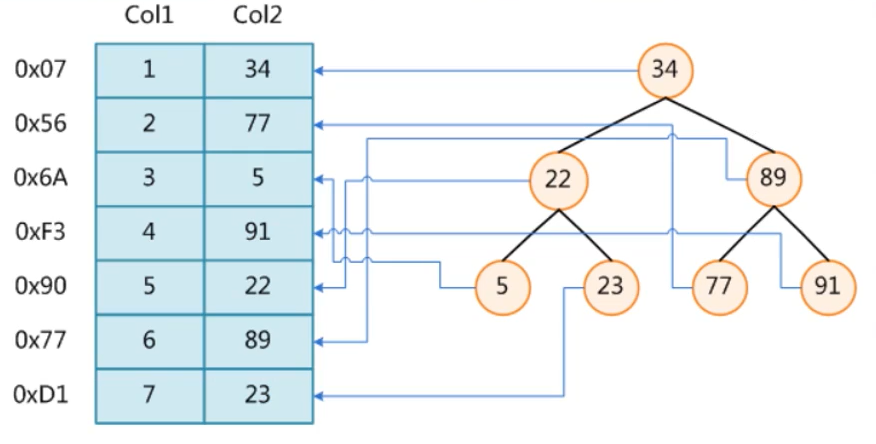  
2. `B-Tree`  
a. 叶节点具有相同的深度，叶节点的指针为空  
b. 所有索引元素不重复  
c.节点中的数据索引从左到右递增排序  
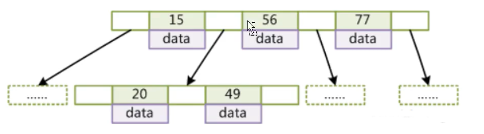  
3. `B+Tree`  
a. 非叶子节点不存储`data`，只存储索引（冗余），可以放更多的索引  
b. 叶子节点包含所有索引字段  
c. 叶子节点用指针连接，提高区间访问的性能  
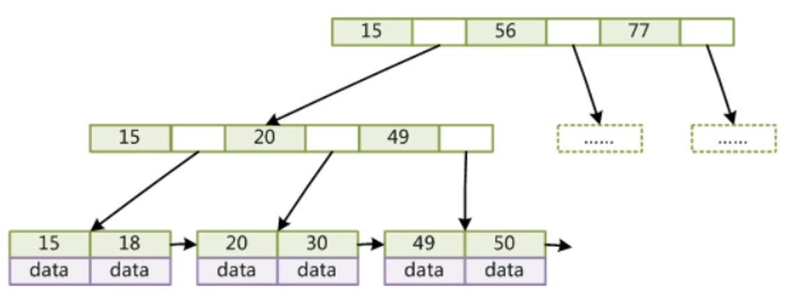  
4. 非聚集索引：索引文件和数据文件是分离的（如`MyISAM`）  
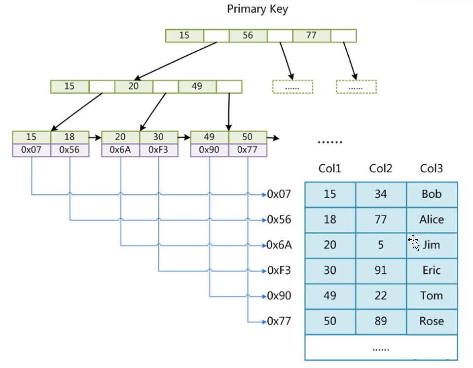  
5. 聚集索引（如`InnoDB`）  
a. 表数据文件本身就是`B+Tree`组织的一个索引结构文件  
b. 叶节点包含了完整的数据记录   
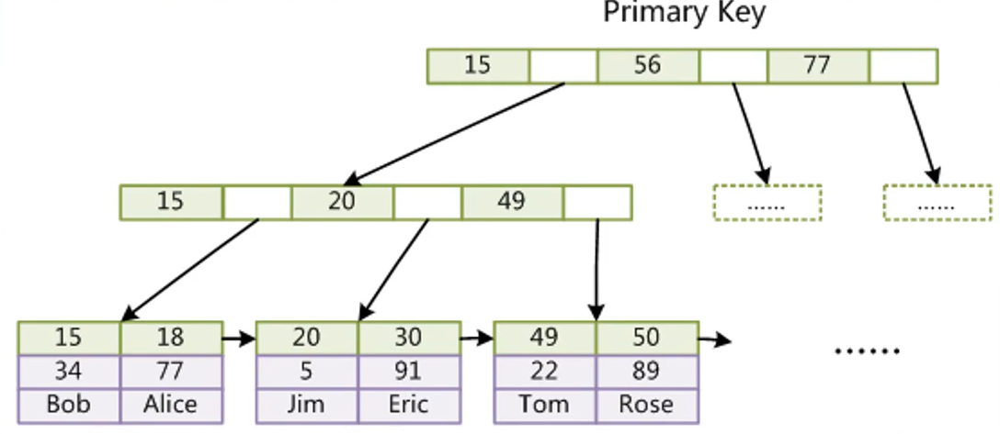  
6. 混合索引  
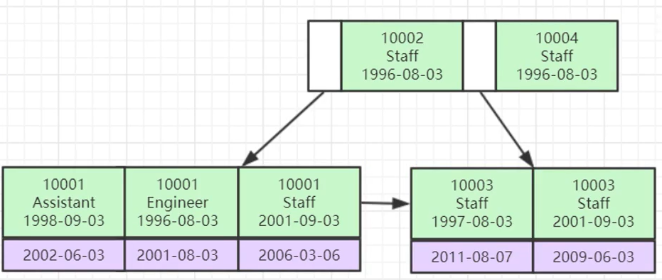
