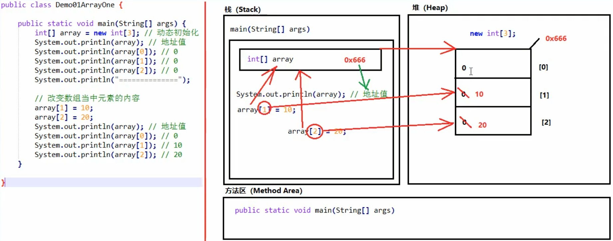

## 数组
- **数组的初始化**  
在内存当中创建一个数组，并向其中赋予一些默认值。
- **两种常见的初始化方式**
1. 动态初始化（指定长度）
2. 静态初始化（指定内容）
- **注意事项**
1. 静态初始化没有直接指定长度，但是仍然会自动推算得到长度。
2. 静态初始化标准格式可以拆分成为两个步骤。
3. 静态初始化也可以拆分成两个步骤。
- **一个数组内存分析**
1. main方法进栈
2. main方法栈空间中创建局部变量array
3. 堆中创建数组对象
4. 栈中变量array存放堆中数组对象地址值

- **两个数组内存分析**
- **两个引用指向同一个数组**
