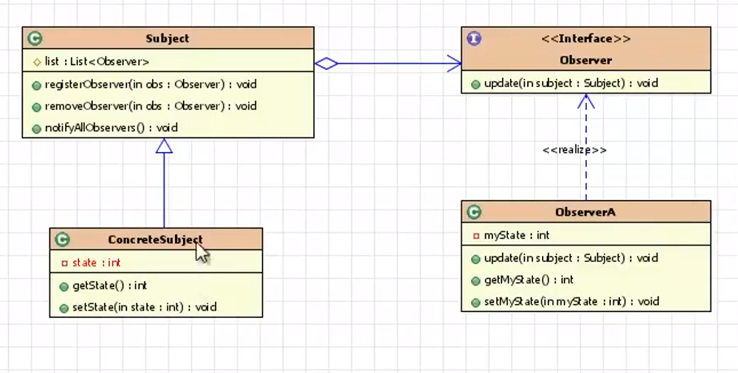

## 设计模式  
- **观察者模式**  
1. 自定义观察者模式 
```
  public class Subject {
    private List<Observer> list = new ArrayList<Observer>();
    
    public void registerObserver(Observer obs) {
      list.add(obs);
    }
    public void removeObserver(Observer obs) {
      list.remove(obs);
    }
    
    // 通知所有的观察者更新状态
    public void notifyAllObservers() {
      for (Observer obs : list) {
        obs.update(this);
      }
    }
  }
  
  public class ConcreteSubject extends Subject {
    private int state;
    
    public int getState() {
      return state;
    }
    
    public void setState(int state) {
      this.state = state;
      
    }
  }
  
  public interface Observer {
    void update(Subject subject);
  }
  
  public class ObserverA implements Observer {
    // myState需要跟目标对象的state值保持一致
    private int myState;
    
    @Override
    public void update(Subject subject) {
      myState = ((ConcreteSubject)subject).getState();
    }
    
    public int getMyState() {
      return myState;
    }
    
    public void setMyState(int myState) {
      this.myState = myState;
    }
  }
``` 
2. `java.util.Observable`和`java.util.Observer`  
  
```
  // 目标类
  public class ConcreteSubject extends Observable {
    private int state;
    
    public void set(int s) {
      // 目标对象的状态发生了改变
      state = s;
      
      // 表示目标对象已经做了更改
      setChanged();
      // 通知所有观察者
      notifyObservers(state);
    }
    
    public int getState() {
      return state;
    }
  }  
  
  public class ObserverA implements Observer {
    private int myState;
    
    @Override
    public void update(Observable o, Object arg) {
      myState = ((ConcreteSubject)o).getState();
    }
    
    public int getMyState() {
      return myState;
    }
  }
  
  public static void main(String[] args) {
    // 创建目标对象
    ConcreteSubject subject = new ConcreteSubject();
  
    // 创建观察者
    ObserverA obs1 = new ObserverA();
    ObserverB obs2 = new ObserverB();
    ObserverC obs3 = new ObserverC();
    
    // 将观察者对象添加到目标对象subject的观察者容器中
    subject.addObserver(obs1);
    subject.addObserver(obs2);
    subject.addObserver(obs3);
    
    // 改变subject对象的状态
    subject.set(3000);
    
    // 观察者的状态发生改变
    System.out.println(obs1.getMyState());
    System.out.println(obs2.getMyState());
    System.out.println(obs3.getMyState());
  }
```
- **SOLID原则**  
- **单一职责原则**  
1. 一个类或者模块只负责完成一个职责。通俗的说就是一个模块、类、方法，不要承担过多的任务  
2. 原则上说，设计一个类的时候不应该设计成大而全的类，要设计粒度小，功能单一的类。如果一个类有两个或两个以上的不相干的功能，就认为它违背了单一职责原则，应拆分成多个功能单一，粒度更细的类。实际软件开发工作中，不必严格遵守该原则，可以设计一个粗粒度的类，随着业务发展，再进行重构  
3. 实际开发中可以按照以下参考意见，进行代码的重构或者设计：  
a. 类依赖过多的其他类，或者代码直接的依赖关系过于复杂时，不符合高内聚低耦合的设计思想时，可以考虑对代码进行拆分  
b. 类的名称和实际的功能关系不大或者没有任何关联性的时候，可以更加细粒度的拆分，把无关的功能独立出去  
c. 类的代码函数过多影响可读性和代码维护时，可以对代码进行方法级别的拆分  
- **开闭原则**  
1. 软件实体（模块、类、方法等）应该“对扩展开放，对修改关闭”。通俗理解就是添加一个功能应该是在已有的代码基础上进行扩展，而不是修改已有的代码 
2. 开闭原则的目的是为了提高代码的可扩展性，并且避免对现有代码的修改给软件带来风险。实际开发中参考如下：  
a. 如果是业务驱动的系统，需要在充分了解业务需求的前提下，找到对应的扩展点。如果不确定因素过多，需求变化过快，则可以对一些比较确定的，短期内可能会扩展的模块设计扩展点，提升代码稳定性和开发效率  
b. 如果是通用型的技术开发，比如开发通用的框架、组建、类库，需要考虑技术框架如何被用户使用，考虑功能的升级需要预留的扩展点以及版本之间的兼容问题  
c. 即使对系统的业务或者技术框架有足够的了解，也不一定要设计所有的扩展点。为未来可能发生变化的每个地方都预留扩展点，会给系统带来极大的复杂度，工作量不容小觑，需要综合考虑开发成本、影响范围、实际收益等因素  
- **里氏替换原则**  
1. 子类对象能够替换程序中父类对象出现的任何地方，并且保证原来程序的逻辑行为不变及正确性不被破坏  
2. 可以利用面向对象编程的多态性来实现，多态和里氏替换原则类似，但是关注角度不同。多态是面向对象编程的特性，而里氏替换是一种设计原则，用来指导继承关系中子类如何设计，子类的设计要确保在替换父类的时候，不改变原有程序的逻辑以及不破坏原有程序的正确性  
3. 具体实现方式：设计子类的时候，要遵循父类的行为约定。父类定义了方法的行为，子类可以改变方法的内部实现逻辑，但不能改变方法原有的行为约定，如接口、方法声明要实现的功能；对参数值、返回值、异常的约定；甚至包括注释种所罗列的任何特殊说明  
- **接口隔离原则**  
1. 客户端不应该被强迫依赖它不需要的接口   
2. 实现参考如下：  
a. 对于接口，如果某个接口承担与它无关的接口定义，则认为该接口违反了接口隔离原则。可以把无关的接口剥离，对胖而杂的接口瘦身  
b. 对于共通的功能，应该细分功能点，按需添加，而不是定义一个大而全的接口，导致子类被迫去实现  
- **依赖倒置原则**  
1. 高层模块不要依赖低层模块，高层模块和低层模块应该通过抽象来相互依赖。此外，抽象不要依赖具体实现细节，而是具体实现细节依赖抽象  
2. 从代码角度，高层模块就是调用者，低层模块是被调用者。即调用者不要依赖于具体的实现，而应该依赖于抽象  
