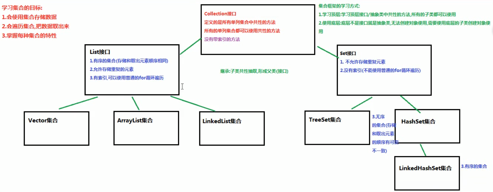

## 集合
- **泛型**
1. 泛型是一种未知的数据类型，当我们不知道使用什么数据类型的时候，可以使用泛型。泛型也可以看作是一个变量，用来接收数据类型。  
`E e`：Element 元素  
`T t`：Type 类型
2. 创建集合对象，不适用泛型    
好处：集合不使用泛型，默认的类型就是`Object`类型，可以存储任意类型的数据。  
弊端：不安全，会引发异常。
```
  private static void method() {
    ArrayList list = new ArrayList();
    list.add("abc");
    list.add(1);
  }
```
3. 创建集合对象，使用泛型  
好处：  
a. 避免了类型转换的麻烦，存储的是什么类型，取出的就是什么类型。  
b. 把运行期异常（代码运行之后抛出的异常），提升到了编译期（写代码的时候会报错）。  
弊端：  
泛型是什么类型，只能存储什么类型的数据。
```
  public class GenericClass<E> {
    private E name;
    
    public E getName() {
      return name;
    }
    
    public void setName(E name) {
      this.name = name;
    }
  }
```
- **集合的框架**

- **ArrayList**  
数组有一个缺点，一旦创建，程序运行期间长度不可以发生改变。然而ArrayList集合的长度是可以随意变化的。  
- **注意事项**
1. 对于ArrayList来说，有一个尖括号`<E>`代表泛型。  
**泛型**：就是装在集合当中的所有元素，全都是统一的什么类型。  
2. 泛型只能是引用类型，不能是基本类型。
```
  // 错误写法
  // ArrayList<int> list = new ArrayList<>();
```
3. 如果希望向集合ArrayList当中存储基本数据类型数据，必须使用基本数据类型对应的“包装类”。   
基本类型 -> 包装类（引用类型，包装类都位于java.lang包下）  
byte -> Byte  
short -> Short  
int -> Integer【特殊】  
long -> Long  
float -> Float  
double -> Double  
char -> Character【特殊】  
boolean -> Boolean  
5. 从JDK1.5+开始，支持自动装箱、自动拆箱。   
自动装箱：基本数据类型 -> 包装类型  
自动拆箱：包装类型 -> 基本数据类型
4. 对于ArrayList集合来说，直接打印得到的不是地址值，而是内容。如果内容为空，得到的是空的中括号：`[]`。
- **ArrayList中的常用方法**  
`public boolean add(E e)`：向集合中添加元素，参数类型和泛型一致。返回值代表添加是否成功。对于ArrayList集合来说，add添加动作一定是成功的，所以返回值可用可不用。但是对于其他某些集合来说，add添加动作不一定成功。  
`public E get(int index)`：从集合当中获取元素，参数是索引编号，返回值就是对应位置的元素。  
`public E remove(int index)`：从集合中删除元素，参数是索引编号，返回值就是被删除掉的元素。  
`public int size()`：获取集合的尺寸长度，返回值是集合中包含的元素个数。
- **集合的遍历**  
1. 迭代器`Iterator`接口  
```
  // 获取迭代器的实现类对象，并且会把指针（索引）指向集合的-1索引
  Iterator<String> it = coll.iterator();
  
  // 使用迭代器取出集合中的元素，是一个重复的过程
  // 使用while循环，循环结束的条件，hasNext方法返回false
  while (it.hasNext()) {
    // 1.取出下一个元素
    // 2.把指针向后移动一位
    String e = it.next();
    System.out.println(e);
  }
```
2. 增强`for`循环：用来遍历集合和数组  
格式：  
```
  for(集合/数组的数据类型 变量名 : 集合名/数组名) {
    System.out.println(变量名);
  }
```
