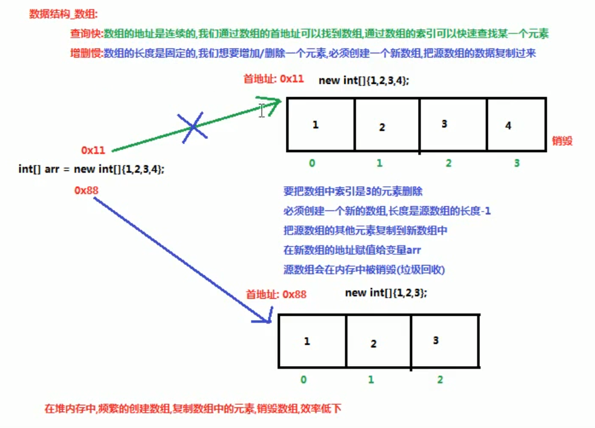
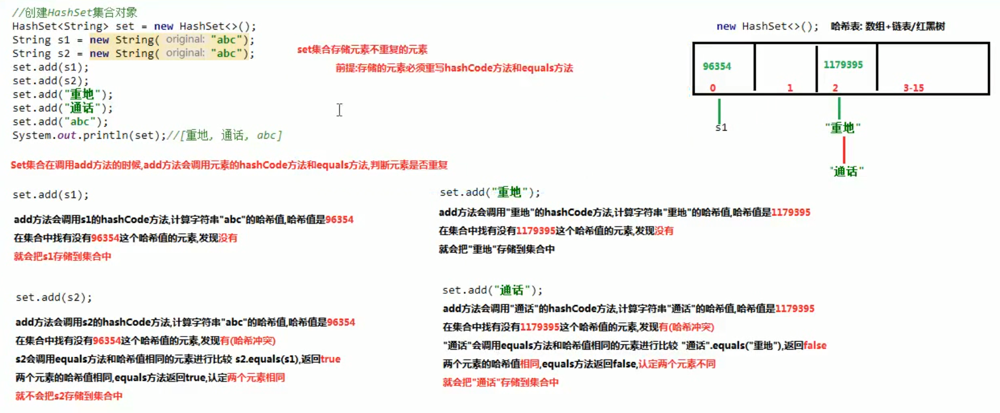

## 集合
- **泛型**
1. 泛型是一种未知的数据类型，当我们不知道使用什么数据类型的时候，可以使用泛型。泛型也可以看作是一个变量，用来接收数据类型。  
`E e`：Element 元素  
`T t`：Type 类型
2. 创建集合对象，不使用泛型    
好处：集合不使用泛型，默认的类型就是`Object`类型，可以存储任意类型的数据。  
弊端：不安全，会引发异常。
```
  private static void method() {
    ArrayList list = new ArrayList();
    list.add("abc");
    list.add(1);
  }
```
3. 创建集合对象，使用泛型  
好处：  
a. 避免了类型转换的麻烦，存储的是什么类型，取出的就是什么类型。  
b. 把运行期异常（代码运行之后抛出的异常），提升到了编译期（写代码的时候会报错）。  
弊端：  
泛型是什么类型，只能存储什么类型的数据。
```
  public class GenericClass<E> {
    private E name;
    
    public E getName() {
      return name;
    }
    
    public void setName(E name) {
      this.name = name;
    }
  }
```
4. 定义含有泛型的方法：泛型定义在方法的修饰符和返回值类型之间。格式：  
```
  修饰符 <泛型> 返回值类型 方法名(参数列表（使用泛型）) {
    方法体;
  }
```
注：含有泛型的方法，在调用方法的时候确定泛型的数据类型。传递什么类型的参数，泛型就是什么类型。
```
  public class GenericMethod {
    // 定义一个含有泛型的方法
    public <M> void method1(M m) {
      System.out.println(m);
    }
    
    // 定义一个含有泛型的静态方法
    public static <S> void method2(S s) {
      System.out.println(s);
    }
  }
```
5. 含有泛型的接口，第一种使用方式：定义接口的实现类，实现接口，指定接口的泛型  
```
  public interface Iterator<E> {
    E next();
  }
  
  //Scanner类实现了Iterator接口，并指定接口的泛型为String，所以重写的next方法泛型默认就是String
  public final class Scanner implements Iterator<String> {
    public String next() {
      // ...
    }
  }
```
6. 含有泛型的接口，第二种使用方式：接口使用什么泛型，实现类就使用什么类型，类跟着接口走。相当于定义一个含有泛型的类，创建对象的时候确定泛型的类型
```
  public interface List<E> {
    boolean add(E e);
    E get(int index);
  }
  
  public class ArrayList<E> implements List<E> {
    public boolean add(E e) { // ... }
    public E get(int index) { // ... }
  }
```
7. 泛型的通配符  
`?`：代表任意的数据类型  
使用方式：不能创建对象使用，只能作为方法的参数使用
```
  // 定义一个方法，能遍历所有类型的ArrayList集合
  // 此时我们不知道ArrayList集合使用什么数据类型，可以使用泛型的通配符?来接收数据类型
  // 注意：泛型没有继承概念
  public static void printArray(ArrayList<?> list) {
    // 使用迭代器遍历集合
    Iterator<?> it = list.iterator();
    while(it.hasNext()) {
      // it.next()方法，取出的元素是Object类型，可以接收任意的数据类型
      Object o = it.next();
      System.out.println(o);
    }
  }
```
8. 泛型的上限限定：`? extends E`：代表使用的泛型只能是`E`类型的子类/本身  
泛型的下限限定：`? super E`：代表使用的泛型只能是`E`类型的父类/本身
- **数据结构**
1. 数组的特点

2. 红黑树的特点（了解）    
a. 节点可以是红色的或者黑色的  
b. 根节点是黑色的  
c. 叶子节点（空节点）是黑色的  
d. 每个红色的节点的子节点都是黑色的  
e. 任何一个节点到其每一个叶子节点的所有路径上黑色节点数相同
- **集合的框架**

- **ArrayList**  
数组有一个缺点，一旦创建，程序运行期间长度不可以发生改变。然而ArrayList集合的长度是可以随意变化的。  
- **注意事项**
1. 对于ArrayList来说，有一个尖括号`<E>`代表泛型。  
**泛型**：就是装在集合当中的所有元素，全都是统一的什么类型。  
2. 泛型只能是引用类型，不能是基本类型。
```
  // 错误写法
  // ArrayList<int> list = new ArrayList<>();
```
3. 如果希望向集合ArrayList当中存储基本数据类型数据，必须使用基本数据类型对应的“包装类”。   
基本类型 -> 包装类（引用类型，包装类都位于java.lang包下）  
byte -> Byte  
short -> Short  
int -> Integer【特殊】  
long -> Long  
float -> Float  
double -> Double  
char -> Character【特殊】  
boolean -> Boolean  
5. 从JDK1.5+开始，支持自动装箱、自动拆箱。   
自动装箱：基本数据类型 -> 包装类型  
自动拆箱：包装类型 -> 基本数据类型
4. 对于ArrayList集合来说，直接打印得到的不是地址值，而是内容。如果内容为空，得到的是空的中括号：`[]`。
- **ArrayList中的常用方法**  
`public boolean add(E e)`：向集合中添加元素，参数类型和泛型一致。返回值代表添加是否成功。对于ArrayList集合来说，add添加动作一定是成功的，所以返回值可用可不用。但是对于其他某些集合来说，add添加动作不一定成功。  
`public E get(int index)`：从集合当中获取元素，参数是索引编号，返回值就是对应位置的元素。  
`public E remove(int index)`：从集合中删除元素，参数是索引编号，返回值就是被删除掉的元素。  
`public int size()`：获取集合的尺寸长度，返回值是集合中包含的元素个数。
- **集合的遍历**  
1. 迭代器`Iterator`接口  
```
  // 获取迭代器的实现类对象，并且会把指针（索引）指向集合的-1索引
  Iterator<String> it = coll.iterator();
  
  // 使用迭代器取出集合中的元素，是一个重复的过程
  // 使用while循环，循环结束的条件，hasNext方法返回false
  while (it.hasNext()) {
    // 1.取出下一个元素
    // 2.把指针向后移动一位
    String e = it.next();
    System.out.println(e);
  }
```
2. 增强`for`循环：用来遍历集合和数组  
格式：  
```
  for(集合/数组的数据类型 变量名 : 集合名/数组名) {
    System.out.println(变量名);
  }
```
- **Set**
1. `java.util.Set`接口`extends Collection`接口，`Set`接口的特点：  
a. 不允许存储重复的元素  
b. 没有索引，没有带索引的方法，也不能使用普通的`for`循环遍历  
2. `java.util.HashSet`集合`implements Set`接口，`HashSet`的特点：  
a. 不允许存储重复的元素  
b. 没有索引，没有带索引的方法，也不能使用普通的`for`循环遍历  
c. 是一个无序的集合，存储元素和取出元素的顺序有可能不一致  
d. 底层是一个哈希表结构（查询的速度非常快）
3. `String`类的哈希值：`String`类重写`Object`类的`hashCode`方法
```
  String s1 = new String("abc");
  String s2 = new String("abc");
  String s3 = "abc";
  String s4 = "abc";
  
  System.out.println(s1.hashCode()); // 96354
  System.out.println(s2.hashCode()); // 96354
  System.out.println(s3.hashCode()); // 96354
  System.out.println(s4.hashCode()); // 96354
  
  System.out.println(s1.getBytes()); // [B@4554617c
  System.out.println(s2.getBytes()); // [B@74a14482
  System.out.println(s3.getBytes()); // [B@1540e19d
  System.out.println(s4.getBytes()); // [B@677327b6
  
  System.out.println(s1 == s2); // false
  System.out.println(s3 == s4); // true
  System.out.println(s1 == s3); // false
```
4. HashSet集合存储数据的结构（哈希表）  
a. `jdk1.8`版本之前：哈希表=数组+链表  
b. `jdk1.8`版本之后：哈希表=数组+链表/红黑树（链表的长度超过8，提高查询的速度）  
c. 哈希表的特点：速度快
5. `Set`集合存储数据不重复的原理

6. `HashSet`存储自定义类型元素，元素类型应该唯一，且必须重写`hashCode`方法和`equals`方法  
7. `java.util.LinkedHashSet`集合`extends HashSet`集合，`LinkedHashSet`集合的特点：  
底层是一个哈希表（数组+链表/红黑树）+链表：多了一条链表（记录元素的存储顺序），保证元素有序
- **可变参数**  
1. `JDK1.5`之后出现的新特性
2. 使用前提：当方法的参数列表数据类型已经确定，但是参数的个数不确定，就可以使用可变参数  
3. 使用格式：定义方法时使用`修饰符 返回值类型 方法名(数据类型... 变量名){}`
4. 可变参数的原理：可变参数底层就是一个数组，根据传递参数个数不同，会创建不同长度的数组，来存储这些参数。传递的参数的个数，可以是0个（不传递）,1,2...多个
5. 可变参数的注意事项：  
a. 一个方法的参数列表，只能有一个可变参数  
b. 如果方法的参数有多个，那么可变参数必须写在参数列表的末尾
- **Collections工具类**
1. `java.util.Collections`是集合工具类，用来对集合进行操作。部分方法如下：  
`public static <T> void sort(List<T> list)`：将集合中元素按照默认规则排序
2. `sort(List<T> list)`使用前提：被排序的集合中存储的元素，必须实现`Comparable`，重写接口中的方法`compareTo`定义排序的规则。
3. `Comparable`接口的排序规则：`自己（this） - 参数`：升序
```
  // 重写排序的规则
  @Override
  public int compareTo(Person o) {
    // return 0; //认为元素是相同的
    // 自定义比较规则，比较两个人的年龄（this，参数Person）
    return this.getAge() - o.getAge(); // 年龄升序排序
  }
```
4. `public static <T> void sort(List<T> list, Comparator<? super T>)`：将集合中元素按照指定规则排序  
5. `Comparator`和`Comparable`的区别：    
a. `Comparable`：自己（`this`）和别人（`参数`）比较，自己需要实现`Comparable`接口，重写比较的规则`compareTo`方法   
b. `Comparator`：相当于找一个第三方的裁判，比较两个   
6. `Comprator`的排序规则：`o1 - o2`：升序
```
  ArrayList<Student> list = new ArrayList<>();
  list.add(new Student("迪丽热巴", 18));
  list.add(new Student("古力娜扎", 20));
  list.add(new Student("马尔扎哈", 999));
  
  Collections.sort(list, new Comparator<Student>() {
    @Override
    public int compare(Student o1, Student o2) {
      // 按照年龄降序排列
      int res = o2.getAge() - o1.getAge()
      // 如果两个人年龄相同，则按姓名的第一个字升序排列
      if(res == 0) {
        res = o1.getName().charAt(0) - o2.getName().charAt(0);
      }
      return res;
    }
  });
```
- **Map**
1. `java.util.Map<k, v>`集合的特点：  
a. `Map`集合是一个双列集合，一个元素包含两个值（一个`key`，一个`value`）  
b. `Map`集合中的元素，`key`和`value`的数据类型可以相同，也可以不同  
c. `Map`集合中`key`不允许重复，`value`可以重复  
d. `Map`集合中`key`和`value`一一对应
2. `java.util.HashMap<k, v>`集合`implements Map<k, v>`接口，`HashMap`集合的特点：  
a. `HashMap`集合底层是哈希表，查询速度特别快  
b. `HashMap`集合是一个无序的集合，存储元素和取出元素的顺序可能不一致  
3. `java.util.LinkedHashMap<k, v>`集合`extends HashMap<k, v>`集合，`LinkedHashMap`的特点：  
a. `LinkedHashMap`集合底层是哈希表+链表（保证迭代的顺序）  
b. `LinkedHashMap`集合是一个有序的集合，存储元素和取出元素的顺序是一致的
4. `Map`集合常用方法：  
a. `public V put(K key, V value)`：把指定的键与指定的值添加到`Map`集合中  
返回值`V`：存储键值对的时候，`key`不重复，返回值`V`是`null`。存储键值对的时候，`key`重复，会使用新的`value`替换`Map`中重复的`value`，返回被替换的`value`值  
b. `public V remove(Object key)`：把指定的键所对应的键值对元素，在`Map`集合中删除，返回被删除元素的值。  
返回值`V`：`key`存在，`V`返回被删除的值。`key`不存在，`V`返回`null`  
5. `Map`集合的第一种遍历方式：通过键找值得方式，`Map`集合中的方法：`Set<K> keySet()`：返回此映射中包含的键的`Set`视图，实现步骤：  
a. 使用`Map`集合中的方法`keySet()`，把`Map`集合中所有的`key`取出来，存储到一个`Set`集合中    
b. 遍历`Set`集合，获取`Map`集合中的每一个`key`    
c. 通过`Map`集合中的方法`get(key)`，通过`key`找到`value`     
6. `Map`集合遍历的第二种方式：使用`Entry`对象遍历。`Map.Entry<K, V>`：在`Map`接口中有一个内部接口`Entry`，作用：当`Map`集合创建，就会在`Map`几何中创建一个`Entry`对象，用来记录键与值（键值对对象，键与值得映射关系）。`Map`集合中的方法`Set<Map.Entry<K, V>> entrySet()`，返回此映射中包含的映射关系的`Set`视图，实现步骤：  
a. 使用`Map`集合中的方法`entrySet()`，把`Map`集合中多个`Entry`对象取出来，存储到一个`Set`集合中  
b. 遍历`Set`集合，获取每一个`Entry`对象  
c. 使用`Entry`对象中的方法`getKey()`和`getValue()`获取键与值
```
  // 使用Map集合中的方法entrySet()，把Map集合中多个Entry对象取出来，存储到一个Set集合中
  Set<Map.Entry<String, Integer>> set = map.entrySet();
  
  // 遍历Set集合，获取每一个Entry对象
  // 使用迭代器遍历Set集合  
  Iterator<Map.Entry<String, Integer>> it = set.iterator();
  while(it.hasNext()) {
    Map.Entry<String, Integer> entry = it.next();
    // 使用Entry对象中的方法getKey()和getValue()获取键与值
    String key = entry.getKey();
    Integer value = entry.getValue();
    System.out.println(key + "=" + value);
  }
  
  for(Map.Entry<String, Integer> entry:set) {
    // 使用Entry对象中的方法getKey()和getValue()获取键与值
    String key = entry.getKey();
    Integer value = entry.getValue();
    System.out.println(key + "=" + value);
  }
```
7. `HashMap`存储自定义类型键值，`Map`集合保证`key`是唯一的：作为`key`的元素，必须重写`hashCode`方法和`equals`方法，以保证`key`唯一
8. `java.util.Hashtable<K, V>`集合`implements Map<K, V>`接口  
a. `Hashtable`：底层也是一个哈希表，是一个线程安全的集合，是单线程集合，速度慢  
b. `HashMap`：底层是一个哈希表，是一个线程不安全的集合，是多线程的集合，速度快  
c. `HashMap`集合：可以存储`null值, null值`  
d. `Hashtable`集合：不能存储`null值, null值`  
e. `Hashtable`和`Vector`集合一样，在`jdk1.2`版本之后被更先进的集合（`HashMap`，`ArrayList`）取代了  
f. `Hashtable`的子类`Properties`依然活跃在历史舞台，`Properties`集合是一个唯一和`IO`流相结合的集合  
8. `JDK9`的新特性：`List`接口，`Set`接口，`Map`接口：新增了一个静态的方法`of`，可以给集合一次性添加多个元素，`static <E> List<E> of (E... elements)`，使用前提：当集合中存储的元素的个数已经确定了，不再改变时使用  
注意：  
a. `of`方法只适用于`List`接口，`Set`接口，`Map`接口，不适用于接口的实现类  
b. `of`方法的返回值是一个不能改变的集合，集合不能再使用`add`、`put`方法添加元素，会抛出异常  
c. `Set`接口和`Map`接口在调用`of`方法的时候，不能有重复的元素，否则会抛出异常
```
  List<String> list = List.of("a", "b", "a", "c");
  System.out.println(list); // [a, b, a, c]
  
  // 执行add，UnsupportedOperationException
  // list.add("w");
  
  // 有重复的元素，IllegalArgumentException
  // Set<String> set = Set.of("a", "b", "a");
```
