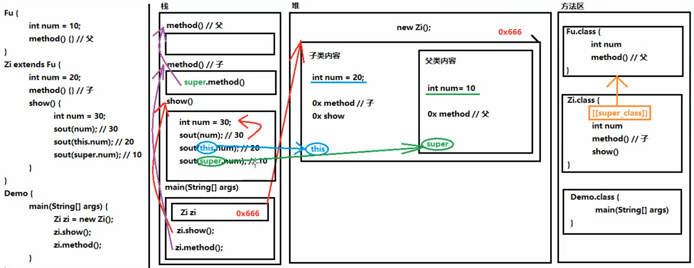

## 面向对象
- **封装**  
封装就是将一些细节信息隐藏起来，对外界不可见。
- **封装性在Java当中的体现**
1. 方法就是一种封装
2. 关键字private也是一种封装
- **局部变量和成员变量**
```
  public class Demo {
    String name; // 成员变量
    
    public void methodA() {
      int num = 20; // 局部变量
    }
    
    public void methodB(int param) {
      //方法的参数就是局部变量
      //参数在方法调用的时候，必然会被赋值
      System.out.println(param);
      
      int num;
      // 错误写法，没赋值不能使用
      // System.out.println(num);
    }
  }
```
- **区别**
1. 定义位置不同  
局部变量：在方法的内部  
成员变量：在方法的外部，直接写在类当中
2. 作用范围不同  
局部变量：只在本方法中有效，出了方法就不能再用  
成员变量：整个类通用
3. 默认值不同  
局部变量：没有默认值，如果想使用，必须手动进行赋值  
成员变量：如果没有赋值，会有默认值，规则和数组一样
4. 内存位置不同  
局部变量：位于栈内存  
成员变量：位于堆内存
5. 生命周期不同  
局部变量：随着方法进栈而诞生，随着方法出栈而消失  
成员变量：随着对象创建而诞生，随着对象被垃圾回收而消失
- **注意事项**
1. 对于基本类型当中的boolean类型，Getter方法一定要写成isXxx的形式，而setXxx规则不变。  
2. 当方法中局部变量和类的成员变量重名的时候，根据“就近原则”，优先使用局部变量。如果需要访问本类中的成员变量，需使用格式：this.成员变量名。
3. 通过谁调用的方法，this就指代谁。
```
  public class Person {
    String name; // 成员变量，我自己的名字
    
    //参数name是局部变量，对方的名字
    public void sayHello(String name) {
      System.out.println(name + "，你好。我是" + name);
    }
    
    public void sayHello1(String name) {
      System.out.println(name + "，你好。我是" + this.name);
    }
  }
```
- **构造方法**  
构造方法是专门用来创建对象的方法，通过关键字new创建对象时，其实就是在调用构造方法。构造方法格式：
```
  public 类名称(参数类型 参数名称) {
    方法体
  }
```
- **注意事项**
1. 构造方法的名称必须和所在类名称完全相同，包括大小写。
2. 构造方法不需要返回值类型，连void都不写。
3. 构造方法不能return一个具体的返回值。
4. 如果没有编写任何构造方法，那么编译器将会默认赠送一个构造方法，没有参数、方法体什么都不做。
- **匿名对象**  
匿名对象就是只有右边的对象，没有左边的名字和赋值运算符。格式：  
`new 类名称();`  
- **注意事项**  
匿名对象只能使用唯一一次，下次再使用不得不再创建一个新对象。如果确定一个对象只需要使用唯一的一次，就可以使用匿名对象。
- **一个对象内存分析** 

- **两个对象内存分析**

- **两个引用指向同一个对象**

- **对象类型作为方法的参数**

- **对象类型作为方法的返回值**

- **static**

- **静态变量与静态方法**  
1. 如果一个成员变量使用了static关键字，那么这个变量不再属于对象自己，而是属于所在的类。多个对象共享同一份数据。
2. 使用static修饰的成员方法是静态方法。静态方法不属于对象，而是属于类。
3. 如果没有static关键字，那么必须首先创建对象，然后通过对象才能使用它。如果有了static关键字，那么不需要创建对象，直接就能通过类名称使用它。
4. 无论是成员变量，还是成员方法，如果有了static修饰，建议都使用类名称进行调用。  
静态变量：`类名称.静态变量`  
静态方法：`类名称.静态方法()`
```
  public static void main(String[] args) {
    MyClass obj = new MyClass();
    
    // 通过对象调用非静态方法
    obj.method();
    
    // methodStatic为静态方法，可以通过对象名进行调用，也可以直接通过类名称进行调用
    // 这种写法在编译之后也会被javac翻译成为“类名称.静态方法名”
    obj.methodStatic();
    // 建议使用这种调用格式
    MyClass.methodStatic();
  }
```
5. 静态不能直接访问非静态。因为在内存当中**先**有静态内容，**后**有非静态内容。“先人不知道后人，但是后人知道先人”。
6. 静态方法当中不能使用this。因为this指向堆中的当前对象，static域在静态区分配内存。
- **静态变量内存分析**

- **静态代码块**  
1. 静态代码块的格式是：
```
  public class 类名称 {
    static {
      // 静态代码块的内容
    }
  }
```
2. 当第一次用到本类时，静态代码块执行唯一的一次。
3. 静态内容总是优先于非静态内容，所以静态代码块比构造方法先执行。
4. 静态代码块的典型用途：用来一次性对静态成员变量进行赋值。
- **注意**
1. java.util.Arrays是一个与数组相关的工具类，里面提供了大量静态方法，用来实现数组常见的操作。
2. java.util.Math类是数学相关的工具类，里面提供了大量的静态方法，完成与数学运算相关的操作。  
`public static double abs(double num)`：获取绝对值  
`public static double ceil(double num)`：向上取整  
`public static double floor(double num)`：向下取整  
`public static long round(double num)`：四舍五入
- **继承与多态**
- **继承关系中成员变量的访问特点**  
1. 直接通过子类对象访问成员变量：等号左边是谁，就优先用谁，没有则向上找。
2. 间接通过成员方法访问成员变量：该方法属于谁，就优先用谁，没有则向上找。
```
  // 此处不考虑代码的健壮性
  class F {
    public String sF = "Father:sF";
    public String s = "Father:s";
    public void methodF(){
      System.out.println(s);
    }
    public void method(){
    }
  }
  
  class S extends F {
    public String sS = "Son:sS";
    public String s = "Son:s";
    public void methodS(){
      System.out.println(s);
    }
    public void method(){
    }
  }
  
  F f = new F();
  S s = new S();
  F ff = new S();
  
  // 没有则向上找
  System.out.println(s.sF); // Father:sF
  
  // 等号左边是子类，就优先用子类
  System.out.println(s.s); // Son:s
  // 等号左边是父类，就优先用父类
  System.out.println(ff.s); // Father:s
  
  // 方法是子类的，优先用子类，没有向上找
  s.methodS(); // Son:s
  // 方法是父类的
  s.methodF(); // Father:s
```
- **注意事项**
局部变量：直接写成员变量名  
本类的成员变量：`this.成员变量名`  
父类的成员变量：`super.成员变量名`
- **继承关系中成员方法的访问特点**  
1. 继承关系中，访问成员方法的规则：创建的对象是谁，就优先用谁，如果没有则向上找。
2. 无论成员方法还是成员变量，如果没有都是向上找父类，绝对不会向下找子类。
```
  S s = new S();
  
  // new子类对象，所以优先用子类方法
  s.method();
```
- **方法覆盖重写的注意事项**
1. 必须保证父子类方法的名称相同，参数列表也相同。  
2. `@Override`：卸载方法前面，用来检测是不是有效的正确覆盖重写。这个注解就算不写，之傲满足要求，也是正确的方法覆盖重写。
3. 子类方法的返回值必须小于等于父类方法的返回值范围。注：`java.lang.Object`是所有类的公共最高父类（祖宗类）。
4. 子类方法的权限必须大于等于父类方法的权限修饰符。  
`public`>`protected`>`(default)`>`private`。`(default)`不是关键字`default`，而是什么都不写。  
同一个类 YES YES YES YES  
同一个包 YES YES YES NO    
不同包子类 YES YES NO NO    
不同包非子类 YES NO NO NO  
- **继承关系的内存分析**

- **抽象方法和抽象类**  
1. 抽象方法：就是加上`abstract`关键字，然后去掉大括号，直接分号结束。
2. 抽象类：抽象方法所在的类，必须是抽象类。在`class`之前写上`abstract`即可。
- **抽象类和抽象方法的使用**
1. 不能直接创建`new`抽象类对象。
2. 必须用一个子类来继承抽象类。
3. 子类必须覆盖重写抽象父类中所有的抽象方法。  
覆盖重写（实现）：子类去掉抽象方法的`abstract`关键字，然后补上大括号方法体。
4. 创建子类对象进行使用。
- **接口**  
接口就是多个类的公共规范。  
接口是一种引用数据类型，最重要的内容就是其中的抽象方法。  
定义一个接口的格式：
```
  public interface 接口名称 {
    // 接口内容
  }
```
注：换成关键字`interface`之后，编译生成的字节码文件仍然是：`.java`->`.class`。  
如果是Java 7，那么接口中可以包含的内容有：常量、抽象方法
1. 接口中也可以定义“成员变量”，但是必须使用`public static final`三个关键字进行修饰。从效果上看，这其实就是接口的【常量】。格式：  
`public static final 数据类型 常量名称 = 数据值;`  
2. 一旦使用final关键字进行修饰，说明不可改变。
3. 接口中的常量，可以省略`public static final`，注意：不写也照样是这样。
4. 接口中的常量必须进行赋值。
5. 接口中常量的名称，建议使用完全大写的字母，用下划线进行分隔。
```
  public interface MyInterface {
    public static final int NUM_OF_MY = 12;
  }
```
如果是Java 8，还可以额外包含有：默认方法、静态方法
1. 默认方法格式：  
```
  public default 返回值类型 方法名称(参数列表) {
    方法体
  }
```
2. 接口当中的默认方法，可以解决接口升级的问题：
```
  public interface MyInterface {
    // 抽象方法
    public abstract void methodAbs();
    
    // 新添加的方法，改成默认方法
    public default void methodDefault() {
      System.out.println("这是新添加的默认方法");
    }
  }
```
3. 接口的默认方法，可以通过接口的实现类对象直接调用，也可以被接口的实现类进行覆盖重写。
4. 静态方法就是将`abstract`或者`default`换成`static`，并带上方法体，格式：
```
  public static 返回值类型 方法名称(参数列表) {
    方法体
  }
```
5. 不能同过接口的实现类的对象来调用接口当中的静态方法。可以通过接口名称直接调用其中的静态方法。格式：`接口名称.静态方法名(参数);`。
```
  MyInterfaceImpl impl = new MyInterfaceImpl();
  
  // 错误写法
  // impl.methodStatic();
  
  // 直接通过接口名称调用静态方法
  MyInterface.methodStatic();
```
如果是Java 9，还可以额外包含有：私有方法
1. 问题描述：我们需要一个共有方法，用来解决两个默认方法之间重复代码的问题。但是这个共有方法不应该让实现类使用，应该是私有化的。  
2. 普通私有方法，解决多个默认方法之间重复代码问题。格式：
```
  private 返回值类型 方法名称(参数列表) {
    方法体
  }
```
3. 静态私有方法，解决多个静态方法之间重复代码问题。格式：
```
  private static 返回值类型 方法名称(参数列表) {
    方法体
  }
```
4. `private`的方法只有接口自己才能调用，不能被实现类使用。
- **注意事项**
1. 接口中的抽象方法，修饰符必须是两个固定的关键字：`public`、`abstract`。
2. 这两个关键字修饰符，可以选择性省略。
3. 方法的三要素，可以随意定义。
4. 如果实现类并没有覆盖重写接口中所有的抽象方法，那么这个实现类自己就必须是抽象类。
```
  public interface MyInterface {
  
    // 这是抽象方法
    public abstract void methodA();
    
    // 这也是抽象方法
    abstract void methodB();
    
    // 这也是抽象方法
    public void methodC();
    
    // 这也是抽象方法
    void methodD();
  }
```
5. 接口没有静态代码块或者构造方法。
6. 一个类的直接父类是唯一的，但是一个类可以同时实现多个接口。
```
  public class MyInterfaceImpl /*extends Object*/ implements MyInterfaceA, MyInterfaceB {
    @Override
    public void methodA() {
      System.out.println("覆盖重写了A方法");
    }
    
    @Override
    public void methodB() {
      System.out.println("覆盖重写了B方法");
    }
  }
```
7. 如果实现类所实现的多个接口中，存在重复的抽象方法，那么只需要覆盖重写一次即可。
8. 如果实现类没有覆盖重写所有接口中的所有抽象方法，那么实现类就必须是一个抽象类。
9. 如果实现类所实现的多个接口中，存在重复的默认方法，那么实现类一定要对冲突的默认方法进行覆盖重写。
10. 如果一个类的直接父类中的方法和接口中的默认方法产生了冲突，优先使用父类中的方法。
- **多态**
小明是一个学生（学生形态），但同时也是一个人（人类形态）。小明是一个对象，这个对象既有学生形态，也有人类形态。一个对象拥有多种形态，这就是对象的多态。  
代码中体现多态性，即父类引用指向子类对象。格式：  
`父类名称 对象名 = new 子类名称();`  
或者：  
`接口名称 对象名 = new 实现类名称();`
- **多态中成员方法的访问规则**  
在多态的代码中，成员方法的访问规则是：看`new`的是谁，就优先用谁，没有则向上找。  
口诀：编译看左边，运行看右边。
```
	Fu obj = new Zi();
	
	obj.method(); // 父子都有，优先用子
	obj.methodFu(); // 子类没有，父类有，向上找到父类
	
	// 编译看左边，左边是Fu，Fu中没有methodZi方法，编译报错
	// obj.methodZi();
```
- **对象的向上转型**  
格式：`父类名称 对象名 = new 子类名称();`  
含义：右侧创建一个子类对象，把它当作父类来看待使用  
注意事项：向上转型一定是安全的，从小范围转向了大范围，类似于自动类型转换。但是对象一旦向上转型为父类，那么就无法调用子类原本特有的内容。解决办法，用对象向下转型还原  
`Animal animal = new Cat(); // 创建一只猫，当作动物看待，没问题`
- **对象的向下转型**  
格式：`子类名称 对象名 = (子类名称) 父类对象;`  
含义：将父类对象，还原成为本来的子类对象  
`Cat cat = (Cat) animal; // 本来是猫，被当作动物看待，还原回来成为本来的猫`  
注意事项：  
a. 必须保证对象本来创建的时候，就是猫，才能向下转型成为猫  
b. 如果对象创建的死后本来不是猫，现在非要向下转型成为猫，就会报错`ClassCastException`
- **final关键字**
1. `final`关键字修饰类，表示被修饰类不能有任何子类，其中所有的成员方法都无法进行覆盖重写（因为没有子类）。格式：  
```
	public final class 类名称 {
		// ...
	}
```
2. `final`关键字修饰方法，表示该方法是最终方法，即不能被覆盖重写。格式：
```
	修饰符 final 返回值类型 方法名称(参数列表) {
		// 方法体
	}
```
3. 对于类、方法来说，`abstract`关键字和`final`关键字不能同时使用，因为矛盾
4. 对于基本类型，不可变说的是变量中的数据不可改变；对于引用类型，不可变说的是变量中的地址值不可改变
```
	final Person p = new Person("迪丽热巴");
	// 错误写法，final修饰的引用类型变量，地址不可改变
	// p = new Person("马尔扎哈");
```
5. 对于成员变量，如果使用`final`关键字修饰，那么这个变量同样不可变。由于成员变量具有默认值，所以用`final`修饰之后必须手动赋值，不会再给默认值。`final`修饰的成员变量，要么使用直接赋值，要么通过构造方法赋值。
```
	public class Person {
		// 错误写法，未赋值
		// private final String name;
	}
```
- **内部类**
1. 成员内部类，格式：
```
	修饰符 class 外部类名称 {
		修饰符 class 内部类名称 {
			// ...
		}
		// ...
	}
```
2. 使用成员内部类有两种方式：  
间接方式，在外部类的方法中，使用内部类，然后`main`方法只是调用外部类的方法   
直接方式，`类名称 对象名 = new 类名称();`  
`外部类名称.内部类名称 对象名 = new 外部类名称().new 内部类名称();`  
内用外，随意访问；外用内，需要内部类对象
3. 内部类访问外部类重名成员变量，格式：`外部类名称.this.外部类成员变量`  
```
	public class Outer {
		int num = 10; // 外部类成员变量
		public class Inner {
			int num = 20; // 内部类成员变量
			public void methodInner() {
				int num = 30; // 内部类方法的局部变量
				// 局部变量，就近原则
				System.out.println(num);
				// 内部类的成员变量
				System.out.println(this.num);
				// 外部类的成员变量
				System.out.println(Outer.this.num);
			}
		}
	}
```
