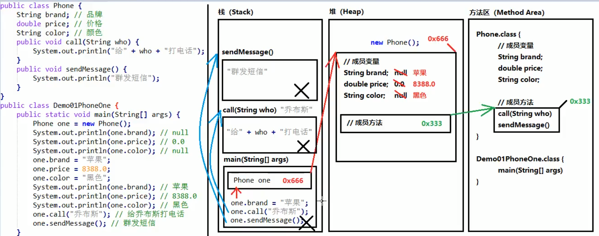
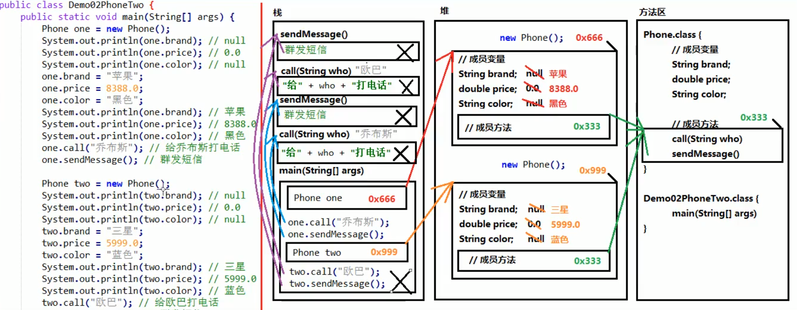
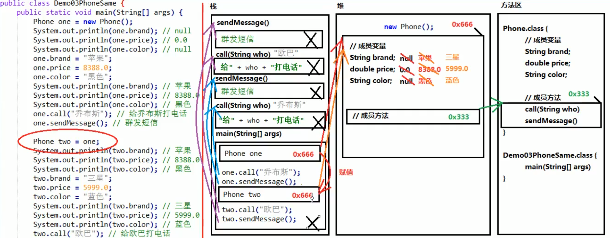
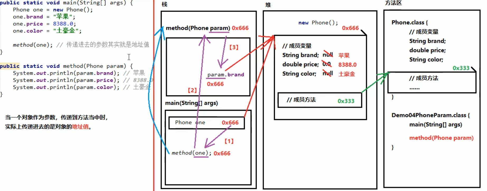
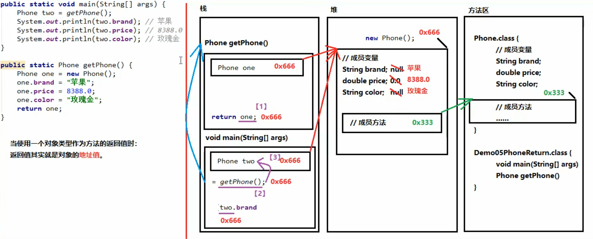
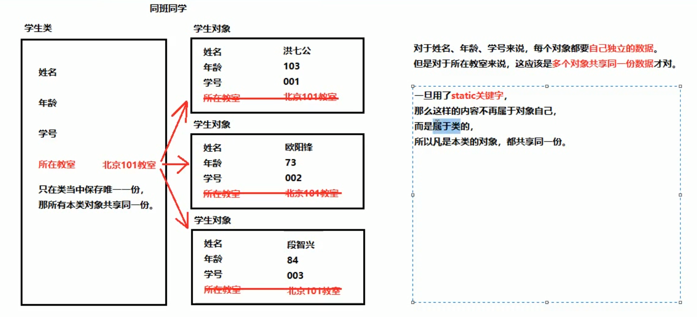
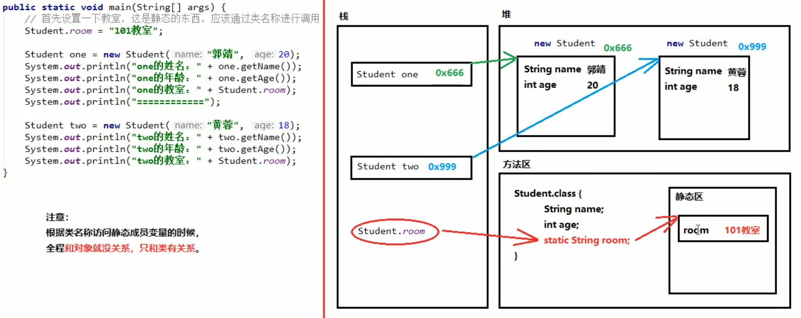

## 面向对象
- **封装**  
封装就是将一些细节信息隐藏起来，对外界不可见。
- **封装性在Java当中的体现**
1. 方法就是一种封装
2. 关键字private也是一种封装
- **局部变量和成员变量**
```
  public class Demo {
    String name; // 成员变量
    
    public void methodA() {
      int num = 20; // 局部变量
    }
    
    public void methodB(int param) {
      //方法的参数就是局部变量
      //参数在方法调用的时候，必然会被赋值
      System.out.println(param);
      
      int num;
      // 错误写法，没赋值不能使用
      // System.out.println(num);
    }
  }
```
- **区别**
1. 定义位置不同  
局部变量：在方法的内部  
成员变量：在方法的外部，直接写在类当中
2. 作用范围不同  
局部变量：只在本方法中有效，出了方法就不能再用  
成员变量：整个类通用
3. 默认值不同  
局部变量：没有默认值，如果想使用，必须手动进行赋值  
成员变量：如果没有赋值，会有默认值，规则和数组一样
4. 内存位置不同  
局部变量：位于栈内存  
成员变量：位于堆内存
5. 生命周期不同  
局部变量：随着方法进栈而诞生，随着方法出栈而消失  
成员变量：随着对象创建而诞生，随着对象被垃圾回收而消失
- **注意事项**
1. 对于基本类型当中的boolean类型，Getter方法一定要写成isXxx的形式，而setXxx规则不变。  
2. 当方法中局部变量和类的成员变量重名的时候，根据“就近原则”，优先使用局部变量。如果需要访问本类中的成员变量，需使用格式：this.成员变量名。
3. 通过谁调用的方法，this就指代谁。
```
  public class Person {
    String name; // 成员变量，我自己的名字
    
    //参数name是局部变量，对方的名字
    public void sayHello(String name) {
      System.out.println(name + "，你好。我是" + name);
    }
    
    public void sayHello1(String name) {
      System.out.println(name + "，你好。我是" + this.name);
    }
  }
```
- **构造方法**  
构造方法是专门用来创建对象的方法，通过关键字new创建对象时，其实就是在调用构造方法。构造方法格式：
```
  public 类名称(参数类型 参数名称) {
    方法体
  }
```
- **注意事项**
1. 构造方法的名称必须和所在类名称完全相同，包括大小写。
2. 构造方法不需要返回值类型，连void都不写。
3. 构造方法不能return一个具体的返回值。
4. 如果没有编写任何构造方法，那么编译器将会默认赠送一个构造方法，没有参数、方法体什么都不做。
- **匿名对象**  
匿名对象就是只有右边的对象，没有左边的名字和赋值运算符。格式：  
`new 类名称();`  
- **注意事项**  
匿名对象只能使用唯一一次，下次再使用不得不再创建一个新对象。如果确定一个对象只需要使用唯一的一次，就可以使用匿名对象。
- **一个对象内存分析** 

- **两个对象内存分析**

- **两个引用指向同一个对象**

- **对象类型作为方法的参数**

- **对象类型作为方法的返回值**

- **static**

- **静态变量与静态方法**  
1. 如果一个成员变量使用了static关键字，那么这个变量不再属于对象自己，而是属于所在的类。多个对象共享同一份数据。
2. 使用static修饰的成员方法是静态方法。静态方法不属于对象，而是属于类。
3. 如果没有static关键字，那么必须首先创建对象，然后通过对象才能使用它。如果有了static关键字，那么不需要创建对象，直接就能通过类名称使用它。
4. 无论是成员变量，还是成员方法，如果有了static修饰，建议都使用类名称进行调用。  
静态变量：`类名称.静态变量`  
静态方法：`类名称.静态方法()`
```
  public static void main(String[] args) {
    MyClass obj = new MyClass();
    
    // 通过对象调用非静态方法
    obj.method();
    
    // methodStatic为静态方法，可以通过对象名进行调用，也可以直接通过类名称进行调用
    // 这种写法在编译之后也会被javac翻译成为“类名称.静态方法名”
    obj.methodStatic();
    // 建议使用这种调用格式
    MyClass.methodStatic();
  }
```
5. 静态不能直接访问非静态。因为在内存当中**先**有静态内容，**后**有非静态内容。“先人不知道后人，但是后人知道先人”。
6. 静态方法当中不能使用this。因为this指向堆中的当前对象，static域在静态区分配内存。
- **静态变量内存分析**

- **静态代码块**  
1. 静态代码块的格式是：
```
  public class 类名称 {
    static {
      // 静态代码块的内容
    }
  }
```
2. 当第一次用到本类时，静态代码块执行唯一的一次。
3. 静态内容总是优先于非静态内容，所以静态代码块比构造方法先执行。
4. 静态代码块的典型用途：用来一次性对静态成员变量进行赋值。
- **注意**
1. java.util.Arrays是一个与数组相关的工具类，里面提供了大量静态方法，用来实现数组常见的操作。
2. java.util.Math类是数学相关的工具类，里面提供了大量的静态方法，完成与数学运算相关的操作。  
`public static double abs(double num)`：获取绝对值  
`public static double ceil(double num)`：向上取整  
`public static double floor(double num)`：向下取整  
`public static long round(double num)`：四舍五入
- **继承与多态**
- **继承成员变量的访问特点**  
1. 直接通过子类对象访问成员变量：等号左边是谁，就优先用谁，没有则向上找。
2. 间接通过成员方法访问成员变量：该方法属于谁，就优先用谁，没有则向上找。
```
  // 此处不考虑代码的健壮性
  class F {
    public String sF = "Father:sF";
    public String s = "Father:s";
    public void methodF(){
      System.out.println(s);
    }
  }
  
  class S extends F {
    public String sS = "Son:sS";
    public String s = "Son:s";
    public void methodS(){
      System.out.println(s);
    }
  }
  
  F f = new F();
  S s = new S();
  F ff = new S();
  
  // 没有则向上找
  System.out.println(s.sF); // Father:sF
  
  // 等号左边是子类，就优先用子类
  System.out.println(s.s); // Son:s
  // 等号左边是父类，就优先用父类
  System.out.println(ff.s); // Father:s
  
  // 方法是子类的，优先用子类，没有向上找
  s.methodS(); // Son:s
  // 方法是父类的
  s.methodF(); // Father:s
```
