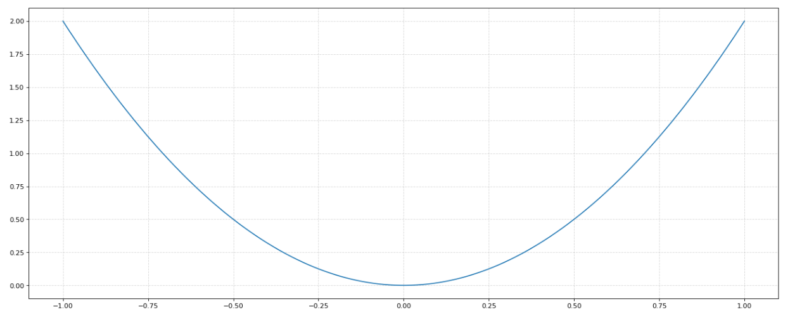
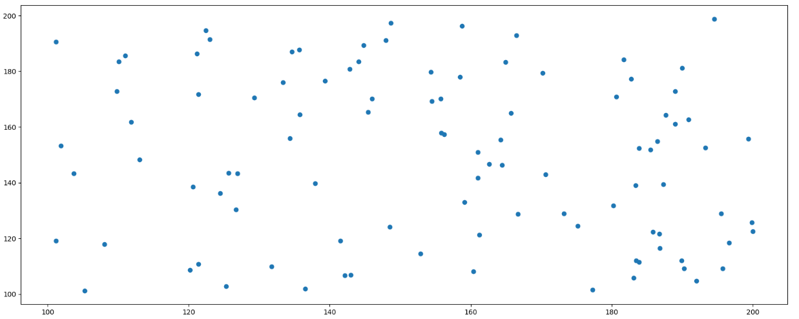
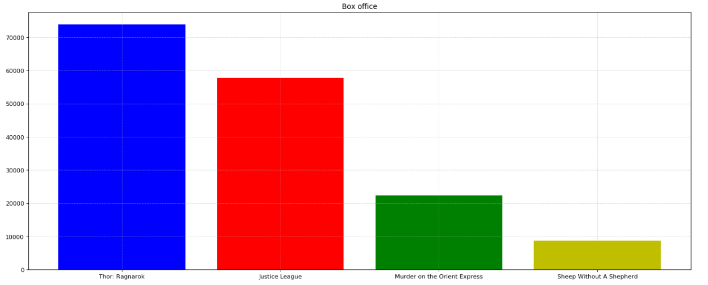
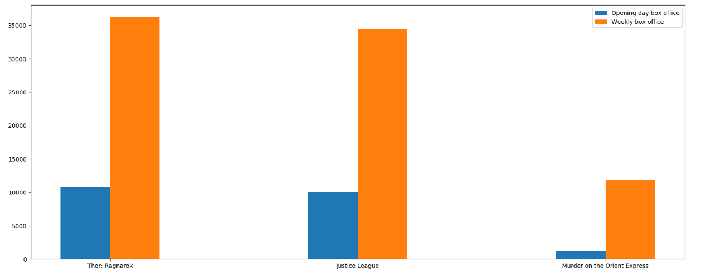
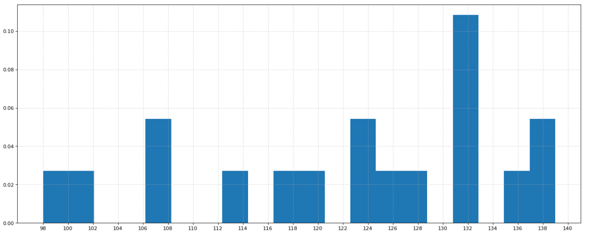
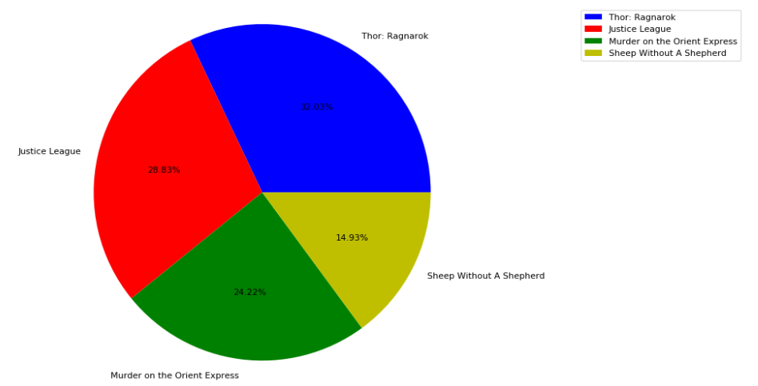

## Matplotlib
- **画二维图标的python库**  
1. `Canvas`（画板）：位于最底层，用户一般接触不到  
2. `Figure`（画布）：建立在`Canvas`之上  
3. `Axes`（绘图区）：建立在`Figure`之上  
4. `Axis`（坐标轴）、`Legend`（图例）等辅助显示层以及图像层建立在`Axes`之上  
    
```
import matplotlib.pyplot as plt
%matplotlib inline
  
plt.figure()
plt.plot([1, 0, 9], [4, 5, 6])
plt.show()
```  
  
- **折线图的绘制与显示**  
1.  
```
# 展现某城市一周的天气，比如从星期一到星期日的天气温度如下
# 1. 创建画布
plt.figure(figsize=(20, 8), dpi=80)

# 2. 绘制图像
plt.plot([1, 2, 3, 4, 5, 6, 7], [17, 17, 18, 15, 11, 11, 13])

# 保存图像
# plt.savefig("weather.png")

# 3. 显示图像
plt.show()
```  
  
2. 辅助显示层（注：这里没有处理中文乱码的问题）  
```
# 需求：画出某城市11点到12点1小时内每分钟的温度变化折线图，温度范围在15度到18度
#       再添加一个城市的温度变化，温度在1度3度
import random

# 1. 准备数据 x y
x = range(60)
y_city1 = [random.uniform(15, 18) for i in x]
y_city2 = [random.uniform(1,3) for i in x]

# 2. 创建画布
# figsize：画布大小
# dpi：dot per inch，图像的清晰度
plt.figure(figsize=(20, 8), dpi=80)

# 3. 绘制图像
plt.plot(x, y_city1, color="r", linestyle="-.", label="城市1")
plt.plot(x, y_city2, color="b", label="城市2")

# 显示图例
plt.legend()

# 修改x、y刻度
# 准备x的刻度说明
x_label = ["11点{}分".format(i) for i in x]
plt.xticks(x[::5], x_label[::5])
plt.yticks(range(0, 40, 5))

# 添加网格显示
plt.grid(True, linestyle="--", alpha=0.5)

# 添加描述信息
plt.xlabel("时间变化")
plt.ylabel("温度变化")
plt.title("城市1、城市2在11点到12点每分钟的温度变化状况")

# 4. 显示
plt.show()
```    
  
3. 多个坐标系显示（面向对象的画图方法）  
```
# 两个城市的温度分开显示

# 1. 准备数据 x y
x = range(60)
y_city1 = [random.uniform(15, 18) for i in x]
y_city2 = [random.uniform(1, 3) for i in x]

# 2. 创建画布
figure, axes = plt.subplots(nrows=1, ncols=2, figsize=(20, 8), dpi=80)

# 3. 绘制图像
axes[0].plot(x, y_city1, color="r", linestyle="-.", label="City1")
axes[1].plot(x, y_city2, color="b", label="City2")

# 显示图例
axes[0].legend()
axes[1].legend()

# 修改x、y刻度
# 准备x的刻度说明
x_label = ["{} past".format(i) for i in x]
axes[0].set_xticks(x[::5])
axes[0].set_xticklabels(x_label[::5])
axes[0].set_yticks(range(0, 40, 5))
axes[1].set_xticks(x[::5])
axes[1].set_xticklabels(x_label[::5])
axes[1].set_yticks(range(0, 40, 5))

# 添加网格显示
axes[0].grid(linestyle="--", alpha=0.5)
axes[1].grid(linestyle="--", alpha=0.5)

# 添加描述信息
axes[0].set_xlabel("Time")
axes[0].set_ylabel("Temperature")
axes[0].set_title("Temperature between 11 and 12")
axes[1].set_xlabel("Time")
axes[1].set_ylabel("Temperature")
axes[1].set_title("Temperature between 11 and 12")

# 显示
plt.show()
```  
  
4. 绘制函数图像  
```
import numpy as np

# 1. 准备x，y数据
x = np.linspace(-1, 1, 1000)
y = 2 * x * x

# 2. 创建画布
plt.figure(figsize=(20, 8), dpi=80)

# 3. 绘制图像
plt.plot(x, y)

# 添加网格显示
plt.grid(linestyle="--", alpha=0.5)

# 4. 显示图像
plt.show()
```  
  
- **散点图的绘制与显示**   
```
import random

# 1. 准备数据
x = [random.uniform(100, 200) for i in range(100)]
y = [random.uniform(100, 200) for i in range(100)]
# 2. 创建画布
plt.figure(figsize=(20, 8), dpi=100)

# 3. 绘制散点图
plt.scatter(x, y)

# 4. 显示图像
plt.show()
```  
  
- **柱状图的绘制与显示**  
1.  
```
# 1. 准备数据
movie_names = ['Thor: Ragnarok', 'Justice League', 'Murder on the Orient Express', 'Sheep Without A Shepherd']  
tickets = [73853, 57767, 22354, 8716]

# 2. 创建画布
plt.figure(figsize=(20, 8), dpi=80)

# 3. 绘制柱状图
x_ticks = range(len(movie_names))
plt.bar(x_ticks, tickets, color=['b', 'r', 'g', 'y'])

# 修改x刻度
plt.xticks(x_ticks, movie_names)

# 添加标题
plt.title("Box office")

# 添加网格显示
plt.grid(linestyle="--", alpha=0.5)

# 4. 显示图像
plt.show()
```  
  
2.  
```
# 1. 准备数据
movie_names = ['Thor: Ragnarok', 'Justice League', 'Murder on the Orient Express']

first_day = [10857, 10062, 1275]
first_weekend = [36224, 34479, 11830]

x = range(len(movie_names))

# 2. 创建画布
plt.figure(figsize=(20, 8), dpi=100)

# 3. 绘制柱状图
plt.bar(x, first_day, width=0.2, label="Opening day box office")
plt.bar([i+0.2 for i in x], first_weekend, width=0.2, label="Weekly box office")

# 显示图例
plt.legend()

# 修改x轴刻度显示
plt.xticks([i+0.1 for i in x], movie_names)

# 4. 显示图像
plt.show()
```  
  
- **直方图的绘制与显示**  
```
# 需求：电影时长分布状况
# 1. 准备数据
time = [131, 98, 125, 131, 124, 139, 131, 117, 128,108, 135, 138, 131, 102, 107, 114, 119, 124]

# 2. 创建画布
plt.figure(figsize=(20, 8), dpi=80)

# 3. 绘制直方图
distance = 2
group_num = int((max(time) - min(time)) / distance)
plt.hist(time, bins=group_num, density=True)

# 修改x轴刻度
plt.xticks(range(min(time), max(time) + 2, distance))

# 添加网格
plt.grid(linestyle="--", alpha=0.5)

# 4. 显示图像
plt.show()
```  
  
- **饼图的绘制与显示**  
```
# 1. 准备数据
movie_name = ['Thor: Ragnarok', 'Justice League', 'Murder on the Orient Express', 'Sheep Without A Shepherd']  
place_count = [60605, 54546, 45819, 28243]

# 2. 创建画布
plt.figure(figsize=(20, 8), dpi=80)

# 3. 绘制饼图
plt.pie(place_count, labels=movie_name, colors=['b', 'r', 'g', 'y'], autopct="%1.2f%%")

# 显示图例
plt.legend()

# 调整横轴纵轴比例
plt.axis('equal')

# 4. 显示图像 
plt.show()
```   

