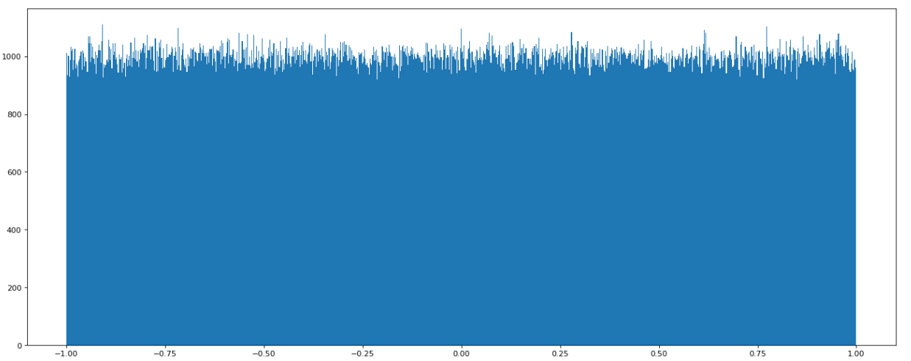
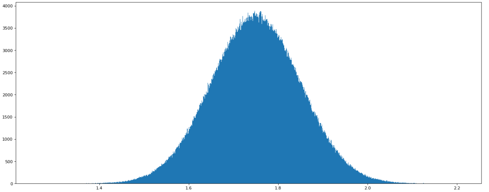

## Numpy
- **高效的运算工具**  
```
import numpy as np

score = np.array([[1, 2, 3, 4],
                 [5, 6, 7, 8]])

type(score) # numpy.ndarray
```  
- **ndarray与Python原生list运算效率对比**  

1. `ndarray`存储相同类型，通用性不强；`Python`的`list`可存储不同类型，通用性强  
2. `ndarray`支持向量化（并行化）运算  
```
import random
import time

# 生成一个大数组
python_list = []

for i in range(100000000):
    python_list.append(random.random())

ndarray_list = np.array(python_list)
len(ndarray_list)  # 100000000

# 原生pythonlist求和
t1 = time.time()
a = sum(python_list)
t2 = time.time()
d1 = t2 - t1

# ndarray求和
t3 = time.time()
b = np.sum(ndarray_list)
t4 = time.time()
d2 = t4 - t3

d1  # 0.5563862323760986
d2  # 0.17122745513916016
```
- **ndarray**  
1. 属性  
```
score.shape  # (2, 4)
score.ndim  # 2
score.size  # 8
score.dtype  # dtype('int32')
score.itemsize  # 4
```  
2. 形状
```
a = np.array([[1,2,3],[4,5,6]])
b = np.array([1,2,3,4])
c = np.array([[[1,2,3],[4,5,6]],[[1,2,3],[4,5,6]]])

a.shape  # (2, 3)
b.shape  # (4,)
c.shape  # (2, 2, 3)
```  
3. 类型  
```
data = np.array([1.1, 2.2, 3.3])

data.dtype  # dtype('float64')

# 创建数组的时候指定类型
np.array([1.1, 2.2, 3.3], dtype="float32")  # array([1.1, 2.2, 3.3], dtype=float32)

np.array([1.1, 2.2, 3.3], dtype=np.float32)  # array([1.1, 2.2, 3.3], dtype=float32)
```
4. 生成数组的方法  
```
# 生成全0的数组
np.zeros(shape=(3, 4), dtype="float32")

# 生成全1的数组
np.ones(shape=[2, 3], dtype=np.int32)

# 从现有数组生成
# np.array() 深拷贝
data1 = np.array(score)

# np.asarray() 浅拷贝
data2 = np.asarray(score)

# np.copy() 深拷贝
data3 = np.copy(score)

score[1, 1] = 1000

# 生成固定范围的数组
np.linspace(0, 10, 5)  # array([ 0. ,  2.5,  5. ,  7.5, 10. ])
np.arange(0, 10, 5)  # array([ 0,  5, 10])

# 生成随机数组
# 均匀分布
data1 = np.random.uniform(low=-1, high=1, size=1000000)

import matplotlib.pyplot as plt

# 1. 创建画布
plt.figure(figsize=(20, 8), dpi=80)

# 2. 绘制直方图
plt.hist(data1, 1000)

# 3. 显示图像
plt.show()

# 正态分布
data2 = np.random.normal(loc=1.75, scale=0.1, size=1000000)

# 1. 创建画布
plt.figure(figsize=(20, 8), dpi=80)

# 2. 绘制直方图
plt.hist(data2, 1000)

# 3. 显示图像
plt.show()
```  
  
  
5. 案例：随机生成8只股票2周的交易日涨幅数据  
```
stock_change = np.random.normal(loc=0, scale=1, size=(8, 10))

# 获取第一个股票的前3个交易日的涨跌幅数据
stock_change[0, :3]
```
6. 形状修改  
```
# 返回新的ndarray，原始数据没有改变
stock_change.reshape((10, 8))

# 没有返回值，对原始的ndarray进行了修改
stock_change.resize((10, 8))

# 转置
stock_change.T
```  
7. 类型修改  
```
stock_change.astype("int32")

c = np.array([1,2,3,4])
c.tostring()  # b'\x01\x00\x00\x00\x02\x00\x00\x00\x03\x00\x00\x00\x04\x00\x00\x00'
```  
8. 数组的去重
```
temp = np.array([[1,2,3,4],[3,4,5,6]])

np.unique(temp)  # array([1, 2, 3, 4, 5, 6])

temp.flatten()  # array([1, 2, 3, 4, 3, 4, 5, 6])

set(temp.flatten())  # {1, 2, 3, 4, 5, 6}
```  
9. 逻辑运算
```
stock_change = np.random.normal(loc=0, scale=1, size=(8, 10))
stock_change
'''
array([[ 1.30733538, -0.06969345,  1.00189604,  1.50736683,  0.56222421,
         0.30112432, -0.49827228, -0.61493628,  0.03010815,  0.14902767],
       [ 1.20010821,  0.83089414, -2.15981579,  0.68029085,  1.17694178,
        -0.43263882, -0.77328468, -0.96121294, -1.71803718, -1.33901869],
       [ 0.06829301,  0.61959446,  0.16560389, -1.84085443,  0.21302321,
         1.55478498,  1.12282039,  1.68685958, -0.43746782,  0.01970137],
       [ 2.21179052, -0.25768081, -0.5091288 , -1.33644633,  2.52756701,
        -1.17081225, -0.5014668 , -1.59071788,  0.94168531, -0.31124633],
       [ 1.39965904,  0.25204531, -0.2860908 , -1.26650929,  1.41920609,
        -1.47622364,  0.11571416, -0.43411683, -0.62465217, -1.47153829],
       [ 1.37692746,  0.0658293 ,  0.14858455, -0.48247065,  0.15131784,
         1.02875507, -0.74138676, -0.4928217 , -0.52533497,  1.38065942],
       [ 0.6014077 ,  0.92072824, -0.79696289, -0.44284016,  0.90564427,
        -0.14751333,  0.4064149 , -0.14025677,  1.72904881, -0.06063341],
       [-0.39016997, -1.07520642, -0.28718814, -1.43646239, -0.36953765,
         0.56104894,  0.65051168, -0.59575838, -0.51245004,  1.593463  ]])
'''

# 逻辑判断，如果涨跌幅大于0.5就标记为True，否则为Flase
stock_change > 0.5
'''
array([[ True, False,  True, False,  True,  True,  True, False, False,
        False],
       [False,  True,  True, False, False, False, False, False, False,
         True],
       [ True,  True,  True, False, False,  True,  True, False, False,
         True],
       [False, False,  True, False, False, False, False, False, False,
        False],
       [False, False, False, False, False, False, False, False, False,
         True],
       [ True, False,  True, False, False,  True, False, False, False,
        False],
       [False, False, False, False, False,  True, False, False, False,
        False],
       [False, False, False, False,  True, False, False,  True,  True,
        False]])
'''

stock_change[stock_change > 0.5]
'''
array([1.30733538, 1.00189604, 1.50736683, 0.56222421, 1.20010821,
       0.83089414, 0.68029085, 1.17694178, 0.61959446, 1.55478498,
       1.12282039, 1.68685958, 2.21179052, 2.52756701, 0.94168531,
       1.39965904, 1.41920609, 1.37692746, 1.02875507, 1.38065942,
       0.6014077 , 0.92072824, 0.90564427, 1.72904881, 0.56104894,
       0.65051168, 1.593463  ])
'''

stock_change[stock_change > 0.5] = 1.1
stock_change
'''
array([[ 1.1       , -0.06969345,  1.1       ,  1.1       ,  1.1       ,
         0.30112432, -0.49827228, -0.61493628,  0.03010815,  0.14902767],
       [ 1.1       ,  1.1       , -2.15981579,  1.1       ,  1.1       ,
        -0.43263882, -0.77328468, -0.96121294, -1.71803718, -1.33901869],
       [ 0.06829301,  1.1       ,  0.16560389, -1.84085443,  0.21302321,
         1.1       ,  1.1       ,  1.1       , -0.43746782,  0.01970137],
       [ 1.1       , -0.25768081, -0.5091288 , -1.33644633,  1.1       ,
        -1.17081225, -0.5014668 , -1.59071788,  1.1       , -0.31124633],
       [ 1.1       ,  0.25204531, -0.2860908 , -1.26650929,  1.1       ,
        -1.47622364,  0.11571416, -0.43411683, -0.62465217, -1.47153829],
       [ 1.1       ,  0.0658293 ,  0.14858455, -0.48247065,  0.15131784,
         1.1       , -0.74138676, -0.4928217 , -0.52533497,  1.1       ],
       [ 1.1       ,  1.1       , -0.79696289, -0.44284016,  1.1       ,
        -0.14751333,  0.4064149 , -0.14025677,  1.1       , -0.06063341],
       [-0.39016997, -1.07520642, -0.28718814, -1.43646239, -0.36953765,
         1.1       ,  1.1       , -0.59575838, -0.51245004,  1.1       ]])
'''

# 判断stock_change[0:2, 0:5]是否全是上涨的
stock_change[0:2, 0:5] > 0
'''
array([[ True, False,  True,  True,  True],
       [ True,  True, False,  True,  True]])
'''
np.all(stock_change[0:2, 0:5] > 0)  # False

# 判断前5只股票是否有上涨的
np.any(stock_change[:5, :] > 0)  # True
```  
10. 三元运算符  
```
# 判断前四只股票前四天的涨跌幅，大于0的置为1，否则为0
temp = stock_change[:4, :4]
temp
'''
array([[ 1.1       , -0.06969345,  1.1       ,  1.1       ],
       [ 1.1       ,  1.1       , -2.15981579,  1.1       ],
       [ 0.06829301,  1.1       ,  0.16560389, -1.84085443],
       [ 1.1       , -0.25768081, -0.5091288 , -1.33644633]])
'''

np.where(temp > 0, 1, 0)
'''
array([[1, 0, 1, 1],
       [1, 1, 0, 1],
       [1, 1, 1, 0],
       [1, 0, 0, 0]])
'''

# 逻辑运算
# 判断前四只股票前四天的涨跌幅 大于0.5并且小于1的，置为1，否则置为0
np.where(np.logical_and(temp > 0.5, temp < 1), 1, 0)
# 判断前四只股票前四天的涨跌幅 大于0.5或者小于-0.5的，置为1，否则为0
np.where(np.logical_or(temp > 0.5, temp < -0.5), 1, 0)

# 统计运算
stock_change = np.random.normal(loc=0, scale=1, size=(8, 10))
temp = stock_change[:4, :4]
temp
'''
array([[-1.56831846,  1.2019012 , -0.18007665, -1.81825136],
       [ 0.37843983, -0.40676585, -0.0910438 ,  1.0690277 ],
       [-0.76381945,  1.33174628,  0.62605773,  0.29980669],
       [ 1.5483996 ,  0.5424435 ,  0.7668949 , -1.55131984]])
'''
temp.max(axis=0)  # array([1.5483996 , 1.33174628, 0.7668949 , 1.0690277 ])

temp.max(axis=1)  # array([1.2019012 , 1.0690277 , 1.33174628, 1.5483996 ])

temp.max(axis=-1)  # array([1.2019012 , 1.0690277 , 1.33174628, 1.5483996 ])

# 返回最大数的索引
temp.argmax(axis=-1)  # array([1, 3, 1, 0], dtype=int64)
```  
11. 数组与数的运算  
```
arr = np.array([[1,2,3,2,1,4], [5,6,1,2,3,1]])
arr + 10
'''
array([[11, 12, 13, 12, 11, 14],
       [15, 16, 11, 12, 13, 11]])
'''

a = [1,2,3]
a * 3  # [1, 2, 3, 1, 2, 3, 1, 2, 3]
```  
12. 广播机制  
a. 维度相等  
b. `shape`（其中相对应的一个地方为1）
```
'''
例如：
Image（3d array）： 256 x 256 x 3
Scale（1d array）：             3
Result（3d array）：256 x 256 x 3

A     （4d array）: 9 x 1 x 7 x 1
B     （3d array）：    8 x 1 x 5
Result（4d array）：9 x 8 x 7 x 5

A     （2d array）：5 x 4
B     （1d array）：    1
Result（2d array）：5 x 4

A     （3d array）：15 x 3 x 5
B     （3d array）：15 x 1 x 1
Result（3d array）：15 x 3 x 5  
'''

arr1 = np.array([[1,2,3,2,1,4], [5,6,1,2,3,1]])  # (2, 6)
arr2 = np.array([[1], [3]])  # (2, 1)
arr1 + arr2
'''
array([[2, 3, 4, 3, 2, 5],
       [8, 9, 4, 5, 6, 4]])
'''

arr1 * arr2
'''
array([[ 1,  2,  3,  2,  1,  4],
       [15, 18,  3,  6,  9,  3]])
'''

'''
如果是下面这样，则不匹配：
A （1d array）：10
B （1d array）：12
A （2d array）：    2 x 1
B （3d array）：8 x 4 x 3
'''
```
