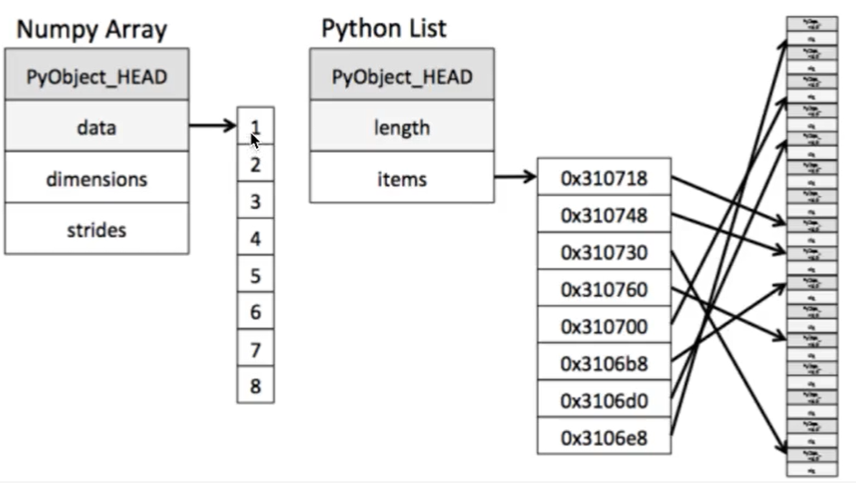

## Numpy
- **高效的运算工具**  
```
import numpy as np

score = np.array([[1, 2, 3, 4],
                 [5, 6, 7, 8]])

type(score) # numpy.ndarray
```  
- **ndarray与Python原生list运算效率对比**  

1. `ndarray`存储相同类型，通用性不强；`Python`的`list`可存储不同类型，通用性强  
2. `ndarray`支持向量化（并行化）运算  
```
import random
import time

# 生成一个大数组
python_list = []

for i in range(100000000):
    python_list.append(random.random())

ndarray_list = np.array(python_list)
len(ndarray_list)  # 100000000

# 原生pythonlist求和
t1 = time.time()
a = sum(python_list)
t2 = time.time()
d1 = t2 - t1

# ndarray求和
t3 = time.time()
b = np.sum(ndarray_list)
t4 = time.time()
d2 = t4 - t3

d1  # 0.5563862323760986
d2  # 0.17122745513916016
```
- **ndarray**  
1. 属性  
```
score.shape  # (2, 4)
score.ndim  # 2
score.size  # 8
score.dtype  # dtype('int32')
score.itemsize  # 4
```  
2. 形状
```
a = np.array([[1,2,3],[4,5,6]])
b = np.array([1,2,3,4])
c = np.array([[[1,2,3],[4,5,6]],[[1,2,3],[4,5,6]]])

a.shape  # (2, 3)
b.shape  # (4,)
c.shape  # (2, 2, 3)
```  
3. 类型  
```
data = np.array([1.1, 2.2, 3.3])

data.dtype  # dtype('float64')

# 创建数组的时候指定类型
np.array([1.1, 2.2, 3.3], dtype="float32")  # array([1.1, 2.2, 3.3], dtype=float32)

np.array([1.1, 2.2, 3.3], dtype=np.float32)  array([1.1, 2.2, 3.3], dtype=float32)
```
