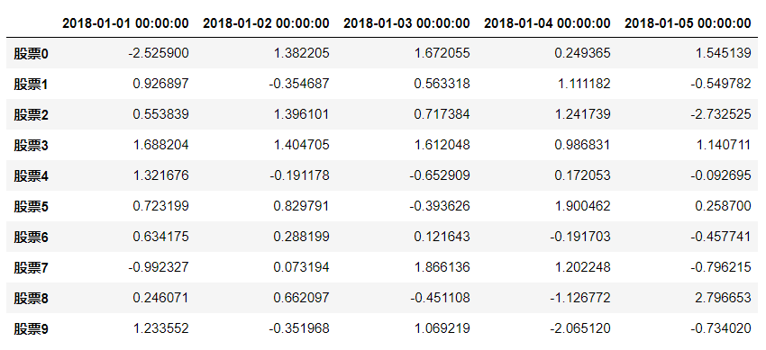

## Pandas
- **数据处理工具**  
```
import numpy as np
# 创建一个符合正态分布的10只股票5天的涨跌幅数据
stock_change = np.random.normal(0, 1, (10, 5))
stock_change
'''
array([[-2.52590018,  1.38220494,  1.67205481,  0.2493653 ,  1.54513908],
       [ 0.926897  , -0.35468718,  0.56331848,  1.11118169, -0.54978151],
       [ 0.55383924,  1.39610056,  0.71738402,  1.24173872, -2.7325251 ],
       [ 1.68820373,  1.40470513,  1.61204834,  0.98683092,  1.14071072],
       [ 1.3216761 , -0.19117825, -0.65290903,  0.17205286, -0.09269546],
       [ 0.72319913,  0.82979121, -0.39362596,  1.90046188,  0.25870008],
       [ 0.63417504,  0.2881991 ,  0.12164292, -0.19170283, -0.45774139],
       [-0.99232697,  0.07319375,  1.86613629,  1.20224782, -0.79621493],
       [ 0.24607146,  0.66209706, -0.45110828, -1.12677247,  2.79665304],
       [ 1.23355207, -0.35196812,  1.06921885, -2.06512031, -0.73402009]])
'''

import pandas as pd
pd.DataFrame(stock_change)

# 添加行索引
stock = ["股票{}".format(i) for i in range(10)]

# 添加列索引
date = pd.date_range(start="20180101", periods=5, freq="B")
date
'''
DatetimeIndex(['2018-01-01', '2018-01-02', '2018-01-03', '2018-01-04',
               '2018-01-05'],
              dtype='datetime64[ns]', freq='B')
'''

data = pd.DataFrame(stock_change, index=stock, columns=date)
data
```

- **DataFrame**
```
data.shape  # (10, 5)

data.values
'''
array([[-2.52590018,  1.38220494,  1.67205481,  0.2493653 ,  1.54513908],
       [ 0.926897  , -0.35468718,  0.56331848,  1.11118169, -0.54978151],
       [ 0.55383924,  1.39610056,  0.71738402,  1.24173872, -2.7325251 ],
       [ 1.68820373,  1.40470513,  1.61204834,  0.98683092,  1.14071072],
       [ 1.3216761 , -0.19117825, -0.65290903,  0.17205286, -0.09269546],
       [ 0.72319913,  0.82979121, -0.39362596,  1.90046188,  0.25870008],
       [ 0.63417504,  0.2881991 ,  0.12164292, -0.19170283, -0.45774139],
       [-0.99232697,  0.07319375,  1.86613629,  1.20224782, -0.79621493],
       [ 0.24607146,  0.66209706, -0.45110828, -1.12677247,  2.79665304],
       [ 1.23355207, -0.35196812,  1.06921885, -2.06512031, -0.73402009]])
'''

data.T
'''
            股票0	股票1	股票2	股票3	股票4	股票5	股票6	股票7	股票8	股票9
2018-01-01	-2.525900	0.926897	0.553839	1.688204	1.321676	0.723199	0.634175	-0.992327	0.246071	1.233552
2018-01-02	1.382205	-0.354687	1.396101	1.404705	-0.191178	0.829791	0.288199	0.073194	0.662097	-0.351968
2018-01-03	1.672055	0.563318	0.717384	1.612048	-0.652909	-0.393626	0.121643	1.866136	-0.451108	1.069219
2018-01-04	0.249365	1.111182	1.241739	0.986831	0.172053	1.900462	-0.191703	1.202248	-1.126772	-2.065120
2018-01-05	1.545139	-0.549782	-2.732525	1.140711	-0.092695	0.258700	-0.457741	-0.796215	2.796653	-0.734020
'''

data.head()  # 默认前5条记录

data.tail()  # 默认后5条记录

# data.index[2] = "股票88" 不能单独修改索引

stock_ = ["股票_{}".format(i) for i in range(10)]
data.index = stock_
data
'''

       2018-01-01 00:00:00	2018-01-02 00:00:00	2018-01-03 00:00:00	2018-01-04 00:00:00	2018-01-05 00:00:00
股票_0	-2.525900	1.382205	1.672055	0.249365	1.545139
股票_1	0.926897	-0.354687	0.563318	1.111182	-0.549782
股票_2	0.553839	1.396101	0.717384	1.241739	-2.732525
股票_3	1.688204	1.404705	1.612048	0.986831	1.140711
股票_4	1.321676	-0.191178	-0.652909	0.172053	-0.092695
股票_5	0.723199	0.829791	-0.393626	1.900462	0.258700
股票_6	0.634175	0.288199	0.121643	-0.191703	-0.457741
股票_7	-0.992327	0.073194	1.866136	1.202248	-0.796215
股票_8	0.246071	0.662097	-0.451108	-1.126772	2.796653
股票_9	1.233552	-0.351968	1.069219	-2.065120	-0.734020
'''
# 重设索引
data.reset_index()
'''

       index	2018-01-01 00:00:00	2018-01-02 00:00:00	2018-01-03 00:00:00	2018-01-04 00:00:00	2018-01-05 00:00:00
0	股票_0	-2.525900	1.382205	1.672055	0.249365	1.545139
1	股票_1	0.926897	-0.354687	0.563318	1.111182	-0.549782
2	股票_2	0.553839	1.396101	0.717384	1.241739	-2.732525
3	股票_3	1.688204	1.404705	1.612048	0.986831	1.140711
4	股票_4	1.321676	-0.191178	-0.652909	0.172053	-0.092695
5	股票_5	0.723199	0.829791	-0.393626	1.900462	0.258700
6	股票_6	0.634175	0.288199	0.121643	-0.191703	-0.457741
7	股票_7	-0.992327	0.073194	1.866136	1.202248	-0.796215
8	股票_8	0.246071	0.662097	-0.451108	-1.126772	2.796653
9	股票_9	1.233552	-0.351968	1.069219	-2.065120	-0.734020
'''

data.reset_index().shape  # (10, 6)

data.reset_index(drop=True).head()
'''

       2018-01-01 00:00:00	2018-01-02 00:00:00	2018-01-03 00:00:00	2018-01-04 00:00:00	2018-01-05 00:00:00
0	-2.525900	1.382205	1.672055	0.249365	1.545139
1	0.926897	-0.354687	0.563318	1.111182	-0.549782
2	0.553839	1.396101	0.717384	1.241739	-2.732525
3	1.688204	1.404705	1.612048	0.986831	1.140711
4	1.321676	-0.191178	-0.652909	0.172053	-0.092695

data.reset_index(drop=True).shape  # (10, 5)
'''

# 设置新索引
df = pd.DataFrame({'month': [1, 4, 7, 10],
                   'year': [2012, 2014, 2013, 2014],
                   'sale': [55, 40, 84, 31]})
                   
df
'''

       month	sale	year
0	1	55	2012
1	4	40	2014
2	7	84	2013
3	10	31	2014
'''

# 以月份设置新的索引
df.set_index("month")
'''
       sale	year
month		
1	55	2012
4	40	2014
7	84	2013
10	31	2014
'''

#  设置多个索引，以年和月份
new_df = df.set_index(["year", "month"])
new_df
'''
		sale
year	month	
2012	1	55
2014	4	40
2013	7	84
2014	10	31
'''

new_df.index
'''
MultiIndex(levels=[[2012, 2013, 2014], [1, 4, 7, 10]],
           labels=[[0, 2, 1, 2], [0, 1, 2, 3]],
           names=['year', 'month'])
'''
```
- **Panel**   
注：`Pandas`从版本`0.20.0`开始弃用，推荐的用于标识`3D`数据的方法是`DataFrame`上的`MultiIndex`方法  
```
p = pd.Panel(np.arange(24).reshape(4,3,2),
            items=list('ABCD'),
            major_axis=pd.date_range('20130101', periods=3),
            minor_axis=['first','second'])
            
p
'''
<class 'pandas.core.panel.Panel'>
Dimensions: 4 (items) x 3 (major_axis) x 2 (minor_axis)
Items axis: A to D
Major_axis axis: 2013-01-01 00:00:00 to 2013-01-03 00:00:00
Minor_axis axis: first to second
'''

p["A"]
'''

              first	second
2013-01-01	0	1
2013-01-02	2	3
2013-01-03	4	5
'''

p["D"]
'''

              first	second
2013-01-01	18	19
2013-01-02	20	21
2013-01-03	22	23
'''

p.major_xs("2013-01-01")
'''
	A	B	C	D
first	0	6	12	18
second	1	7	13	19
'''

p.minor_xs("first")
'''

              A	B	C	D
2013-01-01	0	6	12	18
2013-01-02	2	8	14	20
2013-01-03	4	10	16	22
'''
```
