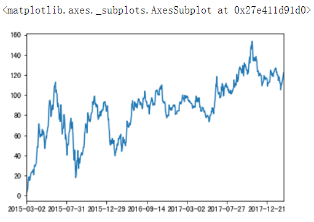
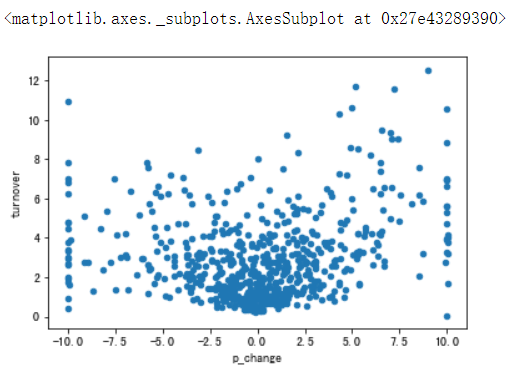
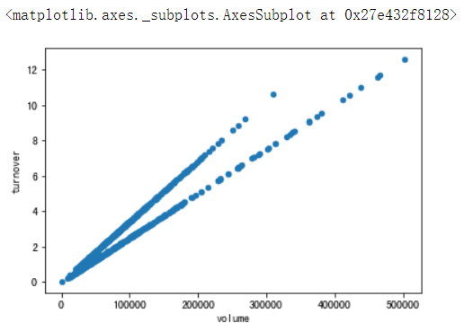
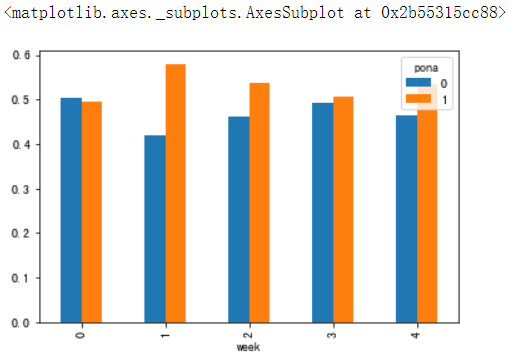
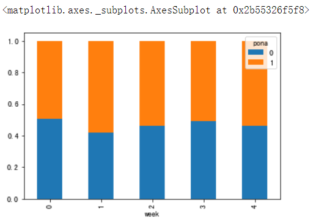
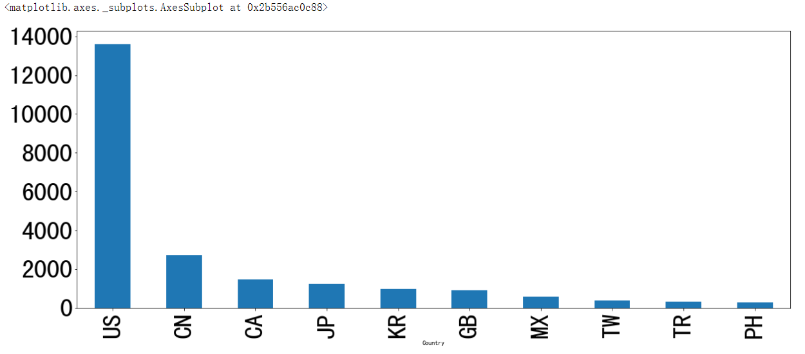
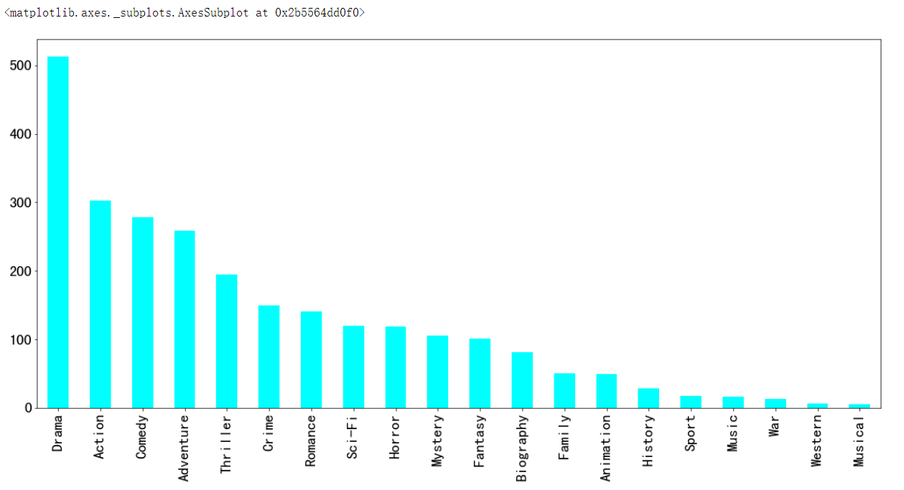

## Pandas
- **数据处理工具**  
```
import numpy as np
# 创建一个符合正态分布的10只股票5天的涨跌幅数据
stock_change = np.random.normal(0, 1, (10, 5))
stock_change
'''
array([[-2.52590018,  1.38220494,  1.67205481,  0.2493653 ,  1.54513908],
       [ 0.926897  , -0.35468718,  0.56331848,  1.11118169, -0.54978151],
       [ 0.55383924,  1.39610056,  0.71738402,  1.24173872, -2.7325251 ],
       [ 1.68820373,  1.40470513,  1.61204834,  0.98683092,  1.14071072],
       [ 1.3216761 , -0.19117825, -0.65290903,  0.17205286, -0.09269546],
       [ 0.72319913,  0.82979121, -0.39362596,  1.90046188,  0.25870008],
       [ 0.63417504,  0.2881991 ,  0.12164292, -0.19170283, -0.45774139],
       [-0.99232697,  0.07319375,  1.86613629,  1.20224782, -0.79621493],
       [ 0.24607146,  0.66209706, -0.45110828, -1.12677247,  2.79665304],
       [ 1.23355207, -0.35196812,  1.06921885, -2.06512031, -0.73402009]])
'''

import pandas as pd
pd.DataFrame(stock_change)

# 添加行索引
stock = ["股票{}".format(i) for i in range(10)]

# 添加列索引
date = pd.date_range(start="20180101", periods=5, freq="B")
date
'''
DatetimeIndex(['2018-01-01', '2018-01-02', '2018-01-03', '2018-01-04',
               '2018-01-05'],
              dtype='datetime64[ns]', freq='B')
'''

data = pd.DataFrame(stock_change, index=stock, columns=date)
data
```

- **DataFrame**
```
data.shape  # (10, 5)

data.values
'''
array([[-2.52590018,  1.38220494,  1.67205481,  0.2493653 ,  1.54513908],
       [ 0.926897  , -0.35468718,  0.56331848,  1.11118169, -0.54978151],
       [ 0.55383924,  1.39610056,  0.71738402,  1.24173872, -2.7325251 ],
       [ 1.68820373,  1.40470513,  1.61204834,  0.98683092,  1.14071072],
       [ 1.3216761 , -0.19117825, -0.65290903,  0.17205286, -0.09269546],
       [ 0.72319913,  0.82979121, -0.39362596,  1.90046188,  0.25870008],
       [ 0.63417504,  0.2881991 ,  0.12164292, -0.19170283, -0.45774139],
       [-0.99232697,  0.07319375,  1.86613629,  1.20224782, -0.79621493],
       [ 0.24607146,  0.66209706, -0.45110828, -1.12677247,  2.79665304],
       [ 1.23355207, -0.35196812,  1.06921885, -2.06512031, -0.73402009]])
'''

data.T
'''
            股票0	股票1	股票2	股票3	股票4	股票5	股票6	股票7	股票8	股票9
2018-01-01	-2.525900	0.926897	0.553839	1.688204	1.321676	0.723199	0.634175	-0.992327	0.246071	1.233552
2018-01-02	1.382205	-0.354687	1.396101	1.404705	-0.191178	0.829791	0.288199	0.073194	0.662097	-0.351968
2018-01-03	1.672055	0.563318	0.717384	1.612048	-0.652909	-0.393626	0.121643	1.866136	-0.451108	1.069219
2018-01-04	0.249365	1.111182	1.241739	0.986831	0.172053	1.900462	-0.191703	1.202248	-1.126772	-2.065120
2018-01-05	1.545139	-0.549782	-2.732525	1.140711	-0.092695	0.258700	-0.457741	-0.796215	2.796653	-0.734020
'''

data.head()  # 默认前5条记录

data.tail()  # 默认后5条记录

# data.index[2] = "股票88" 不能单独修改索引

stock_ = ["股票_{}".format(i) for i in range(10)]
data.index = stock_
data
'''

       2018-01-01 00:00:00	2018-01-02 00:00:00	2018-01-03 00:00:00	2018-01-04 00:00:00	2018-01-05 00:00:00
股票_0	-2.525900	1.382205	1.672055	0.249365	1.545139
股票_1	0.926897	-0.354687	0.563318	1.111182	-0.549782
股票_2	0.553839	1.396101	0.717384	1.241739	-2.732525
股票_3	1.688204	1.404705	1.612048	0.986831	1.140711
股票_4	1.321676	-0.191178	-0.652909	0.172053	-0.092695
股票_5	0.723199	0.829791	-0.393626	1.900462	0.258700
股票_6	0.634175	0.288199	0.121643	-0.191703	-0.457741
股票_7	-0.992327	0.073194	1.866136	1.202248	-0.796215
股票_8	0.246071	0.662097	-0.451108	-1.126772	2.796653
股票_9	1.233552	-0.351968	1.069219	-2.065120	-0.734020
'''
# 重设索引
data.reset_index()
'''

       index	2018-01-01 00:00:00	2018-01-02 00:00:00	2018-01-03 00:00:00	2018-01-04 00:00:00	2018-01-05 00:00:00
0	股票_0	-2.525900	1.382205	1.672055	0.249365	1.545139
1	股票_1	0.926897	-0.354687	0.563318	1.111182	-0.549782
2	股票_2	0.553839	1.396101	0.717384	1.241739	-2.732525
3	股票_3	1.688204	1.404705	1.612048	0.986831	1.140711
4	股票_4	1.321676	-0.191178	-0.652909	0.172053	-0.092695
5	股票_5	0.723199	0.829791	-0.393626	1.900462	0.258700
6	股票_6	0.634175	0.288199	0.121643	-0.191703	-0.457741
7	股票_7	-0.992327	0.073194	1.866136	1.202248	-0.796215
8	股票_8	0.246071	0.662097	-0.451108	-1.126772	2.796653
9	股票_9	1.233552	-0.351968	1.069219	-2.065120	-0.734020
'''

data.reset_index().shape  # (10, 6)

data.reset_index(drop=True).head()
'''

       2018-01-01 00:00:00	2018-01-02 00:00:00	2018-01-03 00:00:00	2018-01-04 00:00:00	2018-01-05 00:00:00
0	-2.525900	1.382205	1.672055	0.249365	1.545139
1	0.926897	-0.354687	0.563318	1.111182	-0.549782
2	0.553839	1.396101	0.717384	1.241739	-2.732525
3	1.688204	1.404705	1.612048	0.986831	1.140711
4	1.321676	-0.191178	-0.652909	0.172053	-0.092695

data.reset_index(drop=True).shape  # (10, 5)
'''

# 设置新索引
df = pd.DataFrame({'month': [1, 4, 7, 10],
                   'year': [2012, 2014, 2013, 2014],
                   'sale': [55, 40, 84, 31]})
                   
df
'''

       month	sale	year
0	1	55	2012
1	4	40	2014
2	7	84	2013
3	10	31	2014
'''

# 以月份设置新的索引
df.set_index("month")
'''
       sale	year
month		
1	55	2012
4	40	2014
7	84	2013
10	31	2014
'''

#  设置多个索引，以年和月份
new_df = df.set_index(["year", "month"])
new_df
'''
		sale
year	month	
2012	1	55
2014	4	40
2013	7	84
2014	10	31
'''

new_df.index
'''
MultiIndex(levels=[[2012, 2013, 2014], [1, 4, 7, 10]],
           labels=[[0, 2, 1, 2], [0, 1, 2, 3]],
           names=['year', 'month'])
'''
```
- **Panel**   
注：`Pandas`从版本`0.20.0`开始弃用，推荐的用于标识`3D`数据的方法是`DataFrame`上的`MultiIndex`方法  
```
p = pd.Panel(np.arange(24).reshape(4,3,2),
            items=list('ABCD'),
            major_axis=pd.date_range('20130101', periods=3),
            minor_axis=['first','second'])
            
p
'''
<class 'pandas.core.panel.Panel'>
Dimensions: 4 (items) x 3 (major_axis) x 2 (minor_axis)
Items axis: A to D
Major_axis axis: 2013-01-01 00:00:00 to 2013-01-03 00:00:00
Minor_axis axis: first to second
'''

p["A"]
'''

              first	second
2013-01-01	0	1
2013-01-02	2	3
2013-01-03	4	5
'''

p["D"]
'''

              first	second
2013-01-01	18	19
2013-01-02	20	21
2013-01-03	22	23
'''

p.major_xs("2013-01-01")
'''
	A	B	C	D
first	0	6	12	18
second	1	7	13	19
'''

p.minor_xs("first")
'''

               A	B	C	D
2013-01-01	0	6	12	18
2013-01-02	2	8	14	20
2013-01-03	4	10	16	22
'''

data.head()
'''

	2018-01-01 00:00:00	2018-01-02 00:00:00	2018-01-03 00:00:00	2018-01-04 00:00:00	2018-01-05 00:00:00
股票_0	-2.525900	1.382205	1.672055	0.249365	1.545139
股票_1	0.926897	-0.354687	0.563318	1.111182	-0.549782
股票_2	0.553839	1.396101	0.717384	1.241739	-2.732525
股票_3	1.688204	1.404705	1.612048	0.986831	1.140711
股票_4	1.321676	-0.191178	-0.652909	0.172053	-0.092695
'''

data.iloc[1, :]
'''
2018-01-01    0.926897
2018-01-02   -0.354687
2018-01-03    0.563318
2018-01-04    1.111182
2018-01-05   -0.549782
Freq: B, Name: 股票_1, dtype: float64
'''

data.iloc[1, :].index
'''
DatetimeIndex(['2018-01-01', '2018-01-02', '2018-01-03', '2018-01-04',
               '2018-01-05'],
              dtype='datetime64[ns]', freq='B')
'''
```  
- **Series**    
`Series`为带索引的一维数组，`DataFrame`是`Series`的容器，`Panel`是`DataFrame`的容器  
```
sr = data.iloc[1, :]
sr
'''
2018-01-01    0.926897
2018-01-02   -0.354687
2018-01-03    0.563318
2018-01-04    1.111182
2018-01-05   -0.549782
Freq: B, Name: 股票_1, dtype: float64
'''

sr.index
'''
DatetimeIndex(['2018-01-01', '2018-01-02', '2018-01-03', '2018-01-04',
               '2018-01-05'],
              dtype='datetime64[ns]', freq='B')
'''

sr.values
'''
array([ 0.926897  , -0.35468718,  0.56331848,  1.11118169, -0.54978151])
'''

type(sr.values)  # numpy.ndarray

pd.Series(np.arange(3, 9, 2))
'''
0    3
1    5
2    7
dtype: int32
'''

pd.Series(np.arange(3, 9, 2), index=["a", "b", "c"])
'''
a    3
b    5
c    7
dtype: int32
'''

pd.Series({'red':100, 'blue':200, 'green':500, 'yellow':1000})
'''
blue       200
green      500
red        100
yellow    1000
dtype: int64
'''
```  
- **基本数据操作**  
```
data = pd.read_csv("./pandas_demo/stock_day.csv")
data.head()
'''

	open	high	close	low	volume	price_change	p_change	ma5	ma10	ma20	v_ma5	v_ma10	v_ma20	turnover
2018-02-27	23.53	25.88	24.16	23.53	95578.03	0.63	2.68	22.942	22.142	22.875	53782.64	46738.65	55576.11	2.39
2018-02-26	22.80	23.78	23.53	22.80	60985.11	0.69	3.02	22.406	21.955	22.942	40827.52	42736.34	56007.50	1.53
2018-02-23	22.88	23.37	22.82	22.71	52914.01	0.54	2.42	21.938	21.929	23.022	35119.58	41871.97	56372.85	1.32
2018-02-22	22.25	22.76	22.28	22.02	36105.01	0.36	1.64	21.446	21.909	23.137	35397.58	39904.78	60149.60	0.90
2018-02-14	21.49	21.99	21.92	21.48	23331.04	0.44	2.05	21.366	21.923	23.253	33590.21	42935.74	61716.11	
'''

data = data.drop(["ma5","ma10","ma20","v_ma5","v_ma10","v_ma20"], axis=1)
data.head()
'''
		open	high	close	low	volume	price_change	p_change	turnover
2018-02-27	23.53	25.88	24.16	23.53	95578.03	0.63	2.68	2.39
2018-02-26	22.80	23.78	23.53	22.80	60985.11	0.69	3.02	1.53
2018-02-23	22.88	23.37	22.82	22.71	52914.01	0.54	2.42	1.32
2018-02-22	22.25	22.76	22.28	22.02	36105.01	0.36	1.64	0.90
2018-02-14	21.49	21.99	21.92	21.48	23331.04	0.44	2.05	0.58
'''

# data[1, 0]  不能直接进行数字索引
data["open"]["2018-02-26"]  # 22.8
# data["2018-02-26"]["open"]  必须先列后行
data.loc["2018-02-26", "open"]  # 22.8
data.iloc[1, 0]  # 22.8

# 获取行第1天到4天，['open', 'close', 'high', 'low']这四个指标的结果
data.ix[:4, ['open','close','high','low']]
'''
		open	close	high	low
2018-02-27	23.53	24.16	25.88	23.53
2018-02-26	22.80	23.53	23.78	22.80
2018-02-23	22.88	22.82	23.37	22.71
2018-02-22	22.25	22.28	22.76	22.02
'''

# 使用ix进行下标和名称组合做索引
data.ix[0:4,['open','close','high','low']]

# 建议使用loc和iloc获取的方式
data.loc[data.index[0:4],['open','close','high','low']]
data.iloc[0:4,data.columns.get_indexer(['open','close','high','low'])]
```  
- **赋值操作**  
```
data.open = 100
data.head()
'''

		open	high	close	low	volume	price_change	p_change	turnover
2018-02-27	100	25.88	24.16	23.53	95578.03	0.63	2.68	2.39
2018-02-26	100	23.78	23.53	22.80	60985.11	0.69	3.02	1.53
2018-02-23	100	23.37	22.82	22.71	52914.01	0.54	2.42	1.32
2018-02-22	100	22.76	22.28	22.02	36105.01	0.36	1.64	0.90
2018-02-14	100	21.99	21.92	21.48	23331.04	0.44	2.05	0.58
'''

data.iloc[1, 0] = 222
data.head(3)
'''

		open	high	close	low	volume	price_change	p_change	turnover
2018-02-27	100	25.88	24.16	23.53	95578.03	0.63	2.68	2.39
2018-02-26	222	23.78	23.53	22.80	60985.11	0.69	3.02	1.53
2018-02-23	100	23.37	22.82	22.71	52914.01	0.54	2.42	1.32
'''
```  
- **排序**  
```
data.sort_values(by="high").head()
'''
		open	high	close	low	volume	price_change	p_change	turnover
2015-03-02	100	12.67	12.52	12.20	96291.73	0.32	2.62	3.30
2015-03-04	100	12.92	12.90	12.61	67075.44	0.20	1.57	2.30
2015-03-03	100	13.06	12.70	12.52	139071.61	0.18	1.44	4.76
2015-09-07	100	13.38	12.77	12.63	52490.04	0.37	2.98	1.80
2015-03-05	100	13.45	13.16	12.87	93180.39	0.26	2.02	3.19
'''

data.sort_values(by="high", ascending=False).head()
'''
		open	high	close	low	volume	price_change	p_change	turnover
2015-06-10	100	36.35	33.85	32.23	269033.12	0.51	1.53	9.21
2015-06-12	100	35.98	35.21	34.01	159825.88	0.82	2.38	5.47
2017-10-31	100	35.22	34.44	32.20	361660.88	2.38	7.42	9.05
2015-06-15	100	34.99	31.69	31.69	199369.53	-3.52	-10.00	6.82
2015-06-11	100	34.98	34.39	32.51	173075.73	0.54	1.59	5.92
'''

data.sort_values(by=["high", "p_change"], ascending=False).head()

data.sort_index().head()
'''
		open	high	close	low	volume	price_change	p_change	turnover
2015-03-02	100	12.67	12.52	12.20	96291.73	0.32	2.62	3.30
2015-03-03	100	13.06	12.70	12.52	139071.61	0.18	1.44	4.76
2015-03-04	100	12.92	12.90	12.61	67075.44	0.20	1.57	2.30
2015-03-05	100	13.45	13.16	12.87	93180.39	0.26	2.02	3.19
2015-03-06	100	14.48	14.28	13.13	179831.72	1.12	8.51	6.16
'''

sr = data["price_change"]
sr.sort_values(ascending=False)
'''
2015-06-09    3.03
2017-10-26    2.68
2015-05-21    2.57
2017-10-31    2.38
2017-06-22    2.36
Name: price_change, dtype: float64
'''

sr.sort_index().head()
'''
2015-03-02    0.32
2015-03-03    0.18
2015-03-04    0.20
2015-03-05    0.26
2015-03-06    1.12
Name: price_change, dtype: float64
'''
```  
- **算术运算**  
```
data["open"] + 3

data["open"].add(3).head()
'''
2018-02-27    103
2018-02-26    225
2018-02-23    103
2018-02-22    103
2018-02-14    103
Name: open, dtype: int64
'''

(data-10).head()
'''
	open	high	close	low	volume	price_change	p_change	turnover
2018-02-27	90	15.88	14.16	13.53	95568.03	-9.37	-7.32	-7.61
2018-02-26	212	13.78	13.53	12.80	60975.11	-9.31	-6.98	-8.47
2018-02-23	90	13.37	12.82	12.71	52904.01	-9.46	-7.58	-8.68
2018-02-22	90	12.76	12.28	12.02	36095.01	-9.64	-8.36	-9.10
2018-02-14	90	11.99	11.92	11.48	23321.04	-9.56	-7.95	-9.42
'''

data.sub(100).head()

data["close"].sub(data["open"]).head()
'''
2018-02-27    -75.84
2018-02-26   -198.47
2018-02-23    -77.18
2018-02-22    -77.72
2018-02-14    -78.08
dtype: float64
'''
```
- **逻辑运算**  
```
# 筛选p_change > 2的日期数据
(data["p_change"] > 2).head()
'''
2018-02-27     True
2018-02-26     True
2018-02-23     True
2018-02-22    False
2018-02-14     True
Name: p_change, dtype: bool
'''

data[data["p_change"] > 2]
'''
	open	high	close	low	volume	price_change	p_change	turnover
2018-02-27	100	25.88	24.16	23.53	95578.03	0.63	2.68	2.39
2018-02-26	222	23.78	23.53	22.80	60985.11	0.69	3.02	1.53
2018-02-23	100	23.37	22.82	22.71	52914.01	0.54	2.42	1.32
2018-02-14	100	21.99	21.92	21.48	23331.04	0.44	2.05	0.58
2018-02-12	100	21.40	21.19	20.63	32445.39	0.82	4.03	0.81
'''

# 完成一个多个逻辑判断，筛选p_change > 2并且low > 15
data[(data["p_change"] > 2) & (data["low"] > 15)].head()
'''
	open	high	close	low	volume	price_change	p_change	turnover
2018-02-27	100	25.88	24.16	23.53	95578.03	0.63	2.68	2.39
2018-02-26	222	23.78	23.53	22.80	60985.11	0.69	3.02	1.53
2018-02-23	100	23.37	22.82	22.71	52914.01	0.54	2.42	1.32
2018-02-14	100	21.99	21.92	21.48	23331.04	0.44	2.05	0.58
2018-02-12	100	21.40	21.19	20.63	32445.39	0.82	4.03	0.81
'''

data.query("p_change > 2 & low > 15").head()
'''

		open	high	close	low	volume	price_change	p_change	turnover
2018-02-27	100	25.88	24.16	23.53	95578.03	0.63	2.68	2.39
2018-02-26	222	23.78	23.53	22.80	60985.11	0.69	3.02	1.53
2018-02-23	100	23.37	22.82	22.71	52914.01	0.54	2.42	1.32
2018-02-14	100	21.99	21.92	21.48	23331.04	0.44	2.05	0.58
2018-02-12	100	21.40	21.19	20.63	32445.39	0.82	4.03	0.81
'''

# 判断'turnover'是否为4.19, 2.39
data["turnover"].isin([4.19, 2.39]).head()
'''
2018-02-27     True
2018-02-26    False
2018-02-23    False
2018-02-22    False
2018-02-14    False
Name: turnover, dtype: bool
'''

data[data["turnover"].isin([4.19, 2.39])].head()
'''
	open	high	close	low	volume	price_change	p_change	turnover
2018-02-27	100	25.88	24.16	23.53	95578.03	0.63	2.68	2.39
2017-07-25	100	24.20	23.70	22.64	167489.48	0.67	2.91	4.19
2016-09-28	100	20.98	20.86	19.71	95580.75	0.98	4.93	2.39
2015-04-07	100	17.98	17.54	16.50	122471.85	0.88	5.28	4.19
'''
```  
- **统计运算**  
```
data.describe()
'''
	open	high	close	low	volume	price_change	p_change	turnover
count	643.000000	643.000000	643.000000	643.000000	643.000000	643.000000	643.000000	643.000000
mean	100.189736	21.900513	21.336267	20.771835	99905.519114	0.018802	0.190280	2.936190
std	4.811210	4.077578	3.942806	3.791968	73879.119354	0.898476	4.079698	2.079375
min	100.000000	12.670000	12.360000	12.200000	1158.120000	-3.520000	-10.030000	0.040000
25%	100.000000	19.500000	19.045000	18.525000	48533.210000	-0.390000	-1.850000	1.360000
50%	100.000000	21.970000	21.450000	20.980000	83175.930000	0.050000	0.260000	2.500000
75%	100.000000	24.065000	23.415000	22.850000	127580.055000	0.455000	2.305000	3.915000
max	222.000000	36.350000	35.210000	34.010000	501915.410000	3.030000	10.030000	12.560000
'''

data.max()
'''
open               222.00
high                36.35
close               35.21
low                 34.01
volume          501915.41
price_change         3.03
p_change            10.03
turnover            12.56
dtype: float64
'''

data.max(axis=1).head()
'''
2018-02-27    95578.03
2018-02-26    60985.11
2018-02-23    52914.01
2018-02-22    36105.01
2018-02-14    23331.04
dtype: float64
'''

data.idxmax()
'''
open            2018-02-26
high            2015-06-10
close           2015-06-12
low             2015-06-12
volume          2017-10-26
price_change    2015-06-09
p_change        2015-08-28
turnover        2017-10-26
dtype: object
'''

# 累计统计函数
data["p_change"].cumsum().head()
'''
2018-02-27     2.68
2018-02-26     5.70
2018-02-23     8.12
2018-02-22     9.76
2018-02-14    11.81
Name: p_change, dtype: float64
'''
```  

- **自定义运算**  
```
data.apply(lambda x: x.max() - x.min())
'''
open               122.00
high                23.68
close               22.85
low                 21.81
volume          500757.29
price_change         6.55
p_change            20.06
turnover            12.52
dtype: float64
'''

data["volume"].max() - data["volume"].min()  # 500757.29

data.plot(x="p_change", y="turnover", kind="scatter")

data.plot(x="volume", y="turnover", kind="scatter")
```  

  
- **读取csv文件**  
```
pd.read_csv("./pandas_demo/stock_day.csv", usecols=["high", "low", "open", "close"]).head()  
'''
		open	high	close	low
2018-02-27	23.53	25.88	24.16	23.53
2018-02-26	22.80	23.78	23.53	22.80
2018-02-23	22.88	23.37	22.82	22.71
2018-02-22	22.25	22.76	22.28	22.02
2018-02-14	21.49	21.99	21.92	21.48
'''

pd.read_csv("./pandas_demo/stock_day2.csv", names=["open","high","close","low","name1","name2","name3","name4","name5","name6","name7","name8","name9","name10"]).head()
'''
		open	high	close	low	name1	name2	name3	name4	name5	name6	name7	name8	name9	name10
2018-02-27	23.53	25.88	24.16	23.53	95578.03	0.63	2.68	22.942	22.142	22.875	53782.64	46738.65	55576.11	2.39
2018-02-26	22.80	23.78	23.53	22.80	60985.11	0.69	3.02	22.406	21.955	22.942	40827.52	42736.34	56007.50	1.53
2018-02-23	22.88	23.37	22.82	22.71	52914.01	0.54	2.42	21.938	21.929	23.022	35119.58	41871.97	56372.85	1.32
2018-02-22	22.25	22.76	22.28	22.02	36105.01	0.36	1.64	21.446	21.909	23.137	35397.58	39904.78	60149.60	0.90
2018-02-14	21.49	21.99	21.92	21.48	23331.04	0.44	2.05	21.366	21.923	23.253	33590.21	42935.74	61716.11	0.58
'''

# 保存'open'列的数据
data[:10].to_csv("test.csv", columns=["open"])
data[:10].to_csv("test.csv", columns=["open"], index=False)
data[:10].to_csv("test.csv", columns=["open"], index=False, mode="a")
data[:10].to_csv("test.csv", columns=["open"], index=False, mode="a", header=False)
```  
- **HDF5**  
```
day_close = pd.read_hdf("./pandas_demo/day_close.h5")
day_close.to_hdf("test.h5", key="close")
pd.read_hdf("test.h5", key="close").head()

day_open = pd.read_hdf("./pandas_demo/day_open.h5")
day_open.to_hdf("test.h5", key="open")
pd.read_hdf("test.h5", key="close").head()
```
- **JSON**  
```
sa = pd.read_json("./pandas_demo/Sarcasm_Headlines_Dataset.json", orient="records", lines=True)
sa.head()
'''
	article_link	headline	is_sarcastic
0	https://www.huffingtonpost.com/entry/versace-b...	former versace store clerk sues over secret 'b...	0
1	https://www.huffingtonpost.com/entry/roseanne-...	the 'roseanne' revival catches up to our thorn...	0
2	https://local.theonion.com/mom-starting-to-fea...	mom starting to fear son's web series closest ...	1
3	https://politics.theonion.com/boehner-just-wan...	boehner just wants wife to listen, not come up...	1
4	https://www.huffingtonpost.com/entry/jk-rowlin...	j.k. rowling wishes snape happy birthday in th...	0
'''
```
- **缺失值处理**   
1. 两种思路：删除含有缺失值的样本；替换/插补  
2. 处理`NaN`：  
a. 判断数据中是否存在`NaN`：`pd.isnull(df)`、`pd.notnull(df)`  
b. 删除含有缺失值的样本：`df.dropna(inplace=False)`；替换/插补：`df.fillna(value, inplace=False)`   
3. 不是缺失值`NaN`，有默认标记的：  
a. 替换`?` -> `np.nan`：`df.replace(to_replace="?", value=np.nan)`  
b. 处理`np.nan`缺失值的步骤  
4. 缺失值处理实例：
```
import pandas as pd
import numpy as np

movie = pd.read_csv("./pandas_demo/IMDB-Movie-Data.csv")

# 1. 判断是否存在缺失值
movie.head(2)
'''

Rank	Title	Genre	Description	Director	Actors	Year	Runtime (Minutes)	Rating	Votes	Revenue (Millions)	Metascore
0	1	Guardians of the Galaxy	Action,Adventure,Sci-Fi	A group of intergalactic criminals are forced ...	James Gunn	Chris Pratt, Vin Diesel, Bradley Cooper, Zoe S...	2014	121	8.1	757074	333.13	76.0
1	2	Prometheus	Adventure,Mystery,Sci-Fi	Following clues to the origin of mankind, a te...	Ridley Scott	Noomi Rapace, Logan Marshall-Green, Michael Fa...	2012	124	7.0	485820	126.46	65.0
'''

pd.isnull(movie.head())
'''
	Rank	Title	Genre	Description	Director	Actors	Year	Runtime (Minutes)	Rating	Votes	Revenue (Millions)	Metascore
0	False	False	False	False	False	False	False	False	False	False	False	False
1	False	False	False	False	False	False	False	False	False	False	False	False
2	False	False	False	False	False	False	False	False	False	False	False	False
3	False	False	False	False	False	False	False	False	False	False	False	False
4	False	False	False	False	False	False	False	False	False	False	False	False
'''

np.any(pd.isnull(movie))  # True，返回True，说明数据中存在缺失值

pd.notnull(movie.head())
'''

Rank	Title	Genre	Description	Director	Actors	Year	Runtime (Minutes)	Rating	Votes	Revenue (Millions)	Metascore
0	True	True	True	True	True	True	True	True	True	True	True	True
1	True	True	True	True	True	True	True	True	True	True	True	True
2	True	True	True	True	True	True	True	True	True	True	True	True
3	True	True	True	True	True	True	True	True	True	True	True	True
4	True	True	True	True	True	True	True	True	True	True	True	True
'''

np.all(pd.notnull(movie))  # 返回False，说明数据中存在缺失值  

pd.isnull(movie).any()
'''
Rank                  False
Title                 False
Genre                 False
Description           False
Director              False
Actors                False
Year                  False
Runtime (Minutes)     False
Rating                False
Votes                 False
Revenue (Millions)     True
Metascore              True
dtype: bool
'''

pd.notnull(movie).all()
'''
Rank                   True
Title                  True
Genre                  True
Description            True
Director               True
Actors                 True
Year                   True
Runtime (Minutes)      True
Rating                 True
Votes                  True
Revenue (Millions)    False
Metascore             False
dtype: bool
'''

pd.notnull(movie).any()
'''
Rank                  True
Title                 True
Genre                 True
Description           True
Director              True
Actors                True
Year                  True
Runtime (Minutes)     True
Rating                True
Votes                 True
Revenue (Millions)    True
Metascore             True
dtype: bool
'''

# 2. 缺失值处理
# 方法1：删除含有缺失值的样本
data1 = movie.dropna()
pd.notnull(movie).all()
'''
Rank                   True
Title                  True
Genre                  True
Description            True
Director               True
Actors                 True
Year                   True
Runtime (Minutes)      True
Rating                 True
Votes                  True
Revenue (Millions)    False
Metascore             False
dtype: bool
'''

pd.notnull(data1).all()
'''
Rank                  True
Title                 True
Genre                 True
Description           True
Director              True
Actors                True
Year                  True
Runtime (Minutes)     True
Rating                True
Votes                 True
Revenue (Millions)    True
Metascore             True
dtype: bool
'''

# 含有缺失值的字段
# Revenue (Millions)
# Metascore
movie["Revenue (Millions)"].fillna(movie["Revenue (Millions)"].mean(), inplace=True)
movie["Metascore"].fillna(movie["Metascore"].mean(), inplace=True)

pd.notnull(movie).all()  # 缺失值已经处理完毕，不存在缺失值
'''
Rank                  True
Title                 True
Genre                 True
Description           True
Director              True
Actors                True
Year                  True
Runtime (Minutes)     True
Rating                True
Votes                 True
Revenue (Millions)    True
Metascore             True
dtype: bool
'''


# 不是缺失值nan，有默认标记的
path = "https://archive.ics.uci.edu/ml/machine-learning-databases/breast-cancer-wisconsin/breast-cancer-wisconsin.data"
data = pd.read_csv(path)
data.head()
'''

	1000025	5	1	1.1	1.2	2	1.3	3	1.4	1.5	2.1
0	1002945	5	4	4	5	7	10	3	2	1	2
1	1015425	3	1	1	1	2	2	3	1	1	2
2	1016277	6	8	8	1	3	4	3	7	1	2
3	1017023	4	1	1	3	2	1	3	1	1	2
4	1017122	8	10	10	8	7	10	9	7	1	4
'''

# 1. 替换
data_new = data.replace(to_replace="?", value=np.nan)
data_new.head()

# 2. 删除缺失值
data_new.dropna(inplace=True)

data_new.isnull().any()  # 全部返回False说明不存在缺失值了
'''
1000025    False
5          False
1          False
1.1        False
1.2        False
2          False
1.3        False
3          False
1.4        False
1.5        False
2.1        False
dtype: bool
'''
```
- **数据离散化**  
1. 离散化  
```
# 原始数据
	性别	年龄
A	1	23
B	2	30
C	1	18

# 离散化
	男	女	年龄
A	1	0	23
B	0	1	30
C	1	0	18
```  
2. 离散化步骤：  
a. 分组：自动分组`sr=pd.qcut(data, bins)`；自定义分组：`sr=pd.cut(data, [])`  
b. 将分组好的结果转换成`one-hot`编码：`pd.get_dummies(sr, prefix=)`
```
# 1. 准备数据
data = pd.Series([165,174,160,180,159,163,192,184])

data
'''
0    165
1    174
2    160
3    180
4    159
5    163
6    192
7    184
dtype: int64
'''

# 2. 分组
# 自动分组
sr = pd.qcut(data, 3)
sr
'''
0      (163.667, 178.0]
1      (163.667, 178.0]
2    (158.999, 163.667]
3        (178.0, 192.0]
4    (158.999, 163.667]
5    (158.999, 163.667]
6        (178.0, 192.0]
7        (178.0, 192.0]
dtype: category
Categories (3, interval[float64]): [(158.999, 163.667] < (163.667, 178.0] < (178.0, 192.0]]
'''

type(sr)  # pandas.core.series.Series

# 3. 转换成one-hot编码
pd.get_dummies(sr, prefix="height")
'''
	height_(158.999, 163.667]	height_(163.667, 178.0]		height_(178.0, 192.0]
0	0	1	0
1	0	1	0
2	1	0	0
3	0	0	1
4	1	0	0
5	1	0	0
6	0	0	1
7	0	0	1
'''

sr.value_counts()
'''
(178.0, 192.0]        3
(158.999, 163.667]    3
(163.667, 178.0]      2
dtype: int64
'''

# 自定义分组
bins = [150, 165, 180, 195]
sr = pd.cut(data, bins)
sr
'''
0    (150, 165]
1    (165, 180]
2    (150, 165]
3    (165, 180]
4    (150, 165]
5    (150, 165]
6    (180, 195]
7    (180, 195]
dtype: category
Categories (3, interval[int64]): [(150, 165] < (165, 180] < (180, 195]]
'''

sr.value_counts()
'''
(150, 165]    4
(180, 195]    2
(165, 180]    2
dtype: int64
'''

# get_dummies
pd.get_dummies(sr, prefix="身高")
'''

	身高_(150, 165]	身高_(165, 180]	身高_(180, 195]
0	1	0	0
1	0	1	0
2	1	0	0
3	0	1	0
4	1	0	0
5	1	0	0
6	0	0	1
7	0	0	1
'''
```  
- **案例：股票的涨跌幅离散化**  
```
# 1. 读取数据
stock = pd.read_csv("./pandas_demo/stock_day.csv")
p_change = stock["p_change"]
p_change.head()  
'''
2018-02-27    2.68
2018-02-26    3.02
2018-02-23    2.42
2018-02-22    1.64
2018-02-14    2.05
Name: p_change, dtype: float64
'''

# 2. 分组
sr = pd.qcut(p_change, 10)
sr.value_counts()
'''
(5.27, 10.03]                    65
(0.26, 0.94]                     65
(-0.462, 0.26]                   65
(-10.030999999999999, -4.836]    65
(2.938, 5.27]                    64
(1.738, 2.938]                   64
(-1.352, -0.462]                 64
(-2.444, -1.352]                 64
(-4.836, -2.444]                 64
(0.94, 1.738]                    63
Name: p_change, dtype: int64
'''

# 3. 离散化
pd.get_dummies(sr, prefix="涨跌幅").head()
'''
	涨跌幅_(-10.030999999999999, -4.836]	涨跌幅_(-4.836, -2.444]	涨跌幅_(-2.444, -1.352]	涨跌幅_(-1.352, -0.462]	涨跌幅_(-0.462, 0.26]	涨跌幅_(0.26, 0.94]	涨跌幅_(0.94, 1.738]	涨跌幅_(1.738, 2.938]	涨跌幅_(2.938, 5.27]	涨跌幅_(5.27, 10.03]
2018-02-27	0	0	0	0	0	0	0	1	0	0
2018-02-26	0	0	0	0	0	0	0	0	1	0
2018-02-23	0	0	0	0	0	0	0	1	0	0
2018-02-22	0	0	0	0	0	0	1	0	0	0
2018-02-14	0	0	0	0	0	0	0	1	0	0
'''

# 自定义分组
bins = [-100, -7, -5, -3, 0, 3, 5, 7, 100]
sr = pd.cut(p_change, bins)
sr.value_counts()
'''
(0, 3]        215
(-3, 0]       188
(3, 5]         57
(-5, -3]       51
(7, 100]       35
(5, 7]         35
(-100, -7]     34
(-7, -5]       28
Name: p_change, dtype: int64
'''

# one-hot
pd.get_dummies(sr, prefix="rise").head()
'''
	rise_(-100, -7]	rise_(-7, -5]	rise_(-5, -3]	rise_(-3, 0]	rise_(0, 3]	rise_(3, 5]	rise_(5, 7]	rise_(7, 100]
2018-02-27	0	0	0	0	1	0	0	0
2018-02-26	0	0	0	0	0	1	0	0
2018-02-23	0	0	0	0	1	0	0	0
2018-02-22	0	0	0	0	1	0	0	0
2018-02-14	0	0	0	0	1	0	0	0
'''
```
- **按方向合并**  
```
pd.concat([stock, stock_change], axis=1)

pd.concat([stock, stock_change], axis=0)
```
- **按索引合并**  
```
left = pd.DataFrame({'key1':['K0','K0','K1','K2'],
                    'key2':['K0','K1','K0','K1'],
                    'A':['A0','A1','A2','A3'],
                    'B':['B0','B1','B2','B3']})
right = pd.DataFrame({'key1':['K0','K1','K1','K2'],
                    'key2':['K0','K0','K0','K0'],
                    'C':['C0','C1','C2','C3'],
                    'D':['D0','D1','D2','D3']})
		    
left
'''
	A	B	key1	key2
0	A0	B0	K0	K0
1	A1	B1	K0	K1
2	A2	B2	K1	K0
3	A3	B3	K2	K1
'''

right
'''
	C	D	key1	key2
0	C0	D0	K0	K0
1	C1	D1	K1	K0
2	C2	D2	K1	K0
3	C3	D3	K2	K0
'''

pd.merge(left, right, how="inner", on=["key1", "key2"])
'''
	A	B	key1	key2	C	D
0	A0	B0	K0	K0	C0	D0
1	A2	B2	K1	K0	C1	D1
2	A2	B2	K1	K0	C2	D2
'''

pd.merge(left, right, how="left", on=["key1", "key2"])
'''
	A	B	key1	key2	C	D
0	A0	B0	K0	K0	C0	D0
1	A1	B1	K0	K1	NaN	NaN
2	A2	B2	K1	K0	C1	D1
3	A2	B2	K1	K0	C2	D2
4	A3	B3	K2	K1	NaN	NaN
'''

pd.merge(left, right, how="outer", on=["key1", "key2"])
'''
	A	B	key1	key2	C	D
0	A0	B0	K0	K0	C0	D0
1	A1	B1	K0	K1	NaN	NaN
2	A2	B2	K1	K0	C1	D1
3	A2	B2	K1	K0	C2	D2
4	A3	B3	K2	K1	NaN	NaN
5	NaN	NaN	K2	K0	C3	D3
'''
```
- **交叉表**  
```
# 星期数据以及涨跌幅是好是坏数据
# pd.crosstab(星期数据列, 涨跌幅数据列)
stock.index
'''
Index(['2018-02-27', '2018-02-26', '2018-02-23', '2018-02-22', '2018-02-14',
       '2018-02-13', '2018-02-12', '2018-02-09', '2018-02-08', '2018-02-07',
       ...
       '2015-03-13', '2015-03-12', '2015-03-11', '2015-03-10', '2015-03-09',
       '2015-03-06', '2015-03-05', '2015-03-04', '2015-03-03', '2015-03-02'],
      dtype='object', length=643)
'''

# pandas日期类型
date = pd.to_datetime(stock.index)
date
'''
DatetimeIndex(['2018-02-27', '2018-02-26', '2018-02-23', '2018-02-22',
               '2018-02-14', '2018-02-13', '2018-02-12', '2018-02-09',
               '2018-02-08', '2018-02-07',
               ...
               '2015-03-13', '2015-03-12', '2015-03-11', '2015-03-10',
               '2015-03-09', '2015-03-06', '2015-03-05', '2015-03-04',
               '2015-03-03', '2015-03-02'],
              dtype='datetime64[ns]', length=643, freq=None)
'''

date.weekday
'''
Int64Index([1, 0, 4, 3, 2, 1, 0, 4, 3, 2,
            ...
            4, 3, 2, 1, 0, 4, 3, 2, 1, 0],
           dtype='int64', length=643)
'''

# 准备星期数据列
stock["week"] = date.weekday
stock.head(1)
'''

open	high	close	low	volume	price_change	p_change	ma5	ma10	ma20	v_ma5	v_ma10	v_ma20	turnover	week
2018-02-27	23.53	25.88	24.16	23.53	95578.03	0.63	2.68	22.942	22.142	22.875	53782.64	46738.65	55576.11	2.39	1
'''

# 准备涨跌幅数据列
stock["pona"] = np.where(stock["p_change"] > 0, 1, 0)
stock.head(1)
'''
open	high	close	low	volume	price_change	p_change	ma5	ma10	ma20	v_ma5	v_ma10	v_ma20	turnover	week	pona
2018-02-27	23.53	25.88	24.16	23.53	95578.03	0.63	2.68	22.942	22.142	22.875	53782.64	46738.65	55576.11	2.39	1	1
'''

# 交叉表
pd.crosstab(stock["week"], stock["pona"])
'''

pona	0	1
week		
0	63	62
1	55	76
2	61	71
3	63	65
4	59	68
'''

data.sum(axis=1)
'''
week
0    125
1    131
2    132
3    128
4    127
dtype: int64
'''

data.div(data.sum(axis=1), axis=0)
'''
pona	0	1
week		
0	0.504000	0.496000
1	0.419847	0.580153
2	0.462121	0.537879
3	0.492188	0.507812
4	0.464567	0.535433
'''

data.div(data.sum(axis=1), axis=0).plot(kind="bar")
```

```
data.div(data.sum(axis=1), axis=0).plot(kind="bar", stacked=True)
```

- **透视表**   
```
data.div(data.sum(axis=1), axis=0)
'''
pona	0	1
week		
0	0.504000	0.496000
1	0.419847	0.580153
2	0.462121	0.537879
3	0.492188	0.507812
4	0.464567	0.535433
'''

# 透视表操作
stock.pivot_table(["pona"], index=["week"])
'''
	pona
week	
0	0.496000
1	0.580153
2	0.537879
3	0.507812
4	0.535433
'''
```
- **分组与聚合**  
```
col = pd.DataFrame({'color':['white','red','green','red','green'],
                   'object':['pen','pencil','pencil','ashtray','pen'],
                   'price1':[5.56,4.20,1.30,0.56,2.75],
                   'price2':[4.75,4.12,1.60,0.75,3.15]})
col
'''
	color	object	price1	price2
0	white	pen	5.56	4.75
1	red	pencil	4.20	4.12
2	green	pencil	1.30	1.60
3	red	ashtray	0.56	0.75
4	green	pen	2.75	3.15
'''

# 进行分组，对颜色分组，price1进行聚合
# 用dataframe的方法进行分组
col.groupby(by="color")["price1"].max()
'''
color
green    2.75
red      4.20
white    5.56
Name: price1, dtype: float64
'''

col["price1"]
'''
0    5.56
1    4.20
2    1.30
3    0.56
4    2.75
Name: price1, dtype: float64
'''

col["price1"].groupby(col["color"]).max()
'''
color
green    2.75
red      4.20
white    5.56
Name: price1, dtype: float64
'''
```  
- **星巴克零售店铺数据案例**   
```
# 1. 准备数据
starbucks = pd.read_csv("./pandas_demo/directory.csv")
starbucks.head(2)
'''

	Brand	Store Number	Store Name	Ownership Type	Street Address	City	State/Province	Country	Postcode	Phone Number	Timezone	Longitude	Latitude
0	Starbucks	47370-257954	Meritxell, 96	Licensed	Av. Meritxell, 96	Andorra la Vella	7	AD	AD500	376818720	GMT+1:00 Europe/Andorra	1.53	42.51
1	Starbucks	22331-212325	Ajman Drive Thru	Licensed	1 Street 69, Al Jarf	Ajman	AJ	AE	NaN	NaN	GMT+04:00 Asia/Dubai	55.47	25.42
'''

# 按照国家分组，求出每个国家的星巴克零售店数量
starbucks.groupby("Country").count().head()
'''

	Brand	Store Number	Store Name	Ownership Type	Street Address	City	State/Province	Postcode	Phone Number	Timezone	Longitude	Latitude
Country												
AD	1	1	1	1	1	1	1	1	1	1	1	1
AE	144	144	144	144	144	144	144	24	78	144	144	144
AR	108	108	108	108	108	108	108	100	29	108	108	108
AT	18	18	18	18	18	18	18	18	17	18	18	18
AU	22	22	22	22	22	22	22	22	0	22	22	22
'''

starbucks.groupby("Country").count()["Brand"].head()
'''
Country
AD      1
AE    144
AR    108
AT     18
AU     22
Name: Brand, dtype: int64
'''

starbucks.groupby("Country").count()["Brand"].sort_values(ascending=False)[:10].plot(kind="bar", figsize=(20,8), fontsize=40)
```
  
```
# 假设加入省市一起进行分组
starbucks.groupby(by=["Country", "State/Province"]).count().head()
'''
		Brand	Store Number	Store Name	Ownership Type	Street Address	City	Postcode	Phone Number	Timezone	Longitude	Latitude
Country	State/Province											
AD	7	1	1	1	1	1	1	1	1	1	1	1
AE	AJ	2	2	2	2	2	2	0	0	2	2	2
	AZ	48	48	48	48	48	48	7	20	48	48	48
	DU	82	82	82	82	82	82	16	50	82	82	82
	FU	2	2	2	2	2	2	1	0	2	2	2
'''
```
- **综合案例**
```
# 1. 准备数据
movie = pd.read_csv("./pandas_demo/IMDB-Movie-Data.csv")
movie.head(1)
'''

	Rank	Title	Genre	Description	Director	Actors	Year	Runtime (Minutes)	Rating	Votes	Revenue (Millions)	Metascore
0	1	Guardians of the Galaxy	Action,Adventure,Sci-Fi	A group of intergalactic criminals are forced ...	James Gunn	Chris Pratt, Vin Diesel, Bradley Cooper, Zoe S...	2014	121	8.1	757074	333.13	76.0
'''

# 问题1：获取这些电影数据中评分的平均分，导演的人数等信息
# 评分的平均分
movie["Rating"].mean()  # 6.723200000000003

# 导演的人数
np.unique(movie["Director"]).size  # 644

# 问题2
movie["Rating"].plot(kind="hist", figsize=(20, 8))

import matplotlib.pyplot as plt
# 1) 创建画布
plt.figure(figsize=(20, 8), dpi=80)

# 2) 绘制直方图
plt.hist(movie["Rating"], 20)

# 修改刻度
plt.xticks(np.linspace(movie["Rating"].min(), movie["Rating"].max(), 21))

# 添加网格
plt.grid(linestyle="--", alpha=0.5)

# 3) 显示图像
plt.show()

# 问题3：统计电影分类（genre）的情况
movie["Genre"].head(2)
'''
0     Action,Adventure,Sci-Fi
1    Adventure,Mystery,Sci-Fi
Name: Genre, dtype: object
'''

# 先统计电影类别有哪些
movie_genre = [i.split(",") for i in movie["Genre"]]

for i in range(3):
    print(movie_genre[i]) 
'''
['Action', 'Adventure', 'Sci-Fi']
['Adventure', 'Mystery', 'Sci-Fi']
['Horror', 'Thriller']
'''

movie_class = np.unique([j for i in movie_genre for j in i])
movie_class
'''
array(['Action', 'Adventure', 'Animation', 'Biography', 'Comedy', 'Crime',
       'Drama', 'Family', 'Fantasy', 'History', 'Horror', 'Music',
       'Musical', 'Mystery', 'Romance', 'Sci-Fi', 'Sport', 'Thriller',
       'War', 'Western'], dtype='<U9')
'''

# 统计每个类别有几个电影
count = pd.DataFrame(np.zeros(shape=[1000, 20], dtype="int32"), columns=movie_class)
count.head()
'''

	Action	Adventure	Animation	Biography	Comedy	Crime	Drama	Family	Fantasy	History	Horror	Music	Musical	Mystery	Romance	Sci-Fi	Sport	Thriller	War	Western
0	0	0	0	0	0	0	0	0	0	0	0	0	0	0	0	0	0	0	0	0
1	0	0	0	0	0	0	0	0	0	0	0	0	0	0	0	0	0	0	0	0
2	0	0	0	0	0	0	0	0	0	0	0	0	0	0	0	0	0	0	0	0
3	0	0	0	0	0	0	0	0	0	0	0	0	0	0	0	0	0	0	0	0
4	0	0	0	0	0	0	0	0	0	0	0	0	0	0	0	0	0	0	0	0
'''

# 计数填表
for i in range(1000):
    count.ix[i, movie_genre[i]] = 1
count.head()
'''
	Action	Adventure	Animation	Biography	Comedy	Crime	Drama	Family	Fantasy	History	Horror	Music	Musical	Mystery	Romance	Sci-Fi	Sport	Thriller	War	Western
0	1	1	0	0	0	0	0	0	0	0	0	0	0	0	0	1	0	0	0	0
1	0	1	0	0	0	0	0	0	0	0	0	0	0	1	0	1	0	0	0	0
2	0	0	0	0	0	0	0	0	0	0	1	0	0	0	0	0	0	1	0	0
3	0	0	1	0	1	0	0	1	0	0	0	0	0	0	0	0	0	0	0	0
4	1	1	0	0	0	0	0	0	1	0	0	0	0	0	0	0	0	0	0	0
'''

count.sum(axis=0)
'''
Action       303
Adventure    259
Animation     49
Biography     81
Comedy       279
Crime        150
Drama        513
Family        51
Fantasy      101
History       29
Horror       119
Music         16
Musical        5
Mystery      106
Romance      141
Sci-Fi       120
Sport         18
Thriller     195
War           13
Western        7
dtype: int64
'''

count.sum(axis=0).sort_values(ascending=False).plot(kind="bar", figsize=(20, 9), fontsize=20, colormap="cool")
```

