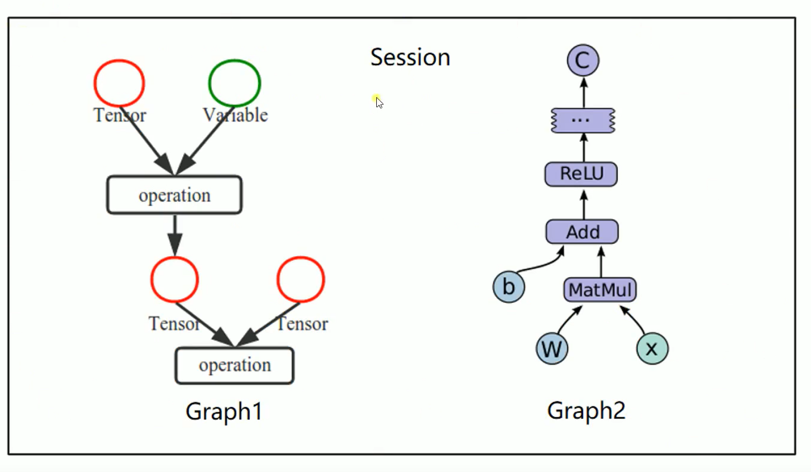
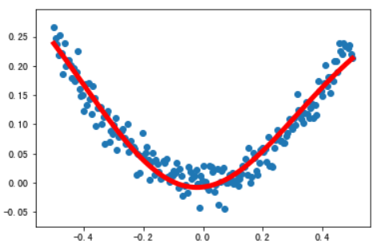

## Tensorflow
- **基本概念**  
1. 使用图（`graphs`）表示计算任务  
2. 在被称为会话（`Session`）的上下文（`context`）中执行图 
3. 使用`tensor`表示数据  
4. 通过变量（`Variable`）维护状态  
5. 使用`feed`和`fetch`为任意操作赋值或者从其中获取数据  
  
- **创建图&启动图**  
```
import tensorflow as tf

# 创建一个常量op
m1 = tf.constant([[3, 3]])
# 创建一个常量op
m2 = tf.constant([[2], [3]])
# 创建一个矩阵乘法op，把m1和m2传入
product = tf.matmul(m1, m2)
print(product)  # Tensor("MatMul_1:0", shape=(1, 1), dtype=int32)

# 定义一个会话，默认启动图
sess = tf.Session()
# 调用sess的run方法执行矩阵乘法op
# run(product)触发图中3个op
result = sess.run(product) 
print(result)  # [[15]]
sess.close()

with tf.Session() as sess:
    result = sess.run(product)
    print(result)  # [[15]]
```
- **变量**  
```
x = tf.Variable([1, 2])
a = tf.constant([3, 3])
# 增加一个减法op
sub = tf.subtract(x, a)
# 增加一个加法op
add = tf.add(x, sub)

# 变量初始化
init = tf.global_variables_initializer()

with tf.Session() as sess:
    sess.run(init)
    print(sess.run(sub))  # [-2 -1]
    print(sess.run(add))  # [-1  1]
    

# 创建一个变量初始化为0
state = tf.Variable(0, name='counter')
# 创建一个op，作用是使state加1
new_value = tf.add(state, 1)
# 赋值op
update = tf.assign(state, new_value)
# 变量初始化
init = tf.global_variables_initializer()

with tf.Session() as sess:
    sess.run(init)
    print(sess.run(state))
    for _ in range(5):
        sess.run(update)
        print(sess.run(state))
'''
0
1
2
3
4
5
'''
```
- **Fetch&Feed**  
```
# Fetch
input1 = tf.constant(3.0)
input2 = tf.constant(2.0)
input3 = tf.constant(5.0)

add = tf.add(input2, input3)
mul = tf.multiply(input1, add)

with tf.Session() as sess:
    result = sess.run([mul, add])
    print(result)  # [21.0, 7.0]
    

# Feed
# 创建占位符
input1 = tf.placeholder(tf.float32)
input2 = tf.placeholder(tf.float32)
output = tf.multiply(input1, input2)

with tf.Session() as sess:
    # feed的数据以字典的形式传入
    print(sess.run(output, feed_dict = {input1:[7.], input2:[2.]}))  # [14.]
```   
- **简单示例**  
```
import tensorflow as tf
import numpy as np

# 使用numpy生成100个随机点
x_data = np.random.rand(100)
y_data = x_data * 0.1 + 0.2

# 构造一个线性模型
b = tf.Variable(0.)
k = tf.Variable(0.)
y = k * x_data + b

# 二次代价函数
loss = tf.reduce_mean(tf.square(y_data - y))
# 定义一个用梯度下降法进行训练的优化器
optimizer = tf.train.GradientDescentOptimizer(0.2)
# 最小化代价函数
train = optimizer.minimize(loss)

# 初始化变量
init = tf.global_variables_initializer()

with tf.Session() as sess:
    sess.run(init)
    for step in range(201):
        sess.run(train)
        if step % 20 == 0:
            print(step, sess.run([k, b]))
            
'''
0 [0.05607688, 0.10074444]
20 [0.10486558, 0.19727439]
40 [0.102663636, 0.1985079]
60 [0.101458184, 0.19918317]
80 [0.100798264, 0.19955285]
100 [0.100437, 0.1997552]
120 [0.10023922, 0.199866]
140 [0.10013096, 0.19992664]
160 [0.10007168, 0.19995984]
180 [0.10003924, 0.19997802]
200 [0.100021474, 0.19998798]
'''
```
- **非线性回归**  
```
import tensorflow as tf
import numpy as np
import matplotlib.pyplot as plt

# 使用numpy生成200个随机点
x_data = np.linspace(-0.5, 0.5, 200)[:, np.newaxis]
noise = np.random.normal(0, 0.02, x_data.shape)  
y_data = np.square(x_data) + noise

# 定义两个placeholder
x = tf.placeholder(tf.float32, [None,1])
y = tf.placeholder(tf.float32, [None,1])

# 定义神经网络中间层
Weights_L1 = tf.Variable(tf.random_normal([1,10]))
biases_L1 = tf.Variable(tf.zeros([1,10]))
Wx_plus_b_L1 = tf.matmul(x, Weights_L1) + biases_L1
L1 = tf.nn.tanh(Wx_plus_b_L1)

# 定义神经网络输出层
Weights_L2 = tf.Variable(tf.random_normal([10,1]))
biases_L2 = tf.Variable(tf.zeros([1,1]))
Wx_plus_b_L2 = tf.matmul(L1, Weights_L2) + biases_L2
prediction = tf.nn.tanh(Wx_plus_b_L2)

# 二次代价函数
loss = tf.reduce_mean(tf.square(y - prediction))
# 使用梯度下降法训练
train_step = tf.train.GradientDescentOptimizer(0.1).minimize(loss)

with tf.Session() as sess:
    # 变量初始化
    sess.run(tf.global_variables_initializer())
    for _ in range(2000):
        sess.run(train_step, feed_dict = {x:x_data,y:y_data})
        
    # 获取预测值
    prediction_value = sess.run(prediction, feed_dict = {x:x_data})
    # 画图
    plt.figure()
    plt.scatter(x_data, y_data)
    plt.plot(x_data, prediction_value, 'r-', lw=5)
    plt.show()
```

