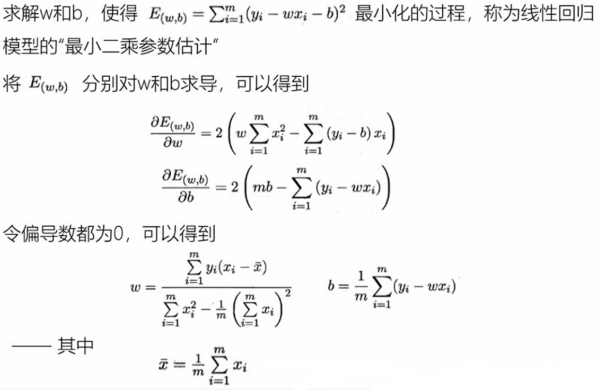

## 推荐系统   
- **分类和回归**   
监督学习问题主要可以划分为两类，即分类问题和回归问题：分类问题预测数据属于哪一类别（离散）；回归问题根据数据预测一个数值（连续）   
- **分类问题**  
1. 在监督学习中，当输出变量Y取有限个离散值时，预测问题就成了分类问题   
2. 监督学习从数据中学习一个分类模型或分类决策函数，称为分类器；分类器对新的输入进行预测，称为分类   
3. 分类问题包括学习和分类两个过程。学习过程中，根据已知的训练数据集利用学习方法学习一个分类器；分类过程中，利用已习得的分类器对新的输入实例进行分类 
4. 分类问题可以用很多学习方法解决，比如K近邻、决策树、感知机、逻辑斯谛回归、支持向量机、朴素贝叶斯法、神经网络等  
- **精确率和召回率**  
1. 评价分类器性能的指标一般是分类准确率，定义为：分类器对测试集正确分类的样本数与总样本数之比   
2. 对于二分类问题，常用的评价指标是精确率与召回率   
3. 通常以关注的类为正类，其它为负类，按照分类器在测试集上预测的正确与否，会有四种情况出现，它们的总数分别记作：   
a. `TP`：将正类预测为正类的数目     
b. `FN`：将正类预测为负类的数目  
c. `FP`：将负类预测为正类的数目  
d. `TN`：将负类预测为负类的数目  
4. 精确率：`P = TP / (TP + FP)`，指的是所有预测为正类的数据中，预测正确的比例  
5. 召回率：`R = TP / (TP + FN)`，指的是所有实际为正类的数据中，预测正确的比例  
- **回归问题**  
1. 回归问题用于预测输入变量和输出变量之间的关系  
2. 回归模型就是表示从输入变量到输出变量之间映射的函数  
3. 回归问题的学习等价于函数拟合：选择一条函数曲线，使其很好地拟合已知数据，并且能够很好地预测未知数据  
4. 回归问题的分类：按照输入变量的个数：一元回归和多元回归；按照模型类型：线性回归和非线性回归  
5. 回归学习的损失函数：平方损失函数。如果选取平方损失函数作为损失函数，回归问题可以用著名的最小二乘法求解
- **模型求解算法（学习方法）**  
- **梯度下降算法**  
1. 梯度下降是一种常用的一阶优化方法，是求解无约束化问题最简单、最经典的方法之一  
2. 梯度方向：函数变化增长最快的方向（变量沿此方向变化时函数增长最快）  
3. 负梯度方向：函数变化减少最快的方向（变量沿此方向变化时函数减少最快）  
4. 损失函数是系数的函数，如果系数沿着损失函数的负梯度方向变化，此时损失函数减少最快，能够以最快速度下降到极小值  
5. 梯度下降不一定能够找到全局最优解，有可能是一个局部最优解。如果损失函数是下凸函数，梯度下降法得到的解就一定是全局最优解 
  
- **牛顿法和拟牛顿法**  

- **Python基础**  
```
  # Python可以使用引号、双引号、三引号表示字符串
  # 三引号可以由多行组成，常用于文档字符串，在文件的特定地点，被当做注释

  # 等待用户输入
  input()
  
  # Python可以在同一行中使用多条语句，语句之间使用分号分割
  
  if expression:
    suite
  elif expression:
    suite
  else:
    suite
    
  # 换行输出
  print("a")
  # 不换行输出
  print("a", end = "")
  
  # 将整个模块导入
  import somemodule
  # 从某个模块导入某个函数
  from somemodule import somefunction
  # 从某个模块导入多个函数
  from somemodule import firstfunc, secondfunc
  # 将某个模块中的全部函数导入
  from somemodule import *
  
  # 整型变量
  counter = 100
  # 浮点型变量
  miles = 1000.0
  # 字符串
  name = "pkz"
  
  # 多变量赋值
  a = b = c = 1
  a, b, c = 1, 2, "pkz"
  
  # 变量的交换
  a, b = b, a
  
  a, b = 10, 20
  a, b = b, a + 5
  print(a, b)
  # 20 15
  
  # 标准数据类型
  # Number（数字）、String（字符串）、List（列表）、Tuple（元组）、Set（集合）、Dictionary（字典）
  # 不可变：Number、String、Tuple
  # 可变：List、Dictionary、Set
  
  # Number
  # int、float、bool、complex
  a, b, c, d = 20, 5.5, True, 5 + 4j
  print(type(a), type(b), type(c), type(d))
  
  # 函数
  type(a) # 判断数据类型
  isinstance(a, int)  # 判断数据是否属于某类型
  del var1, var2  # 手动GC
  # type()不会认为子类是一种父类类型
  # isinstance()会认为子类是一种父类类型
  class A:
    pass
  class B(A):
    pass
  print(type(A()) == A) # True
  print(type(B()) == A) # False
  print(isinstance(A(), A)) # True
  print(isinstance(B(), A)) # True
  
  # 进制
  # 二进制：0b开头
  0b1010
  # 八进制：0o开头
  0o555
  # 十六进制：0x开头
  0x52A74 # 大小写都可以
  
  # python中没有数字的大小限制，可以使用任意大的数字
  # python可以保证整数运算的精确，但是浮点数运算时可能会得到一个不精确的结果
  
  # 数学函数
  import math
  # 基本数学函数
  abs(x)  # 返回x的绝对值
  ceil(x) # 返回x的上入整数
  (x > y) - (x < y) # 如果x<y返回-1，如果x==y返回0，如果x>y返回1
  exp(x)  # 返回e的x次幂
  fabs(x) # 返回x的绝对值
  floor(x)  # 返回x的下舍整数
  log(x)  # math.log(math.e)返回1.0，math.log(100,10)返回2.0
  log10(x)  # 返回以10为基数的x的对数
  max(x1, x2, ...)  # 返回最大值
  min(x1, x2, ...)  # 返回最小值
  modf(x) # 返回x的整数部分与小数部分，两部分的符号与x相同，整数部分以浮点型表示
  pow(x, y) # x**y运算后的值
  round(x [,n])  # 返回浮点数x的四舍五入值，如给出n值，则代表舍入到小数点后的位数
  sqrt(x) # 返回数字x的平方根
  
  # 随机数函数
  choice(seq) # 从序列的元素中随机挑选一个元素，比如random.choice(range(10))，从0到9中随机挑选一个整数
  randrange([start,] stop [,step])  # 从指定范围内，按指定基数递增从集合中获取一个随机数
  random()  # 随机生成一个范围在[0, 1)的实数
  seed([x]) # 改变随机数生成器的种子seed
  shuffle(lst)  # 将序列中所有元素随机排列
  uniform(x, y) # 随机生成一个范围在[x, y]的实数
  
  # 三角函数
  acos(x) # 返回x的反余弦弧度值
  asin(x) # 返回x的反正弦弧度值
  atan(x) # 返回x的反正切弧度值
  atan2(y, x) # 返回给定的x及y坐标值的反正切值
  cos(x) # 返回x的弧度的余弦值
  hypot(x, y) # 返回欧几里德范数sqrt(x*x+y*y)
  sin(x) # 返回x的正弦值
  tan(x) # 返回x的正切值
  degrees(x) # 将弧度转换为角度，如degrees(math.pi/2)，返回90.0
  radians(x) # 将角度转换为弧度
  
  # 数学常量
  pi # 圆周率
  e # 自然常数
  
  # String
  # Python中的字符串用单引号或双引号括起来，同时使用反斜杠\转义特殊字符
  # 加号+是字符串的连接符，星号*表示复制当前字符串，后面的数字为复制的次数
  
  # 字符串截取：变量[头下标 : 尾下标 : 步长]
  
  # 字符串打印
  # Python使用反斜杠\转义特殊字符，如果不想让反斜杠发生转义，可以在字符串前添加一个r，表示原始字符串
  print('pk\nz')
  print(r'pk\nz')
  
  # 字符串获取
  # Python中的字符串有两种索引方式，从左往右以0开始，从右往左以-1开始
  # Python中的字符串不能改变
  # Python中没有单独的字符类型，一个字符就是长度为1的字符串
  print(str[0])
  
  # List
  # 列表是写在方括号[]之间，用逗号分隔开的元素列表
  # 列表中元素的类型可以不相同，支持数字、字符串，也可以包含新列表
  # 列表可以被索引和截取，被截取后返回一个包含所需元素的新列表
  # 列表可以使用+操作符进行拼接
  # 列表中的元素是可以改变的
  # 列表不支持与或非运算
  list = [0, 1, 2, 'a']
  list[0] # 0
  len(list) # 4
  list[0 : 3] # [0, 1, 2]
  list[0] = 3
  
  # Tuple
  # 元组与列表类似，不同之处在于元组的元素不能修改
  # 元组写在小括号()里，元素之间用逗号隔开
  t = (0, 1, 2, 'a')
  t[0] # 0
  len(t) # 4
  t[0 : 3] # (0, 1, 2)
  # t[0] = 3 报错
  # 虽然元组的元素不可改变，但可以包含可变的对象，比如list
  list = [0, 1, 2]
  t = (0, 1, list)
  # t[0] = 1 报错
  t[2][0] = 1
  # 元组可以被索引和切片
  # 构造包含0或1个元素的元组的特殊语法规则
  tup = () # 空元组
  tup = (1,) # 一个元素的元组需要在元素后添加逗号
  # 元组可以使用+或*操作符进行拼接
  
  # Set
  # 集合基本功能是进行成员关系测试和删除重复元素
  # 可以使用大括号{}或set()函数创建集合
  # 创建一个空集合必须用set()而不是{}，因为{}是用来创建一个空字典
  s = {'a', 1, 2}
  s = set('1a1a2b2') # {'a', 'b', '1', '2'}
  sa = {'a', 'b', 'c'}
  sb = {'a', 'd'}
  print(sa - sb) # {'c', 'b'} sa和sb的差集
  print(sa | sb) # {'c', 'a', 'b', 'd'} sa和sb的并集
  print(sa & sb) # {'a'} sa和sb的交集
  print(sa ^ sb) # {'c', 'b', 'd'} sa和sb中不同时存在的元素
  
  # Dictionary
  # 列表是有序的对象集合，字典是无序的对象集合
  # 字典当中的元素是通过键来存取的
  # 字典用{}标识，同一个字典中，键(key)必须是唯一的
  d = {'a':1, 'b':2, 'c':3}
  d = dict([('a',3), ('b',2), ('c',1)])
  d = {x : x ** 2 for x in (2, 4, 6)}
  d = dict(a = 1, b = 3, c = 2)
  print(d['a'])
  print(d.keys()) # 输出所有键 dict_keys(['a', 'b', 'c'])
  print(d.values()) # 输出所有值 dict_values([1, 2, 3])
  
  # 函数
  # 基本语法
  def 函数名(参数列表):
    函数体
  
  # 在函数调用中输入参数时，参数名称必须对应
  # 当调用函数时，参数必须全部传入，且名称对应，顺序可以不同
  def aa(x, y):
    print(x)
  aa(x=2, y=3) # 2
  aa(2, 3) # 2
  aa(y=2, x=3) # 3
  
  # 函数中可以定义默认值
  # 有默认值的参数必须定义在无默认值的参数的后面
  def aa(x, y=1):
    print(y)
  aa(2) # 1
  aa(x=2) # 1
  aa(2, y=3) # 3
  # aa(y=2) 报错
  
  # 不定长度参数
  def aa(x, *args, **kwargs):
    print(x)
    print(args) # 元组
    print(kwargs) # 字典
  aa(1, 2, 3, 4, a=1, b=2)
  
  # 函数有返回值
  # 单个返回值
  def aa(x):
    return x
  a = aa(10)
  
  # 多个返回值
  def aa(x):
    return x, 10
  a = aa(10) # a是一个元组
  a, b = aa(10) # 多个参数接收
  
  # 匿名函数
  lambda [arg1 [,arg2, ...argn]]:expression
  sum = lambda arg1, arg2: arg1 + arg2
  sum(1, 2) # 3
```
- **线性回归模型**  
1. 线性回归是一种线性模型，它假设输入变量x和单个输出变量y之间存在线性关系。具体来说，利用线性回归模型，可以从一组输入变量x的线性组合中，计算输出变量y  
`y = ax + b`，`f(x) = w1x1 + w2x2 + ... + wdxd + b`  
   
2. 给定d个属性（特征）描述的示例`x = (x1; x2; ...; xd)`，其中`xi`是`x`在第`i`个属性（特征）上的取值，线性模型试图学得一个通过属性（特征）的线性组合来进行预测的函数，即`f(x) = w1x1 + w2x2 + ... + wdxd + b`，一般用向量形式写成`f(x) = wTx + b`，其中`w = (w1, w2, ..., wd)`  
3. 假设特征和结果都满足线性，即不大于一次方。`w`和`b`学得之后，模型就得以确定  
4. 许多功能更为强大的非线性模型可在线性模型的基础上通过引入层级结构或高维映射得到  
- **最小二乘法**  

1. 基于均方误差最小化来进行模型求解的方法称为“最小二乘法”，它的主要思想是选择未知参数，使得理论值与观测值之差的平方和达到最小  
2. 假设输入属性（特征）的数目只有一个，`f(xi) = wxi + b`，使得`f(xi) ≈ yi`，在线性回归中，最小二乘法就是试图找到一条直线，使所有样本到直线上的欧式距离之和最小  
  
- **求解线性回归**  

- **算法实现**  
```
  # 0.引入依赖
  import numpy as np
  import matplotlib.pyplot as plt

  # 1.导入数据
  points = np.genfromtxt('./data/linear_data.csv', delimiter = ',')
  
  # 提取points中的两列数据，分别作为x，y
  x = points[:, 0]
  y = points[:, 1]
  
  # 2.定义损失函数
  # 损失函数是系数的函数，另外还需传入数据的x，y
  def compute_cost(w, b, points):
    total_cost = 0
    M = len(points)
    
    # 逐点计算平方损失误差，然后求平均数
    for i in range(M):
        x = points[i, 0]
        y = points[i, 1]
        total_cost += (y - w * x - b) ** 2
    
    return total_cost / M
    
  # 3.定义算法拟合函数
  # 先定义一个求均值的函数
  def average(data):
    sum = 0
    num = len(data)
    for i in range(num):
        sum += data[i]
    return sum / num

  # 定义核心拟合函数
  def fit(points):
    M = len(points)
    x_bar = average(points[:, 0])
    
    sum_yx = 0
    sum_x2 = 0
    sum_delta = 0
    
    for i in range(M):
        x = points[i, 0]
        y = points[i, 1]
        sum_yx += y * (x - x_bar)
        sum_x2 += x ** 2
    
    # 根据公式计算w
    w = sum_yx / (sum_x2 - M * (x_bar ** 2))
    
    for i in range(M):
        x = points[i, 0]
        y = points[i, 1]
        sum_delta += (y - w * x)
    b = sum_delta / M
    
    return w, b
    
  # 4.测试
  w, b = fit(points)

  print('w is：', w) # w is： 9449.962321455074
  print('b is：', b) # b is： 25792.20019866871

  cost = compute_cost(w, b, points)

  print('cost is：', cost) # cost is： 31270951.722280964
  
  # 5.画出拟合曲线
  plt.scatter(x, y)

  # 针对每一个x，计算出预测的y值
  pred_y = w * x + b

  plt.plot(x, pred_y, c = 'r')
  plt.show()
```  
![./Pics/线性回归_1.png]
