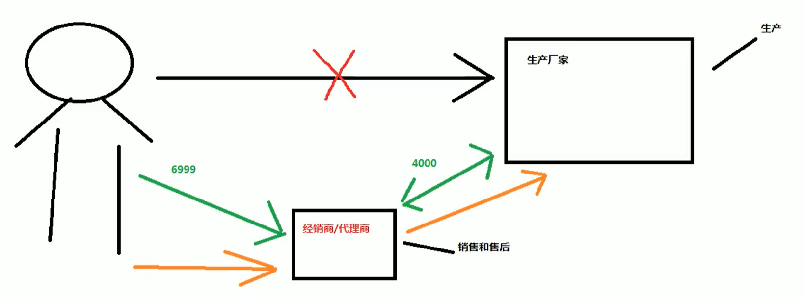

## AOP
- **代理的概念**  
 
```
  // 代理对生产厂家要求的接口标准  
  public interface IProducer {
    // 销售
    public void saleProduct(float money);
    
    // 售后
    public void afterService(float money);
  }
  
  
  // 生产者
  public class Producer implements IProducer {
    // 销售
    public void saleProduct(float money) {
      System.out.println("销售产品，代理费：" + money);
    }
    
    // 售后
    public void afterService(float money) {
      System.out.println("提供售后服务，代理费：" + money);
    }
  }
  
  
  // 模拟消费者
  public class Client {
    public static void main(String[] args) {
      // 厂家直销
      Producer Producer = new ProxyProducer();
      Producer.saleProduct(1000f);
    }
  }
```  
- **动态代理**  
1. 特点：字节码随用随创建，随用随加载，不修改源码的基础上对方法增强  
2. 基于接口的动态代理  
a. 涉及类`Proxy`，由JDK提供  
b. 创建代理对象使用`Proxy`类中的`newProxyInstance`方法，要求被代理类最少实现一个接口，如果没有则不能用  
c. `newProxyInstance`方法的参数：  
`ClassLoader`：类加载器，用于加载代理对象字节码，和被代理对象使用相同的类加载器，固定写法  
`Class[]`：字节码数组，用于让代理对象和被代理对象有相同方法，固定写法  
`InvocationHandler`：用于提供增强的代码，编写如何代理。一般都是写一个该接口的实现类，通常情况下都是匿名内部类，但不是必须  
```
  final Producer producer = new Producer();

  IProducer proxyProducer = (IProducer) Proxy.newProxyInstance(producer.getClass().getClassLoader(), 
    producer.getClass().getInterfaces(), 
    new InvocationHandler() {
      /**
       * 作用：执行被代理对象的任何接口方法都会经过该方法
       * 方法参数的含义
       * @param proxy 代理对象的引用
       * @param method 当前执行的方法
       * @param args 当前执行方法所需的参数
       * @return 和被代理对象方法相同的返回值
       * @throws Throwable
       */
      @Override
      public Object invoke(Object proxy, Method method, Object[] args) throws Throwable {
        // 提供增强的代码
        Object returnValue = null;
        // 1. 获取方法执行的参数
        Float money = (Float)args[0];
        // 2. 判断当前方法是不是销售
        if("saleProduct".equals(method.getName())) {
          returnValue = method.invoke(producer, money * 0.8f);
        }
        return returnValue;
      }
    });
    
    proxyProducer.saleProduct(10000f);
```
3. 基于子类的动态代理  
a. 涉及类`Enhancer`，由第三方`cglib`库提供  
b. 使用`Enhancer`类中的`create`方法创建代理对象，被带离类不能是最终类  
c. `create`方法的参数：  
`Class`：字节码，用于指定被代理对象的字节码  
`Callback`：用于提供增强的代码，编写如何代理。一般都是写一个该接口的实现类，通常情况下都是匿名内部类，但不是必须的。一般写该接口的子接口实现类：`MethodInterceptor`
```
  Producer cglibProducer = (Producer)Enhancer.create(producer.getClass(), new MethodInterceptor() {
    /**
     * 执行被代理对象的任何方法都会经过该方法
     * @param proxy
     * @param method
     * @param args
     * 以上三个参数和基于接口的动态代理中`invoke`方法的参数是一样的
     * @param mehodProxy：当前执行方法的代理对象 
     * @return 
     * @throws Throwable
     */
     @Override
     public Object intercept(Object proxy, Method method, Object[] args, MethodProxy methodProxy) throws Throwable {
      // 提供增强的代码
      Object returnValue = null;
      
      // 1. 获取方法执行的参数
      Float money = (Float)args[0];
      // 2. 判断当前方法是不是销售
      if("saleProduct".equals(method.getName())) {
        returnValue = method.invoke(producer, money * 0.8f);
      }
      return returnValue;
     }
  });
  
  cglibProducer.saleProduct(10000f);
```
