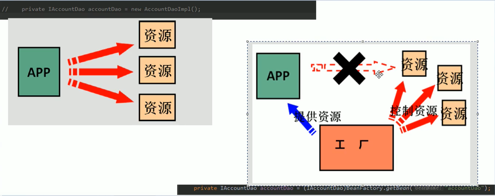
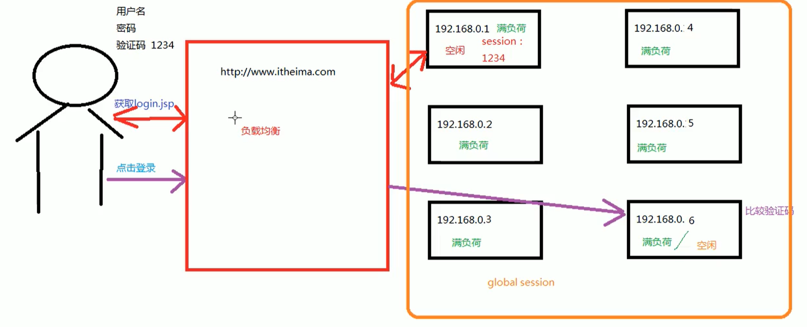

## IOC
控制反转  
- **程序的耦合**
1. 耦合：程序间的依赖关系。包括：类之间的依赖；方法之间的依赖
2. 解耦：降低程序间的依赖关系。实际开发中应该做到：编译期不依赖，运行时才依赖
```
  // 1. 注册驱动
  // new对象增加耦合性
  // DriverManager.registerDriver(new com.mysql.jdbc.Driver());
  // 新问题，参数被写死
  Class.forName("com.mysql.jdbc.Driver");
  // 2. 获取连接
  Connection conn = DriverManager.getConnection("jdbc:mysql://localhost:3306/db", "root", "123");
  // 3. 获取操作数据库的预处理对象
  PreparedStatement pstm = conn.prepareStatement("select * from account");
  // 4. 执行SQL，得到结果集
  ResultSet rs = pstm.executeQuery();
  // 5. 遍历结果集
  while(rs.next()){
    System.out.println(rs.getString("name"));
  }
  // 6. 释放资源
  rs.close();
  pstm.close();
  conn.close();
```
3. 解耦的思路：第一步，使用反射创建对象，而避免使用`new`关键字；第二步，通过读取配置文件获取要创建的对象全限定类名  
4. `Bean`：在计算机英语中，有可重用组件的含义；`JavaBean`：用`java`语言编写的可重用组件；`javabean > 实体类`
```
  // 创建Bean对象的工厂
  // 需要一个配置文件来配置需要的JavaBean，配置的内容：唯一标识=全限定类名（key=value）
  // 通过读取配置文件中配置的内容，反射创建对象
  public calss BeanFactory {
    // 定义一个Properties对象
    private static Properties props;
    
    // 定义一个Map，用于存放要创建的对象，称之为容器
    private static Map<String, Object> beans;
    
    // 使用静态代码块为Properties对象赋值
    static {
      try {
        // 实例化对象
        props = new Properties();
        // 获取properties文件的流对象
        InputStream in = BeanFactory.class.getClassLoader().getResourceAsStream("bean.properties");
        props.load(in);
        
        // 实例化容器
        beans = new HashMap<String, Object>();
        // 取出配置文件中所有的Key
        Enumeration keys = props.keys();
        // 遍历枚举
        while(keys.hasMoreElements()) {
          // 取出每个Key
          String key = keys.nextElement().toString();
          // 根据key获取value
          String beanPath = props.getProperty(key);
          // 反射创建对象
          Object value = Class.forName(beanPath).newInstance();
          // 把key和value存入容器中
          beans.put(key, value);
        }
      } catch(Exception e) {
        throw new ExceptionInInitializerError("初始化properties失败");
      }
    }
    

    // 根据Bean的名称获取bean对象
    public static Object getBean(String beanName) {
      return beans.get(beanName);
    } 
    /*
    public static Object getBean(String beanName) {
      Object bean = null;
      try {
        String beanPath = props.getProperty(beanName);
        // 注：每次都会创建一个对象，并非单例
        bean = Class.forName(beanPath).newInstance();
      } catch (Exception e) {
        e.printStackTrace();
      }
      return bean;
    }
    */
    
  }
```
5.  

- **Spring核心容器**  
1.   
```
  // 配置文件
  <beans xmlns="">
    <!--把对象的创建交给Spring管理-->
    <bean id="accountService" class="com.hzhang.service.impl.AccountServiceImpl"></bean>
  </beans>
  
  // 获取Spring的IOC核心容器，并根据id获取对象
  // 1. 获取核心容器对象
  ApplicationContext ac = new ClassPathXmlApplicationContext("bean.xml");
  // 2. 根据id获取Bean对象
  IAccountService as = (IAccountService)ac.getBean("accountService");
  // 3. 手动关闭容器
  ac.close();
```
2. `ApplicationContext`的三个常用实现类：  
a. `ClassPathXmlApplicationContext`：可以加载类路径下的配置文件，要求配置文件必须在类路径下，不在则加载不了  
b. `FileSystemXmlApplicationContext`：可以加载磁盘任意路径下的配置文件（必须有访问权限）  
c. `AnnotationConfigApplicationContext`：用于读取注解创建容器  
`ApplicationContext ac = new FileSystemXmlApplicationContext("C:\\Users\\hzhang\\Desktop\\bean.xml");`  
3. 核心容器的两个接口引发的问题：  
a. `ApplicationContext`：在构建核心容器时，创建对象采取的策略是立即加载。也就是，只要一读取完配置文件马上就创建配置文件中配置的对象。单例对象适用。一般使用此接口       
b. `BeanFactory`：在创建核心容器时，创建对象采取的策略是延迟加载。也就是，什么时候根据`id`获取对象，什么时候才真正创建对象。多例对象适用      
```
  // BeanFactory
  Resource resource = new ClassPathResource("bean.xml");
  BeanFactory factory = new XmlBeanFactory(resource);
  IAccountService as = (IAccountService)factory.getBean("accountService");
```  
- **Spring中创建Bean的三种方式**  
1. 第一种方式：使用默认构造函数创建。在Spring的配置文件中使用`bean`标签，配置`id`和`class`属性之后，且没有其他属性和标签时，采用的就是默认构造函数创建`bean`对象。此时如果类中没有默认构造函数，则对象无法创建  
`<bean id="accountService" class="com.hzhang.service.impl.AccountServiceImpl"></bean>`  
2. 第二种方式：使用普通工厂中的方法创建对象  
```
  // 模拟一个工厂类（该类可能存在于jar包中，无法通过修改源码的方式提供默认构造函数）
  public class InstanceFactory {
    public IAccountService getAccountService() {
      return new AccountServiceImpl();
    }
  }
  
  // 配置文件
  // 使用某个类中的方法创建对象，并存入Spring容器
  <bean id="instanceFactory" class="com.hzhang.factory.InstanceFactory"></bean>
  <bean id="accountService" factory-bean="instanceFactory" factory-method="getAccountService"></bean>
```  
3. 第三种方式：使用工厂中的静态方法创建对象  
```
  // 模拟一个工厂类（该类可能是存在于jar包中的，无法通过修改源码的方式提供默认构造函数）
  public class StaticFactory {
    public static IAccountService getAccountService() {
      return new AccountServiceImpl();
    }
  }
  
  // 配置文件
  // 使用某个类中的静态方法创建对象，并存入Spring容器
  <bean id="accountService" class="com.hzhang.factory.StaticFactory" factory-method="getAccountService"></bean>
```
- **Bean对象的作用范围**  
1. `bean`标签的`scope`属性，用于指定`bean`的作用范围  
2. `scope`的取值：  
a. `singleton`：单例的（默认值）  
b. `prototype`：多例的  
c. `request`：作用于web应用的请求范围  
d. `session`：作用于web应用的会话范围  
e. `global-session`：作用于集群环境的会话范围（全局会话范围），当不是集群环境时，它就是`session`  

3. 常用的时单例的和多例的  
