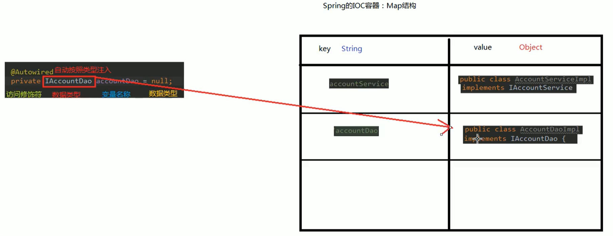
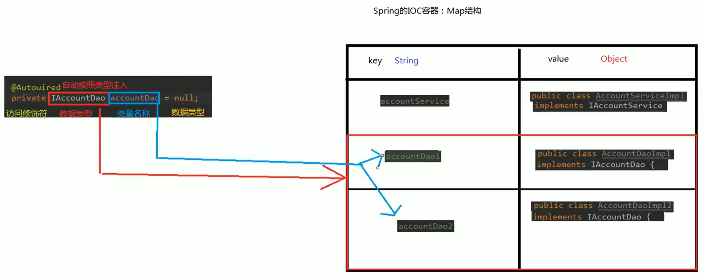

## IOC
控制反转  
- **程序的耦合**
1. 耦合：程序间的依赖关系。包括：类之间的依赖；方法之间的依赖
2. 解耦：降低程序间的依赖关系。实际开发中应该做到：编译期不依赖，运行时才依赖
```
  // 1. 注册驱动
  // new对象增加耦合性
  // DriverManager.registerDriver(new com.mysql.jdbc.Driver());
  // 新问题，参数被写死
  Class.forName("com.mysql.jdbc.Driver");
  // 2. 获取连接
  Connection conn = DriverManager.getConnection("jdbc:mysql://localhost:3306/db", "root", "123");
  // 3. 获取操作数据库的预处理对象
  PreparedStatement pstm = conn.prepareStatement("select * from account");
  // 4. 执行SQL，得到结果集
  ResultSet rs = pstm.executeQuery();
  // 5. 遍历结果集
  while(rs.next()){
    System.out.println(rs.getString("name"));
  }
  // 6. 释放资源
  rs.close();
  pstm.close();
  conn.close();
```
3. 解耦的思路：第一步，使用反射创建对象，而避免使用`new`关键字；第二步，通过读取配置文件获取要创建的对象全限定类名  
4. `Bean`：在计算机英语中，有可重用组件的含义；`JavaBean`：用`java`语言编写的可重用组件；`javabean > 实体类`
```
  // 创建Bean对象的工厂
  // 需要一个配置文件来配置需要的JavaBean，配置的内容：唯一标识=全限定类名（key=value）
  // 通过读取配置文件中配置的内容，反射创建对象
  public calss BeanFactory {
    // 定义一个Properties对象
    private static Properties props;
    
    // 定义一个Map，用于存放要创建的对象，称之为容器
    private static Map<String, Object> beans;
    
    // 使用静态代码块为Properties对象赋值
    static {
      try {
        // 实例化对象
        props = new Properties();
        // 获取properties文件的流对象
        InputStream in = BeanFactory.class.getClassLoader().getResourceAsStream("bean.properties");
        props.load(in);
        
        // 实例化容器
        beans = new HashMap<String, Object>();
        // 取出配置文件中所有的Key
        Enumeration keys = props.keys();
        // 遍历枚举
        while(keys.hasMoreElements()) {
          // 取出每个Key
          String key = keys.nextElement().toString();
          // 根据key获取value
          String beanPath = props.getProperty(key);
          // 反射创建对象
          Object value = Class.forName(beanPath).newInstance();
          // 把key和value存入容器中
          beans.put(key, value);
        }
      } catch(Exception e) {
        throw new ExceptionInInitializerError("初始化properties失败");
      }
    }
    

    // 根据Bean的名称获取bean对象
    public static Object getBean(String beanName) {
      return beans.get(beanName);
    } 
    /*
    public static Object getBean(String beanName) {
      Object bean = null;
      try {
        String beanPath = props.getProperty(beanName);
        // 注：每次都会创建一个对象，并非单例
        bean = Class.forName(beanPath).newInstance();
      } catch (Exception e) {
        e.printStackTrace();
      }
      return bean;
    }
    */
    
  }
```
5.  

- **IOC核心容器**  
1.   
```
  // 配置文件
  <beans xmlns="">
    <!--把对象的创建交给Spring管理-->
    <bean id="accountService" class="com.hzhang.service.impl.AccountServiceImpl"></bean>
  </beans>
  
  // 获取Spring的IOC核心容器，并根据id获取对象
  // 1. 获取核心容器对象
  ApplicationContext ac = new ClassPathXmlApplicationContext("bean.xml");
  // 2. 根据id获取Bean对象
  IAccountService as = (IAccountService)ac.getBean("accountService");
  // 3. 手动关闭容器
  ac.close();
```
2. `ApplicationContext`的三个常用实现类：  
a. `ClassPathXmlApplicationContext`：可以加载类路径下的配置文件，要求配置文件必须在类路径下，不在则加载不了  
b. `FileSystemXmlApplicationContext`：可以加载磁盘任意路径下的配置文件（必须有访问权限）  
c. `AnnotationConfigApplicationContext`：用于读取注解创建容器  
`ApplicationContext ac = new FileSystemXmlApplicationContext("C:\\Users\\hzhang\\Desktop\\bean.xml");`  
3. 核心容器的两个接口引发的问题：  
a. `ApplicationContext`：在构建核心容器时，创建对象采取的策略是立即加载。也就是，只要一读取完配置文件马上就创建配置文件中配置的对象。单例对象适用。一般使用此接口       
b. `BeanFactory`：在创建核心容器时，创建对象采取的策略是延迟加载。也就是，什么时候根据`id`获取对象，什么时候才真正创建对象。多例对象适用      
```
  // BeanFactory
  Resource resource = new ClassPathResource("bean.xml");
  BeanFactory factory = new XmlBeanFactory(resource);
  IAccountService as = (IAccountService)factory.getBean("accountService");
```  
- **Spring中创建Bean的三种方式**  
1. 第一种方式：使用默认构造函数创建。在Spring的配置文件中使用`bean`标签，配置`id`和`class`属性之后，且没有其他属性和标签时，采用的就是默认构造函数创建`bean`对象。此时如果类中没有默认构造函数，则对象无法创建  
`<bean id="accountService" class="com.hzhang.service.impl.AccountServiceImpl"></bean>`  
2. 第二种方式：使用普通工厂中的方法创建对象  
```
  // 模拟一个工厂类（该类可能存在于jar包中，无法通过修改源码的方式提供默认构造函数）
  public class InstanceFactory {
    public IAccountService getAccountService() {
      return new AccountServiceImpl();
    }
  }
  
  // 配置文件
  // 使用某个类中的方法创建对象，并存入Spring容器
  <bean id="instanceFactory" class="com.hzhang.factory.InstanceFactory"></bean>
  <bean id="accountService" factory-bean="instanceFactory" factory-method="getAccountService"></bean>
```  
3. 第三种方式：使用工厂中的静态方法创建对象  
```
  // 模拟一个工厂类（该类可能是存在于jar包中的，无法通过修改源码的方式提供默认构造函数）
  public class StaticFactory {
    public static IAccountService getAccountService() {
      return new AccountServiceImpl();
    }
  }
  
  // 配置文件
  // 使用某个类中的静态方法创建对象，并存入Spring容器
  <bean id="accountService" class="com.hzhang.factory.StaticFactory" factory-method="getAccountService"></bean>
```
- **Bean对象的作用范围**  
1. `bean`标签的`scope`属性，用于指定`bean`的作用范围  
2. `scope`的取值：  
a. `singleton`：单例的（默认值）  
b. `prototype`：多例的  
c. `request`：作用于web应用的请求范围  
d. `session`：作用于web应用的会话范围  
e. `global-session`：作用于集群环境的会话范围（全局会话范围），当不是集群环境时，它就是`session`  

3. 常用的时单例的和多例的  
- **Bean对象的生命周期**  
1. 单例对象  
a. 出生：当容器创建时对象出生  
b. 存活：只要容器还在，对象一直存活  
c. 死亡：容器销毁，对象消亡  
d. 总结：单例对象的声明周期和容器相同  
2. 多例对象  
a. 出生：当我们使用对象时`Spring`框架为我们创建  
b. 存活：对象只要是在使用过程中就一直存活  
c. 死亡：当对象长时间不用，且没有别的对象引用时，由Java的垃圾回收器回收  
- **Spring中的依赖注入**  
1. IOC的作用：降低程序间的耦合（依赖关系）
2. 依赖注入：Dependency Injection。依赖关系的管理都交给`Spring`来维护，在当前类需要用到其他类的对象时，由`Spring`为我们提供，我们只需要在配置文件中说明依赖关系的维护，就称之为依赖注入  
3. 依赖注入能注入的数据有三类：基本类型和`String`；其他`bean`类型（在配置文件中或者注解配置过的`bean`）；复杂类型/集合类型  
- **依赖注入的方式**   
```
  public class AccountServiceImpl implements IAccountService {
    // 如果是经常变化的数据，并不适用于注入的方式
    private String name;
    private Integer age;
    private Date birthday;
    
    public AccountServiceImpl(String name, Integer age, Date birthday) {
      this.name = name;
      this.age = age;
      this.birthday = birthday;
    }
    
    public void setName(String name) {
      this.name = name;
    }
    
    public void setAge(Integer age) {
      this.age = age;
    }
    
    public void setBirthday(Date birthday) {
      this.birthday = birthday;
    }
    
    public void saveAccount() {
      System.out.println("Service中的saveAccount方法执行：" + name + ", " + age + ", " + birthday);
    }
  }
```
1. 第一种：使用构造函数提供  
```
  <!--
    构造函数注入：
    使用的标签：constructor-arg
    标签出现的位置：bean标签的内部
    标签中的属性：
      type：用于指定要注入的数据的数据类型，该数据类型也是构造函数中某个或某些参数的类型  
      index：用于指定要注入的数据给构造函数中指定索引位置的参数赋值，索引的位置是从0开始
      name：用于指定给构造函数中指定名称的参数赋值（常用）
      以上三个属性用于指定给构造函数中哪个参数赋值
      value：用于提供基本类型和String类型的数据
      ref：用于指定其他的bean类型数据，就是在spring的IOC核心容器中出现过的bean对象
      
    优势：在获取bean对象时，注入数据是必须的操作，否则对象无法创建成功
    弊端：改变了bean对象的实例化方式，在创建对象时，如果用不到这些数据，也必须提供
  -->
  <bean id="accountService" class="com.hzhang.service.impl.AccountServiceImpl">
    <constructor-arg name="name" value="pkz"></constructor-arg>
    <constructor-arg name="age" value="17"></constructor-arg>
    <constructor-arg name="birthday" ref="current-time"></constructor-arg>
  </bean>
  
  <!-- 配置一个日期对象 -->
  <bean id="current-time" class="java.util.Date"></bean>
```
2. 第二种：使用`set`方法提供（常用）  
```
  <!--
    set方法注入：
    涉及的标签：property
    出现的位置：bean标签的内部
    标签的属性：
      name：用于指定注入时所调用的set方法名称
      value：用于提供基本类型和String类型的数据
      ref：用于指定其他的bean类型数据，就是在spring的IOC容器中出现过的bean对象
      
    优势：创建对象时没有明确的限制，可以直接使用默认构造函数
    弊端：如果某个成员必须有值，则获取对象时有可能set方法没有执行
  -->  
  <bean id="accountService" class="com.hzhang.service.impl.AccountServiceImpl">
    <property name="name" value="pkz"></property>
    <property name="age" value="17"></property>
    <property name="birthday" ref="current-time"></property>
  </bean>
  
  <bean id="current-time" class="java.util.Date"></bean>  
```
3. 第三种：使用注解提供  
- **复杂类型/集合类型的注入**  
```
  public class AccountServiceImpl implements IAccountService {
    private String[] strs;
    private List<String> list;
    private Set<String> set;
    private Map<String, String> map;
    private Properties props;
    
    // 此处省略Setter
  }
  
  // 配置文件
  <!--
    复杂类型/集合类型的注入
    用于给List结构集合注入的标签：
      list  array  set
    用于给Map结构集合注入的标签：
      map  props
    结构相同，标签可以互换
  -->
  <bean id="accountService" class="com.hzhang.service.impl.AccountServiceImpl">
    <property name="strs">
      <array>
        <value>AA</value>
        <value>BB</value>
        <value>CC</value>
      </array>
    </property>
    
    <property name="list">
      <list>
        <value>AA</value>
        <value>BB</value>
        <value>CC</value>
      </list>
    </property>
    
    <property name="set">
      <set>
        <value>AA</value>
        <value>BB</value>
        <value>CC</value>
      </set>
    </property>
    
    <property name="map">
      <map>
        <entry key="AA" value="aa"></entry>
        <entry key="BB">
          <value>bb</value>
        </entry>
      </map>
    </property>
    
    <property name="props">
      <props>
        <prop key="AA" value="aa"></prop>
        <prop key="BB" value="bb"></prop>
      </props>
    </property>
  </bean>
```
- **IOC的常用注解**   
```
  // 配置文件
  <beans xmlns:context="...">
    <!-- 告知spring在创建容器时要扫描的包，配置所需要的标签不是在beans的约束中，而是一个context名称空间和约束中 -->
    <context:component-scan base-package="com.pkz"></context:component-scan>
  </beans>
```
1. 用于创建对象的：作用就和在XML配置文件中编写一个`<bean>`标签实现的功能一样  
a. `Component`  
作用：用于把当前类对象存入`spring`容器中  
属性：`value`用于指定`bean`的`id`，当不写时，默认值是当前类名，且首字母改小写  
b. `Controller`：一般用在表现层  
c. `Service`：一般用在业务层  
d. `Repository`：一般用在持久层  
```
  @Component
  public class AccountServiceImpl implements IAccountService {
  }
  
  @Component(value="accountService")
  public class AccountServiceImpl implements IAccountService {
  }
  
  @Component("accountService")
  public class AccountServiceImpl implements IAccountService{
  }
  
  // 根据id获取bean对象
  IAccountService as = (IAccountService)ac.getBean("accountServiceImpl");
```
e. 以上三个注解的作用和属性与`Component`是一模一样，是`spring`框架提供明确的三层使用的注解，使三层对象更加清晰
2. 用于注入数据的：作用就和在XML配置文件中的`bean`标签中写一个`<property>`标签的作用一样  
a. `Autowired`  
作用：自动按照类型注入，只要容器中唯一的一个`bean`对象类型和要注入的变量类型匹配，就可以注入成功。如果`ioc`容器中没有任何`bean`的类型和要注入的变量类型匹配，则报错。  

如果`ioc`容器中有多个类型匹配时：  

出现位置：可以是变量上，也可以是方法上    
```
  @Service("accountService")
  public class AccountServiceImpl implements IAccountService {
    @Autowired
    private IAccountDao accountDao = null;
    
    public void saveAccount() {
      accountDao.saveAccount();
    }
  }

  @Repository("accountDao")
  public class AccountDaoImpl implements IAccountDao {
  }

  IAccountDao adao = ac.getBean("accountDao", IAccountDao.class);
```  
b. `Qualifier`    
作用：在按照类中注入的基础之上再按照名称注入，在给类成员注入时不能单独使用（必须和`Autowired`结合使用），但是在给方法参数注入时可以  
属性：`value`用于指定注入`bean`的`id`
```
  @Autowired
  @Qualifier("accountDao1")
  private IAccountDao accountDao = null;
```  
c. `Resource`  
作用：直接按照`bean`的`id`注入，可以独立使用  
属性：`name`用于指定`bean`的`id`  
```
  @Resource(name = "accountDao2")
  private IAccountDao accountDao = null;
```  
d. 以上三个注入都只能注入`bean`类型的数据，而基本类型和`String`类型无法使用上述注解实现。另外，集合类型的注入只能通过XML来实现  
e. `Value`  
作用：用于注入基本类型和`String`类型的数据  
属性：`value`用于指定数据的值。可以使用`spring`中`SpEL`（也就是`spring`的`el`表达式），`SpEL`的写法：`${表达式}`  
3. 用于改变作用范围的：作用就和在`bean`标签中使用`scope`属性实现的功能是一样的  
a. `Scope`  
作用：用于指定`bean`的作用范围  
属性`value`指定范围的值，常用取值：`singleton`、`prototype`  
```
  @Scope("singleton")
  public class AccountServiceImpl implements IAccountService {}
  
  IAccountService as = (IAccountService)ac.getBean("accountService");
  IAccountService as2 = (IAccountService)ac.getBean("accountService");
  System.out.pringln(as == as2); // true
```
4. 和生命周期相关的：作用就和在`bean`标签中使用`init-method`和`destroy-method`的作用一样  
a. `PreDestroy`用于指定销毁方法  
b. `PostConstruct`用于指定初始化方法  
```
  @PostConstruct
  public void init(){
    System.out.println("初始化方法执行");
  }
  
  @PreDestroy
  public void destroy(){
    System.out.println("销毁方法执行");
  }
```
