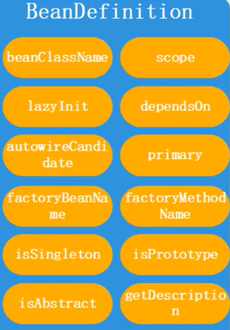
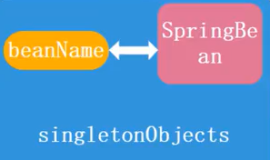

## 加载和创建  
- **BeanFactory和FactoryBean**    
1. `BeanFactory`定义了`IOC`容器的最基本形式，提供了`IOC`容器应遵循的最基本的接口。`spring`中有不同类型的`BeanFactory`，如：`ApplicationContext`、`ClassPathXmlApplicationContext`、`AnnocationConfigApplicationContext`  
2. `FactoryBean`是`Spring`容器中的一个对象，用来创建特殊的对象，是一个能生产或者修饰对象生成的工厂`Bean`，它的实现与设计模式中的工厂模式和装饰器模式类似。一般`spring`是通过反射创建对象，但是如果某个对象的创建过程过于复杂或者无法按照传统的方式实例化，可以使用`FactoryBean`  
- **BeanPostProcessor和BeanFactoryPostProcessor**  
```
@Component("aa")
public class A {
  public A(){
    System.out.println("Create A");
  }
  
  @PostConstruct
  public void init(){
    System.out.println("Initialize object of A");
  }
}

@Component
public class MyBeanPostProcessor implements BeanPostProcessor {
  public Object postProcessBeforeInitialization(Object bean, String beanName) throws BeansException {
    if(beanName.equals("aa")){
      System.out.println(beanName + " : postProcessBeforeInitialization");
    }
    return bean;
  }
  
  public Object postProcessAfterInitialization(Object bean, String beanName) throws BeansException{
    if(beanName.equals("aa")){
      System.out.println(beanName + " : postProcessAfterInitialization");
    }
  }
}

@Component
public class MyBeanFactoryPostProcessor implements BeanFactoryPostProcessor {
  @Override
  public void postProcessBeanFactory(ConfigurableListableBeanFactory beanFactory) throws BeansException{
    System.out.println("postProcessBeanFactory");
    // 把beanName = "aa"的Bean修改为B
    AbstractBeanDefinition beanDefinition = (AbstractBeanDefinition)beanFactory.getBeanDefinition("aa");
    beanDefinition.setBeanClass(B.class);
  }
}
```  
- **JavaBean和SpringBean**  
1. `JavaBean`：即对象，使用`new`或其他方式直接创建，由`JVM`统一管理，一个`java`对象只具有生成该对象的类中所声明的所有属性和方法  
2. `SpringBean`：通过反射创建，由`spring`容器统一管理，除了具有相应类中声明的属性和方法，还具有`spring`为其增加或修改的属性和方法
- **加载和创建流程**  
1. `JavaBean`的加载和创建流程：`User.java` -> (`ClassLoader`) -> `Class类型的对象` -> (`new`) -> `内存中的一个User对象`  
2. `SpringBean`的加载和创建流程：`User.java` -> (`ClassLoader`) -> `Class类型的对象` -> `BeanDefinition` -> (`存储`) -> `beanDefinitionMap` -> (`BeanFactoryPostProcessor`) -> (`检查/校验（类名是否合法；是否抽象类；是否单例；是否懒加载...）`) -> (`BeanPostProcessor`) -> (`对象创建；属性注入；初始化方法；AOP处理...`) -> `singletonObjects`  
  
  
  
