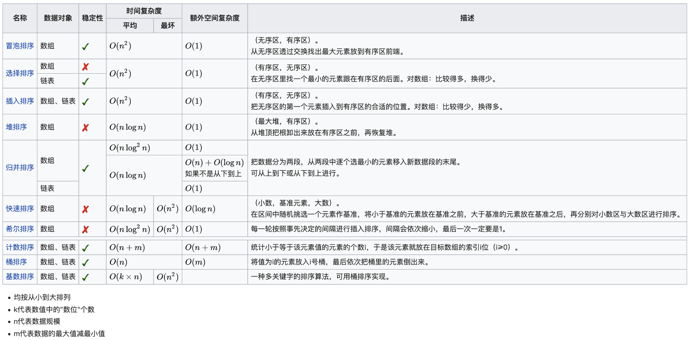

## LeetCode
- **两数之和**  
1. 题目描述：在给定整数数组中查找和为目标值的两个数，返回两数的下标  
2. 代码实现：  
```
  public int[] twoSum(int[] nums, int target) {
    Map<Integer, Integer> map = new HashMap<>();
    for(int i = 0; i < nums.length; i++) {
      if(map.containsKey(target - nums[i]) && map.get(target - nums[i]) != i) {
        return new int[]{i, map.get(target - nums[i])};
      }
      map.put(nums[i], i);
    }
    return new int[]{-1, -1};
  }
```
- **链表的中间结点**  
1. 解题思路：快慢指针（题目中说带有头结点，测试用例却没有带头结点）  
2. 代码实现：  
```
  // Java
  public ListNode middleNode(ListNode head) {
    ListNode slow = head;
    ListNode fast = head;
    while(fast!=null && fast.next!=null){
      slow = slow.next;
      fast = fast.next.next;
    }
    return slow;
  }
  
  # Python
  def middleNode(self, head):
    slow = head
    fast = head
    while fast and fast.next:
      slow = slow.next
      fast = fast.next.next
    return slow
```
- **按摩师**   
1. 解题思路：`dp[i] = Math.max(dp[i-1], dp[i-2] + nums[i])`  
2. 代码实现：  
```
    // Java
    public int massage(int[] nums) {
        int len = nums.length;
        if(len == 0){
            return 0;
        }
        if(len == 1){
            return nums[0];
        }
        int[] dp = new int[len];
        dp[0] = nums[0];
        dp[1] = Math.max(nums[0], nums[1]);
        for(int i = 2;i < len;i++){
            dp[i] = Math.max(dp[i-1], dp[i-2] + nums[i]);
        }
        return dp[len-1];
    }
    
        # Python翻译
        def massage(self, nums):
        if not nums:
            return 0;
        if len(nums) == 1:
            return nums[0]
        dp = [0 for _ in nums]
        dp[0] = nums[0]
        dp[1] = max(nums[0], nums[1])
        for i in range(2, len(nums)):
            dp[i] = max(dp[i-1], dp[i-2] + nums[i])
        return dp[-1]
```
- **三维形体的表面积**  
1. 解题思路：每个网格的立方体增加表面积`个数（高度） * 4 + 2`，然后在遍历过程中，分别减去与已经遍历过的相邻网格中立方体的重叠表面积`Math.min(当前高度, 相邻高度) * 2`
2. 代码实现：  
```
    public int surfaceArea(int[][] grid) {
        int n = grid.length;
        int res = 0;
        for(int i = 0;i < n;i++){
            for(int j = 0;j < n;j++){
                if(grid[i][j] > 0){
                    res += grid[i][j] * 4 + 2;
                    res -= i > 0 ? Math.min(grid[i][j], grid[i-1][j]) * 2 : 0;
                    res -= j > 0 ? Math.min(grid[i][j], grid[i][j-1]) * 2 : 0;
                }
            }
        } 
        return res;      
    }
```
- **买卖股票的最佳时机**  
1. 解题思路：`dp[i] = Math.max(dp[i - 1], prices[i] - min)` 
2. 代码实现：  
```
    public int maxProfit(int[] prices) {
        if(prices.length == 0){
            return 0;
        }
        int min = prices[0];
        int[] dp = new int[prices.length];
        for(int i = 1;i < prices.length;i++){
            dp[i] = Math.max(dp[i-1], prices[i] - min);
            min = Math.min(min, prices[i]);
        }
        return dp[prices.length - 1];
    }

    // 优化
    public int maxProfit(int[] prices) {
        int min = Integer.MAX_VALUE;
        int res = 0;
        for(int i = 0;i < prices.length;i++) {
            res = Math.max(res, prices[i] - min);
            min = Math.min(min, prices[i]);
        }
        return res;
    }
```
- **车的可用捕获量**  
代码实现：  
```
    public int numRookCaptures(char[][] board) {
        int[][] directs = {{0,-1}, {0,1}, {-1,0}, {1,0}};
        int res = 0;
        int x = 0,y = 0;
        for(int i = 0;i < 8;i++){
            for(int j = 0;j < 8;j++){
                if('R' == board[i][j]){
                    x = i;
                    y = j;
                    break;
                }
            }
        }
        for(int k = 0;k < 4;k++){
            int i = x, j = y;
            while(true){
                i += directs[k][0];
                j += directs[k][1];
                if(i <= 0 || i >= 8 || j <= 0 || j >= 8 || 'B' == board[i][j]){
                    break;
                }
                if('p' == board[i][j]){
                    res++;
                    break;
                }
            }
        }
        return res;
    }
```
- **最大子序和**  
1. 解题思路：如果当前`sum < 0`，则重置`sum`的值，因为`sum`为负数和下一个数相加结果只会比当前值小  
2. 代码实现：  
```
    public int maxSubArray(int[] nums) {
        int res = nums[0], sum = 0;
        for(int num : nums){
            if(sum >= 0){
                sum += num;
            }else{
                sum = num;
            }
            res = Math.max(res, sum);
        }
        return res;
    }
```
- **卡牌分组**  
1. 解题思路：统计每种卡牌的次数，判断公约数是否大于等于2  
2. 代码实现：  
```
    public boolean hasGroupsSizeX(int[] deck) {
        if(deck.length < 2) {
            return false;
        }
        int[] count = new int[10000];
        for(int d : deck) {
            count[d]++;
        }
        int x = -1;
        for(int c : count) {
            if(c == 1) {
                return false;
            }
            x = x == -1 ? c : gcd(x, c);
            // 提前终止循环
            if(x == 1) {
                return false;
            }
        }
        return true;
    }

    public int gcd(int a, int b) {
        return b == 0 ? a : gcd(b, a % b);
    }
```
- **单词的压缩编码**  
1. 解题思路：字典树（后缀所以倒序插入）  
2. 代码实现：  
```
    public int minimumLengthEncoding(String[] words) {
        TireNode root = new TireNode();
        HashMap<TireNode, Integer> map = new HashMap<>();
        for(int i = 0;i < words.length;i++) {
            String str = words[i];
            TireNode cur = root;
            for(int j = str.length() - 1;j >= 0;j--) {
                cur = cur.insert(str.charAt(j));
            }
            map.put(cur, i);
        }
        int res = 0;
        for(TireNode node : map.keySet()) {
            if(node.count == 0) {
                res += words[map.get(node)].length() + 1;
            }
        }
        return res;
    }


class TireNode {
    TireNode[] childs;
    int count;
    public TireNode() {
        childs = new TireNode[26];
        count = 0;
    }
    public TireNode insert(char c) {
        if(childs[c - 'a'] == null) {
            childs[c - 'a'] = new TireNode();
            count++;
        }
        return childs[c - 'a'];
    }
}
```
- **地图分析**  
1. 解题思路：`BFS`，题意有点绕，求每一个海洋区域的最近陆地距离，然后返回这些距离的最大值  
2. 代码实现：
```
    public int maxDistance(int[][] grid) {
        int[][] dir = {{1,0}, {-1,0}, {0,1}, {0,-1}};
        Queue<int[]> q = new LinkedList<>();
        int len = grid.length;
        for(int i = 0;i < len;i++){
            for(int j = 0;j < len;j++){
                if(grid[i][j] == 1){
                    q.offer(new int[]{i, j});
                }
            }
        }
        if(q.isEmpty()){
            return -1;
        }
        boolean hasOcean = false;
        int[] cur = null;
        while(!q.isEmpty()){
            cur = q.poll();
            for(int i = 0;i < 4;i++){
                int x = cur[0] + dir[i][0];
                int y = cur[1] + dir[i][1];
                if(x < 0 || x >= len || y < 0 || y >= len || grid[x][y] != 0){
                    continue;
                }
                hasOcean = true;
                grid[x][y] = grid[cur[0]][cur[1]] + 1;
                q.offer(new int[]{x, y});
            }
        }
        if(!hasOcean){
            return -1;
        }
        return grid[cur[0]][cur[1]] - 1; 
    }
```
- **圆圈中最后剩下的数字**  
1. 解题思路：模拟/数学法
2. 代码实现：  
```
    // 模拟
    public int lastRemaining(int n, int m) {
        ArrayList<Integer> list = new ArrayList<>();
        for(int i = 0;i < n;i++){
            list.add(i);
        }
        int idx = 0;
        while(n > 1){
            idx = (idx + m - 1) % n;
            list.remove(idx);
            n--; 
        }
        return list.get(0);
    }
    
    // 数学法：(当前index + m) % 上一轮剩余数字的个数
    public int lastRemaining(int n, int m) {
        int res = 0;
        for(int i = 2;i <= n;i++){
            res = (res + m) % i;
        }
        return res;
    }
```
- **排序数组**  
  
```
    // 快排
    public int[] sortArray(int[] nums) {
        quickSort(nums, 0, nums.length - 1);
        return nums;
    }

    public void quickSort(int[] nums, int l, int h) {
        if(l < h){
            int idx = partition(nums, l, h);
            quickSort(nums, l, idx - 1);
            quickSort(nums, idx + 1, h);
        }
    }

    public int partition(int[] nums, int l, int h) {
        int t = nums[l];
        while(l < h){
            while(nums[h] >= t && l < h){
                h--;
            }
            nums[l] = nums[h];
            while(nums[l] < t && l < h){
                l++;
            }
            nums[h] = nums[l];
        }
        nums[l] = t;
        return l;
    }


    // 归并排序
    public int[] sortArray(int[] nums) {
        mergeSort(nums, 0, nums.length - 1);
        return nums;
    }

    public void mergeSort(int[] nums, int l, int h) {
        if(l >= h){
            return;
        }
        int mid = (l + h) >> 1;
        mergeSort(nums, l, mid);
        mergeSort(nums, mid + 1, h);
        int[] arr = new int[h - l + 1];
        int s = l, m = mid + 1;
        int k = 0;
        while(s <= mid && m <= h){
            if(nums[s] < nums[m]){
                arr[k++] = nums[s++];
            }else{
                arr[k++] = nums[m++];
            }
        }
        while(s <= mid){
            arr[k++] = nums[s++];
        }
        while(m <= h){
            arr[k++] = nums[m++];
        }
        for(int i = 0;i < arr.length;i++){
            nums[l + i] = arr[i];
        }
    }
    
    
    // 堆排序
    public int[] sortArray(int[] nums) {
        heapSort(nums);
        return nums;
    }

    public void heapSort(int[] nums) {
        int len = nums.length;
        for(int i = (len >> 1) - 1;i >= 0;i--){
            adjust(nums, len, i);
        }
        for(int i = len - 1;i >= 1;i--){
            int t = nums[0];
            nums[0] = nums[i];
            nums[i] = t;
            adjust(nums, i, 0);
        }
    }

    public void adjust(int[] nums, int len, int idx) {
        int l = (idx << 1) + 1;
        int r = (idx << 1) + 2;
        int max = idx;
        if(l < len && nums[l] > nums[max]){
            max = l;
        }
        if(r < len && nums[r] > nums[max]){
            max = r;
        }
        if(max != idx){
            int t = nums[max];
            nums[max] = nums[idx];
            nums[idx] = t;
            adjust(nums, len, max);
        }
    }
```
- **有效括号的嵌套深度**  
1. 题意读了半天没读懂  
2. 代码实现：  
```
    public int[] maxDepthAfterSplit(String seq) {
        int[] res = new int[seq.length()];
        int idx = 0;
        for(char c : seq.toCharArray()){
            res[idx++] = c == '(' ? (idx - 1) & 1 : idx & 1;
        }
        return res;
    }
```
- **有效的括号**  
代码实现：  
```
    public boolean isValid(String s) {
        HashMap<Character, Character> map = new HashMap<>();
        map.put(')','(');
        map.put('}','{');
        map.put(']','[');
        Stack<Character> stack = new Stack<>();
        for(char c : s.toCharArray()){
            if(map.containsKey(c)){
                if(stack.isEmpty()){
                    return false;
                }else{
                    if(map.get(c) != stack.pop()){
                        return false;
                    }
                }                
            }else{
                stack.push(c);
            }
        }
        return stack.isEmpty();     
    }
```
- **生命游戏**  
1. 解题思路：注意状态是同时变化的  
2. 代码实现：  
```
    public void gameOfLife(int[][] board) {
        int[] direct = {-1, 0, 1};
        int m = board.length;
        int n = board[0].length;
        int liveNeighbors;
        for(int i = 0;i < m;i++){
            for(int j = 0;j < n;j++){
                liveNeighbors = 0;
                for(int k = 0;k < 3;k++){
                    for(int l = 0;l < 3;l++){
                        if(!(direct[k] == 0 && direct[l] == 0)){
                            int r = i + direct[k];
                            int c = j + direct[l];
                            if(r >= 0 && r < m && c >= 0 && c < n && (Math.abs(board[r][c]) == 1)){
                                liveNeighbors++;
                            }
                        }
                    }
                }
                if(board[i][j] == 1 && (liveNeighbors < 2 || liveNeighbors > 3)){
                    board[i][j] = -1;
                }
                if(board[i][j] == 0 && liveNeighbors == 3){
                    board[i][j] = 2;
                }
            }
        }
        for(int i = 0;i < m;i++){
            for(int j = 0;j < n;j++){
                board[i][j] = board[i][j] <= 0 ? 0 : 1;
            }
        }
    }
```
- **字符串转换整数（atoi）**  
1. 解题思路：按题意模拟（更简捷的方法用正则表达式）
2. 代码实现：  
```
    public int myAtoi(String str) {
        int res = 0;
        boolean isNegative = false;
        int idx = 0;
        while(idx < str.length() && ' ' == str.charAt(idx)){
            idx++;
        }
        if(idx == str.length()){
            return 0;
        }
        if('-' == str.charAt(idx)){
            isNegative = true;
        }
        if('+' == str.charAt(idx) || '-' == str.charAt(idx)){
            idx++;
        }
        while(idx < str.length() && str.charAt(idx) >= '0' && str.charAt(idx) <= '9'){
            int cur = str.charAt(idx) - '0';
            if(res > Integer.MAX_VALUE / 10 || (res == Integer.MAX_VALUE / 10 && cur >= 8)){
                return isNegative ? Integer.MIN_VALUE : Integer.MAX_VALUE;
            }
            res = res * 10 + cur;
            idx++;
        }
        return isNegative ? -res : res;
    }
```
- **多数元素**  
1. 解题思路：投票算法（攻守阵地算法），注意题目中假定总是存在多数元素  
2. 代码实现：  
```
    public int majorityElement(int[] nums) {
        int res = nums[0];
        int count = 1;
        for(int i = 1;i < nums.length;i++){
            count = nums[i] == res ? count + 1 : count - 1;
            if(count == 0){
                res = nums[i];
                count = 1;
            }
        }
        return res;
    }
    
    // 改写版
    // 代码简捷了一些，但是LC判题后耗时不增反降，是因为创建包装类对象/自动装箱/拆箱？
    public int majorityElement(int[] nums) {
        int count = 0;
        Integer res = null;
        for(int num : nums){
            if(count == 0){
                res = num;
            }
            count += (num == res) ? 1 : -1;
        }
        return res;
    }
```
- **反转链表**  
代码实现：  
```
    public ListNode reverseList(ListNode head) {
        ListNode pre = null;
        ListNode cur = head;
        while(cur != null){
            ListNode next = cur.next;
            cur.next = pre;
            pre = cur;
            cur = next;
        }
        return pre;
    }
```
- **用队列实现栈**  
代码实现：
```
class MyStack {
    private Queue<Integer> q;
    /** Initialize your data structure here. */
    public MyStack() {
        q = new LinkedList<>();
    }
    
    /** Push element x onto stack. */
    public void push(int x) {
        q.add(x);
    }
    
    /** Removes the element on top of the stack and returns that element. */
    public int pop() {
        for(int i = 0;i < q.size() - 1;i++){
            q.add(q.poll());
        }
        return q.poll();
    }
    
    /** Get the top element. */
    public int top() {
        for(int i = 0;i < q.size() - 1;i++){
            q.add(q.poll());
        }
        int res = q.poll();
        q.add(res);
        return res;
    }
    
    /** Returns whether the stack is empty. */
    public boolean empty() {
        return q.peek() == null;
    }
}
```
- **接雨水**  
代码实现：
```
    public int trap(int[] height) {
        int res = 0;
        int l = 0, r = height.length - 1;
        int lMax = 0, rMax = 0;
        while(l < r){
            if(height[l] < height[r]){
                if(height[l] >= lMax){
                    lMax = height[l];
                }else{
                    res += lMax - height[l];
                }
                l++;
            }else{
                if(height[r] >= rMax){
                    rMax = height[r];
                }else{
                    res += rMax - height[r];
                }
                r--;
            }
        }
        return res;
    }
```
- **最长回文串**  
1. 解题思路：注意题意是说由给定字符构成的回文串，并不是在给定串中查找  
2. 代码实现：  
```
    public int longestPalindrome(String s) {
        int[] arr = new int[128];
        for(char c : s.toCharArray()){
            arr[c]++;
        }
        int count = 0;
        for(int n : arr){
            count += n % 2;
        }
        return count == 0 ? s.length() : (s.length() - count + 1);
    }
```
- **二叉树的直径**  
1. 解题思路：转换为求二叉树每个节点左右子树高度和的最大值  
2. 代码实现：
```
class Solution {
    int ans;
    public int diameterOfBinaryTree(TreeNode root) {
        ans = 0;
        depth(root);
        return ans;
    }

    public int depth(TreeNode node){
        if(node == null){
            return 0;
        }
        int l = depth(node.left);
        int r = depth(node.right);
        ans = Math.max(ans, l + r);
        return Math.max(l, r) + 1;
    }
}
```
- **矩形重叠**  
```
    public boolean isRectangleOverlap(int[] rec1, int[] rec2) {
        return !(rec2[1] >= rec1[3] || rec2[3] <= rec1[1]
            || rec2[2] <= rec1[0] || rec2[0] >= rec1[2]);
    }
```
- **零钱兑换**  
1. 解题思路：自下而上的动态规划  
2. 代码实现：
```
    public int coinChange(int[] coins, int amount) {
        if(amount == 0){
            return 0;
        }
        int[] dp = new int[amount + 1];
        Arrays.fill(dp, amount + 1);
        dp[0] = 0;
        for(int i = 1;i <= amount;i++){
            for(int j = 0;j < coins.length;j++){
                if(i >= coins[j]){
                    dp[i] = Math.min(dp[i], dp[i-coins[j]] + 1);
                }
            }
        }
        return dp[amount] > amount ? -1 : dp[amount];
    }
```
- **旋转矩阵**  
1. 解题思路：每一组交换的四个数的坐标`(i, j)`，`(j, n-i-1)`，`(n-i-1, n-j-1)`，`(n-j-1, i)`，然后根据方向（顺时针/逆时针）交换
2. 代码实现：  
```
    public void rotate(int[][] matrix) {
        int n = matrix.length;
        int t = matrix[0][0];
        for(int i = 0;i < n / 2;i++){
            for(int j = 0;j < (n + 1) / 2;j++){
                t = matrix[i][j];
                matrix[i][j] = matrix[n-j-1][i];
                matrix[n-j-1][i] = matrix[n-i-1][n-j-1];
                matrix[n-i-1][n-j-1] = matrix[j][n-i-1];
                matrix[j][n-i-1] = t;
            }
        }
    }
```
- **机器人的运动范围**  
1. 解题思路：`DFS`  
2. 代码实现：  
```
    public int movingCount(int m, int n, int k) {
        boolean[][] visited = new boolean[m][n];
        return dfs(0, 0, m, n, k, visited);
    }

    public int dfs(int r, int c, int m, int n, int k, boolean[][] visited){
        if(r<0 || r>=m || c<0 || c>=n || (r%10 + r/10 + c%10 + c/10)>k || visited[r][c]){
            return 0;
        }
        visited[r][c] = true;
        return dfs(r+1, c, m, n, k, visited) + dfs(r-1, c, m, n, k, visited)
            + dfs(r, c+1, m, n, k, visited) + dfs(r, c-1, m, n, k, visited) + 1;
    }
```
- **找树左下角的值**   
```
  public int findBootomLeftValue(TreeNode root){
    Queue<TreeNode> queue = new LinkedList<>();
    queue.offer(root);
    while(!queue.isEmpty()){
      root = queue.poll();
      if(root.right != null){
        queue.offer(root.right);
      }
      if(root.left != null){
        queue.offer(root.left)
      }
    }
    return root.val;
  }
```
- **盛最多水的容器**  
```
    public int maxArea(int[] height) {
        int l = 0, h = height.length - 1;
        int res = 0;
        while(l < h){
            // 错误写法
            // res = height[l] < height[h] ? Math.max(res, height[l++] * (h - l)) : Math.max(res, height[h--] * (h - l));
            // 正确写法
            res = height[l] < height[h] ? Math.max(res, (h - l) * height[l++]) : Math.max(res, (h - l) * height[h--]);
        }
        return res; 
    }
```
- **火柴拼正方形**  
```
    public boolean makesquare(int[] nums) {
        if(nums.length == 0){
            return false;
        }
        int sum = 0;
        for(int num : nums){
            sum += num;
        }
        if(sum % 4 != 0){
            return false;
        }
        return dfs(nums, 0, new int[4], sum >> 2);
    }

    public boolean dfs(int[] nums, int idx, int[] len, int s){
        if(idx == nums.length){
            if(len[0] == s && len[1] == s && len[2] == s && len[3] == s){
                return true;
            }
        }
        for(int i = 0;i < 4;i++){
            if(len[i] + nums[idx] <= s){
                len[i] += nums[idx];
                if(dfs(nums, idx + 1, len, s)){
                    return true;
                }
                len[i] -= nums[idx];
            }
        }
        return false;
    }
```
- **验证回文字符串Ⅱ**  
```
    public boolean validPalindrome(String s) {
        int l = 0, r = s.length() - 1;
        while(l < r){
            if(s.charAt(l) == s.charAt(r)){
                l++;
                r--;
            }else{
                boolean flag1 = true, flag2 = true;
                for(int i = l, j = r - 1;i < j;i++, j--){
                    if(s.charAt(i) != s.charAt(j)){
                        flag1 = false;
                        break;
                    }
                }
                for(int i = l + 1, j = r;i < j;i++, j--){
                    if(s.charAt(i) != s.charAt(j)){
                        flag2 = false;
                        break;
                    }
                }
                return flag1 || flag2;
            }
        }
        return true;
    }
```
- **朋友圈**  
```
    public int findCircleNum(int[][] M) {
        int[] visited = new int[M.length];
        int count = 0;
        for(int i = 0;i < M.length;i++){
            if(visited[i] == 0){
                dfs(M, visited, i);
                count++;
            }
        }
        return count;
    }

    public void dfs(int[][] M, int[] visited, int i){
        visited[i] = 1;
        for(int j = 0;j < M.length;j++){
            if(M[i][j] == 1 && visited[j] == 0){
                dfs(M, visited, j);
            }
        }
    }
```
- **分饼干**  
```
    public int findContentChildren(int[] g, int[] s) {
        Arrays.sort(g);
        Arrays.sort(s);
        int count = 0;
        int gi = 0;
        int si = 0;
        while(gi < g.length && si < s.length){
            if(s[si++] >= g[gi]){
                gi++;
                count++;
            }
        }
        return count;
    }
```
- **长度最小的子数组**  
```
    public int minSubArrayLen(int s, int[] nums) {
        int ans = Integer.MAX_VALUE;
        int sum = 0;
        int l = 0;
        for(int i = 0;i < nums.length;i++){
            sum += nums[i];
            while(sum >= s){
                ans = Math.min(ans, i - l + 1);
                sum -= nums[l++];
            }
        }
        return ans == Integer.MAX_VALUE ? 0 : ans;
    }
```
- **三个数的最大乘积**  
```
    public int maximumProduct(int[] nums) {
        int l = nums.length;
        Arrays.sort(nums);
        return Math.max(nums[l - 1] * nums[l - 2] * nums[l - 3], nums[0] * nums[1] * nums[l - 1]);
    }
    
    public int maximumProduct(int[] nums) {
        int max1 = Integer.MIN_VALUE, max2 = Integer.MIN_VALUE, max3 = Integer.MIN_VALUE;
        int min1 = Integer.MAX_VALUE, min2 = Integer.MAX_VALUE;
        for(int n : nums){
            if(n > max1){
                max3 = max2;
                max2 = max1;
                max1 = n;
            }else if(n > max2){
                max3 = max2;
                max2 = n;
            }else if(n > max3){
                max3 = n;
            }
            if(n < min1){
                min2 = min1;
                min1 = n;
            }else if(n < min2){
                min2 = n;
            }
        }
        return Math.max(max1 * max2 * max3, max1 * min1 * min2);
    }
```
- **有效的括号**  
```
    public boolean isValid(String s) {
        HashMap<Character, Character> map = new HashMap<>();
        map.put(')','(');
        map.put('}','{');
        map.put(']','[');
        Stack<Character> stack = new Stack<>();
        for(char c : s.toCharArray()){
            if(map.containsKey(c)){
                if(stack.isEmpty()){
                    return false;
                }else{
                    if(map.get(c) != stack.pop()){
                        return false;
                    }
                }                
            }else{
                stack.push(c);
            }
        }
        return stack.isEmpty();     
    }
```
- **从前序与中序遍历序列构造二叉树**  
```
    HashMap<Integer, Integer> m;
    public TreeNode buildTree(int[] preorder, int[] inorder) {
        m = new HashMap<>();
        for(int i = 0;i < inorder.length;i++){
            m.put(inorder[i], i);
        }
        return build(preorder, 0, preorder.length - 1, 0);
    }

    public TreeNode build(int[] pre, int prel, int prer, int inl){
        if(prel > prer){
            return null;
        }
        TreeNode t = new TreeNode(pre[prel]);
        int lsize = m.get(pre[prel]) - inl;
        t.left = build(pre, prel + 1, prel + lsize, inl);
        t.right = build(pre, prel + lsize + 1, prer, inl + lsize + 1);
        return t;
    }
```
- **三数之和**  
```
    public List<List<Integer>> threeSum(int[] nums) {
        List<List<Integer>> ans = new ArrayList<>();
        Arrays.sort(nums);
        for(int i = 0;i < nums.length - 2;i++){
            if(i > 0 && nums[i] == nums[i - 1]){
                continue;
            }
            int l = i + 1, r = nums.length - 1;
            int sum = 0 - nums[i];
            while(l < r){
                if(nums[l] + nums[r] == sum){
                    ans.add(Arrays.asList(nums[i], nums[l], nums[r]));
                    while(l < r && nums[l] == nums[l + 1]){
                        l++;
                    }
                    while(l < r && nums[r] == nums[r - 1]){
                        r--;
                    }
                    l++;
                    r--;
                }else if(nums[l] + nums[r] < sum){
                    l++;
                }else{
                    r--;
                }
            } 
        }
        return ans;
    }
```  
- **路径总和**  
```
    public boolean hasPathSum(TreeNode root, int sum) {
        return bc(root, sum);
    }

    public boolean bc(TreeNode node, int sum){
        if(node == null){
            return false;
        }
        sum -= node.val;
        if(sum == 0 && node.left == null && node.right == null){
            return true;
        }
        return bc(node.left, sum) || bc(node.right, sum);
    }
```
- **路径总和Ⅱ**  
```
    public List<List<Integer>> pathSum(TreeNode root, int sum) {
        List<List<Integer>> ans = new ArrayList<>();
        bc(root, sum, new ArrayList<>(), ans);
        return ans;
    }

    public void bc(TreeNode node, int sum, List<Integer> cur, List<List<Integer>> ans){
        if(node == null){
            return;
        }
        cur.add(node.val);
        if(sum - node.val == 0 && node.left == null && node.right == null){
            ans.add(new ArrayList(cur));
        }
        bc(node.left, sum - node.val, cur, ans);
        bc(node.right, sum - node.val, cur, ans);
        cur.remove(cur.size() - 1);
    }
```
- **除自身以外数组的乘积**  
```
    public int[] productExceptSelf(int[] nums) {
        int[] ans = new int[nums.length];
        int k = 1;
        for(int i = 0;i < nums.length;i++){
            ans[i] = k;
            k *= nums[i];
        }
        k = 1;
        for(int i = nums.length - 1;i >= 0;i--){
            ans[i] *= k;
            k *= nums[i];
        }
        return ans;
    }
```
- **删除链表的倒数第N个节点**  
```
    public ListNode removeNthFromEnd(ListNode head, int n) {
        ListNode p1 = head;
        while(n-- > 0){
            p1 = p1.next;
        }
        if(p1 == null){
            return head.next;
        }
        ListNode p2 = head;
        while(p1.next != null){
            p1 = p1.next;
            p2 = p2.next;
        }
        p2.next = p2.next.next;
        return head;
    }
```  
- **电话号码的字母组合**  
```
    HashMap<String, String> m;
    ArrayList<String> ans;
    public List<String> letterCombinations(String digits) {
        m = new HashMap<>();
        m.put("2", "abc");
        m.put("3", "def");
        m.put("4", "ghi");
        m.put("5", "jkl");
        m.put("6", "mno");
        m.put("7", "pqrs");
        m.put("8", "tuv");
        m.put("9", "wxyz");
        ans = new ArrayList<>();
        if(digits.length() != 0){
            bc("", digits);
        }
        return ans;
    }

    public void bc(String cur, String digs){
        if(digs.length() == 0){
            ans.add(cur);
            return;
        }
        String td = digs.substring(0, 1);
        String ts = m.get(td);
        for(int i = 0;i < ts.length();i++){
            bc(cur + ts.charAt(i), digs.substring(1));
        }
    }
```
- **爬楼梯**  
```
    public int climbStairs(int n) {
        if(n < 3){
            return n;
        }
        int p1 = 1;
        int p2 = 2;
        int sum = 0;
        for(int i = 3;i <= n;i++){
            sum = p1 + p2;
            p1 = p2;
            p2 = sum;
        }
        return sum;
    }
```  
- **对称二叉树**  
```
    public boolean isSymmetric(TreeNode root) {
        if(root == null){
            return true;
        }
        return isSymmetric(root.left, root.right);
    }

    public boolean isSymmetric(TreeNode left, TreeNode right){
        if(left == null && right == null){
            return true;
        }
        if(left == null || right == null){
            return false;
        }
        return left.val == right.val && isSymmetric(left.left, right.right) && isSymmetric(left.right, right.left);
    }
```  
- **二叉树的最大深度**  
```
    public int maxDepth(TreeNode root) {
        if(root == null){
            return 0;
        }
        return Math.max(maxDepth(root.left), maxDepth(root.right)) + 1;
    }
```  
- **环形链表**  
```
    public boolean hasCycle(ListNode head) {
        if(head == null || head.next == null){
            return false;
        }
        ListNode slow = head;
        ListNode fast = head.next;
        while(slow != fast){
            if(fast.next == null || fast.next.next == null){
                return false;
            }
            fast = fast.next.next;
            slow = slow.next;
        } 
        return true;
    }
```  
- **最小栈**  
```
    Stack<Integer> s1;
    Stack<Integer> s2;

    public MinStack() {
        s1 = new Stack<>();
        s2 = new Stack<>();
    }
    
    public void push(int x) {
        s1.push(x);
        if(s2.isEmpty()){
            s2.push(x);
            return;
        }
        s2.push(s2.peek() < x ? s2.peek() : x);
    }
    
    public void pop() {
        s1.pop();
        s2.pop();
    }
    
    public int top() {
        return s1.peek();
    }
    
    public int getMin() {
        return s2.peek();
    }
```
- **相交链表**  
```
    public ListNode getIntersectionNode(ListNode headA, ListNode headB) {
        ListNode l1 = headA;
        ListNode l2 = headB;
        while(l1 != l2){
            l1 = l1 == null ? headB : l1.next;
            l2 = l2 == null ? headA : l2.next;
        }
        return l1; 
    }
```  
- **打家劫舍**  
```
    public int rob(int[] nums) {
        if(nums.length == 0){
            return 0;
        }
        if(nums.length == 1){
            return nums[0];
        }
        int[] dp = new int[nums.length];
        dp[0] = nums[0];
        dp[1] = Math.max(nums[0], nums[1]);
        for(int i = 2;i < nums.length;i++){
            dp[i] = Math.max(dp[i-1], dp[i-2] + nums[i]);
        }
        return dp[nums.length - 1];
    }
```  
- **翻转二叉树**  
```
    public TreeNode invertTree(TreeNode root) {
        if(root == null){
            return null;
        }
        TreeNode t = root.left;
        root.left = root.right;
        root.right = t;
        invertTree(root.left);
        invertTree(root.right);
        return root;
    }
```  
- **回文链表**  
```
    public boolean isPalindrome(ListNode head) {
        if(head == null){
            return true;
        }
        ListNode firstEnd = endOfHalf(head);
        ListNode secondStart = firstEnd.next;
        ListNode p1 = head;
        ListNode t = reverse(secondStart);
        ListNode p2 = t;
        boolean ans = true;
        while(ans && p2 != null){
            if(p1.val != p2.val){
                ans = false;
            }
            p1 = p1.next;
            p2 = p2.next;
        }
        // firstEnd.next = reverse(t);
        return ans;
    }

    public ListNode endOfHalf(ListNode head){
        ListNode slow = head;
        ListNode fast = head;
        while(fast.next != null && fast.next.next != null){
            slow = slow.next;
            fast = fast.next.next;
        }
        return slow;
    }

    public ListNode reverse(ListNode node){
        ListNode pre = null;
        ListNode cur = node;
        ListNode next = null;
        while(cur != null){
            next = cur.next;
            cur.next = pre;
            pre = cur;
            cur = next;san
        }
        return pre;
    }
```  
- **路径总和III**  
```
    HashMap<Integer, Integer> m;
    public int pathSum(TreeNode root, int sum) {
        m = new HashMap<>();
        m.put(0, 1);
        return bc(root, sum, 0);
    }

    public int bc(TreeNode node, int sum, int path){
        if(node == null){
            return 0;
        }
        path += node.val;
        int t = m.getOrDefault(path - sum, 0);
        m.put(path, m.getOrDefault(path, 0) + 1);
        t += bc(node.left, sum, path) + bc(node.right, sum, path);
        m.put(path, m.get(path) - 1);
        return t;
    }
```
- **找到所有数组中消失的数字**  
```
    public List<Integer> findDisappearedNumbers(int[] nums) {
        HashSet<Integer> s = new HashSet<>();
        for(int n : nums){
            s.add(n);
        }
        List<Integer> ans = new ArrayList<>();
        for(int i = 1;i <= nums.length;i++){
            if(!s.contains(i)){
                ans.add(i);
            }
        }
        return ans;
    }
```  
- **汉明距离**  
```
    public int hammingDistance(int x, int y) {
        int xor = x ^ y;
        int ans = 0;
        while(xor != 0){
            ans++;
            xor &= (xor - 1);
        }
        return ans;
    }
```  
- **把二叉搜索树转换为累加树**  
```
    int sum = 0;
    public TreeNode convertBST(TreeNode root) {
        if(root != null){
            convertBST(root.right);
            sum += root.val;
            root.val = sum;
            convertBST(root.left);
        }
        return root;
    }
```  
- **最短无序连续子数组**  
```
    public int findUnsortedSubarray(int[] nums) {
        Stack<Integer> s = new Stack<>();
        int l = nums.length - 1, r = 0;
        for(int i = 0;i < nums.length;i++){
            while(!s.isEmpty() && nums[s.peek()] > nums[i]){
                l = Math.min(l, s.pop());
            }
            s.push(i);
        }
        s.clear();
        for(int i = nums.length - 1;i >= 0;i--){
            while(!s.isEmpty() && nums[s.peek()] < nums[i]){
                r = Math.max(r, s.pop());
            }
            s.push(i);
        }
        return r - l > 0 ? r - l + 1 : 0;
    }
```  
- **合并二叉树**  
```
    public TreeNode mergeTrees(TreeNode t1, TreeNode t2) {
        if(t1 == null){
            return t2;
        }
        if(t2 == null){
            return t1;
        }
        t1.val += t2.val;
        t1.left = mergeTrees(t1.left, t2.left);
        t1.right = mergeTrees(t1.right, t2.right);
        return t1;
    }
```
- **顺时针打印矩阵**  
```
    public int[] spiralOrder(int[][] matrix) {
        if(matrix.length == 0 || matrix[0].length == 0){
            return new int[0];
        }
        int m = matrix.length;
        int n = matrix[0].length;
        int[] ans = new int[m * n];
        int l = 0, r = n - 1, t = 0, b = m - 1, k = 0;
        while(l <= r && t <= b){
            for(int col = l;col <= r;col++){
                ans[k++] = matrix[t][col];
            }
            for(int row = t + 1;row <= b;row++){
                ans[k++] = matrix[row][r];
            }
            if(l < r && t < b){
                for(int col = r - 1;col >= l;col--){
                    ans[k++] = matrix[b][col];
                }
                for(int row = b - 1;row > t;row--){
                    ans[k++] = matrix[row][l];
                }
            }
            l++;
            r--;
            t++;
            b--;
        }
        return ans; 
    }
```
- **最长连续序列**  
```
    public int longestConsecutive(int[] nums) {
        HashSet<Integer> s = new HashSet<>();
        for(int num : nums){
            s.add(num);
        }
        int ans = 0;
        for(int num : nums){
            if(!s.contains(num - 1)){
                int cur = 1;
                int curNum = num;
                while(s.contains(curNum + 1)){
                    curNum++;
                    cur++;
                }
                ans = Math.max(cur, ans);
            }
        }
        return ans;
    }
```
