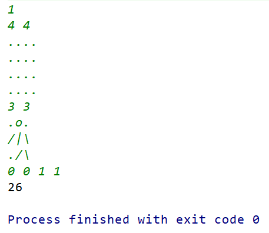

## 笔试面试题 记录
- **查找第K大的数字**  
1. 题目描述：在含有N个数的乱序数组`arr`中，就地查找第K大的数，若找到则返回该数在数组中的索引    
2. 解题思路：  
a. 执行一次快排后得到一个基准索引，记为`base`（左边的数比数组中该索引存储的数小，右边的数比数组中该索引存储的数大）  
b. 若`base == k-1`，则`arr[base]`既为第K大的数，返回`base`的值      
c. 若`base < k-1`，则第K大的数位于`base`右边部分，则只对右边部分继续进行查找     
d. 若`base > k-1`，则第K大的数位于`base`左边部分，则只对左边部分继续进行查找   
3. 代码实现：  
```
  // 时间复杂度O(n)

  public int partition(int[] arr, int low, int high) {
    int tmp = arr[low];
    while(low < high) {
      while(arr[high] >= tmp && low < high) {
        high--;
      }
      arr[low] = arr[high];
      while(arr[low] <= tmp && low < high) {
        low++;
      }
      arr[high] = arr[low];
    }
    arr[low] = tmp;
    return low;
  }
  
  public int find_k(int k, int[] arr, int low, int high) {
    if(arr.length < k || k <= 0)
      return -1;
    int base = partition(arr, low, high);
    if(base == k-1) {
      return base;
    }else if(base < k-1) {
      return find_k(k, arr, base + 1, high);
    }else {
      return find_k(k, arr, low, base - 1);
    }
  } 
```
- **二分查找**  
1. 非递归：  
```
  public int binSear(int[] arr, int key) {
    if(arr.length == 0 || arr == null)
      return -1;
      int low = 0, high = arr.length - 1;
      while(low <= high) {
        int mid = (low + high) / 2;
        if(arr[mid] == key) 
          return mid;
        else if(arr[mid] > key)  
          high = mid - 1;
        else 
          low = m + 1;
      }
      return -1;
  }
```  
2. 递归：  
```
  public int binSear(int[] arr, int key, int low, int high) {
    if(low <= high) {
      int mid = (low + high) / 2;
      if(arr[mid] == key)
        return mid;
      else if(arr[mid] < key) 
        return binSear(arr, key, mid + 1, high);
      else
        return binSear(arr, key, low, mid - 1);
    }
    return -1;
  }
```
- **最大的K个数**  
1. 问题描述：输入n个数，找出最大的K个数  
2. 解题思路：维护一个大小为K的最小堆；也可以借鉴快排查找第K大数的思想查找出结果
3. 代码实现：
```
  public ArrayList<Integer> findKs(int[] arr, int k) {
    if(arr.length < k || k <= 0)
      return new ArrayList<Integer>();
    PriorityQueue<Integer> heap = new PriorityQueue<>();
    for(int n : arr){
      heap.add(n);
      if(heap.size() > k)
        heap.poll();
    }
    return new ArrayList<Integer>(heap);
  }
```  
4. 如果输入数据为海量数据  
a. `Hash`法去重  
b. 分治&归并  
c. 每个被分治的局部数据内部，采用快排思想找出局部最大的K个数（也可以采用最小堆法），然后将所有局部的结果归并，再查找一次  
d. 若数据以流的方式输入（只在内存流过一次），则采用最小堆法最合适   
- **回文游戏**  
1. 题目描述：Cassidy和Eleanore一起玩了一个回文游戏，游戏规则：给出一个仅包含小写字母的字符串S，在每一个人的回合中，她们会进行两个操作：1) 尝试重新排列这个字符串，如果可以把这个字符串排列成回文字符串，则立即获胜。2) 否则，她们必须删掉字符串中的一个字符。已知，Cassidy先手，在两个人都采取最佳策略的情况下，谁可以获胜  
2. 代码实现：   
```
    public static String whoWillWin(String str){
        int[] arr = new int[26];
        char[] chars = str.toCharArray();
        for(char c : chars){
            arr[c - 'a']++;
        }
        int odd = 0;
        for(int num : arr){
            if((num & 1) == 1){
                odd++;
            }
        }
        if(odd > 0){
            odd -= 1;
        }
        return odd % 2 == 0 ? "Cassidy" : "Eleanore";
    }
```
- **回合制游戏**   
1. 题目描述：聚力会提高你下个回合攻击的伤害。攻击会对敌人造成一定量的伤害。如果你上个回合使用了聚力，那这次攻击会对敌人造成buffedAttack点伤害。否则，会造成normalAttack点伤害。给出血量HP和不同攻击的伤害，buffedAttack和normalAttack，返回你能杀死敌人的最小回合数   
2. 代码实现：
```
    public static void main(String[] args){
        Scanner sc = new Scanner(System.in);
        while(sc.hasNext()){
            int hp = sc.nextInt();
            int natk = sc.nextInt();
            int batk = sc.nextInt();
            if(batk >= natk * 2){
                int res = hp % batk;
                if(res > 0 && res <= natk){
                    res = hp / batk * 2 + 1;
                    System.out.println(res);
                }else{
                    res = (hp - 1) / batk * 2 + 2;
                    System.out.println(res);
                }
            }else{
                int res = (hp - 1) / natk + 1;
                System.out.println(res);
            }
        }
    }
```   
- **两两配对差值最小**   
1. 题目描述：给定一个长度为偶数的数组arr，将该数组中的数字两两配对并求和，在这些和中选出最大和最小值，请问该如何两两配对，才能让最大值和最小值的差值最小      
2. 代码实现：   
```
    public static void main(String[] args){
        Scanner sc = new Scanner(System.in);
        while(sc.hasNext()){
            int n = sc.nextInt();
            int[] arr = new int[n];
            for(int i = 0;i < n;i++){
                arr[i] = sc.nextInt();
            }
            Arrays.sort(arr);
            int max = Integer.MIN_VALUE, min = Integer.MAX_VALUE;
            for(int i = 0, j = n - 1;i < n / 2;i++, j--){
                max = Math.max(max, arr[i] + arr[j]);
                min = Math.min(min, arr[i] + arr[j]);
            }
            System.out.println(max - min);
        }
    }
```
- **查询最少有2门课程都>=60分的学生信息**  
```
create table t_student(
	s_id int comment '学生ID',
	s_name varchar(20) comment '学生姓名',
	s_gender int comment '学生性别 0-男,1-女'
) comment '学生表';

create table t_score(
	sc_id int comment '成绩ID',
	s_id int comment '学生ID',
	course_name varchar(20) comment '课程名称',
	score numeric(10,0) comment '成绩'	
) comment '成绩表';

select st.* from t_student st, t_score sc where st.s_id = sc.s_id and sc.score >= 60 group by sc.s_id having count(*) >= 2;
```  
- **查询学生最多的省份名字**  
```
select province, count(*) as c from stu group by province order by c desc limit 1;
```
- **十进制转n进制**  
```
    Stack<String> s;
    public void convert(int num, int n) {
        String[] arr = new String[]{"0", "1", "2", "3", "4", "5", "6", "7", "8", "9", "A", "B", "C", "D", "E", "F"};
        s = new Stack<>();
        while (num != 0) {
            s.push(arr[num % n]);
            num /= n;
        }
    }
```  
- **ps**  
```
ps：查看进程瞬时状态
ps -ef | grep processname
	e：显示所有进程，环境变量
	f：全格式
	grep：查询，格式：grep [options] 'pattern' filename
```  
- **top**  
```
top：实时显示进程状态，监视系统性能，如平均负载、CPU和内存的消耗
top -H -p pid
	p：指定进程ID来仅仅监控某个进程的状态
	H：显示某个进程所有活跃的线程的消耗情况
```  
- **df**  
```
df：以磁盘分区为单位查看文件系统，可以获取磁盘被占用多少空间、还剩下多少空间等信息
```  
- **查看端口占用情况**  
```
lsof -i : port
netstat -apn | grep port
```
- **查找employees表所有emp_no为奇数，且last_name不为Mary的员工信息，并按照hire_date逆序排列**  
```
select * from employees where emp_no % 2 = 1 and last_name != 'Mary' order by hire_date desc;
```  
- **斐波那契数列递归算法时间复杂度为O(2^n)**  
- **打开文件同时定位到第n行**  
```
vim filename +n
```  
- **打开文件同时定位到第一个匹配的词**  
```
vim filename +/pattern
```  
- **动态查看文件内容**  
```
tail -f filename
	f：循环读取
```
- **按行查看文件内容**  
```
head -n filename
	取文件前n行的内容
tail -n filename
	取文件后n行的内容
sed -n '2p' filename
	打印文件第二行
sed -n '1, 3p' filename
	打印文件1到3行
```  
- **任务调度**  
```
public class Solution {
    static class Node{
        int idx;
        int cost;
        public Node(int idx, int cost){
            this.idx = idx;
            this.cost = cost;
        }
    }

    public static void main(String[] args){
        Scanner sc = new Scanner(System.in);
        int n = sc.nextInt();
        int m = sc.nextInt();
        int[] costs = new int[n + 1];
        int[] d = new int[n + 1];
        for(int i = 1;i <= n;i++){
            costs[i] = sc.nextInt();
            d[i] = 0;
        }
        int[][] depend = new int[n + 1][n + 1];
        for(int i = 0;i < m;i++){
            int t1 = sc.nextInt();
            int t2 = sc.nextInt();
            depend[t1][t2] = 1;
            d[t2]++;
        }
        ArrayList<Integer> ans = exec(n, d, depend, costs);
        for(int i = 0;i < ans.size();i++){
            if(i == ans.size() - 1){
                System.out.println(ans.get(i));
            }else{
                System.out.print(ans.get(i) + " ");
            }
        }
    }

    public static ArrayList<Integer> exec(int n, int[] d, int[][] depend, int[] costs){
        ArrayList<Integer> ans = new ArrayList<>();
        PriorityQueue<Node> q = new PriorityQueue<>(((o1, o2) -> o1.cost - o2.cost));
        for(int i = 1;i <= n;i++){
            if(d[i] == 0){
                q.offer(new Node(i, costs[i]));
                d[i] = -1;
            }
        }
        while (!q.isEmpty()){
            Node t = q.poll();
            ans.add(t.idx);
            boolean isDepent = false;
            for(int i = 1;i <= n;i++){
                if(depend[t.idx][i] == 1){
                    isDepent = true;
                    d[i]--;
                }
            }
            if (isDepent == false){
                continue;
            }
            for(int i = 1;i <= n;i++){
                if(d[i] == 0){
                    q.offer(new Node(i, costs[i]));
                    d[i] = -1;
                }
            }
        }
        return ans;
    }
}
```  
- **20200905网易互娱笔试01**  
```
    // 大意是输出 一个user_name对应多个user_id 的user_name的个数
	
    public static void main(String[] args){
        Scanner sc = new Scanner(System.in);
        int n = sc.nextInt();
        HashMap<String, HashSet<Integer>> m = new HashMap<>();
        while (n-- > 0){
            int id = sc.nextInt();
            String cur = sc.next();
            if(!m.containsKey(cur)){
                HashSet<Integer> s = new HashSet<>();
                s.add(id);
                m.put(cur, s);
            }else{
                HashSet<Integer> ss = m.get(cur);
                ss.add(id);
                m.put(cur, ss);
            }
        }
        int ans = 0;
        for(String k : m.keySet()){
            if (m.get(k).size() >= 2){
                ans++;
            }
        }
        System.out.println(ans);
    }
```
- **20200905网易互娱笔试02**  
```
    // 大意是 一个目标（由字符组成的图）移动，统计目标完全移出背景图（由字符组成）时，字符总共需要刷新的次数
    // 暴力解法
    
    public static void main(String[] args) {
        Scanner sc = new Scanner(System.in);
        int T = sc.nextInt();
        while (T-- > 0){
            int W = sc.nextInt();
            int H = sc.nextInt();
            char[][] bgp = new char[W][H];
            char[][] bgc = new char[W][H];
            char[][] bgt = new char[W][H];
            for(int i = 0;i < W;i++){
                char[] cur = new char[H];
                cur = sc.next().toCharArray();
                for(int j = 0;j < H;j++){
                    bgp[i][j] = cur[j];
                    bgc[i][j] = cur[j];
                    bgt[i][j] = cur[j];
                }
            }
            int P = sc.nextInt();
            int Q = sc.nextInt();
            char[][] pe = new char[P][Q];
            for(int i = 0;i < P;i++){
                char[] cur = new char[Q];
                cur = sc.next().toCharArray();
                for(int j = 0;j < Q;j++){
                    pe[i][j] = cur[j];
                }
            }
            int i = sc.nextInt();
            int j = sc.nextInt();
            int a = sc.nextInt();
            int b = sc.nextInt();
            int ans = 0;
            i--;
            j--;
            while (i<W && j<H){
                for(int d = 0;d < i-a+P;d++){
                    for (int f = 0;f < j-b+Q;f++){
                        if(d>=W || f>=H){
                            continue;
                        }else {
                            bgc[d][f] = bgt[d][f];
                        }
                    }
                }
                for(int k = 0;k < P;k++){
                    for(int l = 0;l < Q;l++){
                        if(i+k<0 || i+k>=W || j+l<0 || j+l>=H){
                            continue;
                        }else{
                            if(bgc[i+k][j+l] != pe[k][l]){
                                bgc[i+k][j+l] = pe[k][l];
                            }
                        }
                    }
                }
                for(int g = 0;g < W;g++){
                    for(int h = 0;h < H;h++){
                        if(bgp[g][h] != bgc[g][h]){
                            ans++;
                            bgp[g][h] = bgc[g][h];
                        }
                    }
                }
                i += a;
                j += b;
            }
            System.out.println(ans);
        }
    }
```  
  
- **20200905网易互娱笔试03**  
```
    // 思路：构图 + BFS
```
- **20200906腾讯笔试**  
```
    //    01 / 100%
    public static void main(String[] args){
        Scanner sc = new Scanner(System.in);
        int n = sc.nextInt();
        int[] a1 = new int[n];
        // HashMap或许更简单
        for(int i = 0;i < n;i++){
            a1[i] = sc.nextInt();
        }
        int m = sc.nextInt();
        int[] a2 = new int[m];
        for(int i = 0;i < m;i++){
            a2[i] = sc.nextInt();
        }
        int i1 = 0, i2 = 0;
        while(i1<n && i2<m){
            if(a1[i1] == a2[i2]){
                System.out.print(a1[i1]+" ");
                i1++;
                i2++;
            }else if(a1[i1] < a2[i2]){
                i2++;
            }else{
                i1++;
            }
        }
        System.out.println();
    }
    
    //    02 / 55%
    public static void main(String[] args){
        Scanner sc = new Scanner(System.in);
        int n = sc.nextInt();
        int m = sc.nextInt();
        HashSet<Integer> s = new HashSet<>();
        int n0 = sc.nextInt();
        while(n0-- > 0){
            int t = sc.nextInt();
            s.add(t);
        }
        for(int i = 1;i < m;i++){
            int ni = sc.nextInt();
            int[] ai = new int[ni];
            boolean fg = false;
            for(int j = 0;j < ni;j++){
                ai[j] = sc.nextInt();
                if(s.contains(ai[j]) && fg == false){
                    fg = true;
                }
            }
            if(fg == true){
                for(int a : ai){
                    s.add(a);
                }
            }
        }
        System.out.println(s.size());
    }
    
    //    03 / 100%
    static class Obj{
        String s;
        int times;
    }

    public static void main(String[] args){
        Scanner sc = new Scanner(System.in);
        int N = sc.nextInt();
        int K = sc.nextInt();
        HashMap<String, Integer> m = new HashMap<>();
        for(int i = 0;i < N;i++){
            String t = sc.next();
            if(m.containsKey(t)){
                m.put(t, m.get(t)+1);
            }else{
                m.put(t, 1);
            }
        }
        Obj[] a = new Obj[m.size()];
        for(int i = 0;i < a.length;i++){
            a[i] = new Obj();
        }
        int k = 0;
        for(Map.Entry<String, Integer> e : m.entrySet()){
            a[k].s = e.getKey();
            a[k].times = e.getValue();
            k++;
        }
        Arrays.sort(a, (o1, o2) -> {
            return o1.times == o2.times ? o1.s.compareTo(o2.s) : o2.times - o1.times;
        });
        for(int i = 0;i < K;i++){
            System.out.println(a[i].s + " " + a[i].times);
        }
        Arrays.sort(a, (o1, o2) -> {
            return o1.times == o2.times ? o1.s.compareTo(o2.s) : o1.times - o2.times;
        });
        for(int i = 0;i < K;i++){
            System.out.println(a[i].s + " " + a[i].times);
        }
    }
    
    //    04 / 100%
    public static void main(String[] args){
        Scanner sc = new Scanner(System.in);
        int n = sc.nextInt();
        int[] a = new int[n];
        for(int i = 0;i < n;i++){
            a[i] = sc.nextInt();
        }
        int[] al = a.clone();
        Arrays.sort(a);
        int t = n>>>1;
        int mr = a[t];
        int ml = a[t-1];
        for(int i = 0;i < n;i++){
            if(al[i] < mr){
                System.out.println(mr);
            }else{
                System.out.println(ml);
            }
        }
    }
    
    //    05 / 5%
    
```
- **中缀字符串求值**  
```
    public static int cal(String[] ans) {
        Stack<Integer> stack = new Stack<>();
        for (String s : ans){
            switch (s){
                case "+":
                    stack.push(stack.pop()+stack.pop());
                    break;
                case "-":
                    int a = stack.pop();
                    stack.push(stack.pop()-a);
                    break;
                case "*":
                    stack.push(stack.pop()*stack.pop());
                    break;
                case "/":
                    int b = stack.pop();
                    stack.push(stack.pop()/b);
                    break;
                default:
                    stack.push(Integer.parseInt(s));
                    break;
            }
        }
        return stack.peek();
    }

    public static String[] mid2After(String[] strs) {
        Stack<String> stack = new Stack<>();
        int k = 0;
        int t = 0;
        for (String s : strs)
            if (s.equals("(") || s.equals(")"))
                t++;
        String[] ans = new String[strs.length-t];
        for (String s : strs) {
            if (isNumber(s))
                ans[k++] = s;
            else if (isOperator(s)){
                if ("(".equals(s))
                    stack.push(s);
                else if (")".equals(s)){
                    while (!stack.peek().equals("("))
                        ans[k++] = stack.pop();
                    stack.pop();
                } else {
                    if (stack.empty() || priority(s)>priority(stack.peek()))
                        stack.push(s);
                    else {
                        while (!stack.empty() && priority(stack.peek())>=priority(s))
                            ans[k++] = stack.pop();
                        stack.push(s);
                    }
                }
            }
        }
        while (!stack.empty())
            ans[k++] = stack.pop();
        return ans;
    }

    public static boolean isNumber(String str){
        return str.matches("\\d+");
    }

    public static boolean isOperator(String str){
        return set.contains(str);
    }

    public static int priority(String op){
        if (op.equals("*") || op.equals("/"))
            return 1;
        else if (op.equals("+") || op.equals("-"))
            return 0;
        return -1;
    }

    public static String[] str2Strs(String str){
        Character[] chars = new Character[]{'+','-','*','/','(',')'};
        Set<Character> set = new HashSet<Character>(Arrays.asList(chars));
        StringBuilder sb = new StringBuilder();
        for (int i=0;i<str.length()-1;i++){
            if (!set.contains(str.charAt(i))){
                if (set.contains(str.charAt(i+1)))
                    sb.append(str.charAt(i)+",");
                else
                    sb.append(str.charAt(i));
            } else
                sb.append(str.charAt(i)+",");
        }
        sb.append(str.charAt(str.length()-1));
        return sb.toString().split(",");
    }
```
