## 计算机网络
- **OSI七层模型**  
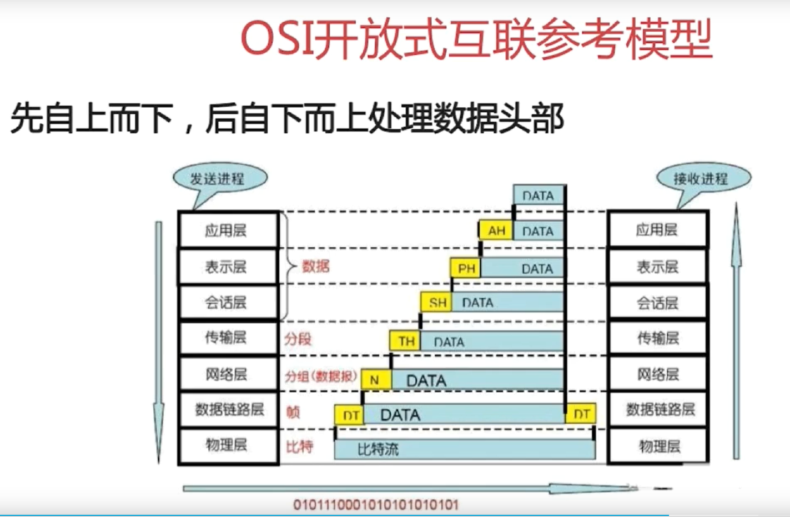
1. 物理层：机械、电子、定时接口通信上的原始比特流传输 
2. 数据链路层：物理寻址，同时将原始比特流转变为逻辑传输线路  
`ARP`：地址解析协议  
`RARP`：逆向地址解析协议  
3. 网络层：控制子网的运行，如逻辑编址、分组传输、路由选择  
`EGP`：外部网关协议  
`RIP2`：路由信息协议第2版本  
`OSPF`：开放最短路径优先协议  
`IP/IPv6`：互联网协议/互联网协议第6版  
`ICMP/ICMPv6`：互联网控制信息协议/互联网控制信息协议第6版  
`IGMP`：互联网组管理协议  
4. 传输层：接受上一层的数据，在必要的时候把数据进行分割，并把这些数据交给网络层，且保证这些数据段有效到达对端  
`TCP`：传输控制协议  
`UDP`：用户数据报协议  
5. 会话层：不同机器上的用户之间简历及管理会话  
`SSL`：安全套接字层协议  
`TLS`：传输层安全协议  
6. 表示层：信息的语法语义以及它们的关联，如加密解密、转换翻译、压缩解压缩  
7. 应用层  
`S-HTTP`：安全超文本传输协议  
`SOCKS`：安全套接字协议  
`TFTP`：简单文件传输协议  
`DNS`：域名系统  
`SNMP`：简单网络管理协议  
- **TCP/IP**  
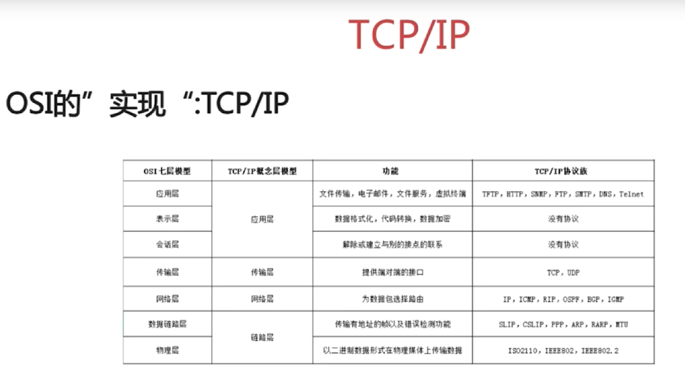
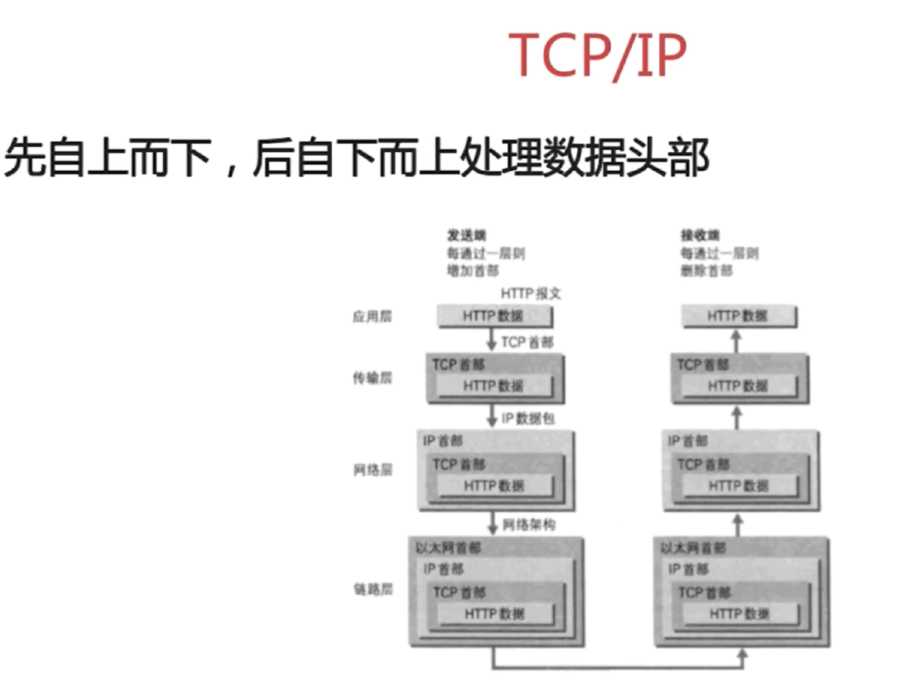  
- **Socket通信流程**  
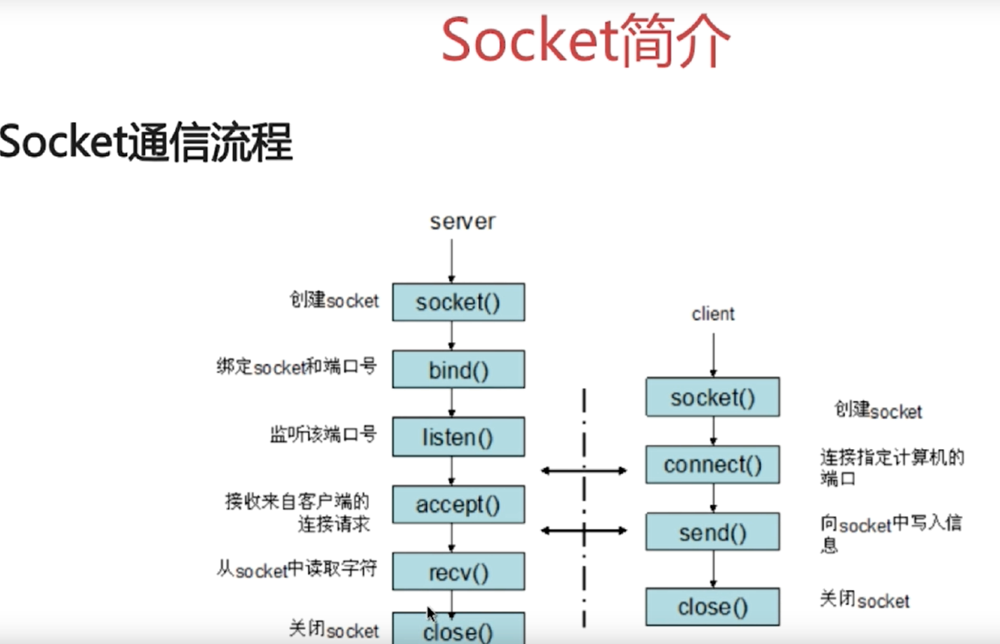
- **TCP三次握手**  
1. TCP Flags：  
`URG`：紧急指针标志  
`ACK`：确认序号标志  
`PSH`：push标志  
`RST`：重置连接标志  
`SYN`：同步序号，用于建立连接过程  
`FIN`：finish标志，用于释放连接  
2. 三次握手流程  
a. 在TCP/IP协议中，TCP协议提供可靠的连接服务，采用三次握手建立一个连接  
b. 第一次握手：建立连接时，客户端发送SYN包（seq=j）到服务器，并进入`SYN_SEND`状态，等待服务器确认  
c. 第二次握手：服务器收到SYN包，必须确认客户的SYN（ack=j+1），同时自己也发送一个SYN包（seq=k），即SYN+ACK包，此时服务器进入`SYN_RECV`状态  
d. 第三次握手：客户端收到服务器的SYN+ACK包，向服务器发送确认包（ack=k+1），此包发送完毕，客户端和服务器进入`ESABLISHED`状态，完成三次握手  
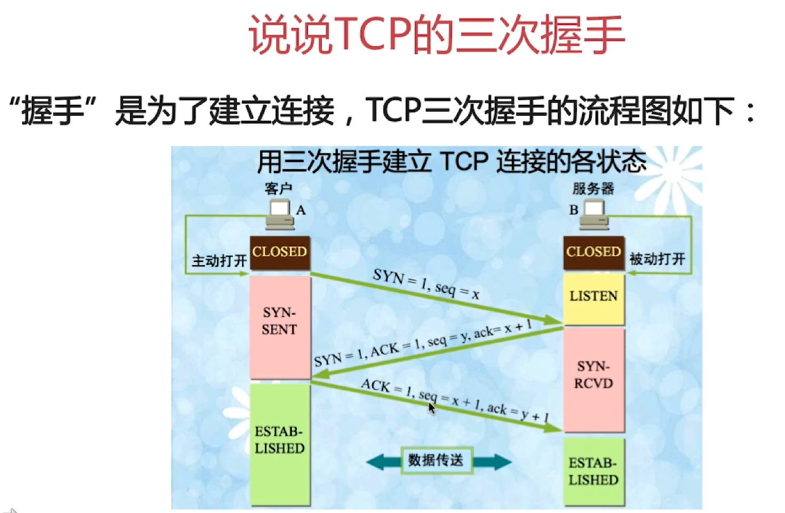  
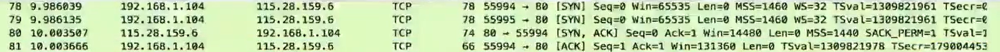  
3. 为什么需要三次握手才能建立起连接  
为了初始化`Sequence Number`的初始值  
4. 首次握手的隐患：SYN超时  
a. Server收到Client的SYN，回复SYN-ACK的时候未收到ACK确认  
b. Server不断重试直至超时，Linux默认等待63秒才断开连接  
5. 针对SYN Flood的防护措施  
a. SYN Flood是当前最流行的DoS（拒绝服务攻击）与DDoS（分布式拒绝服务攻击）的方式之一，这是一种利用TCP协议缺陷，发送大量伪造的TCP连接请求，从而使得被攻击方资源好进（CPU满负荷或内存不足）的攻击方式。SYN攻击利用TCP协议缺陷，通过发送大量的半连接请求，耗费CPU和内存资源。配合IP欺骗，SYN攻击能达到很好的效果，通常，客户端在短时间内伪造大量不存在的IP地址，向服务器不断地发送syn包，服务器回复确认包，并等待客户地确认，由于源地址是不存在地，服务器需要不断地重发直至超时，这些伪造地SYN包将长时间占用未连接队列，正常的SYN请求被丢弃，目标系统运行缓慢，严重者引起网络堵塞甚至系统瘫痪  
b. SYN队列满后，通过`tcp_syncookies`参数回发SYN Cookie  
c. 若为正常连接则Client会回发SYN Cookie，直接建立连接  
6. 建立连接后，Client出现故障怎么办  
保活机制：  
a. 向对方发送保活探测报文，如果未收到响应则继续发送  
b. 尝试次数达到保活探测数仍未收到响应则中断连接  
- **TCP四次挥手**  
1. 挥手是为了终止连接，TCP采用四次挥手来释放连接    
a. 第一次挥手：Client发送一个FIN，用来关闭Client到Server的数据传送，Client进入`FIN_WAIT_1`状态  
b. 第二次挥手：Server收到FIN后，发送一个ACK给Client，确认序号为收到序号+1（与SYN相同，一个FIN占用一个序号），Server进入`CLOSE_WAIT`状态  
c. 第三次挥手：Server发送一个FIN，用来关闭Server到Client的数据传送，Server进入`LAST_ACK`状态  
d. 第四次挥手：Client收到FIN后，Client进入`TIME_WAIT`状态，接着发送一个ACK给Server，确认序号为收到序号+1，Server进入`CLOSED`状态，完成四次挥手  
  
2. 为什么会有`TIME_WAIT`状态  
a. 确保有足够的时间让对方收到ACK包  
b. 避免新旧连接混淆
3. 为什么需要四次挥手才能断开连接  
因为全双工，发送方和接收方都需要FIN报文和ACK报文  
4. 服务器出现大量`CLOSE_WAIT`状态的原因  
a. 对方关闭socket连接，我方忙于读或写，没有及时关闭连接  
b. 检查代码，特别是释放资源的代码；检查配置，特别是处理请求的线程配置    
- **TCP和UDP**  
1. UDP的特点：  
a. 面向非连接  
b. 不维护连接状态，支持同时向多个客户端传输相同的消息  
c. 数据包报头只有8个字节，额外开销较小  
d. 吞吐量只受限于数据生成速率、传输速率以及机器性能  
e. 尽最大努力交付，不保证可靠交付，不需要维持复杂的链接状态表  
f. 面向报文，不对应用程序提交的报文信息进行拆分或者合并  
2. TCP和UDP的区别  
a. 面向连接 vs 无连接  
b. 可靠性  
c. 有序性  
d. 速度  
e. 量级  
- **HTTP**  
1. 特点：  
a. 支持客户/服务器模式  
b. 简单快速  
c. 灵活  
d. 无连接  
e. 无状态   
2. HTTP请求结构  
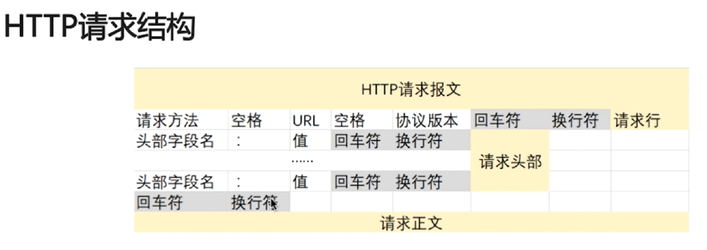   
3. HTTP响应结构  
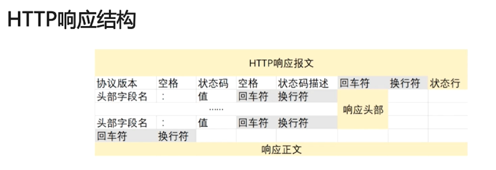
4. 请求/响应的步骤  
a. 客户端连接到Web服务器  
b. 发送HTTP请求  
c. 服务器接受请求并返回HTTP响应  
d. 释放连接TCP连接  
e. 客户端浏览器解析HTML内容  
5. 在浏览器地址栏键入URL，按下回车之后经历的流程  
a. DNS解析  
b. TCP连接  
c. 发送HTTP请求  
d. 服务器处理请求并返回HTTP报文  
e. 浏览器解析渲染页面  
f. 连接结束  
6. HTTP状态码  
五种可能的取值：  
a. 1xx：指示信息，表示请求已接收，继续处理  
b. 2xx：成功，表示请求已被成功接收、理解、接受   
c. 3xx：重定向，要完成请求必须进行更进一步的操作  
d. 4xx：客户端错误，请求有语法错误或请求无法实现  
e. 5xx：服务器端错误，服务器未能实现合法的请求  
7. 常见的HTTP状态码  
a. 200 OK：正常返回信息  
b. 400 Bad Request：客户端请求有语法错误，不能被服务器所理解  
c. 401 Unauthorized：请求未经授权，这个状态码必须和WWW-Authenticate报头域一起使用  
d. 403 Forbiddern：服务器收到请求，但是拒绝提供服务  
e. 404 Not Found：请求资源不存在，如：输入了错误的URL  
f. 500 Internal Server Error：服务器发生不可预期的错误  
g. 503 Server Unavailable：服务器当前不能处理客户端的请求，一段时间后可能恢复正常  
8. GET请求和POST请求的区别  
a. Http报文层面：GET将请求信息放在URL，POST放在报文体中  
b. 数据库层面：GET符合幂等性和安全性，POST不符合  
c. 其他层面：GET可以被缓存、被存储，而POST不行
9. Cookie简介  
a. 是由服务器发给客户端的特殊信息，以文本的形式存放在客户端  
b. 客户端再次请求的时候，会把Cookie回发  
c. 服务器收到后，会解析Cookie，生成与客户端相对应的内容  
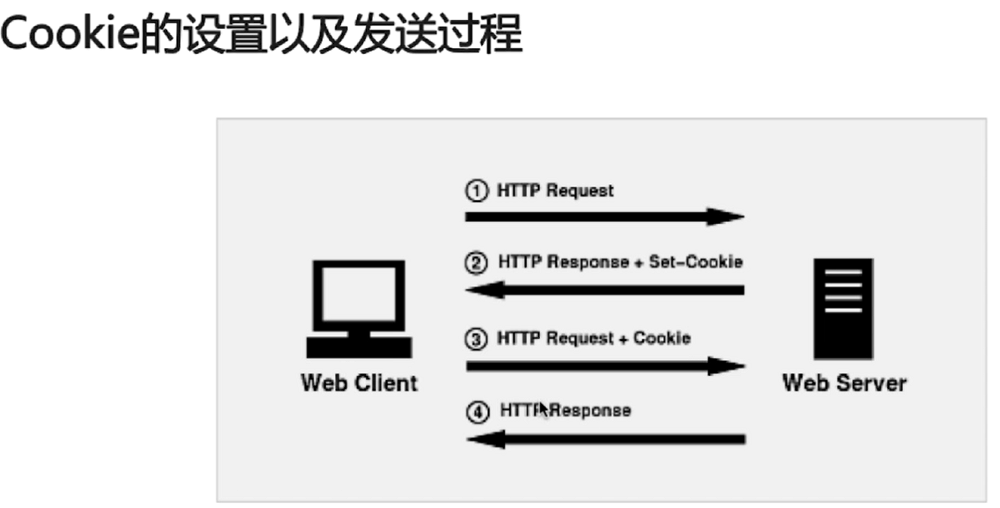  
10. Session简介  
a. 服务器端的机制，在服务器上保存的信息  
b. 解析客户端请求并操作session id，按需保存状态信息  
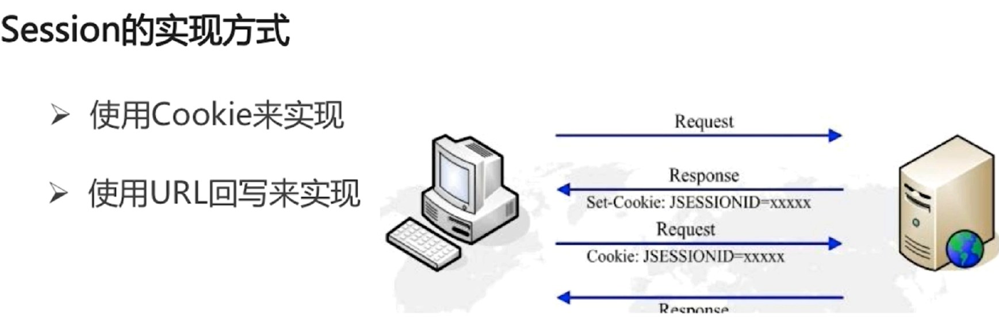  
11. Cookie和Session的区别  
a. Cookie数据存放在客户的浏览器上，Session数据放在服务器上  
b. Session相对于Cookie更安全  
c. 若考虑减轻服务器负担，应当使用Cookie  
- **HTTPS**
1. SSL（Security Sockets Layer，安全套接层）  
a. 为网络通信提供安全及数据完整性的一种安全协议  
b. 是操作系统对外的API，SSL3.0后更名为TLS  
c. 采用身份验证和数据加密保证网络通信的安全和数据的完整性  
2. 加密的方式  
a. 对称加密：加密和解密都使用同一个密钥  
b. 非对称加密：加密使用的密钥和解密使用密钥是不相同的  
c. 哈希算法：将任意长度的信息转换为固定长度的值，算法不可逆  
d. 数字签名：证明某个消息或者文件是某人发出/认同的   
3. HTTPS数据传输流程（了解）   
a. 浏览器将支持的加密算法信息发送给服务器  
b. 服务器选择一套浏览器支持的加密算法，以证书的形式回发给浏览器  
c. 浏览器验证证书合法性，并结合证书公钥加密信息发送给服务器  
d. 服务器使用私钥解密信息，验证哈希，加密响应消息回发给浏览器  
e. 浏览器解密响应消息，并对消息进行验证，之后进行加密交互数据  
4. HTTP和HTTPS的区别  
a. HTTPS需要到CA申请证书，HTTP不需要  
b. HTTPS密文传输，HTTP明文传输  
c. 连接方式不同，HTTPS默认使用443端口，HTTP使用80端口  
d. HTTPS=HTTP+加密+认证+完整性保护，较HTTP安全  
5. HTTPS真的安全吗  
a. 浏览器默认填充`http://`，请求需要进行跳转，有被劫持的风险  
b. 可以使用HSTS（HTTP Strict Transport Security）优化（了解）  
- **拥塞控制**  
1. 在某段时间，若对网络中某一资源的需求超过了该资源所能提供的可用部分，网络性能就要变坏，这就叫做拥塞。若出现拥塞而不进行控制，整个网络的吞吐量将随输入负荷的增大而下降      
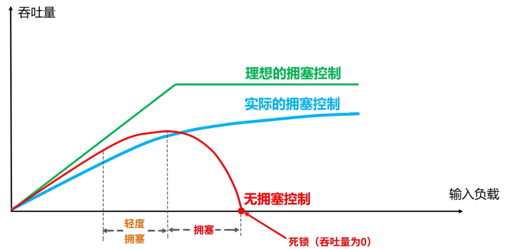  
2. TCP有四种拥塞控制算法，假定：数据是单方向传送，而另一个方向只传送确认；接收方总是有足够大的缓存空间，因而发送方发送窗口的大小由网络的拥塞程度决定；以TCP报文段的个数为讨论问题的单位，而不是以字节为单位  
3. 慢开始  
4. 拥塞避免  
5. 快重传  
6. 快恢复
